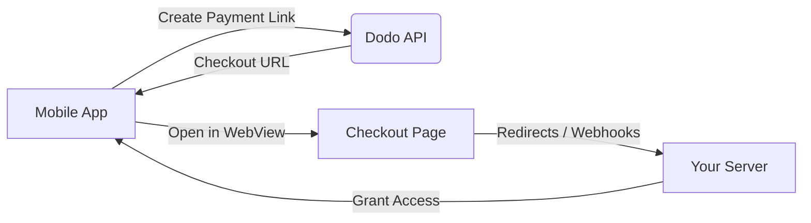

## Pendahuluan

Dodo Payments memberdayakan pengembang untuk menjual barang dan layanan digital di aplikasi iOS, menangani aspek kompleks seperti kepatuhan pajak, konversi mata uang, dan pembayaran. Panduan komprehensif ini menjelaskan cara mengintegrasikan Dodo Payments ke dalam aplikasi iOS Anda, khususnya untuk alat SaaS, langganan konten, dan utilitas digital.

## Ikhtisar

Dodo Payments berfungsi sebagai **Merchant of Record (MoR)** Anda, mengelola aspek kritis dari bisnis digital Anda:

<Tabs>
<Tab title="Apa yang Kami Tangani">
- Pengumpulan dan penyerahan pajak (PPN, GST, dan pajak regional lainnya)
- Pembayaran global sesuai kebijakan dan metode pembayaran lokal
- Konversi mata uang dan valuta asing
- Pengembalian dana dan pencegahan penipuan
- Penagihan dan kwitansi untuk pelanggan akhir
- Kepatuhan terhadap regulasi regional
</Tab>

<Tab title="Apa yang Anda Dapatkan">
- API terpadu untuk platform web dan mobile
- Dukungan untuk checkout dalam aplikasi (UPI, kartu, dompet, BNPL)
- Dukungan pembayaran global (Payoneer, Wise, transfer bank lokal)
- Dasbor analitik dan pelaporan
- Proses pembayaran yang aman
</Tab>
</Tabs>

## Kasus Penggunaan

<CardGroup cols={2}>
<Card title="Langganan" icon="repeat">
- Akses konten atau fitur premium
- Penagihan berulang dengan opsi fleksibel, Uji coba gratis, Prorata, atau Peningkatan dan penurunan
</Card>

<Card title="Kursus dan Pembelajaran" icon="graduation-cap">
- Akses bayar-per-kursus
- Paket konten terbundel
- Lisensi seumur hidup atau yang dapat diperbarui
- Integrasi pelacakan kemajuan
</Card>

<Card title="Unduhan Digital" icon="download">
- Pembelian satu kali (PDF, musik, alat)
- Pengiriman aset digital
- Manajemen kunci lisensi
</Card>

<Card title="Alat SaaS" icon="screwdriver-wrench">
- Langganan Software-as-a-Service
- Penagihan berbasis penggunaan
- Rencana tim dan perusahaan
</Card>
</CardGroup>

## Alur Integrasi

Anda dapat mengintegrasikan Dodo Payments ke dalam aplikasi Anda menggunakan checkout yang dihosting atau solusi browser dalam aplikasi.

### Langkah-langkah Integrasi

<Steps>
<Step title="Aplikasi Mobile ke Dodo API">
Proses dimulai dengan aplikasi mobile yang membuat tautan pembayaran dengan berinteraksi dengan Dodo API.
</Step>

<Step title="Dodo API ke Aplikasi Mobile">
Dodo API merespons dengan memberikan URL checkout kembali ke aplikasi mobile.
</Step>

<Step title="Aplikasi Mobile ke Halaman Checkout">
Aplikasi mobile kemudian membuka URL checkout ini dalam WebView, mengarahkan pengguna ke halaman checkout.
</Step>

<Step title="Halaman Checkout ke Server Anda">
Setelah proses checkout selesai, halaman checkout berkomunikasi dengan server Anda melalui pengalihan atau webhook.
</Step>

<Step title="Server Anda ke Aplikasi Mobile">
Akhirnya, server Anda memberikan akses ke konten atau layanan yang dibeli, menyelesaikan siklus transaksi kembali di aplikasi mobile.
</Step>
</Steps>

<Card title="Panduan Integrasi Mobile" icon="mobile" href="/developer-resources/mobile-integration">
Untuk walkthrough pengembang yang lengkap, jelajahi Panduan Integrasi Mobile kami.
</Card>

## Ketersediaan Regional

Dodo Payments memungkinkan alur pembelian dalam aplikasi alternatif hanya di wilayah App Store di mana Apple secara eksplisit mengizinkan pembayaran eksternal, atau di mana regulator atau perintah pengadilan memerintahkannya.

### Wilayah yang Didukung

<AccordionGroup>
<Accordion title="Amerika Serikat">
Didukung sejauh yang diizinkan oleh perintah pengadilan saat ini dan pedoman terbaru Apple.

- Tersedia di bawah ketentuan yang ditetapkan oleh pengadilan tertentu
- Tunduk pada kepatuhan Apple terhadap persyaratan hukum
- Harus mengikuti pedoman implementasi Apple
</Accordion>

<Accordion title="App Store Uni Eropa (EU)">
Didukung melalui Ketentuan Alternatif EU Apple dan Entitlement Pembelian Eksternal.

- Diaktifkan melalui Ketentuan Alternatif EU Apple
- Memerlukan persetujuan Entitlement Pembelian Eksternal
- Harus mematuhi persyaratan Undang-Undang Pasar Digital EU
</Accordion>

<Accordion title="Korea Selatan">
Didukung melalui Entitlement Pembelian Eksternal StoreKit untuk biner khusus Korea.

- Tersedia melalui Entitlement Pembelian Eksternal StoreKit
- Memerlukan biner aplikasi khusus Korea
- Harus mematuhi undang-undang telekomunikasi Korea
</Accordion>
</AccordionGroup>

<Warning>
Selalu tinjau dan patuhi entitlement spesifik wilayah Apple dan persyaratan App Store Connect sebelum mengaktifkan Dodo Payments untuk storefront mana pun. Menggunakan alur pembayaran alternatif di wilayah yang tidak didukung dapat mengakibatkan penolakan atau penghapusan aplikasi.
</Warning>

<Note>
Untuk beberapa model bisnis - seperti layanan atau kategori konten tertentu - Apple mungkin tidak memerlukan penggunaan pembelian dalam aplikasi (IAP) sama sekali. Dodo Payments juga mendukung model ini. Selalu verifikasi klasifikasi aplikasi Anda dan pedoman terbaru Apple untuk menentukan apakah IAP wajib untuk kasus penggunaan Anda.
</Note>

### Pelajari Lebih Lanjut

Untuk rincian mendalam tentang kebijakan global, preseden hukum, dan pendekatan strategis untuk menghindari biaya App Store, lihat panduan komprehensif kami:

<Card title="Menghindari Biaya App Store & Play Store: Buku Pedoman Strategis dan Hukum" icon="shield-check" href="/features/bypassing-app-store-fees">
Pelajari di mana dan bagaimana Anda dapat secara legal menerapkan alur pembayaran alternatif, dengan panduan regional terkini dan tips kepatuhan.
</Card>