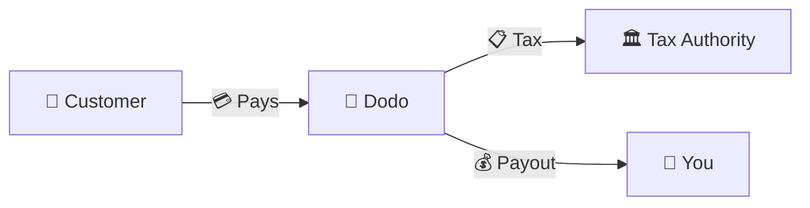
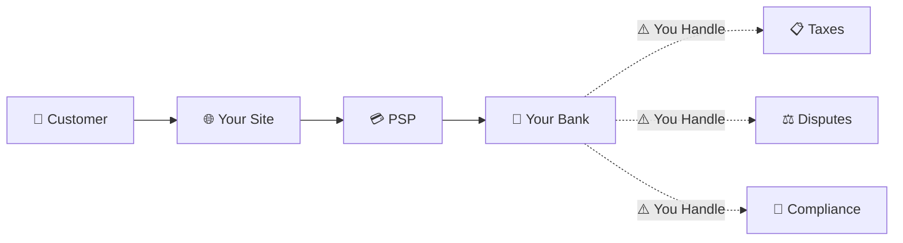
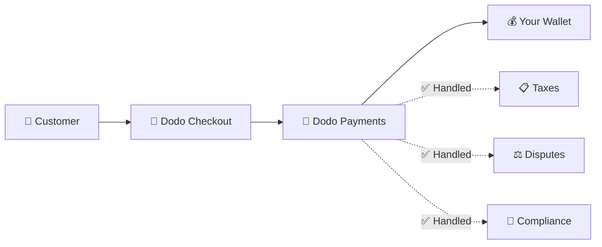
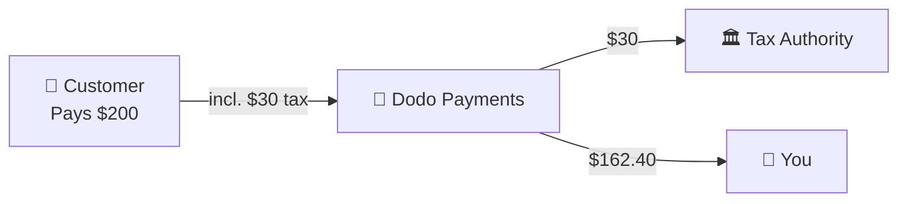

Dodo Payments beroperasi sebagai **Merchant of Record (MoR)** — kami menjadi penjual legal produk digital Anda, mengambil tanggung jawab untuk pembayaran, pajak, penipuan, dan kepatuhan sehingga Anda dapat sepenuhnya fokus pada pengembangan produk Anda.

<CardGroup cols={3}>
{/* LOCKED_PATTERN_0dfe8c9e68953181aad63120292193bb */}
Kepatuhan pajak ditangani secara otomatis
</Card>

{/* LOCKED_PATTERN_a7f32ee62695527a537b82d99f01c4bc */}
Kartu, dompet, dan metode lokal
</Card>

{/* LOCKED_PATTERN_cb6e35d755bb02c3f1254b1c5a9c4c73 */}
Kami menangani semua pengiriman uang
</Card>
</CardGroup>

## Apa Itu Merchant of Record?

Seorang **Merchant of Record** adalah entitas hukum yang muncul di pernyataan kartu kredit pelanggan Anda dan mengambil tanggung jawab untuk transaksi. Ketika Anda menggunakan Dodo Payments sebagai MoR Anda:

- **Kami adalah penjual legal** — Dodo muncul di pernyataan bank dan kwitansi
- **Anda adalah pencipta produk** — Anda membangun, menetapkan harga, dan mengirimkan produk Anda
- **Kami menangani back office** — Pajak, sengketa, kepatuhan, dan dukungan penagihan
- **Anda menerima pembayaran bersih** — Pendapatan disetorkan langsung ke akun Anda

<Note>
Pikirkan Merchant of Record sebagai merekrut tim keuangan global yang menangani penagihan, pajak, dan penagihan di setiap negara — tanpa Anda perlu mengangkat jari.
</Note>

## Mengapa Menggunakan Merchant of Record?

Menjual produk digital secara global berarti menavigasi VAT di Eropa, GST di Australia, Pajak Penjualan di AS, dan banyak persyaratan lainnya. Setiap yurisdiksi memiliki aturan, tarif, ambang batas, dan tenggat waktu pengajuan yang berbeda.

| Tanggung Jawab Anda | Tanpa MoR | Dengan Dodo sebagai MoR |
|---------------------|:-----------:|:----------------:|
| Pendaftaran VAT/GST | ❌ Anda | ✅ Dodo |
| Perhitungan Pajak | ❌ Anda | ✅ Dodo |
| Pengajuan & Remitansi Pajak | ❌ Anda | ✅ Dodo |
| Tanggung Jawab Chargeback | ❌ Anda | ✅ Dodo |
| Kepatuhan PCI | ❌ Anda | ✅ Dodo |
| Dukungan Multi-Mata Uang | ❌ Kompleks | ✅ Terintegrasi |
| Metode Pembayaran Lokal | ❌ Integrasi Masing-Masing | ✅ 30+ Termasuk |

<Tip>
**Contoh**: Menjual langganan €50/bulan ke pelanggan Perancis?

**Tanpa MoR**: Daftar untuk VAT Prancis, kenakan €60 (20% VAT), ajukan laporan Prancis setiap kuartal, tangani audit—dalam bahasa Prancis.

**Dengan Dodo**: Kami mengumpulkan €60, menyetor €10 PPN ke Perancis, dan membayar Anda €50 dikurangi biaya. Anda menulis kode.
</Tip>

## PSP vs. MoR: Perbedaan Utama

Memahami perbedaan antara **Payment Service Provider** (seperti Stripe) dan **Merchant of Record** sangat penting.

### Payment Service Provider (PSP)

PSP memproses transaksi tetapi membiarkan Anda sebagai penjual legal:

<Warning>
Dengan PSP, **Anda** bertanggung jawab atas pendaftaran pajak, pengumpulan, pelaporan, dan penyetoran di setiap yurisdiksi tempat Anda memiliki pelanggan.
</Warning>

### Merchant of Record (Dodo)

Seorang MoR menjadi penjual legal, menangani kepatuhan dari awal hingga akhir:

<Check>
Dengan Dodo sebagai MoR, kami menangani pajak, sengketa, dan kepatuhan. Anda menerima pembayaran bersih tanpa dokumen.
</Check>

### Perbandingan Berdampingan

| Aspek | PSP (Stripe, dll.) | MoR (Dodo) |
|--------|:------------------:|:----------:|
| Penjual Legal | Perusahaan Anda | Dodo |
| Di Pernyataan Pelanggan | Nama Anda | Dodo |
| Pendaftaran Pajak | ❌ Anda | ✅ Dodo |
| Perhitungan Pajak | ❌ Anda | ✅ Dodo |
| Remitansi Pajak | ❌ Anda | ✅ Dodo |
| Risiko Chargeback | ❌ Anda | ✅ Dodo |
| Kepatuhan PCI | ❌ Anda | ✅ Dodo |
| Pengaturan untuk Global | Kompleks | Sederhana |

<Info>
**Penting**: Baik PSP maupun MoR menangani pemrosesan pembayaran. Perbedaan utamanya adalah **siapa yang secara hukum bertanggung jawab** atas kepatuhan pajak dan tanggung jawab transaksi.
</Info>

## Bagaimana Kepatuhan Pajak Bekerja

Dodo menangani seluruh siklus pajak secara otomatis:

<Steps>
{/* LOCKED_PATTERN_9939f53f87faa28f5e85c7bcd4aa5d90 */}
Kami mendeteksi negara pelanggan dan menentukan aturan pajak mana yang berlaku — PPN, GST, Pajak Penjualan, atau persyaratan lokal lainnya.
</Step>

{/* LOCKED_PATTERN_70142fc485c0e1d535a43e599b490143 */}
Tarif pajak yang benar dihitung berdasarkan jenis produk, lokasi pelanggan, dan status B2B/B2C. Pelanggan bisnis UE dengan nomor PPN yang valid mendapatkan reverse charge diterapkan.
</Step>

{/* LOCKED_PATTERN_44b82b1d71e9f255cf562f67916ee9b7 */}
Pajak ditampilkan jelas dan dikumpulkan saat checkout. Pelanggan melihat persis apa yang mereka bayar.
</Step>

{/* LOCKED_PATTERN_1a778e95cb3812007334c0b47194f9ac */}
Kami melaporkan pengembalian dan membayar pajak yang dikumpulkan kepada otoritas terkait sesuai jadwal. Anda tidak pernah melihat formulir pajak.
</Step>
</Steps>

## Aliran Pendapatan

Berikut adalah cara uang bergerak dari pelanggan ke akun Anda:

### Contoh Rincian Pembayaran

| Item Baris | Jumlah |
|-----------|-------:|
| Pembayaran Pelanggan | $200.00 |
| Pajak Penjualan (15% VAT) | −$30.00 |
| Biaya Platform Dodo (4%) | −$8.00 |
| Pemrosesan Pembayaran | −$0.60 |
| **Pembayaran Anda** | **$162.40** |

## Kapan Memilih MoR vs. PSP

<Tabs>
{/* LOCKED_PATTERN_1d2e428d12b1ee53f2d946d9302bede1 */}
**Dodo Payments sangat ideal jika Anda:**

- Menjual produk digital, SaaS, atau langganan
- Memiliki pelanggan di berbagai negara
- Ingin menghindari kerumitan pendaftaran pajak
- Lebih memilih kepatuhan yang diprediksi dan dialihdayakan
- Mengutamakan kecepatan ke pasar daripada kontrol maksimal
- Tidak ingin menangani sengketa dan penipuan
</Tab>

{/* LOCKED_PATTERN_9020967e8e2c9a3ebc575f4072e18e76 */}
**PSP mungkin sesuai jika Anda:**

- Beroperasi terutama di satu negara
- Memiliki tim keuangan dan kepatuhan internal
- Membutuhkan kontrol penuh atas UX checkout
- Bekerja dengan margin yang sangat tipis
- Menjual barang fisik (MoR fokus pada digital)
</Tab>
</Tabs>

<Note>
Banyak bisnis memulai dengan PSP dan beralih ke MoR saat mereka berkembang secara internasional. Dodo menawarkan dukungan migrasi untuk membuat transisi ini mulus.
</Note>

## Pertanyaan yang Sering Diajukan

<AccordionGroup>
{/* LOCKED_PATTERN_03db007d1397fc75cc7c059a12f7514d */}
Dodo Payments muncul sebagai pedagang. Kami menyertakan referensi produk/merek Anda jika batas karakter memungkinkan, dan pelanggan menerima tanda terima rinci yang menunjukkan informasi produk Anda.
</Accordion>

{/* LOCKED_PATTERN_14efbd55af6b9971cc9bb290118d1ce5 */}
Ya. Anda mengontrol penetapan harga, pencitraan merek, pengiriman produk, dan komunikasi langsung. Dodo menangani mekanisme penagihan, tetapi pelanggan tahu mereka membeli dari Anda. Merek Anda tampil menonjol di checkout, email, dan faktur.
</Accordion>

{/* LOCKED_PATTERN_5e87ff5ce15f8c25ec293008878ec1c8 */}
Untuk penjualan B2B di UE, pelanggan dapat memasukkan nomor PPN mereka saat checkout. Kami memvalidasinya dan otomatis menerapkan reverse charge — pajak dialihkan ke laporan PPN pembeli alih-alih dikumpulkan.
</Accordion>

{/* LOCKED_PATTERN_828a96aed23c294d40585d542017c689 */}
Dodo beroperasi sebagai solusi lengkap menggunakan infrastruktur pembayaran kami. Integrasi inilah yang memungkinkan kami mengambil alih tanggung jawab pajak dan penipuan. Kami sedang bekerja menyediakan integrasi dengan pemroses pembayaran lain di masa depan.
</Accordion>

{/* LOCKED_PATTERN_7d718a1b657f28e952148f962ca6593e */}
Mulai pengembalian dana dari dasbor Anda. Kami memproses pengembalian dengan metode pembayaran dan mata uang asli pelanggan. Jumlah pajak disesuaikan dan direkonsiliasi secara otomatis.
</Accordion>

{/* LOCKED_PATTERN_dc7f113144600495109fc2c229c89f70 */}
Dodo menangani **pajak penjualan** (PPN, GST, Pajak Penjualan) atas transaksi pelanggan. Anda tetap bertanggung jawab atas pajak penghasilan bisnis Anda, pajak korporasi, dan kewajiban pajak atas pembayaran yang Anda terima.
</Accordion>

{/* LOCKED_PATTERN_04ec30ba2875e1ca25e9a1ae1dcc112d */}
Kami menerima pembayaran dari 220+ negara dan wilayah dengan ekspansi terus-menerus. Lihat daftar lengkapnya:

{/* LOCKED_PATTERN_1baa59aa331aff639990872bb61046bd */}
Lihat semua 220+ negara dan wilayah tempat kami menerima pembayaran.
</Card>
</Accordion>
</AccordionGroup>

## Mulai

<CardGroup cols={2}>
{/* LOCKED_PATTERN_a6e00712f4bf1e0645985bccec8d5def */}
Daftar gratis dan terima pembayaran global dalam hitungan menit.
</Card>

{/* LOCKED_PATTERN_d858044e80838a32f52c51b21b17f5eb */}
Perbandingan rinci dengan contoh dan kasus penggunaan.
</Card>

{/* LOCKED_PATTERN_4e501d9df0a1b75ab7c08a16b87219c5 */}
Pelajari bisnis yang kami dukung.
</Card>

{/* LOCKED_PATTERN_6053eaa23d9fa4210c02c58e94af8536 */}
Dapatkan panduan pribadi dari tim kami.
</Card>
</CardGroup>
