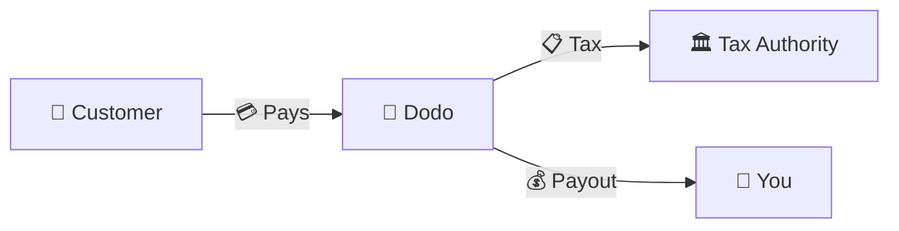
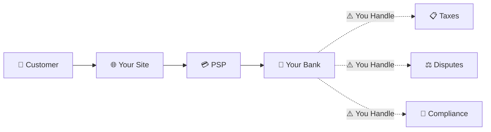
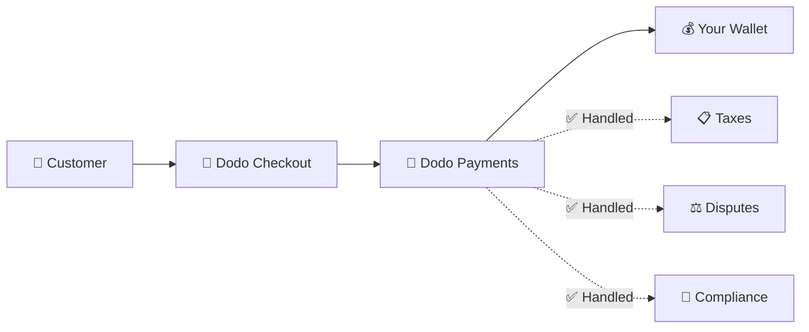
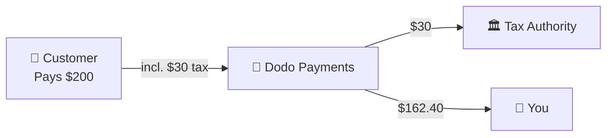

Dodo Payments beroperasi sebagai **Merchant of Record (MoR)** — kami menjadi penjual legal produk digital Anda, mengambil tanggung jawab untuk pembayaran, pajak, penipuan, dan kepatuhan sehingga Anda dapat sepenuhnya fokus pada pengembangan produk Anda.

<CardGroup cols={3}>
<Card title="220+ Wilayah" icon="globe">
Kepatuhan pajak ditangani secara otomatis
</Card>

<Card title="30+ Metode Pembayaran" icon="credit-card">
Kartu, dompet, dan metode lokal
</Card>

<Card title="Pengajuan Pajak Nol" icon="file-invoice">
Kami menangani semua remitansi
</Card>
</CardGroup>

## Apa Itu Merchant of Record?

Seorang **Merchant of Record** adalah entitas hukum yang muncul di pernyataan kartu kredit pelanggan Anda dan mengambil tanggung jawab untuk transaksi. Ketika Anda menggunakan Dodo Payments sebagai MoR Anda:

- **Kami adalah penjual legal** — Dodo muncul di pernyataan bank dan kwitansi
- **Anda adalah pencipta produk** — Anda membangun, menetapkan harga, dan mengirimkan produk Anda
- **Kami menangani back office** — Pajak, sengketa, kepatuhan, dan dukungan penagihan
- **Anda menerima pembayaran bersih** — Pendapatan disetorkan langsung ke akun Anda

<Note>
Anggaplah Merchant of Record sebagai menyewa tim keuangan global yang menangani penagihan, pajak, dan penagihan di setiap negara — tanpa Anda mengangkat jari.
</Note>

## Mengapa Menggunakan Merchant of Record?

Menjual produk digital secara global berarti menavigasi VAT di Eropa, GST di Australia, Pajak Penjualan di AS, dan banyak persyaratan lainnya. Setiap yurisdiksi memiliki aturan, tarif, ambang batas, dan tenggat waktu pengajuan yang berbeda.

| Tanggung Jawab Anda | Tanpa MoR | Dengan Dodo sebagai MoR |
|---------------------|:-----------:|:----------------:|
| Pendaftaran VAT/GST | ❌ Anda | ✅ Dodo |
| Perhitungan Pajak | ❌ Anda | ✅ Dodo |
| Pengajuan & Remitansi Pajak | ❌ Anda | ✅ Dodo |
| Tanggung Jawab Chargeback | ❌ Anda | ✅ Dodo |
| Kepatuhan PCI | ❌ Anda | ✅ Dodo |
| Dukungan Multi-Mata Uang | ❌ Kompleks | ✅ Terintegrasi |
| Metode Pembayaran Lokal | ❌ Integrasi Masing-Masing | ✅ 30+ Termasuk |

<Tip>
**Contoh**: Menjual langganan €50/bulan kepada pelanggan Prancis?

**Tanpa MoR**: Daftar untuk VAT Prancis, kenakan €60 (20% VAT), ajukan laporan Prancis setiap kuartal, tangani audit—dalam bahasa Prancis.

**Dengan Dodo**: Kami mengumpulkan €60, mengirimkan €10 VAT ke Prancis, dan membayar Anda €50 dikurangi biaya. Anda menulis kode.
</Tip>

## PSP vs. MoR: Perbedaan Utama

Memahami perbedaan antara **Payment Service Provider** (seperti Stripe) dan **Merchant of Record** sangat penting.

### Payment Service Provider (PSP)

PSP memproses transaksi tetapi membiarkan Anda sebagai penjual legal:

<Warning>
Dengan PSP, **Anda** bertanggung jawab untuk pendaftaran pajak, pengumpulan, pengajuan, dan remitansi di setiap yurisdiksi tempat Anda memiliki pelanggan.
</Warning>

### Merchant of Record (Dodo)

Seorang MoR menjadi penjual legal, menangani kepatuhan dari awal hingga akhir:

<Check>
Dengan Dodo sebagai MoR, kami menangani pajak, sengketa, dan kepatuhan. Anda menerima pembayaran bersih tanpa dokumen.
</Check>

### Perbandingan Berdampingan

| Aspek | PSP (Stripe, dll.) | MoR (Dodo) |
|--------|:------------------:|:----------:|
| Penjual Legal | Perusahaan Anda | Dodo |
| Di Pernyataan Pelanggan | Nama Anda | Dodo |
| Pendaftaran Pajak | ❌ Anda | ✅ Dodo |
| Perhitungan Pajak | ❌ Anda | ✅ Dodo |
| Remitansi Pajak | ❌ Anda | ✅ Dodo |
| Risiko Chargeback | ❌ Anda | ✅ Dodo |
| Kepatuhan PCI | ❌ Anda | ✅ Dodo |
| Pengaturan untuk Global | Kompleks | Sederhana |

<Info>
**Penting**: Baik PSP maupun MoR menangani pemrosesan pembayaran. Perbedaan kunci adalah **siapa yang secara hukum bertanggung jawab** untuk kepatuhan pajak dan tanggung jawab transaksi.
</Info>

## Bagaimana Kepatuhan Pajak Bekerja

Dodo menangani seluruh siklus pajak secara otomatis:

<Steps>
<Step title="Lokasi Pelanggan">
Kami mendeteksi negara pelanggan dan menentukan aturan pajak mana yang berlaku — VAT, GST, Pajak Penjualan, atau persyaratan lokal lainnya.
</Step>

<Step title="Perhitungan Tarif">
Tarif pajak yang benar dihitung berdasarkan jenis produk, lokasi pelanggan, dan status B2B/B2C. Pelanggan bisnis di UE dengan nomor VAT yang valid mendapatkan penerapan reverse charge.
</Step>

<Step title="Pengumpulan di Checkout">
Pajak ditampilkan dengan jelas dan dikumpulkan di checkout. Pelanggan melihat dengan tepat apa yang mereka bayar.
</Step>

<Step title="Pengajuan & Remitansi">
Kami mengajukan laporan dan membayar pajak yang dikumpulkan kepada otoritas terkait sesuai jadwal. Anda tidak pernah melihat formulir pajak.
</Step>
</Steps>

## Aliran Pendapatan

Berikut adalah cara uang bergerak dari pelanggan ke akun Anda:

### Contoh Rincian Pembayaran

| Item Baris | Jumlah |
|-----------|-------:|
| Pembayaran Pelanggan | $200.00 |
| Pajak Penjualan (15% VAT) | −$30.00 |
| Biaya Platform Dodo (4%) | −$8.00 |
| Pemrosesan Pembayaran | −$0.60 |
| **Pembayaran Anda** | **$162.40** |

## Kapan Memilih MoR vs. PSP

<Tabs>
<Tab title="Pilih Dodo (MoR)">
**Dodo Payments ideal jika Anda:**

- Menjual produk digital, SaaS, atau langganan
- Memiliki pelanggan di berbagai negara
- Ingin menghindari sakit kepala pendaftaran pajak
- Lebih memilih kepatuhan yang dapat diprediksi dan dialihdayakan
- Menghargai kecepatan ke pasar daripada kontrol maksimum
- Tidak ingin mengelola sengketa dan penipuan
</Tab>

<Tab title="Pertimbangkan PSP">
**PSP mungkin cocok untuk Anda jika Anda:**

- Beroperasi terutama di satu negara
- Memiliki tim keuangan dan kepatuhan internal
- Membutuhkan kontrol mutlak atas UX checkout
- Bekerja dengan margin yang sangat tipis
- Menjual barang fisik (MoR fokus pada digital)
</Tab>
</Tabs>

<Note>
Banyak bisnis mulai dengan PSP dan beralih ke MoR saat mereka berkembang secara internasional. Dodo menawarkan dukungan migrasi untuk membuat transisi ini menjadi mulus.
</Note>

## Pertanyaan yang Sering Diajukan

<AccordionGroup>
<Accordion title="Apa yang muncul di pernyataan kartu kredit pelanggan saya?">
Dodo Payments muncul sebagai pedagang. Kami menyertakan referensi produk/merek Anda di mana batas karakter memungkinkan, dan pelanggan menerima kwitansi terperinci yang menunjukkan informasi produk Anda.
</Accordion>

<Accordion title="Apakah saya masih memiliki hubungan dengan pelanggan?">
Ya. Anda mengontrol harga, merek, pengiriman produk, dan komunikasi langsung. Dodo menangani mekanika penagihan, tetapi pelanggan tahu bahwa mereka membeli dari Anda. Merek Anda muncul dengan jelas di checkout, email, dan faktur.
</Accordion>

<Accordion title="Bagaimana cara kerja reverse charge VAT B2B?">
Untuk penjualan B2B di UE, pelanggan dapat memasukkan nomor VAT mereka di checkout. Kami memvalidasinya dan menerapkan reverse charge secara otomatis — pajak berpindah ke pengembalian VAT pembeli alih-alih dikumpulkan.
</Accordion>

<Accordion title="Bisakah saya menggunakan pemroses pembayaran saya sendiri?">
Dodo beroperasi sebagai solusi lengkap menggunakan infrastruktur pembayaran kami. Integrasi ini memungkinkan kami untuk mengambil tanggung jawab pajak dan penipuan. Kami sedang bekerja untuk menyediakan integrasi dengan pemroses pembayaran lain di masa depan.
</Accordion>

<Accordion title="Bagaimana cara kerja pengembalian dana?">
Inisiasi pengembalian dana dari dasbor Anda. Kami memproses pengembalian dana dalam metode pembayaran dan mata uang asli pelanggan. Jumlah pajak secara otomatis disesuaikan dan direkonsiliasi.
</Accordion>

<Accordion title="Bagaimana dengan pajak penghasilan saya?">
Dodo menangani **pajak penjualan** (VAT, GST, Pajak Penjualan) pada transaksi pelanggan. Anda tetap bertanggung jawab atas pajak penghasilan bisnis Anda, pajak perusahaan, dan kewajiban pajak atas pembayaran yang Anda terima.
</Accordion>

<Accordion title="Negara mana yang bisa saya jual?">
Kami menerima pembayaran dari 220+ negara dan wilayah dengan ekspansi terus-menerus. Lihat daftar lengkapnya:

<Card title="Wilayah yang Didukung" icon="globe" href="/miscellaneous/list-of-countries-we-accept-payments-from">
Lihat semua 220+ negara dan wilayah tempat kami menerima pembayaran.
</Card>
</Accordion>
</AccordionGroup>

## Mulai

<CardGroup cols={2}>
<Card title="Buat Akun" icon="rocket" href="https://app.dodopayments.com/signup">
Daftar gratis dan terima pembayaran global dalam hitungan menit.
</Card>

<Card title="MoR vs PG Mendalam" icon="scale-balanced" href="/features/mor-vs-pg">
Perbandingan mendetail dengan contoh dan kasus penggunaan.
</Card>

<Card title="Kebijakan Penerimaan" icon="building-shield" href="/miscellaneous/merchant-acceptance">
Pelajari bisnis apa yang kami dukung.
</Card>

<Card title="Bicara dengan Kami" icon="envelope" href="mailto:founders@dodopayments.com">
Dapatkan panduan pribadi dari tim kami.
</Card>
</CardGroup>
