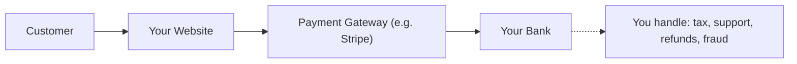
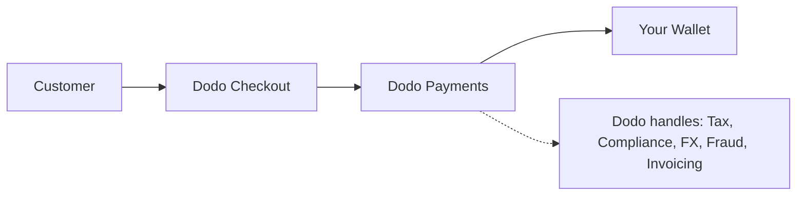

## Pendahuluan

Panduan ini membandingkan model MoR dengan pendekatan Payment Gateway tradisional, membantu Anda memahami keuntungan yang dibawa Dodo Payments untuk bisnis Anda.

## Perbedaan Inti

| Fitur                          | MoR (Dodo Payments)         | Payment Gateway (PG Tradisional)           |
|----------------------------------|--------------------------------------------|--------------------------------------------|
| Penjual Legal                     | Dodo Payments (MoR)                        | Perusahaan Anda                               |
| Pengumpulan & Penyerahan Pajak     | Ditangani oleh Dodo                            | Anda bertanggung jawab                        |
| Beban Kepatuhan & Regulasi  | Dodo mengasumsikan tanggung jawab                     | Anda menangani hukum lokal dan chargeback      |
| Mata Uang Penyelesaian             | USD, EUR, INR, dan 25+ lainnya didukung    | Tergantung pada akun merchant Anda           |
| Manajemen Risiko                 | Perlindungan penipuan dan chargeback bawaan   | Anda mengatur alat Anda sendiri (mis. Stripe Radar) |
| Pembayaran                         | Pembayaran global yang teragregasi dan disederhanakan   | Langsung dari PG ke Anda, dengan pengaturan bank     |

## Apa Artinya Bagi Anda

Dengan **Dodo sebagai MoR**, kami menjadi penjual legal kepada pelanggan Anda, memungkinkan Anda untuk:

- Melewatkan pengaturan entitas lokal
- Menghindari penanganan VAT, GST, atau pajak penjualan
- Menawarkan lebih banyak metode pembayaran secara global
- Mengurangi risiko hukum
- Meluncurkan lebih cepat di pasar baru

<Note>
Bayangkan menjual langganan digital kepada pengguna di Prancis. Dengan Dodo Payments, kami mengumpulkan pembayaran, mengurus pajak pertambahan nilai dengan otoritas Prancis, dan mengirimkan pendapatan bersih kepada Anda. Tidak ada pusing soal pajak. Tidak perlu pengacara. Hanya fokus pada pertumbuhan.
</Note>

Selain itu, model MoR menyederhanakan seluruh back office Anda. Sebagai MoR Anda, Dodo menangani kepatuhan PCI, deteksi penipuan, konversi mata uang, dan bahkan dukungan penagihan pelanggan, membebaskan tim Anda untuk fokus pada produk dan pertumbuhan.

## Perbandingan Visual

**Aliran Pendapatan: Payment Gateway**

**Aliran Pendapatan: Merchant of Record (Dodo)**

## Mengapa Ini Penting untuk Bisnis SaaS & Digital

Seiring bisnis Anda berkembang, mengelola pajak, kepatuhan, dan preferensi pembayaran global bisa menjadi sangat membebani. Dengan payment gateway, Anda bertanggung jawab untuk:

- Pendaftaran dan pengajuan VAT/GST di berbagai yurisdiksi
- Mengelola konversi mata uang dan chargeback
- Menyediakan checkout dan metode pembayaran yang dilokalisasi

Dengan Dodo Payments sebagai MoR Anda:
- Anda berkembang secara global tanpa mengatur entitas lokal
- Pajak dihitung, dikumpulkan, dan diserahkan atas nama Anda
- Anda mendapatkan akses ke perpustakaan metode pembayaran yang disesuaikan untuk pelanggan Anda
- Kami bertindak sebagai penyangga hukum dan mitra operasional Anda

<Tip>
“Pikirkan gateway pembayaran layaknya terowongan. Sekarang bayangkan Merchant of Record sebagai terowongan, kereta, pengemudi, dan staf tiket dalam satu paket.”
</Tip>

## Siapa yang Harus Menggunakan MoR?

Dodo Payments sangat cocok untuk:
- Perusahaan produk digital & SaaS
- Kreator indie dan solopreneur
- Bisnis global dengan pelanggan di lebih dari 100 negara
- Perusahaan yang tidak ingin mengelola pajak & kepatuhan secara internal

Jika Anda memperluas secara internasional, menjual langganan, atau hanya ingin mengurangi sakit kepala operasional, MoR adalah pilihan yang lebih cerdas.

## Kapan Menggunakan Payment Gateway Sebagai Gantinya

Ada kasus di mana menggunakan hanya payment gateway mungkin masuk akal:
- Bisnis Anda beroperasi hanya di satu negara
- Anda sudah memiliki sumber daya keuangan dan kepatuhan internal
- Anda memerlukan kontrol penuh atas pengalaman penagihan pelanggan
- Anda sangat sensitif terhadap biaya dengan margin tipis pada skala

<Note>
Bagi banyak startup, menggunakan gateway mungkin cukup pada awalnya - namun seiring kompleksitas tumbuh, beralih ke MoR dapat menghemat waktu, mengurangi risiko, dan mempercepat pertumbuhan internasional.
</Note>

## Mengapa Memilih Dodo Payments

Dodo Payments menawarkan:
- Tumpukan pembayaran, pajak, dan kepatuhan all-in-one
- Dukungan FX dan multi-mata uang secara real-time
- Akses ke 30+ metode pembayaran
- Penagihan berbasis kursi, langganan, dan pembayaran satu kali
- Penanganan pajak otomatis di 150+ negara
- Pencegahan penipuan dan kepatuhan PCI bawaan

Apakah Anda seorang pendiri solo atau tim SaaS yang sedang berkembang, Dodo menyederhanakan kompleksitas menjual secara global.

## Pelajari Lebih Lanjut

<CardGroup cols={2}>
{/* LOCKED_PATTERN_255f37658964531eef93d79ee5d8bb7a */}
Pelajari bagaimana Dodo secara otomatis menampilkan harga dalam mata uang lokal pelanggan Anda
</Card>

{/* LOCKED_PATTERN_9bf5b254a8af251551af21558f3421ad */}
Temukan lebih dari 30 metode pembayaran yang tersedia melalui Dodo Payments
</Card>
</CardGroup>

## Siap untuk Beralih?

Bergabunglah dengan 3,000+ bisnis digital yang menggunakan Dodo Payments untuk menjual secara global, tanpa batasan atau hambatan.

<CardGroup cols={2}>
{/* LOCKED_PATTERN_2d2ae952f85e9d3c5861b83c7818a666 */}
Buat akun Dodo Payments Anda dan mulai jual secara global hari ini
</Card>

{/* LOCKED_PATTERN_f3b5e9c6689a9ef5e4b14f5eeed286a7 */}
Dapatkan panduan pribadi dari tim kami
</Card>
</CardGroup>

<Tip>
Biarkan Dodo mengurus hal-hal sulit - sehingga Anda dapat fokus membangun produk yang hebat.
</Tip>