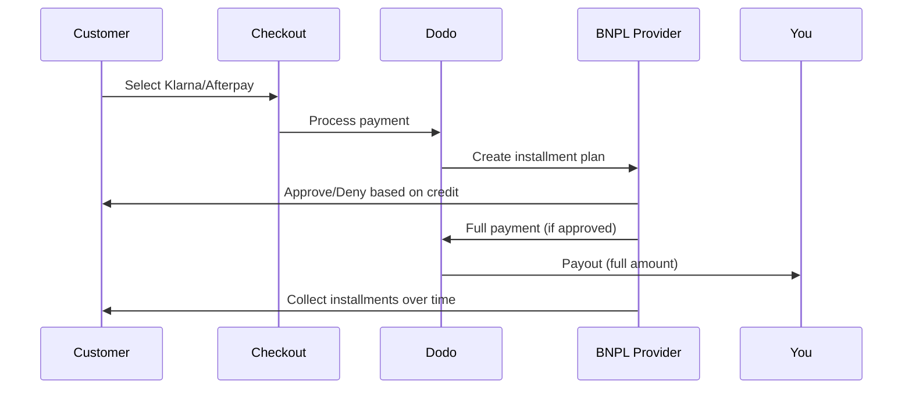

Beli Sekarang Bayar Nanti (BNPL) memungkinkan pelanggan membagi pembelian menjadi cicilan tanpa bunga, meningkatkan nilai rata-rata order sebesar 20-50% dan tingkat konversi sebesar 10-30% untuk transaksi yang memenuhi syarat.

## Mengapa Menawarkan BNPL?

<CardGroup cols={3}>
{/* LOCKED_PATTERN_b97f9be1eb159e011a6342413e37bd80 */}
Pelanggan membelanjakan lebih banyak saat mereka bisa mencicil pembayaran dari waktu ke waktu. Nilai pesanan rata-rata meningkat 20-50%.
</Card>

{/* LOCKED_PATTERN_b8dc04ad87db956cb850399b43c82817 */}
Menghilangkan hambatan pembayaran saat checkout. Tingkat konversi meningkat 10-30% untuk produk bernilai tinggi.
</Card>

{/* LOCKED_PATTERN_e1c4683cab6a6bdfa91140cb62e2921c */}
Penyedia BNPL menangani risiko kredit dan penagihan. Anda menerima pembayaran penuh di muka.
</Card>
</CardGroup>

## Penyedia yang Didukung

### Klarna

| Fitur | Detail |
| :------ | :------ |
| **Ketersediaan** | AS + 19 negara Eropa |
| **Mata Uang** | USD, EUR, GBP, DKK, NOK, SEK, CZK, RON, PLN, CHF |
| **Minimum** | $50.01 (atau setara) |
| **Langganan** | Tidak |

**Negara yang Didukung:** Austria, Belgia, Republik Ceko, Denmark, Finlandia, Prancis, Jerman, Yunani, Irlandia, Italia, Belanda, Norwegia, Polandia, Portugal, Rumania, Spanyol, Swedia, Swiss, Inggris, Amerika Serikat

**Opsi Pembayaran:**
- **Bayar dalam 4** — Bagi menjadi 4 pembayaran tanpa bunga
- **Bayar dalam 30 hari** — Pembayaran penuh jatuh tempo dalam 30 hari
- **Pembiayaan** — Rencana cicilan jangka panjang

### Afterpay (Clearpay)

| Fitur | Detail |
| :------ | :------ |
| **Ketersediaan** | AS, Inggris |
| **Mata Uang** | USD, GBP |
| **Minimum** | $50.01 (atau setara) |
| **Langganan** | Tidak |

**Opsi Pembayaran:**
- **Bayar dalam 4** — 4 pembayaran tanpa bunga setiap 2 minggu

<Note>
Di Inggris, Afterpay beroperasi sebagai "Clearpay" tetapi menggunakan jenis API yang sama (`afterpay_clearpay`).
</Note>

### Billie

| Fitur | Detail |
| :------ | :------ |
| **Ketersediaan** | Global |
| **Mata Uang** | GBP |
| **Minimum** | Tidak ada |
| **Langganan** | Tidak |

**Tentang Billie:**
Billie adalah solusi B2B Beli Sekarang Bayar Nanti yang memungkinkan bisnis menawarkan syarat pembayaran yang fleksibel kepada pelanggannya. Dirancang untuk transaksi bisnis-ke-bisnis di mana pembeli memerlukan opsi pembayaran berbasis faktur.

**Opsi Pembayaran:**
- **Pembayaran Faktur** — Bayar dalam jangka waktu yang disepakati
- **Syarat Fleksibel** — Jadwal pembayaran yang ramah bisnis

## Konfigurasi

### Jenis Metode API

| Tipe | Penyedia |
| :--- | :------- |
| `klarna` | Klarna |
| `afterpay_clearpay` | Afterpay / Clearpay |
| `billie` | Billie (B2B) |

### Contoh

```javascript
const session = await client.checkoutSessions.create({
  product_cart: [{ product_id: 'prod_123', quantity: 1 }],
  allowed_payment_method_types: [
    'klarna',
    'afterpay_clearpay',
    'credit',
    'debit'
  ],
  customer: {
    email: 'customer@example.com',
    name: 'Jane Smith'
  },
  billing_address: {
    country: 'US',
    zipcode: '10001'
  },
  return_url: 'https://example.com/success'
});
```

<Warning>
Selalu sertakan `credit` dan `debit` sebagai cadangan. Tidak semua pelanggan memenuhi syarat untuk BNPL, dan transaksi di bawah $50,01 tidak akan memenuhi syarat.
</Warning>

## Jumlah Transaksi Minimum

**Baik Klarna dan Afterpay memerlukan minimum sebesar $50.01 USD** (atau setara dalam mata uang yang didukung).

Transaksi di bawah ambang batas ini:
- Opsi BNPL tidak akan muncul di checkout
- Tidak ada kesalahan yang ditampilkan — opsi tidak akan muncul
- Pembayaran kartu tetap tersedia

Ini perilaku yang diharapkan. Jangan sertakan BNPL dalam `allowed_payment_method_types` untuk produk di bawah $50.

## Cara Kerja Cicilan



**Poin penting:**
- Anda menerima **pembayaran penuh di muka** dari penyedia BNPL
- Penyedia BNPL menangani **risiko kredit dan penagihan**
- Pelanggan membayar penyedia secara langsung dalam **4 cicilan** (biasanya)
- **Tidak ada pengembalian dana** dari kegagalan cicilan — itu adalah risiko penyedia

## Pengujian

### Data Uji Klarna

Gunakan rincian ini dalam mode uji:

| Bidang | Disetujui | Ditolak |
| :---- | :------- | :----- |
| **Tanggal Lahir** | 07-10-1970 | 07-10-1970 |
| **Nama Depan** | Uji | Uji |
| **Nama Belakang** | Orang-us | Orang-us |
| **Email** | customer@email.us | customer+denied@email.us |
| **Jalan** | Amsterdam Ave | Amsterdam Ave |
| **Nomor Rumah** | 509 | 509 |
| **Kota** | New York | New York |
| **Negara Bagian** | New York | New York |
| **Kode Pos** | 10024-3941 | 10024-3941 |
| **Telepon** | +13106683312 | +13106354386 |

<Note>
Transaksi harus setidaknya $50 agar Klarna muncul sebagai opsi.
</Note>

### Pengujian Afterpay

<Steps>
{/* LOCKED_PATTERN_50be67b06aca0719749c0148b14ededb */}
Pilih Afterpay di checkout dan klik Bayar.
</Step>

{/* LOCKED_PATTERN_e69c9723c2cfe705ec0ec6c279278116 */}
Gunakan email dan alamat pengiriman yang valid.
</Step>

{/* LOCKED_PATTERN_f705651ecb928289d18b7053fe33fbad */}
Untuk menguji kegagalan: tutup modal Afterpay di halaman pengalihan. Status pembayaran berubah menjadi `requires_payment_method`.
</Step>
</Steps>

## Praktik Terbaik

<AccordionGroup>
{/* LOCKED_PATTERN_fbd77987b33e84be7392d40b156b399b */}
BNPL bekerja paling baik untuk produk $100-$1000. Nilai jual "bayar secara cicilan" paling menarik di rentang ini.
</Accordion>

{/* LOCKED_PATTERN_73212def30811547cb4565bbe3cf9728 */}
"4 pembayaran $25" lebih menarik daripada "$100 dengan Klarna". Tampilkan jumlah per pembayaran jika memungkinkan.
</Accordion>

{/* LOCKED_PATTERN_b91d7612271491e0d73908c4d5f59440 */}
Di bawah $50, BNPL tidak akan muncul. Di bawah $100, sebagian besar pelanggan lebih memilih kartu. Fokuskan promosi BNPL pada barang bernilai tinggi.
</Accordion>

{/* LOCKED_PATTERN_09f1d72b973f5ae340cb9d61176e092c */}
Penyedia BNPL memerlukan informasi tagihan untuk pemeriksaan kredit. Pastikan checkout Anda mengumpulkan detail alamat lengkap.
</Accordion>

{/* LOCKED_PATTERN_40dceba4d9d5358ae7f9b7ccd887c8b1 */}
Pelanggan harus memahami bahwa mereka memasuki perjanjian kredit dengan Klarna/Afterpay, bukan dengan Anda.
</Accordion>
</AccordionGroup>

## Batasan

### Tidak Ada Langganan
Metode pembayaran BNPL **tidak mendukung pembayaran berulang**. Untuk produk berlangganan, gunakan kartu atau metode lain yang kompatibel dengan pembayaran berulang.

### Persetujuan Berdasarkan Kredit
Penyedia BNPL melakukan pemeriksaan kredit instan. Tidak semua pelanggan akan disetujui. Tingkat persetujuan bervariasi berdasarkan:
- Riwayat kredit pelanggan dengan penyedia
- Jumlah transaksi
- Lokasi pelanggan

### Pemetaan Mata Uang & Negara

Setiap mata uang dibatasi untuk wilayah yang sesuai:

| Mata Uang | Negara yang Didukung |
| :------- | :------------------ |
| **USD** | Hanya Amerika Serikat |
| **EUR** | Semua negara Eropa yang didukung (Austria, Belgia, Republik Ceko, Denmark, Finlandia, Prancis, Jerman, Yunani, Irlandia, Italia, Belanda, Norwegia, Polandia, Portugal, Rumania, Spanyol, Swedia, Swiss) |
| **GBP** | Inggris Raya dan semua negara Eropa yang didukung |

Mata uang lain yang didukung Klarna (DKK, NOK, SEK, CZK, RON, PLN, CHF) berfungsi di negara masing-masing.

{/* LOCKED_PATTERN_6fa96040307d68e9fa44436559d63ee8 */}
Misalnya, transaksi USD hanya akan menampilkan opsi BNPL kepada pelanggan di AS. Transaksi EUR akan menampilkan opsi BNPL di semua negara Eropa yang didukung. Transaksi GBP akan menampilkan opsi BNPL kepada pelanggan di Inggris Raya dan semua negara Eropa yang didukung.
{/* LOCKED_PATTERN_07427f62e4e59df6149fbd24d60de439 */}

| Penyedia | Mata Uang yang Didukung |
| :------- | :------------------- |
| Klarna | USD, EUR, GBP, DKK, NOK, SEK, CZK, RON, PLN, CHF |
| Afterpay | USD (AS), GBP (Inggris Raya) |

## Pemecahan Masalah

<AccordionGroup>
{/* LOCKED_PATTERN_4de1f796f92552e68d790659c1400cdb */}
**Periksa:**
1. Apakah jumlah transaksi setidaknya $50,01?
2. Apakah lokasi pelanggan berada di negara yang didukung?
3. Apakah mata uang didukung oleh penyedia BNPL?
4. Apakah metode BNPL disertakan dalam `allowed_payment_method_types`?

**Solusi:** Biasanya, transaksi masih di bawah minimum. Pastikan jumlahnya memenuhi ambang $50,01.
</Accordion>

{/* LOCKED_PATTERN_d83228e73178d33af019cc137eea6331 */}
**Penyebab:**
- Riwayat kredit tidak cukup dengan penyedia
- Terlalu banyak rencana cicilan aktif
- Verifikasi identitas gagal

**Solusi:** Ini diharapkan untuk beberapa pelanggan. Pastikan cadangan kartu tersedia. Jangan mengungkapkan alasan penolakan secara spesifik.
</Accordion>

{/* LOCKED_PATTERN_b83fcfa7ee1d57953629ef78553f40c7 */}
**Penyebab:** Pelanggan tidak menyelesaikan alur autentikasi dengan penyedia BNPL.

**Solusi:** Pembayaran akan kedaluwarsa dan gagal. Pelanggan dapat mencoba lagi atau menggunakan metode lain.
</Accordion>
</AccordionGroup>

## Halaman Terkait

<CardGroup cols={2}>
{/* LOCKED_PATTERN_014d7e4ef5d99df996cbbae24da710a6 */}
Lihat semua metode pembayaran yang didukung.
</Card>

{/* LOCKED_PATTERN_15f99901a394e4ce133a078d90e6360d */}
Lengkapi panduan implementasi checkout.
</Card>

{/* LOCKED_PATTERN_969f11f876a6712c92c3c11cb433bf1f */}
Semua data pengujian untuk metode pembayaran.
</Card>

{/* LOCKED_PATTERN_0da642f750ba9399c6c82f3cf51c812c */}
Dukungan mata uang dan konversi.
</Card>
</CardGroup>