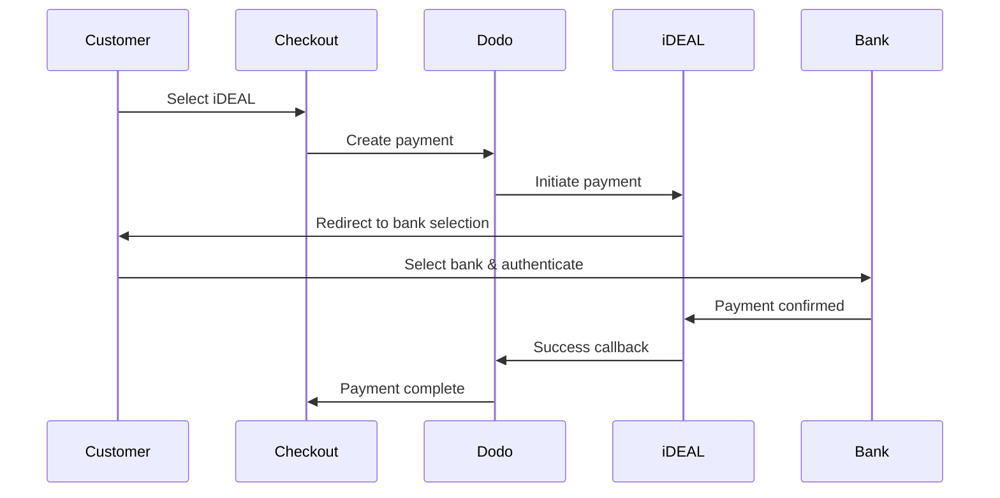

Pelanggan Eropa sangat menyukai metode pembayaran lokal yang terintegrasi dengan sistem perbankan mereka. Menawarkan metode ini dapat meningkatkan rasio konversi sebesar 20-40% di pasar target.

## Mengapa Metode Pembayaran Lokal Eropa?

<CardGroup cols={3}>
{/* LOCKED_PATTERN_efcf455d16a3d54177d3ce475c882342 */}
iDEAL menangkap ~60% pembayaran online Belanda. Tidak menawarkan berarti kehilangan pelanggan.
</Card>

{/* LOCKED_PATTERN_6b22bf3bf0cf724ac8ed217c65843a32 */}
Pembayaran yang diautentikasi bank memiliki tingkat penipuan hampir nol dan tanpa chargeback.
</Card>

{/* LOCKED_PATTERN_4a1acead7202a8a596c7a76e46cacb00 */}
Sebagian besar metode Eropa memberikan konfirmasi pembayaran instan.
</Card>
</CardGroup>

## Metode yang Didukung

| Metode | Negara | Pangsa Pasar | Mata Uang | Langganan |
| :----- | :------ | :----------- | :------- | :-----------: |
| **iDEAL** | Belanda | ~60% | EUR | Tidak |
| **Bancontact** | Belgia | ~50% | EUR | Tidak |
| **EPS** | Austria | ~30% | EUR | Tidak |
| **Multibanco** | Portugal | ~40% | EUR | Tidak |

## iDEAL (Belanda)

iDEAL adalah metode pembayaran daring yang dominan di Belanda, terhubung langsung ke semua bank utama Belanda.

### Cara Kerjanya



### Bank yang Didukung

Semua bank utama Belanda didukung:
- ABN AMRO
- ASN Bank
- Bunq
- ING
- Knab
- Rabobank
- RegioBank
- Revolut
- SNS
- Triodos Bank
- Van Lanschot

### Konfigurasi

```javascript
const session = await client.checkoutSessions.create({
  product_cart: [{ product_id: 'prod_123', quantity: 1 }],
  allowed_payment_method_types: ['ideal', 'credit', 'debit'],
  billing_currency: 'EUR',
  billing_address: {
    country: 'NL',
    zipcode: '1012JS'
  },
  return_url: 'https://example.com/success'
});
```

## Bancontact (Belgia)

Bancontact adalah skema pembayaran nasional Belgia, digunakan oleh hampir semua bank Belgia untuk pembayaran daring.

### Fitur
- Berfungsi dengan kartu debit Belgia yang ada
- Dukungan aplikasi seluler (Payconiq oleh Bancontact)
- Konfirmasi pembayaran instan
- Tidak perlu pendaftaran tambahan untuk pelanggan

### Konfigurasi

```javascript
const session = await client.checkoutSessions.create({
  product_cart: [{ product_id: 'prod_123', quantity: 1 }],
  allowed_payment_method_types: ['bancontact_card', 'credit', 'debit'],
  billing_currency: 'EUR',
  billing_address: {
    country: 'BE',
    zipcode: '1000'
  },
  return_url: 'https://example.com/success'
});
```

## EPS (Austria)

EPS (Electronic Payment Standard) memungkinkan transfer bank daring langsung untuk pelanggan Austria.

### Fitur
- Integrasi langsung dengan bank-bank Austria
- Konfirmasi pembayaran waktu nyata
- Tingkat kepercayaan tinggi di antara konsumen Austria
- Tidak ada pengembalian dana

### Bank yang Didukung

Bank-bank besar Austria termasuk:
- Erste Bank
- Bank Austria
- Raiffeisen
- BAWAG
- Volksbank

### Konfigurasi

```javascript
const session = await client.checkoutSessions.create({
  product_cart: [{ product_id: 'prod_123', quantity: 1 }],
  allowed_payment_method_types: ['eps', 'credit', 'debit'],
  billing_currency: 'EUR',
  billing_address: {
    country: 'AT',
    zipcode: '1010'
  },
  return_url: 'https://example.com/success'
});
```

## Multibanco (Portugal)

Multibanco adalah jaringan antarbank Portugal, menawarkan pembayaran daring dan pembayaran berbasis ATM.

### Opsi Pembayaran

1. **Perbankan Daring** — Transfer bank langsung melalui perbankan internet
2. **Pembayaran ATM** — Pelanggan menerima referensi untuk membayar di mana saja di ATM Multibanco
3. **Perbankan Seluler** — Pembayaran melalui aplikasi seluler bank

### Cara Kerja Pembayaran ATM

Untuk pembayaran ATM, pelanggan menerima referensi pembayaran:

```
Entity: 12345
Reference: 123 456 789
Amount: €50.00
Expiry: 24 hours
```

Pelanggan dapat membayar di mana saja di ATM Portugal atau melalui perbankan daring menggunakan referensi ini.

### Konfigurasi

```javascript
const session = await client.checkoutSessions.create({
  product_cart: [{ product_id: 'prod_123', quantity: 1 }],
  allowed_payment_method_types: ['multibanco', 'credit', 'debit'],
  billing_currency: 'EUR',
  billing_address: {
    country: 'PT',
    zipcode: '1000-001'
  },
  return_url: 'https://example.com/success'
});
```

<Note>
Pembayaran ATM Multibanco mungkin mengalami keterlambatan antara checkout dan pembayaran aktual. Pantau webhook untuk konfirmasi pembayaran.
</Note>

## Jenis Metode API

| Jenis | Metode | Negara |
| :--- | :----- | :------ |
| `ideal` | iDEAL | Netherlands |
| `bancontact_card` | Bancontact | Belgium |
| `eps` | EPS | Austria |
| `multibanco` | Multibanco | Portugal |

## Checkout Eropa Multi-Negara

Untuk bisnis yang melayani berbagai negara Eropa, sertakan semua metode regional:

```javascript
const session = await client.checkoutSessions.create({
  product_cart: [{ product_id: 'prod_123', quantity: 1 }],
  allowed_payment_method_types: [
    'ideal',           // Netherlands
    'bancontact_card', // Belgium
    'eps',             // Austria
    'multibanco',      // Portugal
    'credit',          // Fallback
    'debit'            // Fallback
  ],
  billing_currency: 'EUR',
  return_url: 'https://example.com/success'
});
```

Dodo secara otomatis hanya menampilkan metode yang relevan berdasarkan lokasi pelanggan. Pelanggan Belanda akan melihat iDEAL; pelanggan Belgia akan melihat Bancontact.

## Pengujian

Metode pembayaran Eropa dapat diuji dalam mode sandbox. Alur pengujian mensimulasikan proses autentikasi bank.

<Steps>
{/* LOCKED_PATTERN_540056f13df545529727751bb5b93f77 */}
Gunakan kunci API uji Dodo Payments Anda.
</Step>

{/* LOCKED_PATTERN_7920d15f7caeeea70ea62bd0d8d57403 */}
Atur negara alamat penagihan agar cocok dengan metode pembayaran:
- `NL` untuk iDEAL
- `BE` untuk Bancontact
- `AT` untuk EPS
- `PT` untuk Multibanco
</Step>

{/* LOCKED_PATTERN_69cef9ebb6025284f3e6858b286f99d9 */}
Ikuti alur otentikasi bank simulasi di lingkungan pengujian.
</Step>
</Steps>

## Praktik Terbaik

<AccordionGroup>
{/* LOCKED_PATTERN_6e39e352c5d82a18aefb4abc54215eac */}
Jika Anda menjual kepada pelanggan Belanda, sertakan iDEAL. Tidak melakukannya seperti tidak menerima Visa di AS — Anda akan kehilangan penjualan signifikan.
</Accordion>

{/* LOCKED_PATTERN_9c635a5b2c09ad8acceb0ae222fad819 */}
Metode pembayaran Eropa memerlukan EUR. Pastikan penetapan harga Anda mendukung transaksi Euro.
</Accordion>

{/* LOCKED_PATTERN_5a50cae3439b9921374aaa8c0461b4a3 */}
Semua metode Eropa melibatkan pengalihan ke situs bank. Pastikan penanganan URL pengembalian Anda kuat dan memperhitungkan pengguna yang meninggalkan di tengah alur.
</Accordion>

{/* LOCKED_PATTERN_3a32b87fb89df99c7fb6cbcd532fcd01 */}
Tidak semua pelanggan Eropa memiliki akses ke metode regional ini (turis, ekspatriat, dll.). Selalu sertakan `credit` dan `debit` sebagai cadangan.
</Accordion>

{/* LOCKED_PATTERN_f4321c6674f862219007fe7c6201edc2 */}
Pembayaran ATM Multibanco mungkin memerlukan waktu berjam-jam untuk selesai. Jangan menghalangi pemenuhan berdasarkan pembayaran langsung — gunakan webhook untuk konfirmasi asinkron.
</Accordion>
</AccordionGroup>

## Pemecahan Masalah

<AccordionGroup>
{/* LOCKED_PATTERN_ccd66af742dc9530dea0480f544f049c */}
**Periksa:**
1. Apakah negara penagihan pelanggan sesuai dengan negara metode?
2. Apakah mata uang disetel ke EUR?
3. Apakah metode termasuk dalam `allowed_payment_method_types`?

**Solusi:** Metode Eropa sangat regional. Pelanggan dengan negara penagihan `DE` (Jerman) tidak akan melihat iDEAL, yang hanya untuk Belanda.
</Accordion>

{/* LOCKED_PATTERN_e65da29a30abf8b0bab16429c0abbf51 */}
**Penyebab:**
- Pelanggan membatalkan selama otentikasi bank
- Sistem otentikasi bank sementara tidak tersedia
- Pelanggan memasukkan kredensial yang salah

**Solusi:** Pelanggan harus mencoba lagi. Jika terus terjadi, sarankan mencoba metode pembayaran lain.
</Accordion>

{/* LOCKED_PATTERN_6ec718ef8b359d908bb220922e56ef7a */}
**Penyebab:**
- Pelanggan menutup browser selama pengalihan bank
- Masalah jaringan selama otentikasi
- URL pengembalian dikonfigurasi salah

**Solusi:** Verifikasi bahwa URL pengembalian benar dan dapat diakses. Pastikan menangani status sukses dan gagal.
</Accordion>

{/* LOCKED_PATTERN_fc8a3a43e2635e2d30bc6ced94d88e30 */}
**Penyebab:** Pelanggan menerima referensi pembayaran tetapi belum membayar.

**Solusi:** Ini diharapkan untuk pembayaran berbasis ATM. Tunggu konfirmasi webhook. Referensi biasanya kedaluwarsa dalam 24-72 jam.
</Accordion>
</AccordionGroup>

## Kepatuhan PSD2

Semua metode pembayaran Eropa mematuhi peraturan PSD2 (Payment Services Directive 2):

- **Autentikasi Pelanggan yang Kuat (SCA)** — Dibangun dalam alur autentikasi bank
- **Komunikasi Aman** — Semua data dikirim melalui saluran yang aman
- **Perlindungan Konsumen** — Kepatuhan penuh terhadap hak-hak konsumen UE

## Halaman Terkait

<CardGroup cols={2}>
{/* LOCKED_PATTERN_014d7e4ef5d99df996cbbae24da710a6 */}
Lihat semua metode pembayaran yang didukung.
</Card>

{/* LOCKED_PATTERN_0da642f750ba9399c6c82f3cf51c812c */}
Dukungan mata uang dan konversi otomatis.
</Card>

{/* LOCKED_PATTERN_15f99901a394e4ce133a078d90e6360d */}
Panduan lengkap implementasi checkout.
</Card>

{/* LOCKED_PATTERN_4fdc255b113f889a339d4227d31c920b */}
Tangani konfirmasi pembayaran secara asinkron.
</Card>
</CardGroup>