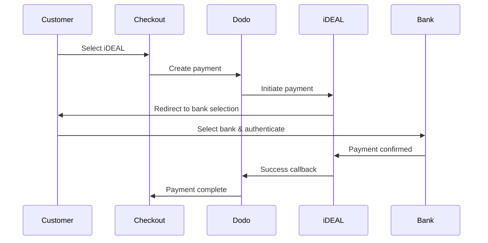

Pelanggan Eropa sangat menyukai metode pembayaran lokal yang terintegrasi dengan sistem perbankan mereka. Menawarkan metode ini dapat meningkatkan rasio konversi sebesar 20-40% di pasar target.

## Mengapa Metode Pembayaran Lokal Eropa?

<CardGroup cols={3}>
<Card title="Konversi Lebih Tinggi" icon="chart-line">
iDEAL menangkap ~60% dari pembayaran daring Belanda. Tidak menawarkan ini berarti kehilangan pelanggan.
</Card>

<Card title="Penipuan Lebih Rendah" icon="shield-check">
Pembayaran yang terautentikasi oleh bank memiliki tingkat penipuan hampir nol dan tidak ada pengembalian dana.
</Card>

<Card title="Setelmen Waktu Nyata" icon="bolt">
Sebagian besar metode Eropa memberikan konfirmasi pembayaran instan.
</Card>
</CardGroup>

## Metode yang Didukung

| Metode | Negara | Pangsa Pasar | Mata Uang | Langganan |
| :----- | :------ | :----------- | :------- | :-----------: |
| **iDEAL** | Belanda | ~60% | EUR | Tidak |
| **Bancontact** | Belgia | ~50% | EUR | Tidak |
| **EPS** | Austria | ~30% | EUR | Tidak |
| **Multibanco** | Portugal | ~40% | EUR | Tidak |

## iDEAL (Belanda)

iDEAL adalah metode pembayaran daring yang dominan di Belanda, terhubung langsung ke semua bank utama Belanda.

### Cara Kerjanya



### Bank yang Didukung

Semua bank utama Belanda didukung:
- ABN AMRO
- ASN Bank
- Bunq
- ING
- Knab
- Rabobank
- RegioBank
- Revolut
- SNS
- Triodos Bank
- Van Lanschot

### Konfigurasi

```javascript
const session = await client.checkoutSessions.create({
  product_cart: [{ product_id: 'prod_123', quantity: 1 }],
  allowed_payment_method_types: ['ideal', 'credit', 'debit'],
  billing_currency: 'EUR',
  billing_address: {
    country: 'NL',
    zipcode: '1012JS'
  },
  return_url: 'https://example.com/success'
});
```

## Bancontact (Belgia)

Bancontact adalah skema pembayaran nasional Belgia, digunakan oleh hampir semua bank Belgia untuk pembayaran daring.

### Fitur
- Berfungsi dengan kartu debit Belgia yang ada
- Dukungan aplikasi seluler (Payconiq oleh Bancontact)
- Konfirmasi pembayaran instan
- Tidak perlu pendaftaran tambahan untuk pelanggan

### Konfigurasi

```javascript
const session = await client.checkoutSessions.create({
  product_cart: [{ product_id: 'prod_123', quantity: 1 }],
  allowed_payment_method_types: ['bancontact_card', 'credit', 'debit'],
  billing_currency: 'EUR',
  billing_address: {
    country: 'BE',
    zipcode: '1000'
  },
  return_url: 'https://example.com/success'
});
```

## EPS (Austria)

EPS (Electronic Payment Standard) memungkinkan transfer bank daring langsung untuk pelanggan Austria.

### Fitur
- Integrasi langsung dengan bank-bank Austria
- Konfirmasi pembayaran waktu nyata
- Tingkat kepercayaan tinggi di antara konsumen Austria
- Tidak ada pengembalian dana

### Bank yang Didukung

Bank-bank besar Austria termasuk:
- Erste Bank
- Bank Austria
- Raiffeisen
- BAWAG
- Volksbank

### Konfigurasi

```javascript
const session = await client.checkoutSessions.create({
  product_cart: [{ product_id: 'prod_123', quantity: 1 }],
  allowed_payment_method_types: ['eps', 'credit', 'debit'],
  billing_currency: 'EUR',
  billing_address: {
    country: 'AT',
    zipcode: '1010'
  },
  return_url: 'https://example.com/success'
});
```

## Multibanco (Portugal)

Multibanco adalah jaringan antarbank Portugal, menawarkan pembayaran daring dan pembayaran berbasis ATM.

### Opsi Pembayaran

1. **Perbankan Daring** — Transfer bank langsung melalui perbankan internet
2. **Pembayaran ATM** — Pelanggan menerima referensi untuk membayar di mana saja di ATM Multibanco
3. **Perbankan Seluler** — Pembayaran melalui aplikasi seluler bank

### Cara Kerja Pembayaran ATM

Untuk pembayaran ATM, pelanggan menerima referensi pembayaran:

```
Entity: 12345
Reference: 123 456 789
Amount: €50.00
Expiry: 24 hours
```

Pelanggan dapat membayar di mana saja di ATM Portugal atau melalui perbankan daring menggunakan referensi ini.

### Konfigurasi

```javascript
const session = await client.checkoutSessions.create({
  product_cart: [{ product_id: 'prod_123', quantity: 1 }],
  allowed_payment_method_types: ['multibanco', 'credit', 'debit'],
  billing_currency: 'EUR',
  billing_address: {
    country: 'PT',
    zipcode: '1000-001'
  },
  return_url: 'https://example.com/success'
});
```

<Note>
Pembayaran ATM Multibanco mungkin mengalami penundaan antara checkout dan pembayaran yang sebenarnya. Pantau webhook untuk konfirmasi pembayaran.
</Note>

## Jenis Metode API

| Jenis | Metode | Negara |
| :--- | :----- | :------ |
| `ideal` | iDEAL | Belanda |
| `bancontact_card` | Bancontact | Belgia |
| `eps` | EPS | Austria |
| `multibanco` | Multibanco | Portugal |

## Checkout Eropa Multi-Negara

Untuk bisnis yang melayani berbagai negara Eropa, sertakan semua metode regional:

```javascript
const session = await client.checkoutSessions.create({
  product_cart: [{ product_id: 'prod_123', quantity: 1 }],
  allowed_payment_method_types: [
    'ideal',           // Netherlands
    'bancontact_card', // Belgium
    'eps',             // Austria
    'multibanco',      // Portugal
    'credit',          // Fallback
    'debit'            // Fallback
  ],
  billing_currency: 'EUR',
  return_url: 'https://example.com/success'
});
```

Dodo secara otomatis hanya menampilkan metode yang relevan berdasarkan lokasi pelanggan. Pelanggan Belanda akan melihat iDEAL; pelanggan Belgia akan melihat Bancontact.

## Pengujian

Metode pembayaran Eropa dapat diuji dalam mode sandbox. Alur pengujian mensimulasikan proses autentikasi bank.

<Steps>
<Step title="Aktifkan mode pengujian">
Gunakan kunci API pengujian Dodo Payments Anda.
</Step>

<Step title="Atur alamat penagihan yang sesuai">
Atur negara alamat penagihan untuk mencocokkan metode pembayaran:
- `NL` untuk iDEAL
- `BE` untuk Bancontact
- `AT` untuk EPS
- `PT` untuk Multibanco
</Step>

<Step title="Selesaikan alur pengujian">
Ikuti alur autentikasi bank yang disimulasikan di lingkungan pengujian.
</Step>
</Steps>

## Praktik Terbaik

<AccordionGroup>
<Accordion title="Selalu sertakan metode regional untuk pasar target">
Jika Anda menjual kepada pelanggan Belanda, sertakan iDEAL. Tidak melakukan hal ini seperti tidak menerima Visa di AS — Anda akan kehilangan penjualan yang signifikan.
</Accordion>

<Accordion title="Cocokkan mata uang dengan wilayah">
Metode pembayaran Eropa memerlukan EUR. Pastikan harga Anda mendukung transaksi Euro.
</Accordion>

<Accordion title="Tangani pengalihan dengan baik">
Semua metode Eropa melibatkan pengalihan ke situs bank. Pastikan penanganan URL kembali Anda kuat dan akuntabel untuk pengguna yang meninggalkan alur di tengah.
</Accordion>

<Accordion title="Berikan fallback kartu">
Tidak semua pelanggan Eropa memiliki akses ke metode regional ini (turis, ekspatriat, dll.). Selalu sertakan `credit` dan `debit` sebagai fallback.
</Accordion>

<Accordion title="Perhatikan waktu Multibanco">
Pembayaran ATM Multibanco mungkin memerlukan waktu berjam-jam untuk diselesaikan. Jangan blokir pemenuhan berdasarkan pembayaran instan — gunakan webhook untuk konfirmasi asinkron.
</Accordion>
</AccordionGroup>

## Pemecahan Masalah

<AccordionGroup>
<Accordion title="Metode Eropa tidak muncul">
**Periksa:**
1. Negara penagihan pelanggan cocok dengan negara metode?
2. Mata uang diatur ke EUR?
3. Metode termasuk dalam `allowed_payment_method_types`?

**Solusi:** Metode Eropa bersifat regional ketat. Pelanggan dengan negara penagihan `DE` (Jerman) tidak akan melihat iDEAL, yang hanya untuk Belanda.
</Accordion>

<Accordion title="Autentikasi bank gagal">
**Penyebab:**
- Pelanggan membatalkan selama autentikasi bank
- Sistem autentikasi bank sementara tidak tersedia
- Pelanggan memasukkan kredensial yang salah

**Solusi:** Pelanggan harus mencoba kembali. Jika terus-menerus gagal, sarankan untuk mencoba metode pembayaran lain.
</Accordion>

<Accordion title="Pengalihan tidak selesai">
**Penyebab:**
- Pelanggan menutup browser selama pengalihan bank
- Masalah jaringan selama autentikasi
- URL kembali salah dikonfigurasi

**Solusi:** Verifikasi bahwa URL kembali benar dan dapat diakses. Pastikan itu menangani keadaan sukses dan gagal.
</Accordion>

<Accordion title="Pembayaran Multibanco tertunda">
**Penyebab:** Pelanggan menerima referensi pembayaran tetapi belum membayar.

**Solusi:** Ini diharapkan untuk pembayaran berbasis ATM. Tunggu konfirmasi webhook. Referensi biasanya kedaluwarsa dalam 24-72 jam.
</Accordion>
</AccordionGroup>

## Kepatuhan PSD2

Semua metode pembayaran Eropa mematuhi peraturan PSD2 (Payment Services Directive 2):

- **Autentikasi Pelanggan yang Kuat (SCA)** — Dibangun dalam alur autentikasi bank
- **Komunikasi Aman** — Semua data dikirim melalui saluran yang aman
- **Perlindungan Konsumen** — Kepatuhan penuh terhadap hak-hak konsumen UE

## Halaman Terkait

<CardGroup cols={2}>
<Card title="Ikhtisar Metode Pembayaran" icon="credit-card" href="/features/payment-methods">
Lihat semua metode pembayaran yang didukung.
</Card>

<Card title="Mata Uang Adaptif" icon="globe" href="/features/adaptive-currency">
Dukungan mata uang dan konversi otomatis.
</Card>

<Card title="Panduan Checkout" icon="book" href="/developer-resources/checkout-session">
Panduan lengkap implementasi checkout.
</Card>

<Card title="Webhook" icon="webhook" href="/developer-resources/webhooks">
Tangani konfirmasi pembayaran secara asinkron.
</Card>
</CardGroup>