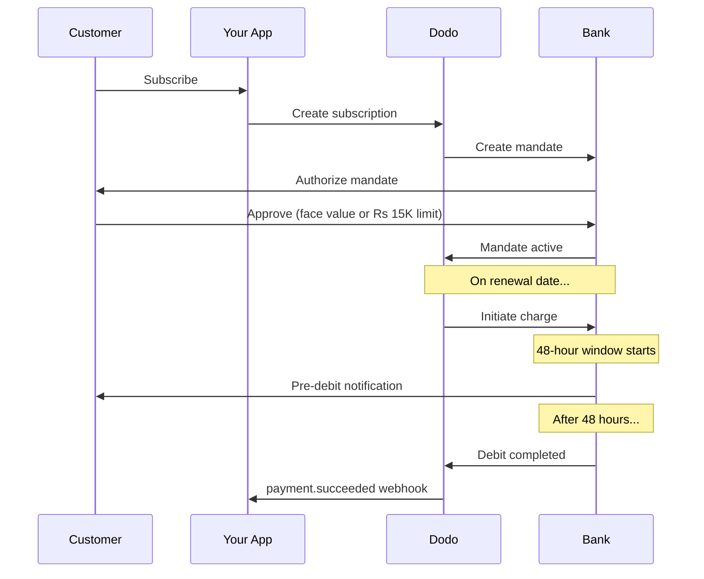

India memiliki infrastruktur pembayaran yang unik didominasi oleh UPI (60%+ dari transaksi digital) dan kartu Rupay. Dodo Payments mendukung keduanya dengan kepatuhan penuh terhadap RBI untuk mandat langganan.

## Mengapa Metode Pembayaran India Penting

<CardGroup cols={3}>
{/* LOCKED_PATTERN_fef1794963d9b6cdb65542c69efa8053 */}
UPI memproses lebih dari 10 miliar transaksi/bulan. Banyak pelanggan India tidak memiliki kartu internasional.
</Card>

{/* LOCKED_PATTERN_b5f6c506ac5b1c8b661845e44f7fdc6c */}
UPI memiliki biaya transaksi hampir nol. Sangat cocok untuk transaksi bervolume tinggi dengan nilai rendah.
</Card>

{/* LOCKED_PATTERN_4d6aa00708c7fde98b8f2cfed63c3234 */}
Berbeda dengan sebagian besar metode pembayaran alternatif, UPI dan Rupay mendukung pembayaran berulang melalui mandat RBI.
</Card>
</CardGroup>

## Metode yang Didukung

| Metode | Tipe | Langganan | Jumlah Min |
| :----- | :--- | :-----------: | :--------- |
| **UPI Collect** | Kode QR / VPA | Ya* | ₹1 |
| **Rupay Kredit** | Kartu | Ya* | ₹1 |
| **Rupay Debit** | Kartu | Ya* | ₹1 |

*Langganan memerlukan mandat yang sesuai dengan RBI dengan aturan pemrosesan khusus.

## Konfigurasi

### Tipe Metode API

| Jenis | Deskripsi |
| :--- | :---------- |
| `upi_collect` | UPI melalui kode QR atau entri VPA |
| `credit` | Kartu kredit termasuk Rupay |
| `debit` | Kartu debit termasuk Rupay |

### Contoh: Checkout Berfokus pada India

```javascript
const session = await client.checkoutSessions.create({
  product_cart: [{ product_id: 'prod_123', quantity: 1 }],
  allowed_payment_method_types: [
    'upi_collect',
    'credit',
    'debit'
  ],
  billing_currency: 'INR',
  customer: {
    email: 'customer@example.in',
    name: 'Priya Sharma',
    phone_number: '+919876543210'
  },
  billing_address: {
    country: 'IN',
    zipcode: '560001'
  },
  return_url: 'https://example.com/success'
});
```

### Persyaratan untuk UPI

Agar UPI muncul saat checkout:
1. **Negara penagihan** harus India (`IN`)
2. **Mata uang** harus INR
3. Untuk pedagang non-India: **Adaptive Currency** harus diaktifkan

<Warning>
Jika Anda pedagang non-India dan Adaptive Currency tidak diaktifkan, UPI tidak akan tersedia bagi pelanggan Anda.
</Warning>

## Langganan dengan Mandat RBI

Langganan metode pembayaran India beroperasi di bawah regulasi RBI (Reserve Bank of India) dengan persyaratan unik.

### Cara Kerja Mandat RBI



### Tipe Mandat

| Jumlah Langganan | Tipe Mandat | Batas |
| :------------------ | :----------- | :---- |
| **Di Bawah Rs 15,000** | Mandat sesuai permintaan | Rs 15,000 |
| **Rs 15,000 atau lebih** | Mandat jumlah tetap | Jumlah langganan yang tepat |

**Penting untuk perubahan rencana:** Jika peningkatan mengakibatkan biaya melebihi batas mandat yang ada, biaya akan gagal dan pelanggan harus mengotorisasi ulang.

### Penundaan Pemrosesan 48 Jam

Ini adalah perbedaan paling penting dari pembayaran menggunakan kartu internasional:

<Steps>
{/* LOCKED_PATTERN_1168a75869d212ca7106c3911617bd37 */}
Pada tanggal pembaruan yang dijadwalkan, Dodo memulai pengenaan biaya ke bank.
</Step>

{/* LOCKED_PATTERN_303e0505fa00f1fe9b5d2ed06a9b7975 */}
Pelanggan menerima pemberitahuan dari bank mereka tentang debit yang akan datang.
</Step>

{/* LOCKED_PATTERN_ccf36ccdabfae2684bf414d6b78bda31 */}
Pelanggan dapat membatalkan mandat selama periode ini melalui aplikasi perbankan mereka.
</Step>

{/* LOCKED_PATTERN_171b46159c8bf2894fdd8df12890dd5f */}
Setelah 48 jam (ditambah hingga 3 jam tambahan untuk pemrosesan bank), dana didebet.
</Step>

{/* LOCKED_PATTERN_183bd9c4ee3d030e8b4107a7afb42a77 */}
`payment.succeeded` webhook dikirim setelah debit sebenarnya, bukan saat inisiasi.
</Step>
</Steps>

<Warning>
**Jangan berikan manfaat saat inisiasi pengenaan biaya.** Tunggu webhook `payment.succeeded`, yang tiba sekitar 48-51 jam setelah tanggal pengenaan biaya yang dijadwalkan.
</Warning>

### Menangani Jendela 48 Jam

```javascript
// DON'T do this:
async function handleSubscriptionRenewal(subscription) {
  // ❌ Bad: Granting access immediately when charge is initiated
  grantPremiumAccess(subscription.customer_id);
}

// DO this:
async function handlePaymentWebhook(event) {
  if (event.type === 'payment.succeeded') {
    // ✅ Good: Only grant access after payment is confirmed
    grantPremiumAccess(event.data.customer_id);
  }
  
  if (event.type === 'payment.failed') {
    // Handle failed payment (mandate cancelled, insufficient funds)
    revokePremiumAccess(event.data.customer_id);
  }
}
```

### Acara Webhook untuk Langganan India

| Peristiwa | Kapan | Tindakan |
| :---- | :--- | :----- |
| `subscription.created` | Mandat disetujui | Catat awal langganan |
| `payment.succeeded` | ~48 jam setelah tanggal pengenaan biaya | Berikan/lanjutkan akses |
| `payment.failed` | Debit gagal | Beritahu pelanggan, jeda akses |
| `subscription.on_hold` | Pembayaran gagal | Minta pembaruan metode pembayaran |
| `subscription.active` | Diaktifkan kembali setelah pembayaran | Pulihkan akses |

## Pengujian

### ID Tes UPI

| Status | UPI ID |
| :----- | :----- |
| Success | `success@upi` |
| Failure | `failure@upi` |

### Nomor Tes Kartu India

| Brand | Skenario | Nomor Kartu | Kadaluwarsa | CVV |
| :---- | :------- | :---------- | :----- | :-- |
| Visa | Success | `4576238912771450` | 06/32 | 123 |
| Visa | Declined | `4706131211212123` | 06/32 | 123 |
| Mastercard | Success | `5409162669381034` | 06/32 | 123 |
| Mastercard | Declined | `5105105105105100` | 06/32 | 123 |

## Praktik Terbaik

<AccordionGroup>
{/* LOCKED_PATTERN_221aaba4b8e7504ee0b95e31b042b2fd */}
Bangun aplikasi Anda untuk menangani jeda antara inisiasi pengenaan biaya dan pembayaran aktual. Pertimbangkan:
- Periode tenggang untuk akses langganan
- Komunikasi yang jelas kepada pelanggan tentang waktu pemrosesan
- Pemenuhan berbasis webhook, bukan berbasis tanggal
</Accordion>

{/* LOCKED_PATTERN_ba2df03fe2862fb850b01eef0893fa6f */}
Pelanggan dapat membatalkan mandat melalui aplikasi bank mereka kapan saja. Pantau webhook `subscription.on_hold` dan minta pelanggan untuk berlangganan ulang atau memperbarui metode pembayaran.
</Accordion>

{/* LOCKED_PATTERN_e710fb81847c744d4006e4fca6c121cf */}
Untuk harga variabel (misalnya berbasis penggunaan), pertimbangkan apakah mandat sesuai permintaan senilai Rs 15.000 sudah cukup. Jika pengenaan biaya mungkin melebihi ini, pelanggan perlu mengotorisasi ulang.
</Accordion>

{/* LOCKED_PATTERN_3761baecc3c28c65031747389aa832d0 */}
Untuk pelanggan India, UPI sebaiknya menjadi opsi pembayaran utama. Banyak pengguna lebih memilihnya dibandingkan kartu karena sudah familiar dan memiliki gesekan lebih rendah.
</Accordion>
</AccordionGroup>

## Pemecahan Masalah

<AccordionGroup>
{/* LOCKED_PATTERN_13ae9b97a0d5eeadd371a86881f06ee7 */}
**Periksa:**
1. Negara penagihan diatur ke `IN`?
2. Mata uang diatur ke `INR`?
3. Jika pedagang non-India: Adaptive Currency diaktifkan?
4. `upi_collect` termasuk dalam `allowed_payment_method_types`?


**Solusi:** Verifikasi alamat penagihan memiliki `country: "IN"` dan `billing_currency: "INR"`.
</Accordion>

{/* LOCKED_PATTERN_1f64fa5b04b26f30c279116fbd022060 */}
**Penyebab:** Jumlah pengenaan biaya baru melebihi batas mandat yang ada (ambang batas Rs 15.000).

**Solusi:** Pelanggan harus memperbarui metode pembayaran untuk membuat mandat baru dengan batas yang benar.
</Accordion>

{/* LOCKED_PATTERN_69921150c2a11d99e3416ff7a65f0f34 */}
**Penyebab:** Pelanggan mungkin telah membatalkan mandat selama jendela 48 jam, atau bank mereka menolak debit.

**Solusi:** Pelanggan perlu mengotorisasi ulang mandat atau memperbarui metode pembayaran.
</Accordion>

{/* LOCKED_PATTERN_36c4e373527e46486381ecf56059b96b */}
**Penyebab:** Keterlambatan API bank dapat memperpanjang pemrosesan hingga 2-3 jam tambahan.

**Solusi:** Ini diharapkan. Bangun sistem Anda untuk menangani keterlambatan variabel hingga sekitar 51 jam total.
</Accordion>

{/* LOCKED_PATTERN_8c8856d83fe8bccc50ae2ce27bf29465 */}
**Penyebab:** Kasus tepi dalam regulasi RBI — pembatalan mandat selama jendela pemrosesan tidak serta-merta membatalkan langganan.

**Solusi:** Pengenaan biaya berikutnya akan gagal dan langganan akan beralih ke `on_hold`. Pantau webhook untuk `payment.failed`.
</Accordion>
</AccordionGroup>

## Halaman Terkait

<CardGroup cols={2}>
{/* LOCKED_PATTERN_014d7e4ef5d99df996cbbae24da710a6 */}
Lihat semua metode pembayaran yang didukung.
</Card>

{/* LOCKED_PATTERN_a10e92592ab9390be911120f2bcecbd0 */}
Dokumentasi langganan lengkap termasuk mandat RBI.
</Card>

{/* LOCKED_PATTERN_4fdc255b113f889a339d4227d31c920b */}
Penanganan webhook untuk kejadian pembayaran.
</Card>

{/* LOCKED_PATTERN_969f11f876a6712c92c3c11cb433bf1f */}
Semua data uji termasuk ID UPI dan kartu India.
</Card>
</CardGroup>
