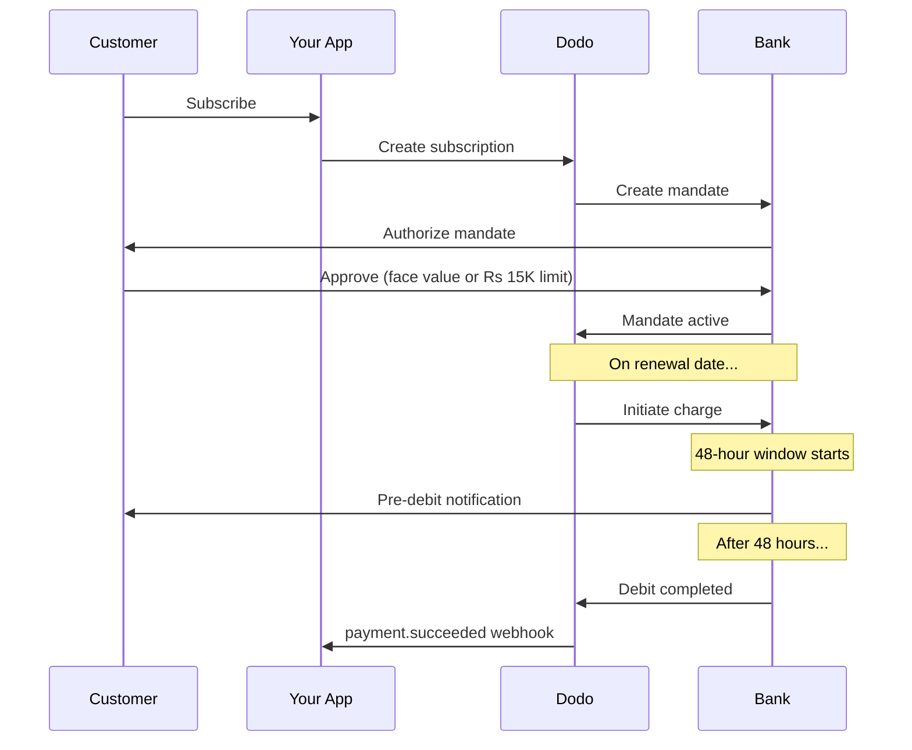

India memiliki infrastruktur pembayaran yang unik didominasi oleh UPI (60%+ dari transaksi digital) dan kartu Rupay. Dodo Payments mendukung keduanya dengan kepatuhan penuh terhadap RBI untuk mandat langganan.

## Mengapa Metode Pembayaran India Penting

<CardGroup cols={3}>
<Card title="Dominasi UPI" icon="mobile">
UPI memproses 10B+ transaksi/bulan. Banyak pelanggan India tidak memiliki kartu internasional.
</Card>

<Card title="Biaya Transaksi Rendah" icon="indian-rupee-sign">
UPI memiliki biaya transaksi mendekati nol. Sangat baik untuk transaksi bernilai rendah dalam volume tinggi.
</Card>

<Card title="Dukungan Langganan" icon="repeat">
Tidak seperti sebagian besar metode pembayaran alternatif, UPI dan Rupay mendukung pembayaran berulang melalui mandat RBI.
</Card>
</CardGroup>

## Metode yang Didukung

| Metode | Tipe | Langganan | Jumlah Min |
| :----- | :--- | :-----------: | :--------- |
| **UPI Collect** | Kode QR / VPA | Ya* | ₹1 |
| **Rupay Kredit** | Kartu | Ya* | ₹1 |
| **Rupay Debit** | Kartu | Ya* | ₹1 |

*Langganan memerlukan mandat yang sesuai dengan RBI dengan aturan pemrosesan khusus.

## Konfigurasi

### Tipe Metode API

| Tipe | Deskripsi |
| :--- | :---------- |
| `upi_collect` | UPI melalui kode QR atau entri VPA |
| `credit` | Kartu kredit termasuk Rupay |
| `debit` | Kartu debit termasuk Rupay |

### Contoh: Checkout Berfokus pada India

```javascript
const session = await client.checkoutSessions.create({
  product_cart: [{ product_id: 'prod_123', quantity: 1 }],
  allowed_payment_method_types: [
    'upi_collect',
    'credit',
    'debit'
  ],
  billing_currency: 'INR',
  customer: {
    email: 'customer@example.in',
    name: 'Priya Sharma',
    phone_number: '+919876543210'
  },
  billing_address: {
    country: 'IN',
    zipcode: '560001'
  },
  return_url: 'https://example.com/success'
});
```

### Persyaratan untuk UPI

Agar UPI muncul di checkout:
1. **Negara penagihan** harus India (`IN`)
2. **Mata Uang** harus INR
3. Untuk pedagang non-India: **Mata Uang Adaptif** harus diaktifkan

<Warning>
Jika Anda adalah pedagang non-India dan Mata Uang Adaptif tidak diaktifkan, UPI tidak akan tersedia untuk pelanggan Anda.
</Warning>

## Langganan dengan Mandat RBI

Langganan metode pembayaran India beroperasi di bawah regulasi RBI (Reserve Bank of India) dengan persyaratan unik.

### Cara Kerja Mandat RBI



### Tipe Mandat

| Jumlah Langganan | Tipe Mandat | Batas |
| :------------------ | :----------- | :---- |
| **Di Bawah Rs 15,000** | Mandat sesuai permintaan | Rs 15,000 |
| **Rs 15,000 atau lebih** | Mandat jumlah tetap | Jumlah langganan yang tepat |

**Penting untuk perubahan rencana:** Jika peningkatan mengakibatkan biaya melebihi batas mandat yang ada, biaya akan gagal dan pelanggan harus mengotorisasi ulang.

### Penundaan Pemrosesan 48 Jam

Ini adalah perbedaan paling penting dari pembayaran menggunakan kartu internasional:

<Steps>
<Step title="Pengisian Dimulai (Hari 0)">
Pada tanggal pembaruan yang dijadwalkan, Dodo memulai pengisian dengan bank.
</Step>

<Step title="Pemberitahuan Pra-Debet">
Pelanggan menerima pemberitahuan dari bank mereka tentang debit yang akan datang.
</Step>

<Step title="Jendela 48 Jam">
Pelanggan dapat membatalkan mandat selama periode ini melalui aplikasi perbankan mereka.
</Step>

<Step title="Debit Selesai (~48-51 jam)">
Setelah 48 jam (ditambah hingga 3 jam tambahan untuk pemrosesan bank), dana akan didebit.
</Step>

<Step title="Webhook Dikirim">
`payment.succeeded` webhook dikirim setelah debit aktual, bukan saat inisiasi.
</Step>
</Steps>

<Warning>
**Jangan memberikan manfaat pada saat inisiasi pengisian.** Tunggu untuk webhook `payment.succeeded`, yang tiba ~48-51 jam setelah tanggal pengisian yang dijadwalkan.
</Warning>

### Menangani Jendela 48 Jam

```javascript
// DON'T do this:
async function handleSubscriptionRenewal(subscription) {
  // ❌ Bad: Granting access immediately when charge is initiated
  grantPremiumAccess(subscription.customer_id);
}

// DO this:
async function handlePaymentWebhook(event) {
  if (event.type === 'payment.succeeded') {
    // ✅ Good: Only grant access after payment is confirmed
    grantPremiumAccess(event.data.customer_id);
  }
  
  if (event.type === 'payment.failed') {
    // Handle failed payment (mandate cancelled, insufficient funds)
    revokePremiumAccess(event.data.customer_id);
  }
}
```

### Acara Webhook untuk Langganan India

| Acara | Kapan | Tindakan |
| :---- | :--- | :----- |
| `subscription.created` | Mandat disetujui | Catat awal langganan |
| `payment.succeeded` | ~48h setelah tanggal pengisian | Berikan/lanjutkan akses |
| `payment.failed` | Debit gagal | Beri tahu pelanggan, jeda akses |
| `subscription.on_hold` | Pembayaran gagal | Minta pembaruan metode pembayaran |
| `subscription.active` | Diaktifkan kembali setelah pembayaran | Pulihkan akses |

## Pengujian

### ID Tes UPI

| Status | ID UPI |
| :----- | :----- |
| Sukses | `success@upi` |
| Gagal | `failure@upi` |

### Nomor Tes Kartu India

| Merek | Skenario | Nomor Kartu | Masa Berlaku | CVV |
| :---- | :------- | :---------- | :----- | :-- |
| Visa | Sukses | `4576238912771450` | 06/32 | 123 |
| Visa | Ditolak | `4706131211212123` | 06/32 | 123 |
| Mastercard | Sukses | `5409162669381034` | 06/32 | 123 |
| Mastercard | Ditolak | `5105105105105100` | 06/32 | 123 |

## Praktik Terbaik

<AccordionGroup>
<Accordion title="Rencanakan untuk penundaan 48 jam">
Bangun aplikasi Anda untuk menangani celah antara inisiasi pengisian dan pembayaran yang sebenarnya. Pertimbangkan:
- Periode tenggang untuk akses langganan
- Komunikasi yang jelas kepada pelanggan tentang waktu pemrosesan
- Pemenuhan berbasis webhook, bukan berbasis tanggal
</Accordion>

<Accordion title="Tangani pembatalan mandat">
Pelanggan dapat membatalkan mandat melalui aplikasi bank mereka kapan saja. Pantau `subscription.on_hold` webhook dan minta pelanggan untuk mendaftar ulang atau memperbarui metode pembayaran.
</Accordion>

<Accordion title="Tetapkan jumlah mandat yang sesuai">
Untuk harga variabel (misalnya, berbasis penggunaan), pertimbangkan apakah mandat sesuai permintaan senilai Rs 15,000 sudah cukup. Jika biaya mungkin melebihi ini, pelanggan perlu mengotorisasi ulang.
</Accordion>

<Accordion title="Tawarkan UPI secara mencolok">
Untuk pelanggan India, UPI harus menjadi opsi pembayaran utama. Banyak pengguna lebih menyukainya daripada kartu karena familiaritas dan sedikit gesekan.
</Accordion>
</AccordionGroup>

## Pemecahan Masalah

<AccordionGroup>
<Accordion title="UPI tidak muncul di checkout">
**Periksa:**
1. Negara penagihan diatur ke `IN`?
2. Mata uang diatur ke `INR`?
3. Jika pedagang non-India: Apakah Mata Uang Adaptif diaktifkan?
4. `upi_collect` termasuk di `allowed_payment_method_types`?

**Solusi:** Verifikasi alamat penagihan memiliki `country: "IN"` dan `billing_currency: "INR"`.
</Accordion>

<Accordion title="Pengisian langganan gagal setelah peningkatan">
**Penyebab:** Jumlah pengisian baru melebihi batas mandat yang ada (ambang Rs 15,000).

**Solusi:** Pelanggan harus memperbarui metode pembayaran untuk menetapkan mandat baru dengan batas yang benar.
</Accordion>

<Accordion title="Langganan tertunda tetapi pelanggan mengklaim mereka tidak membatalkan">
**Penyebab:** Pelanggan mungkin telah membatalkan mandat selama jendela 48 jam, atau bank mereka menolak debit.

**Solusi:** Pelanggan perlu mengotorisasi ulang mandat atau memperbarui metode pembayaran mereka.
</Accordion>

<Accordion title="Pengurangan pembayaran ditunda lebih dari 48 jam">
**Penyebab:** Penundaan API bank dapat memperpanjang pemrosesan hingga 2-3 jam tambahan.

**Solusi:** Ini diharapkan. Bangun sistem Anda untuk menangani penundaan variabel hingga ~51 jam total.
</Accordion>

<Accordion title="Mandat dibatalkan tetapi langganan tetap aktif">
**Penyebab:** Kasus tepi dalam regulasi RBI — pembatalan mandat selama jendela pemrosesan tidak segera membatalkan langganan.

**Solusi:** Pengisian berikutnya akan gagal dan langganan akan beralih ke `on_hold`. Pantau webhook untuk `payment.failed`.
</Accordion>
</AccordionGroup>

## Halaman Terkait

<CardGroup cols={2}>
<Card title="Ikhtisar Metode Pembayaran" icon="credit-card" href="/features/payment-methods">
Lihat semua metode pembayaran yang didukung.
</Card>

<Card title="Langganan" icon="repeat" href="/features/subscription">
Dokumentasi lengkap langganan termasuk mandat RBI.
</Card>

<Card title="Webhook" icon="webhook" href="/developer-resources/webhooks">
Penanganan webhook untuk kejadian pembayaran.
</Card>

<Card title="Proses Pengujian" icon="flask" href="/miscellaneous/testing-process">
Semua data uji termasuk ID UPI dan kartu India.
</Card>
</CardGroup>
