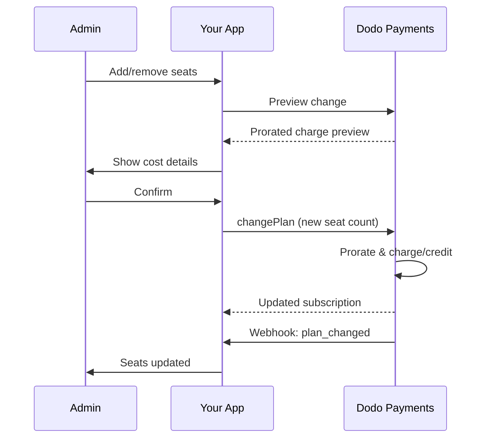

<Info>
Penagihan berbasis kursi memungkinkan Anda menagih pelanggan berdasarkan jumlah pengguna, anggota tim, atau lisensi yang mereka perlukan. Ini adalah model harga standar untuk alat kolaborasi tim, perangkat lunak perusahaan, dan produk SaaS B2B.
</Info>

<CardGroup cols={2}>
<Card title="Implementation Tutorial" icon="code" href="/developer-resources/seat-based-pricing">
  Panduan langkah demi langkah dengan contoh kode.
</Card>

<Card title="Add-ons Documentation" icon="puzzle" href="/features/addons">
  Pelajari tentang sistem add-on yang mendukung penagihan berbasis kursi.
</Card>

<Card title="Subscription Management" icon="repeat" href="/features/subscription">
  Kelola langganan berbasis kursi dan perubahan paket.
</Card>

<Card title="Webhooks" icon="bell" href="/developer-resources/webhooks/intents/subscription">
  Lacak perubahan kursi dengan webhook langganan.
</Card>
</CardGroup>

---

## Apa itu Penagihan Berdasarkan Kursi?

Penagihan berbasis kursi (juga disebut harga per pengguna atau per kursi) mengenakan biaya kepada pelanggan berdasarkan jumlah pengguna yang mengakses produk Anda. Alih-alih biaya tetap, harga akan meningkat seiring dengan ukuran tim.

### Kasus Penggunaan Umum

| Industri | Contoh | Model Harga |
|----------|---------|---------------|
| Kolaborasi Tim | Slack, Notion, Asana | Per pengguna aktif/bulan |
| Alat Pengembang | GitHub, GitLab, Jira | Per kursi/bulan |
| Perangkat Lunak CRM | Salesforce, HubSpot | Per lisensi pengguna |
| Alat Desain | Figma, Canva | Per kursi editor |
| Perangkat Lunak Keamanan | 1Password, Okta | Per pengguna/bulan |
| Konferensi Video | Zoom, Teams | Per lisensi host |

### Manfaat Harga Berdasarkan Kursi

**Untuk Bisnis Anda:**
- Pendapatan berkembang secara alami seiring pertumbuhan pelanggan
- Harga yang dapat diprediksi yang dapat dianggarkan oleh pelanggan
- Jalur peningkatan yang jelas dari individu ke tim hingga perusahaan
- Nilai seumur hidup yang lebih tinggi seiring tim berkembang

**Untuk Pelanggan Anda:**
- Bayar hanya untuk apa yang mereka gunakan
- Mudah dipahami dan memprediksi biaya
- Fleksibilitas untuk menambah/menghapus pengguna sesuai kebutuhan
- Harga yang adil yang sesuai dengan ukuran tim

---

## Bagaimana Penagihan Berdasarkan Kursi Bekerja di Dodo Payments

Dodo Payments menerapkan penagihan berbasis kursi menggunakan sistem **Add-ons**. Berikut cara kerjanya:

### Ikhtisar Arsitektur

Langganan Team Pro seharga $99/bulan dan mencakup 5 kursi. Jika Anda memiliki lebih dari 5 pengguna, Anda membayar $15/bulan tambahan untuk setiap kursi ekstra. 

Misalnya, jika tim Anda membutuhkan 15 kursi:
- Paket Dasar: $99/bulan (termasuk 5 kursi)
- Add-on: 10 kursi tambahan × $15/bulan = $150/bulan
- Total biaya bulanan: $99 + $150 = $249 untuk 15 kursi

### Komponen Utama

| Komponen | Tujuan | Contoh |
|-----------|---------|---------|
| Produk Dasar | Langganan inti dengan kursi yang termasuk | "Rencana Tim - $99/bulan (5 kursi termasuk)" |
| Add-on Kursi | Biaya per kursi untuk pengguna tambahan | "Kursi Tambahan - $15/bulan masing-masing" |
| Kuantitas | Jumlah kursi tambahan yang dibeli | 10 kursi tambahan |

---

## Strategi Penetapan Harga

Pilih strategi penetapan harga berbasis kursi yang sesuai untuk bisnis Anda:

### Strategi 1: Dasar + Add-on Per-Kursi

Sertakan sejumlah kursi dalam rencana dasar, kenakan biaya untuk kursi tambahan.

**Contoh:**

```
Starter Plan: $49/month
├── Includes: 3 seats
├── Extra seats: $10/month each
└── 8 total seats = $49 + (5 × $10) = $99/month
```

**Terbaik untuk:** Produk di mana tim kecil dapat berfungsi dengan penawaran dasar.

### Strategi 2: Harga Per-Kursi Murni

Kenakan tarif tetap per kursi tanpa biaya dasar.

**Contoh:**

```
Per User: $12/month
├── 5 users = $60/month
├── 20 users = $240/month
└── 100 users = $1,200/month
```

**Implementasi:** Atur harga rencana dasar menjadi $0, gunakan hanya add-on kursi.

**Terbaik untuk:** Penetapan harga yang sederhana dan transparan; model berbasis penggunaan.

### Strategi 3: Penetapan Harga Kursi Bertingkat

Rencana dasar yang berbeda dengan tarif per-kursi yang berbeda.

**Contoh:**

```
Starter: $0/month base + $15/seat
├── Lower features, higher per-seat cost

Professional: $99/month base + $10/seat
├── More features, lower per-seat cost

Enterprise: $499/month base + $7/seat
└── All features, volume discount on seats
```

**Implementasi:** Buat produk terpisah untuk setiap tingkat dengan harga add-on yang berbeda.

**Terbaik untuk:** Mendorong peningkatan ke tingkat yang lebih tinggi; penjualan perusahaan.

### Strategi 4: Paket Kursi

Jual kursi dalam paket daripada secara individu.

**Contoh:**

```
5-Seat Pack: $50/month ($10/seat)
10-Seat Pack: $80/month ($8/seat)
25-Seat Pack: $175/month ($7/seat)
```

**Implementasi:** Buat beberapa add-on untuk ukuran paket yang berbeda.

**Terbaik untuk:** Menyederhanakan keputusan pembelian; mendorong komitmen yang lebih besar.

---

## Menyiapkan Penagihan Berdasarkan Kursi

### Langkah 1: Rencanakan Penetapan Harga Anda

Sebelum implementasi, tentukan struktur harga Anda:

<Steps>
<Step title="Define Base Plan">
Putuskan apa yang termasuk dalam langganan dasar:
- Harga dasar (bisa $0 untuk model murni per-kursi)
- Jumlah kursi yang disertakan
- Fitur yang tersedia pada tingkat ini
</Step>

<Step title="Set Seat Pricing">
Tentukan biaya add-on per kursi:
- Harga per kursi tambahan
- Diskon volume (melalui beberapa add-on)
- Maksimal kursi yang diperbolehkan (jika berlaku)
</Step>

<Step title="Consider Billing Frequency">
Sesuaikan harga kursi dengan siklus penagihan Anda:
- Langganan bulanan → biaya kursi bulanan
- Langganan tahunan → biaya kursi tahunan (seringkali diskon)
</Step>
</Steps>

### Langkah 2: Buat Add-on Kursi

Di dasbor Dodo Payments Anda:

1. Navigasi ke **Produk** → **Add-Ons**
2. Klik **Buat Add-On**
3. Konfigurasikan add-on:

| Field | Value | Notes |
|-------|-------|-------|
| Nama | "Kursi Tambahan" atau "Anggota Tim" | Nama yang jelas dan ramah pengguna |
| Deskripsi | "Tambahkan anggota tim lain ke ruang kerja Anda" | Jelaskan apa yang didapat pelanggan |
| Harga | Harga per kursi Anda | misalnya, $10.00 |
| Mata Uang | Sesuaikan dengan produk dasar Anda | Harus sama dengan mata uang yang sama |
| Kategori Pajak | Sama dengan produk dasar | Memastikan penanganan pajak yang konsisten |

<Tip>
Buat nama add-on deskriptif yang masuk akal di faktur. "Additional Team Seat" lebih jelas daripada "Seat Add-on" bagi pelanggan yang melihat tagihan mereka.
</Tip>

### Langkah 3: Buat Produk Langganan Dasar

Buat produk langganan Anda:

1. Navigasi ke **Produk** → **Buat Produk**
2. Pilih **Langganan**
3. Konfigurasikan harga dan detail
4. Di bagian **Add-Ons**, lampirkan add-on kursi Anda

### Langkah 4: Lampirkan Add-on ke Produk

Tautkan add-on kursi ke langganan Anda:

1. Edit produk langganan Anda
2. Gulir ke bagian **Add-Ons**
3. Klik **Tambahkan Add-Ons**
4. Pilih add-on kursi Anda
5. Simpan perubahan

<Check>
Produk langganan Anda sekarang mendukung harga berbasis kursi. Pelanggan dapat membeli jumlah kursi tambahan berapa pun saat checkout.
</Check>

---

## Mengelola Kursi

### Menambahkan Kursi ke Langganan Baru

Saat membuat sesi checkout, tentukan jumlah kursi:

```typescript
const session = await client.checkoutSessions.create({
  product_cart: [{
    product_id: 'prod_team_plan',
    quantity: 1,
    addons: [{
      addon_id: 'addon_seat',
      quantity: 10  // 10 additional seats
    }]
  }],
  customer: { email: 'admin@company.com' },
  return_url: 'https://yourapp.com/success'
});
```

### Mengubah Jumlah Kursi pada Langganan yang Ada

Gunakan API Ubah Rencana untuk menyesuaikan kursi:

```typescript
// Add 5 more seats to existing subscription
await client.subscriptions.changePlan('sub_123', {
  product_id: 'prod_team_plan',
  quantity: 1,
  proration_billing_mode: 'prorated_immediately',
  addons: [{
    addon_id: 'addon_seat',
    quantity: 15  // New total: 15 additional seats
  }]
});
```

### Menghapus Kursi

Untuk mengurangi jumlah kursi, tentukan kuantitas yang lebih rendah:

```typescript
// Reduce from 15 to 8 additional seats
await client.subscriptions.changePlan('sub_123', {
  product_id: 'prod_team_plan',
  quantity: 1,
  proration_billing_mode: 'difference_immediately',
  addons: [{
    addon_id: 'addon_seat',
    quantity: 8  // Reduced to 8 additional seats
  }]
});
```

### Menghapus Semua Kursi Tambahan

Kirim array addons kosong untuk menghapus semua add-on:

```typescript
// Remove all additional seats, keep only base plan seats
await client.subscriptions.changePlan('sub_123', {
  product_id: 'prod_team_plan',
  quantity: 1,
  proration_billing_mode: 'difference_immediately',
  addons: []  // Removes all add-ons
});
```

---

## Prorasi untuk Perubahan Kursi

Ketika pelanggan menambah atau menghapus kursi di tengah siklus, prorasi menentukan bagaimana mereka ditagih.



### Mode Prorata

| Mode | Menambah Kursi | Mengurangi Kursi |
|------|-------------|----------------|
| `prorated_immediately` | Charge for remaining days in cycle | Credit for unused days |
| `difference_immediately` | Charge full seat price | Credit applied to future renewals |
| `full_immediately` | Charge full seat price, reset billing cycle | No credit |

### Contoh Prorata

**Skenario: Siklus penagihan 15 hari tersisa, menambahkan 5 kursi seharga $10/kursi**

<Tabs>
<Tab title="prorated_immediately">

```
Prorated charge = ($10 × 5 seats) × (15 days / 30 days)
                = $50 × 0.5
                = $25 immediate charge
```

Pelanggan membayar $25 sekarang, lalu $50/bulan saat pembaruan.
</Tab>

<Tab title="difference_immediately">

```
Immediate charge = $10 × 5 seats = $50
```

Pelanggan membayar penuh $50 sekarang, terlepas dari posisi siklus.
</Tab>

<Tab title="full_immediately">

```
Immediate charge = Full subscription + add-ons
Billing cycle resets to today
```

Pelanggan membayar jumlah penuh, siklus penagihan baru dimulai.
</Tab>
</Tabs>

**Skenario: Menghapus 3 kursi di tengah siklus dengan prorated_immediately**

```
Current: Team Plan ($99/month) + 10 extra seats × $10/seat = $199/month
Change: Remove 3 seats (10 → 7 extra seats) on day 20 of 30-day cycle
Remaining: 10 days

Credit for removed seats:
  = ($10 × 3 seats) × (10 days / 30 days)
  = $30 × 0.333
  = $10.00 credit

→ $10.00 credit added to subscription
→ Next renewal: $99 + (7 × $10) = $169.00/month
→ Credit auto-applies: $169.00 − $10.00 = $159.00 on next invoice
```

<Tip>
**Memilih mode prorata untuk perubahan kursi**: Gunakan `prorated_immediately` untuk penagihan berbasis hari yang adil ketika tim sering menyesuaikan kursi. Gunakan `difference_immediately` untuk matematika yang lebih sederhana yang mengenakan biaya atau mengkreditkan harga kursi penuh. Lihat [Panduan Prorata](/developer-resources/subscription-upgrade-downgrade#proration-modes) untuk perbandingan rinci.
</Tip>

### Pratinjau Sebelum Mengubah

Selalu pratinjau prorata sebelum melakukan perubahan:

```typescript
const preview = await client.subscriptions.previewChangePlan('sub_123', {
  product_id: 'prod_team_plan',
  quantity: 1,
  proration_billing_mode: 'prorated_immediately',
  addons: [{ addon_id: 'addon_seat', quantity: 20 }]
});

console.log('Immediate charge:', preview.immediate_charge.summary);
// Show customer: "Adding 5 seats will cost $25 today"
```

---

## Melacak Kursi dengan Webhook

Pantau perubahan kursi dengan mendengarkan webhook langganan:

### Event yang Relevan

| Event | Kapan Dipicu | Kasus Penggunaan |
|-------|----------------|----------|
| `subscription.active` | Langganan baru diaktifkan | Sediakan kursi awal |
| `subscription.plan_changed` | Kursi ditambahkan/dihapus | Perbarui jumlah kursi di aplikasi Anda |
| `subscription.renewed` | Langganan diperpanjang | Pastikan jumlah kursi tidak berubah |
| `subscription.cancelled` | Langganan dibatalkan | Hapus semua kursi |

### Contoh Handler Webhook

```typescript
app.post('/webhooks/dodo', async (req, res) => {
  const event = req.body;

  switch (event.type) {
    case 'subscription.active':
      // New subscription - provision seats
      const seats = calculateTotalSeats(event.data);
      await provisionSeats(event.data.customer_id, seats);
      break;

    case 'subscription.plan_changed':
      // Seats changed - update access
      const newSeats = calculateTotalSeats(event.data);
      await updateSeatCount(event.data.subscription_id, newSeats);
      break;

    case 'subscription.cancelled':
      // Subscription cancelled - deprovision
      await deprovisionAllSeats(event.data.subscription_id);
      break;
  }

  res.json({ received: true });
});

function calculateTotalSeats(subscriptionData) {
  const baseSeats = 5;  // Included in plan
  const addonSeats = subscriptionData.addons?.reduce(
    (total, addon) => total + addon.quantity, 0
  ) || 0;
  return baseSeats + addonSeats;
}
```

---

## Menegakkan Batas Kursi

Aplikasi Anda harus menegakkan batas kursi. Dodo Payments melacak penagihan, tetapi Anda mengendalikan akses.

### Strategi Penegakan

<Tabs>
<Tab title="Hard Limit">
Tegas mencegah penambahan pengguna di luar jumlah kursi.

```typescript
async function inviteUser(teamId: string, email: string) {
  const team = await getTeam(teamId);
  const subscription = await getSubscription(team.subscriptionId);
  const totalSeats = calculateTotalSeats(subscription);
  const usedSeats = await countTeamMembers(teamId);

  if (usedSeats >= totalSeats) {
    throw new Error('No seats available. Please upgrade your plan.');
  }

  await sendInvitation(teamId, email);
}
```

</Tab>

<Tab title="Soft Limit with Warning">
Izinkan melebihi dengan peringatan dan masa tenggang.

```typescript
async function inviteUser(teamId: string, email: string) {
  const team = await getTeam(teamId);
  const { totalSeats, usedSeats } = await getSeatInfo(team);

  if (usedSeats >= totalSeats) {
    // Allow but flag for billing
    await flagOverage(teamId, usedSeats - totalSeats + 1);
    await notifyAdmin(team.adminEmail, 'You have exceeded your seat limit');
  }

  await sendInvitation(teamId, email);
}
```

</Tab>

<Tab title="Auto-Upgrade">
Tambahkan kursi secara otomatis ketika batas tercapai.

```typescript
async function inviteUser(teamId: string, email: string) {
  const team = await getTeam(teamId);
  const { totalSeats, usedSeats, subscriptionId } = await getSeatInfo(team);

  if (usedSeats >= totalSeats) {
    // Automatically add a seat
    await client.subscriptions.changePlan(subscriptionId, {
      product_id: team.productId,
      quantity: 1,
      proration_billing_mode: 'prorated_immediately',
      addons: [{ addon_id: 'addon_seat', quantity: totalSeats - baseSeats + 1 }]
    });

    await notifyAdmin(team.adminEmail, 'A new seat was added to your plan');
  }

  await sendInvitation(teamId, email);
}
```

</Tab>
</Tabs>

---

## Pola Lanjutan

### Jenis Kursi yang Berbeda

Tawarkan jenis kursi berbeda dengan harga berbeda:

```
Full Seats: $20/month - Full access to all features
View-Only Seats: $5/month - Read-only access
Guest Seats: $0/month - Limited external collaborator access
```

**Implementasi:** Buat add-on terpisah untuk setiap jenis kursi.

```typescript
const session = await client.checkoutSessions.create({
  product_cart: [{
    product_id: 'prod_team_plan',
    quantity: 1,
    addons: [
      { addon_id: 'addon_full_seat', quantity: 10 },
      { addon_id: 'addon_viewer_seat', quantity: 25 },
      { addon_id: 'addon_guest_seat', quantity: 50 }
    ]
  }]
});
```

### Diskon Kursi Tahunan

Tawarkan harga kursi tahunan dengan diskon:

```
Monthly: $15/seat/month
Annual: $12/seat/month (20% savings)
```

**Implementasi:** Buat produk terpisah untuk paket bulanan dan tahunan dengan harga add-on yang berbeda.

### Persyaratan Kursi Minimum

Tuntut jumlah kursi minimum untuk paket tertentu:

```typescript
async function validateSeatCount(planId: string, seatCount: number) {
  const minimums = {
    'prod_starter': 1,
    'prod_team': 5,
    'prod_enterprise': 25
  };

  if (seatCount < minimums[planId]) {
    throw new Error(`${planId} requires at least ${minimums[planId]} seats`);
  }
}
```

---

## Praktik Terbaik

### Praktik Terbaik Penetapan Harga

- **Komunikasi Jelas**: Tampilkan harga per kursi secara mencolok di halaman harga Anda
- **Kursi yang Disertakan**: Pertimbangkan menyertakan beberapa kursi dalam harga dasar untuk mengurangi hambatan
- **Diskon Volume**: Tawarkan tarif per kursi lebih rendah untuk tim besar guna memenangkan kesepakatan perusahaan
- **Insentif Tahunan**: Diskon paket tahunan untuk meningkatkan arus kas dan retensi

### Praktik Terbaik Teknis

- **Cache Jumlah Kursi**: Cache jumlah kursi langganan secara lokal untuk menghindari panggilan API setiap permintaan
- **Sinkronisasi Secara Berkala**: Sinkronkan jumlah kursi lokal Anda secara berkala dengan Dodo Payments via API
- **Tangani Kegagalan**: Jika perubahan kursi gagal, tampilkan pesan kesalahan yang jelas dan opsi coba ulang
- **Jejak Audit**: Catat semua perubahan kursi untuk sengketa penagihan dan kepatuhan

### Praktik Terbaik Pengalaman Pengguna

- **Umpan Balik Waktu-nyata**: Tampilkan dampak biaya segera saat menyesuaikan kursi
- **Langkah Konfirmasi**: Minta konfirmasi sebelum perubahan penagihan
- **Transparansi Prorata**: Jelaskan dengan jelas biaya prorata sebelum diterapkan
- **Penurunan Tingkat yang Mudah**: Jangan membuatnya sulit untuk mengurangi kursi (ini membangun kepercayaan)

---

## Pemecahan Masalah

<AccordionGroup>
<Accordion title="Seat count mismatch between app and billing">
**Gejala**: Aplikasi Anda menampilkan jumlah kursi berbeda dari langganan.

**Penyebab**:
- Webhook tidak diterima atau diproses
- Kondisi balapan saat perubahan kursi
- Data cache tidak diperbarui

**Solusi**:
1. Terapkan handler webhook untuk `subscription.plan_changed`
2. Tambahkan tombol "Sinkronkan dengan penagihan" yang mengambil langganan saat ini
3. Tetapkan TTL cache untuk memastikan penyegaran reguler
</Accordion>

<Accordion title="Proration charges unexpected">
**Gejala**: Pelanggan bingung dengan jumlah tagihan di tengah siklus.

**Penyebab**:
- Mode prorata tidak dikomunikasikan dengan jelas
- Pelanggan tidak melihat pratinjau sebelum mengonfirmasi

**Solusi**:
1. Selalu gunakan `previewChangePlan` sebelum melakukan perubahan
2. Tampilkan rincian yang jelas: "Menambah X kursi = $Y hari ini (prorata untuk Z hari)"
3. Dokumentasikan kebijakan prorata Anda di pusat bantuan
</Accordion>

<Accordion title="Add-on not appearing in checkout">
**Gejala**: Add-on kursi tidak tersedia saat checkout.

**Penyebab**:
- Add-on tidak terpasang ke produk
- Add-on diarsipkan atau dihapus
- Ketidaksesuaian mata uang antara produk dan add-on

**Solusi**:
1. Verifikasi add-on terpasang di pengaturan produk
2. Periksa status add-on di dasbor Add-Ons
3. Pastikan mata uang cocok persis
</Accordion>

<Accordion title="Cannot reduce seats below current usage">
**Gejala**: Pelanggan ingin mengurangi kursi tetapi memiliki pengguna yang ditetapkan.

**Solusi**:
1. Tunjukkan pengguna mana yang harus dihapus sebelum mengurangi kursi
2. Terapkan alur kerja: Hapus pengguna → Kurangi kursi
3. Pertimbangkan masa tenggang sebelum memberlakukan pengurangan kursi
</Accordion>
</AccordionGroup>

---

## Dokumentasi Terkait

<CardGroup cols={2}>
<Card title="Seat-Based Pricing Tutorial" icon="code" href="/developer-resources/seat-based-pricing">
  Panduan implementasi lengkap dengan kode.
</Card>

<Card title="Add-ons" icon="puzzle" href="/features/addons">
  Pahami sistem add-on secara mendalam.
</Card>

<Card title="Plan Changes & Proration" icon="arrows-rotate" href="/developer-resources/subscription-upgrade-downgrade">
  Tangani modifikasi langganan.
</Card>

<Card title="Subscription Webhooks" icon="bell" href="/developer-resources/webhooks/intents/subscription">
  Lacak event langganan.
</Card>
</CardGroup>
