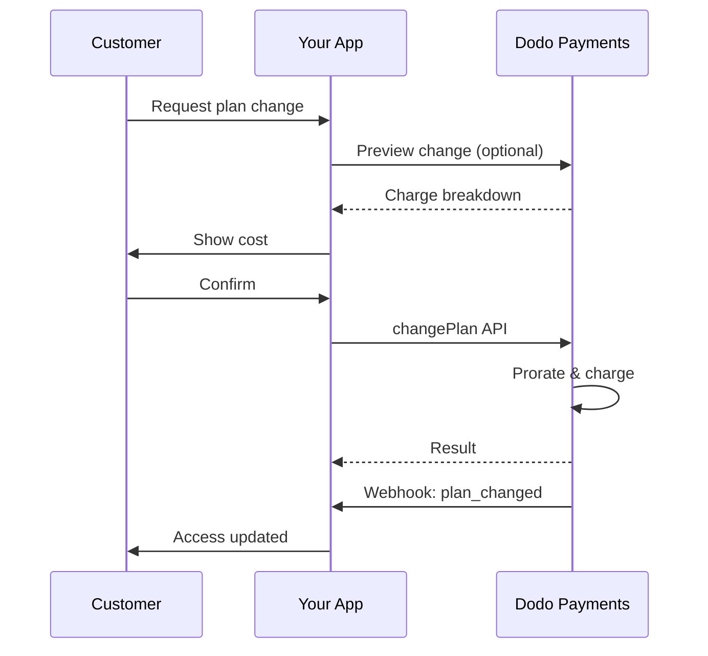
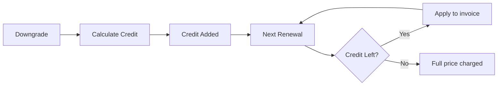

<Info>
Langganan memungkinkan Anda menjual akses berkelanjutan dengan pembaruan otomatis. Gunakan siklus penagihan yang fleksibel, percobaan gratis, perubahan paket, dan add-on untuk menyesuaikan harga bagi setiap pelanggan.
</Info>

<CardGroup cols={2}>
<Card title="Upgrade & Downgrade" icon="repeat" href="/developer-resources/subscription-upgrade-downgrade">
Kendalikan perubahan paket dengan prorasional dan pembaruan kuantitas.
</Card>

<Card title="On‑Demand Subscriptions" icon="bolt" href="/developer-resources/ondemand-subscriptions">
Otorisasi mandat sekarang dan kenakan biaya nanti dengan jumlah kustom.
</Card>

<Card title="Customer Portal" icon="id-card" href="/features/customer-portal">
Biarkan pelanggan mengelola paket, penagihan, dan pembatalan.
</Card>

<Card title="Subscription Webhooks" icon="code" href="/developer-resources/webhooks/intents/subscription">
Respon terhadap event siklus hidup seperti dibuat, diperbarui, dan dibatalkan.
</Card>
</CardGroup>

## Apa Itu Langganan?

Langganan adalah produk berulang yang dibeli pelanggan sesuai jadwal. Mereka ideal untuk:

- **Lisensi SaaS**: Aplikasi, API, atau akses platform
- **Keanggotaan**: Komunitas, program, atau klub
- **Konten digital**: Kursus, media, atau konten premium
- **Rencana dukungan**: SLA, paket keberhasilan, atau pemeliharaan

## Manfaat Utama

- **Pendapatan yang dapat diprediksi**: Penagihan berulang dengan pembaruan otomatis
- **Siklus fleksibel**: Bulanan, tahunan, interval kustom, dan percobaan
- **Agilitas rencana**: Prorata untuk peningkatan dan penurunan
- **Add-on dan kursi**: Lampirkan peningkatan opsional yang dapat dihitung
- **Checkout yang mulus**: Checkout yang dihosting dan portal pelanggan
- **Developer-first**: API yang jelas untuk pembuatan, perubahan, dan pelacakan penggunaan

## Membuat Langganan

Buat produk langganan di dasbor Dodo Payments Anda, lalu jual melalui checkout atau API Anda. Memisahkan produk dari langganan aktif memungkinkan Anda untuk memversioning harga, melampirkan add-on, dan melacak kinerja secara independen.

### Pembuatan produk langganan

Konfigurasikan bidang di dasbor untuk mendefinisikan bagaimana langganan Anda dijual, diperbarui, dan ditagih. Bagian di bawah ini langsung memetakan apa yang Anda lihat di formulir pembuatan.

#### Detail produk

- **Nama Produk** (wajib): Nama tampilan yang ditampilkan di checkout, portal pelanggan, dan faktur.
- **Deskripsi Produk** (wajib): Pernyataan nilai yang jelas yang muncul di checkout dan faktur.
- **Gambar Produk** (wajib): PNG/JPG/WebP hingga 3 MB. Digunakan di checkout dan faktur.
- **Merek**: Kaitkan produk dengan merek tertentu untuk tema dan email.
- **Kategori Pajak** (wajib): Pilih kategori (misalnya, SaaS) untuk menentukan aturan pajak.

<Tip>
Pilih kategori pajak yang paling akurat untuk memastikan pengumpulan pajak yang tepat di setiap wilayah.
</Tip>

#### Penetapan Harga

- **Tipe Harga**: Pilih <b>Langganan</b> (panduan ini). Alternatifnya adalah Pembayaran Tunggal dan Penagihan Berdasarkan Penggunaan.
- **Harga** (diperlukan): Harga dasar berulang dengan mata uang.
- **Diskon yang Berlaku (%)**: Diskon persentase opsional yang diterapkan pada harga dasar; tercermin dalam checkout dan faktur.
- **Pembayaran ulang setiap** (diperlukan): Interval untuk perpanjangan, misalnya, setiap 1 Bulan. Pilih ritme (bulan atau tahun) dan jumlahnya.
- **Periode Langganan** (diperlukan): Total masa di mana langganan tetap aktif (misalnya, 10 Tahun). Setelah periode ini berakhir, perpanjangan berhenti kecuali diperpanjang.
- **Hari Periode Percobaan** (diperlukan): Atur panjang percobaan dalam hari. Gunakan 0 untuk menonaktifkan percobaan. Biaya pertama terjadi secara otomatis ketika percobaan berakhir.
- **Pilih add-on**: Lampirkan hingga 10 add-on yang dapat dibeli pelanggan bersamaan dengan paket dasar.

<Warning>
Mengubah harga pada produk aktif akan memengaruhi pembelian baru. Langganan yang sudah ada mengikuti pengaturan perubahan paket dan prorasional Anda.
</Warning>

<Info>
Add-on ideal untuk tambahan yang dapat dihitung seperti tempat duduk atau penyimpanan. Anda dapat mengontrol kuantitas yang diizinkan dan perilaku prorasional saat pelanggan mengubahnya.
</Info>

#### Pengaturan Lanjutan

- **Harga Termasuk Pajak**: Tampilkan harga termasuk pajak yang berlaku. Perhitungan pajak akhir masih bervariasi berdasarkan lokasi pelanggan.
- **Hasilkan kunci lisensi**: Terbitkan kunci unik untuk setiap pelanggan setelah pembelian. Lihat panduan <a href="/features/license-keys">Kunci Lisensi</a>.
- **Pengiriman Produk Digital**: Kirim file atau konten secara otomatis setelah pembelian. Pelajari lebih lanjut di <a href="/features/digital-product-delivery">Pengiriman Produk Digital</a>.
- **Metadata**: Lampirkan pasangan kunci-nilai kustom untuk penandaan internal atau integrasi klien. Lihat <a href="/api-reference/metadata">Metadata</a>.

<Tip>
Gunakan metadata untuk menyimpan pengenal dari sistem Anda (misalnya accountId) agar Anda dapat merekonsiliasi event dan faktur nanti.
</Tip>

## Percobaan Langganan

Percobaan memungkinkan pelanggan mengakses langganan tanpa pembayaran segera. Biaya pertama terjadi secara otomatis ketika percobaan berakhir.

### Mengonfigurasi Percobaan

Tetapkan **Trial Period Days** di bagian harga produk (gunakan `0` untuk menonaktifkan). Anda dapat menimpanya saat membuat langganan:

```typescript
// Via subscription creation
const subscription = await client.subscriptions.create({
  customer_id: 'cus_123',
  product_id: 'prod_monthly',
  trial_period_days: 14  // Overrides product's trial period
});

// Via checkout session
const session = await client.checkoutSessions.create({
  product_cart: [{ product_id: 'prod_monthly', quantity: 1 }],
  subscription_data: { trial_period_days: 14 }
});
```

<Warning>
Nilai `trial_period_days` harus antara 0 dan 10.000 hari.
</Warning>

### Mendeteksi Status Percobaan

<Warning>
Saat ini, tidak ada field langsung untuk mendeteksi status trial. Berikut adalah solusi sementara yang memerlukan query pembayaran, yang tidak efisien. Kami sedang mengerjakan solusi yang lebih efisien.
</Warning>

Untuk menentukan apakah langganan sedang dalam percobaan, ambil daftar pembayaran untuk langganan tersebut. Jika ada tepat satu pembayaran dengan jumlah 0, langganan sedang dalam periode percobaan:

```typescript
const subscription = await client.subscriptions.retrieve('sub_123');
const payments = await client.payments.list({
  subscription_id: subscription.subscription_id
});

// Check if subscription is in trial
const isInTrial = payments.items.length === 1 && 
                  payments.items[0].total_amount === 0;
```

### Memperbarui Periode Percobaan

Perpanjang trial dengan memperbarui `next_billing_date`:

```typescript
await client.subscriptions.update('sub_123', {
  next_billing_date: '2025-02-15T00:00:00Z'  // New trial end date
});
```

<Warning>
Anda tidak dapat menetapkan `next_billing_date` ke waktu lampau. Tanggal harus di masa depan.
</Warning>

## Perubahan Rencana Langganan

Perubahan rencana memungkinkan Anda untuk meningkatkan atau menurunkan langganan, menyesuaikan kuantitas, atau bermigrasi ke produk yang berbeda. Setiap perubahan memicu biaya segera berdasarkan mode prorata yang Anda pilih.

<Tip>
Anda dapat mengubah paket langganan dan memperbarui tanggal penagihan berikutnya langsung dari dasbor Dodo Payments. Ini memberikan cara cepat untuk menyesuaikan langganan untuk permintaan dukungan pelanggan, peningkatan promosi, atau migrasi paket tanpa membuat panggilan API.
</Tip>

<Tip>
**Aktifkan perubahan paket swalayan:** Ingin pelanggan meningkatkan atau menurunkan langganan mereka sendiri melalui Portal Pelanggan? Tambahkan produk langganan Anda ke Koleksi Produk dan aktifkan "Allow Subscription Updates" di Pengaturan Langganan Anda.
</Tip>



<Card title="Product Collections" icon="layer-group" href="/features/product-collections">
  Kelompokkan produk terkait menjadi koleksi untuk memungkinkan jalur peningkatan/penurunan yang mulus di Portal Pelanggan.
</Card>

### Mode Prorasional

Pilih bagaimana pelanggan ditagih saat mengganti paket:

<Info>
**Perbandingan cepat dari tiga mode prorasional:**

| | `prorated_immediately` | `difference_immediately` | `full_immediately` |
|---|---|---|---|
| **Upgrade** | Beban prorata untuk hari tersisa | Selisih harga penuh | Harga paket baru penuh |
| **Downgrade** | Kredit prorata untuk hari tersisa | Selisih harga penuh sebagai kredit | Tidak ada kredit, tagihan penuh |
| **Siklus penagihan** | Tetap sama | Tetap sama | Diatur ulang ke hari ini |
| **Cocok untuk** | Penagihan adil berbasis waktu | Perubahan tingkatan sederhana | Reset siklus penagihan |
</Info>

#### `prorated_immediately`
Menagihkan jumlah prorata berdasarkan waktu tersisa dalam siklus penagihan saat ini. Cocok untuk penagihan yang adil dengan memperhitungkan waktu yang belum digunakan.

```typescript
await client.subscriptions.changePlan('sub_123', {
  product_id: 'prod_pro',
  quantity: 1,
  proration_billing_mode: 'prorated_immediately'
});
```

#### `difference_immediately`
Menagihkan selisih harga segera (upgrade) atau menambahkan kredit untuk pembaruan di masa depan (downgrade). Cocok untuk skenario upgrade/downgrade sederhana.

```typescript
// Upgrade: charges $50 (difference between $30 and $80)
// Downgrade: credits remaining value, auto-applied to renewals
await client.subscriptions.changePlan('sub_123', {
  product_id: 'prod_pro',
  quantity: 1,
  proration_billing_mode: 'difference_immediately'
});
```

<Info>
Kredit dari penurunan menggunakan `difference_immediately` berskala langganan dan diterapkan secara otomatis ke perpanjangan mendatang. Mereka berbeda dari hak <a href="/features/credit-based-billing">Penagihan Berbasis Kredit</a>.
</Info>

Saat pelanggan melakukan downgrade dengan `difference_immediately`, nilai yang belum digunakan menjadi kredit berskala langganan yang otomatis mengurangi pembaruan mendatang:



#### `full_immediately`
Menagihkan jumlah paket baru penuh segera, mengabaikan waktu yang tersisa. Cocok untuk mereset siklus penagihan.

```typescript
await client.subscriptions.changePlan('sub_123', {
  product_id: 'prod_monthly',
  quantity: 1,
  proration_billing_mode: 'full_immediately'
});
```

<AccordionGroup>
<Accordion title="Example: Prorated upgrade calculation">

**Skenario**: Pelanggan di Basic ($30/bulan) meningkatkan ke Pro ($80/bulan) pada hari ke-16 dari siklus 30 hari menggunakan `prorated_immediately`.

```
Unused credit from Basic = $30 × (15 remaining / 30 total) = $15.00
Prorated cost of Pro     = $80 × (15 remaining / 30 total) = $40.00
────────────────────────────────────────────────────────────────────
Immediate charge         = $40.00 − $15.00 = $25.00
```

Pembaharuan berikutnya pada tanggal penagihan asli: **$80,00/bulan**.

<Tip>
Untuk contoh perhitungan dan kasus tepi yang lebih rinci, lihat panduan lengkap kami [Upgrade & Downgrade Guide](/developer-resources/subscription-upgrade-downgrade).
</Tip>

</Accordion>
<Accordion title="Example: Downgrade credit calculation">

**Skenario**: Pelanggan di Pro ($80/bulan) menurunkan ke Starter ($20/bulan) menggunakan `difference_immediately`.

```
Credit = Old plan − New plan = $80 − $20 = $60.00
```

Kredit $60 diterapkan otomatis ke pembaruan selanjutnya:
- Pembaruan 1: $20 − $20 (kredit) = **$0,00** ($40 kredit tersisa)
- Pembaruan 2: $20 − $20 (kredit) = **$0,00** ($20 kredit tersisa)  
- Pembaruan 3: $20 − $20 (kredit) = **$0,00** (kredit habis)
- Pembaruan 4: **$20,00** (harga penuh)

<Info>
Pelajari lebih lanjut tentang bagaimana kredit dikelola di [Upgrade & Downgrade Guide](/developer-resources/subscription-upgrade-downgrade).
</Info>

</Accordion>
</AccordionGroup>

### Mengubah Paket dengan Add-on

Modifikasi add-on saat mengubah paket. Add-on diperhitungkan dalam perhitungan prorasional:

```typescript
await client.subscriptions.changePlan('sub_123', {
  product_id: 'prod_pro',
  quantity: 1,
  proration_billing_mode: 'difference_immediately',
  addons: [{ addon_id: 'addon_extra_seats', quantity: 2 }]  // Add add-ons
  // addons: []  // Empty array removes all existing add-ons
});
```

<Info>
Perubahan paket memicu penagihan segera. Jika penagihan gagal, langganan dapat beralih ke status `on_hold`. Lacak perubahan melalui event webhook `subscription.plan_changed`.
</Info>

### Pratinjau Perubahan Paket

Sebelum menyetujui perubahan paket, pratinjau biaya dan langganan hasilnya:

```typescript
const preview = await client.subscriptions.previewChangePlan('sub_123', {
  product_id: 'prod_pro',
  quantity: 1,
  proration_billing_mode: 'prorated_immediately'
});

// Show customer the charge before confirming
console.log('You will be charged:', preview.immediate_charge.summary);
```

<Card title="Preview Change Plan API" icon="eye" href="/api-reference/subscriptions/preview-change-plan">
  Pratinjau perubahan paket sebelum menyetujuinya.
</Card>

## Status Langganan

Langganan dapat berada dalam status berbeda sepanjang siklus hidupnya:

- **`active`**: Langganan aktif dan akan diperbarui otomatis
- **`on_hold`**: Langganan ditangguhkan karena pembayaran gagal. Pembaruan metode pembayaran diperlukan untuk mengaktifkan kembali
- **`cancelled`**: Langganan dibatalkan dan tidak akan diperbarui
- **`expired`**: Langganan telah mencapai tanggal berakhirnya
- **`pending`**: Langganan sedang dibuat atau diproses

### Status Ditangguhkan

Langganan masuk ke status `on_hold` ketika:

- Pembayaran pembaruan gagal (dana tidak mencukupi, kartu kadaluwarsa, dll.)
- Penagihan perubahan paket gagal
- Otorisasi metode pembayaran gagal

<Warning>
Saat langganan berada di status `on_hold`, langganan tidak akan diperbarui otomatis. Anda harus memperbarui metode pembayaran untuk mengaktifkan kembali langganan.
</Warning>

### Mengaktifkan Kembali dari Status Ditangguhkan

Untuk mengaktifkan kembali langganan dari status `on_hold`, perbarui metode pembayaran. Ini secara otomatis:

1. Membuat penagihan untuk tunggakan yang tersisa
2. Menghasilkan faktur
3. Memproses pembayaran menggunakan metode pembayaran baru
4. Mengaktifkan kembali langganan ke status `active` setelah pembayaran berhasil

```typescript
// Reactivate subscription from on_hold
const response = await client.subscriptions.updatePaymentMethod('sub_123', {
  type: 'new',
  return_url: 'https://example.com/return'
});

// For on_hold subscriptions, a charge is automatically created
if (response.payment_id) {
  console.log('Charge created:', response.payment_id);
  // Redirect customer to response.payment_link to complete payment
  // Monitor webhooks for payment.succeeded and subscription.active
}
```

<Info>
Setelah berhasil memperbarui metode pembayaran untuk langganan `on_hold`, Anda akan menerima event webhook `payment.succeeded` diikuti oleh `subscription.active`.
</Info>

## Manajemen API

<AccordionGroup>
<Accordion title="Create subscriptions">
Gunakan `POST /subscriptions` untuk membuat langganan secara programatik dari produk, dengan percobaan dan add-on opsional.

<Card title="API Reference" icon="code" href="/api-reference/subscriptions/post-subscriptions">
Lihat API buat langganan.
</Card>
</Accordion>

<Accordion title="Update subscriptions">
Gunakan `PATCH /subscriptions/{id}` untuk memperbarui kuantitas, membatalkan pada tanggal penagihan berikutnya, atau memodifikasi metadata.

<Card title="API Reference" icon="code" href="/api-reference/subscriptions/patch-subscriptions">
Pelajari cara memperbarui detail langganan.
</Card>
</Accordion>

<Accordion title="Change plans (proration)">
Ubah produk aktif dan kuantitas dengan kontrol prorasional.

<Card title="API Reference" icon="code" href="/api-reference/subscriptions/change-plan">
Tinjau opsi perubahan paket.
</Card>
</Accordion>

<Accordion title="On‑demand charges">
Untuk langganan on-demand, kenakan jumlah tertentu sesuai permintaan.

<Card title="API Reference" icon="code" href="/api-reference/subscriptions/create-charge">
Kenakan biaya langganan on-demand.
</Card>
</Accordion>

<Accordion title="List and retrieve">
Gunakan `GET /subscriptions` untuk mencantumkan semua langganan dan `GET /subscriptions/{id}` untuk mengambil satu.

<Card title="API Reference" icon="code" href="/api-reference/subscriptions/get-subscriptions">
Telusuri API listing dan retrieval.
</Card>
</Accordion>

<Accordion title="Usage history">
Ambil penggunaan tercatat untuk model harga metered atau hibrida.

<Card title="API Reference" icon="code" href="/api-reference/subscriptions/get-usage-history">
Lihat API riwayat penggunaan.
</Card>
</Accordion>

<Accordion title="Update payment method">
Perbarui metode pembayaran untuk langganan. Untuk langganan aktif, ini memperbarui metode pembayaran untuk pembaruan mendatang. Untuk langganan dalam status `on_hold`, ini mengaktifkan kembali langganan dengan membuat penagihan untuk tunggakan yang tersisa.

<Card title="API Reference" icon="code" href="/api-reference/subscriptions/update-payment-method">
Pelajari cara memperbarui metode pembayaran dan mengaktifkan kembali langganan.
</Card>
</Accordion>
</AccordionGroup>

## Kasus Penggunaan Umum

- **SaaS dan API**: Akses bertingkat dengan add-on untuk tempat duduk atau penggunaan
- **Konten dan media**: Akses bulanan dengan percobaan pengantar
- **Rencana dukungan B2B**: Kontrak tahunan dengan add-on dukungan premium
- **Alat dan plugin**: Kunci lisensi dan rilis berperingkat

## Contoh Integrasi

### Sesi Checkout (langganan)
Saat membuat sesi checkout, sertakan produk langganan Anda dan add-on opsional:

```typescript
const session = await client.checkoutSessions.create({
  product_cart: [
    {
      product_id: 'prod_subscription',
      quantity: 1
    }
  ]
});
```

### Perubahan paket dengan prorasional
Tingkatkan atau turunkan langganan dan kendalikan perilaku prorasional:

```typescript
await client.subscriptions.changePlan('sub_123', {
  product_id: 'prod_new',
  quantity: 1,
  proration_billing_mode: 'difference_immediately'
});
```

### Batalkan pada tanggal penagihan berikutnya
Jadwalkan pembatalan yang berlaku pada akhir periode penagihan saat ini:

```typescript
await client.subscriptions.update('sub_123', {
  cancel_at_next_billing_date: true
});
```

### Langganan on-demand
Buat langganan on-demand dan kenakan biaya nanti sesuai kebutuhan:

```typescript
const onDemand = await client.subscriptions.create({
  customer_id: 'cus_123',
  product_id: 'prod_on_demand',
  on_demand: true
});

await client.subscriptions.createCharge(onDemand.id, {
  amount: 4900,
  currency: 'USD',
  description: 'Extra usage for September'
});
```

### Perbarui metode pembayaran untuk langganan aktif
Perbarui metode pembayaran untuk langganan aktif:

```typescript
// Update with new payment method
const response = await client.subscriptions.updatePaymentMethod('sub_123', {
  type: 'new',
  return_url: 'https://example.com/return'
});

// Or use existing payment method
await client.subscriptions.updatePaymentMethod('sub_123', {
  type: 'existing',
  payment_method_id: 'pm_abc123'
});
```

### Aktifkan kembali langganan dari on_hold
Aktifkan kembali langganan yang ditangguhkan karena pembayaran gagal:

```typescript
// Update payment method - automatically creates charge for remaining dues
const response = await client.subscriptions.updatePaymentMethod('sub_123', {
  type: 'new',
  return_url: 'https://example.com/return'
});

if (response.payment_id) {
  // Charge created for remaining dues
  // Redirect customer to response.payment_link
  // Monitor webhooks: payment.succeeded → subscription.active
}
```

## Langganan dengan Mandat yang Mematuhi RBI

  Langganan UPI dan kartu India beroperasi di bawah regulasi RBI (Reserve Bank of India) dengan persyaratan mandat spesifik:

  ### Batas Mandat

  Jenis dan jumlah mandat tergantung pada biaya langganan berulang Anda:

  - **Biaya di bawah Rs 15.000:** Kami membuat mandat on-demand sebesar Rs 15.000 INR. Jumlah langganan ditagih secara berkala sesuai frekuensi langganan Anda, hingga batas mandat.
  - **Biaya Rs 15.000 atau lebih:** Kami membuat mandat langganan (atau mandat on-demand) untuk jumlah langganan yang tepat.

Untuk informasi rinci tentang mandat yang sesuai dengan RBI untuk metode pembayaran India, lihat halaman <a href="/features/payment-methods/india">India Payment Methods</a>.

  ### Pertimbangan Upgrade dan Downgrade

  **Penting:** Saat meningkatkan atau menurunkan langganan, pertimbangkan dengan cermat batas mandat:

  - Jika upgrade/downgrade menghasilkan jumlah tagihan yang melebihi Rs 15.000 dan melampaui batas pembayaran on-demand yang ada, biaya transaksi mungkin gagal.
  - Dalam kasus tersebut, pelanggan mungkin perlu memperbarui metode pembayaran mereka atau mengubah langganan lagi untuk menetapkan mandat baru dengan batas yang tepat.

  ### Otorisasi untuk Biaya Bernilai Tinggi

  Untuk biaya langganan sebesar Rs 15.000 atau lebih:

  - Pelanggan akan diminta oleh bank mereka untuk mengotorisasi transaksi.
  - Jika pelanggan gagal mengotorisasi transaksi, transaksi akan gagal dan langganan akan ditangguhkan.

  ### Penundaan Pemrosesan 48 Jam

  **Timeline Pemrosesan:** Biaya berulang pada kartu India dan langganan UPI mengikuti pola pemrosesan unik:

  - Biaya **diajukan** pada tanggal yang dijadwalkan sesuai frekuensi langganan Anda.
  - **Pemotongan** aktual dari akun pelanggan terjadi hanya setelah **48 jam** dari inisiasi pembayaran.
  - Jendela 48 jam ini dapat diperpanjang hingga **2-3 jam tambahan** tergantung respons API bank.

  ### Jendela Pembatalan Mandat

  Selama jendela pemrosesan 48 jam:

  - Pelanggan dapat membatalkan mandat melalui aplikasi perbankan mereka.
  - Jika pelanggan membatalkan mandat selama periode ini, langganan akan tetap **aktif** (ini adalah kasus tepi khusus untuk langganan kartu India dan UPI AutoPay).
  - Namun, pemotongan aktual mungkin gagal, dan dalam hal itu, kami akan menempatkan langganan **ditangguhkan**.

  **Penanganan Kasus Tepi:** Jika Anda memberikan manfaat, kredit, atau penggunaan langganan kepada pelanggan segera setelah inisiasi penagihan, Anda perlu menangani jendela 48 jam ini dengan tepat dalam aplikasi Anda. Pertimbangkan:
  - Menunda aktivasi manfaat hingga konfirmasi pembayaran
  - Menerapkan periode tenggang atau akses sementara
  - Memantau status langganan untuk pembatalan mandat
  - Menangani status penangguhan langganan dalam logika aplikasi Anda

  - Delaying benefit activation until payment confirmation
  - Implementing grace periods or temporary access
  - Monitoring subscription status for mandate cancellations
  - Handling subscription hold states in your application logic

  <Tip>
  Pantau webhook langganan untuk melacak perubahan status pembayaran dan menangani kasus tepi di mana mandat dibatalkan selama jendela 48 jam.
  </Tip>

## Praktik Terbaik

- **Mulai dengan tingkatan yang jelas**: 2–3 paket dengan perbedaan yang jelas
- **Komunikasikan harga**: Tampilkan total, prorasional, dan pembaruan berikutnya
- **Gunakan trial secara bijaksana**: Konversi dengan onboarding, bukan hanya waktu
- **Manfaatkan add-on**: Jaga paket dasar tetap sederhana dan tawarkan tambahan
- **Uji perubahan**: Validasi perubahan paket dan prorasional dalam mode pengujian

<Info>
Langganan adalah fondasi fleksibel untuk pendapatan berulang. Mulailah sederhana, uji secara menyeluruh, dan iterasi berdasarkan metrik adopsi, churn, dan ekspansi.
</Info>