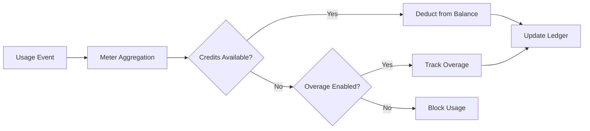

<Info>
Meter mengubah event mentah menjadi jumlah yang dapat ditagih. Mereka menyaring event dan menerapkan fungsi agregasi (Count, Sum, Max, Last) untuk menghitung pemakaian per pelanggan.
</Info>

<Frame>

</Frame>

## Sumber Daya API

<AccordionGroup>
<Accordion title="View Meter API References">
<CardGroup cols={2}>
<Card title="Create Meter" icon="plus" href="/api-reference/meters/create-meter">
Buat meter secara program melalui API.
</Card>

<Card title="List Meters" icon="list" href="/api-reference/meters/get-meters">
Ambil semua meter dalam akun Anda.
</Card>

<Card title="Get Meter" icon="eye" href="/api-reference/meters/retrieve-meter">
Ambil detail untuk meter tertentu berdasarkan ID.
</Card>

<Card title="Archive Meter" icon="arrow-rotate-right" href="/api-reference/meters/archive-meter">
Arsipkan meter untuk berhenti melacak pemakaian.
</Card>

<Card title="Unarchive Meter" icon="arrow-rotate-left" href="/api-reference/meters/unarchive-meter">
Pulihkan meter yang diarsipkan untuk melanjutkan pelacakan.
</Card>
</CardGroup>
</Accordion>
</AccordionGroup>

## Membuat Meter

<Steps>
<Step title="Basic Information">
<ParamField path="Meter Name" type="string" required>
Nama deskriptif (misalnya, "API Requests", "Token Usage")
</ParamField>

<ParamField path="Event Name" type="string" required>
Nama event yang tepat untuk dicocokkan (sensitif terhadap huruf besar/kecil). Contoh: `api.call`, `image.generated`
</ParamField>
</Step>

<Step title="Aggregation">
<ParamField path="Aggregation Type" type="string" required>
Pilih bagaimana event diagregasi:

- **Count**: Jumlah total event (panggilan API, unggahan)
- **Sum**: Menjumlahkan nilai numerik (token, byte)
- **Max**: Nilai tertinggi dalam periode (pengguna puncak)
- **Last**: Nilai terbaru
</ParamField>

<ParamField path="Over Property" type="string">
Kunci metadata untuk diagregasi (wajib untuk semua jenis kecuali Count). Contoh: `tokens`, `bytes`, `duration_ms`
</ParamField>

<ParamField path="Measurement Unit" type="string" required>
Label satuan untuk faktur. Contoh: `calls`, `tokens`, `GB`, `hours`
</ParamField>
</Step>

<Step title="Filtering (Optional)">
<Frame>

</Frame>

Tambahkan kondisi untuk menyaring peristiwa mana yang dihitung:
- **Logika DAN**: Semua kondisi harus cocok
- **Logika ATAU**: Kondisi mana pun dapat cocok

**Pembanding**: sama dengan, tidak sama dengan, lebih besar dari, kurang dari, mengandung

Aktifkan penyaringan, pilih logika, tambahkan kondisi dengan kunci properti, pembanding, dan nilai.
</Step>

<Step title="Create">
Tinjau konfigurasi dan klik **Create Meter**.
</Step>
</Steps>

## Melihat Analitik

<Frame>

</Frame>

Dasbor meter Anda menunjukkan:
- **Ikhtisar**: Total penggunaan dan grafik penggunaan
- **Peristiwa**: Peristiwa individu yang diterima
- **Pelanggan**: Penggunaan dan biaya per pelanggan

## Penagihan dalam Kredit Alih-alih Mata Uang

Secara default, meter mengenakan biaya pelanggan per unit dalam dolar (atau mata uang yang Anda konfigurasikan). Anda bisa mengonfigurasi meter untuk **memotong dari saldo kredit** - jadi penggunaan mengonsumsi kredit alih-alih menghasilkan biaya moneter.

<Info>
Pengurangan berbasis kredit memerlukan sebuah [Hak Kredit](/features/credit-based-billing) yang terpasang pada produk yang sama. Buat kredit Anda terlebih dahulu, lalu tautkan ke meter.
</Info>

### Kapan Menggunakan Pengurangan Berbasis Kredit

| Scenario | Standard (currency) | Credit-based |
|----------|-------------------|--------------|
| Penetapan harga per unit sederhana ($0,01/panggilan) | ✅ Paling tepat | Beban tambahan yang tidak perlu |
| Paket kredit prabayar (beli 10K token, gunakan seiring waktu) | ❌ Tidak bisa diekspresikan | ✅ Paling tepat |
| Penggunaan bundel dengan langganan (paket Pro mencakup 100K panggilan) | Mungkin lewat ambang bebas | ✅ Lebih baik - kredit digulirkan, kedaluwarsa, tampil di portal |
| Produk multi-meter berbagi kumpulan kredit | ❌ Setiap meter menagih secara terpisah | ✅ Semua meter memotong dari satu saldo |

### Mengonfigurasi Meter agar Memotong Kredit

<Steps>
<Step title="Create a Credit Entitlement">
Pertama, buat kredit di **Products → Credits**. Tentukan unit (misal, "API Calls", "Tokens"), presisi, dan pengaturan siklus hidup (kedaluwarsa, pengguliran, kelebihan).

Lihat panduan [Penagihan Berbasis Kredit](/features/credit-based-billing) untuk petunjuk rinci.
</Step>

<Step title="Create or Edit a Usage-Based Product">
Buka produk berbasis penggunaan Anda dan buka bagian konfigurasi **Meter**.
</Step>

<Step title="Add a Meter">
Klik tombol **+** untuk melampirkan meter. Konfigurasikan nama acara, jenis agregasi, dan unit pengukuran seperti biasa.
</Step>

<Step title="Enable 'Bill Usage in Credits'">
Alihkan **Bill usage in Credits** di konfigurasi meter. Ini akan menampilkan pengaturan kredit:

<Frame caption="Toggle 'Bill usage in Credits' to switch from currency-based to credit-based deduction.">

</Frame>

<ParamField path="Credit Entitlement" type="string" required>
Pilih hak kredit mana yang harus dipotong oleh meter ini.
</ParamField>

<ParamField path="Meter units per credit" type="number" required>
Jumlah unit penggunaan yang diperlukan agar memotong 1 kredit. Misalnya:
- `1` = setiap peristiwa meter memotong 1 kredit
- `100` = 100 peristiwa meter memotong 1 kredit
- `1000` = 1.000 panggilan API mengonsumsi 1 kredit
</ParamField>
</Step>

<Step title="Set the Free Threshold">
Ambang **Free Threshold** masih berlaku - peristiwa di bawah ambang ini tidak memotong kredit.

**Contoh**: Dengan ambang bebas 1.000 dan meter-units-per-credit 1:
- Pelanggan menggunakan 2.500 panggilan API
- 1.000 pertama gratis
- Sisa 1.500 memotong 1.500 kredit dari saldo mereka
</Step>
</Steps>

### Bagaimana Pengurangan Kredit Bekerja

Setelah dikonfigurasi, pipeline pengurangan berjalan secara otomatis:

1. **Events arrive** - Aplikasi Anda mengirimkan peristiwa penggunaan melalui [Event Ingestion API](/features/usage-based-billing/event-ingestion)
2. **Meter aggregates** - Peristiwa digabungkan sesuai konfigurasi meter Anda (Count, Sum, Max, Last)
3. **Background worker processes** - Setiap menit, seorang pekerja mengambil peristiwa baru sejak checkpoint terakhir
4. **Credits are deducted** - Penggunaan yang telah digabungkan dikonversi menjadi kredit menggunakan tarif `meter_units_per_credit` dan dipotong menggunakan **penyusunan FIFO** (hak kredit tertua dikonsumsi lebih dulu)
5. **Overage tracked** - Jika saldo mencapai nol dan overage diaktifkan, penggunaan berlanjut dan overage ditangani sesuai perilaku yang dikonfigurasi (maafkan saat reset, ditagihkan di faktur berikutnya, atau dibawa maju sebagai defisit)

<Warning>
Pengurangan kredit berjalan secara asinkron (setiap ~1 menit). Mungkin ada jeda singkat antara ingesting peristiwa dan pemotongan saldo. Rancang aplikasi Anda untuk menangani jeda ini - jangan bergantung pada pemeriksaan saldo waktu nyata untuk kontrol akses pada permintaan individual.
</Warning>

### Banyak Meter, Satu Kumpulan Kredit

Anda dapat menautkan beberapa meter pada produk yang sama ke **hak kredit yang sama**. Semua meter memotong dari satu saldo bersama.

**Contoh**: Platform AI dengan dua meter:
- `text.generation` - 1 kredit per 1.000 token
- `image.generation` - 10 kredit per gambar

Keduanya memotong dari kumpulan "AI Credits" yang sama. Pelanggan melihat satu saldo terpadu di portal mereka.

<Tip>
Gunakan tarif `meter_units_per_credit` berbeda antar meter untuk menyatakan biaya relatif. Operasi mahal (generasi gambar) membutuhkan lebih sedikit unit meter per kredit dibanding yang murah (penyelesaian teks).
</Tip>

<CardGroup cols={2}>
<Card title="List Customer Ledger" icon="scroll" href="/api-reference/credit-entitlements/list-customer-ledger">
Lihat riwayat pengurangan kredit lengkap untuk pelanggan.
</Card>
<Card title="Get Customer Balance" icon="wallet" href="/api-reference/credit-entitlements/get-customer-balance">
Periksa saldo kredit saat ini pelanggan melalui API.
</Card>
</CardGroup>

## Pemecahan Masalah

<AccordionGroup>
<Accordion title="Events not appearing">
- Nama peristiwa harus cocok persis (sensitif huruf besar-kecil)
- Periksa agar filter meter tidak mengecualikan peristiwa
- Pastikan ID pelanggan ada
- Nonaktifkan filter sementara untuk menguji
</Accordion>

<Accordion title="Aggregation not working">
- Pastikan Over Property cocok persis dengan kunci metadata
- Gunakan angka, bukan string: `tokens: 150` bukan `"150"`
- Sertakan properti yang diperlukan dalam semua peristiwa
</Accordion>

<Accordion title="Filters not working">
- Cocokkan huruf besar-kecil secara tepat
- Gunakan operator yang tepat untuk tipe data
- Pastikan peristiwa menyertakan properti yang difilter
</Accordion>

<Accordion title="Wrong usage totals">
- Periksa tab Events untuk menghitung peristiwa yang sebenarnya diterima
- Verifikasi jenis agregasi (Count vs Sum)
- Pastikan nilainya numerik untuk Sum/Max
</Accordion>
</AccordionGroup>

## Langkah Berikutnya

<CardGroup cols={2}>

<Card title="Send Events" icon="bolt" href="/features/usage-based-billing/event-ingestion">
Mulai kirim peristiwa penggunaan dari aplikasi Anda ke meter Anda.
</Card>

<Card title="View Blueprints" icon="copy" href="/features/usage-based-billing/ingestion-blueprints">
Gunakan konfigurasi meter siap pakai untuk kasus penggunaan umum.
</Card>
</CardGroup>
