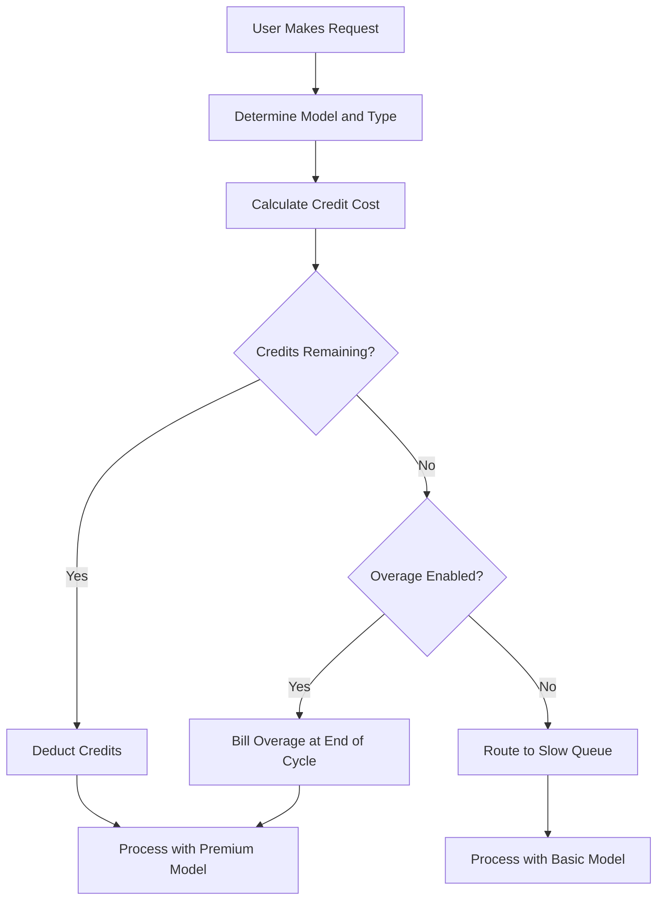

## Come Fattura Cursor

Cursor utilizza un modello ibrido che combina un abbonamento mensile con un pool di crediti che si esaurisce. Questo approccio garantisce un prezzo prevedibile per gli utenti gestendo contemporaneamente i costi variabili dei diversi modelli di IA.

**Livelli di Prezzo**: Cursor offre livelli dal Hobby all'Ultra, bilanciando accesso premium e standard per adattarsi a diversi flussi di lavoro.

| Piano | Prezzo | Richieste Premium | Richieste Lente |
| :--- | :--- | :--- | :--- |
| Hobby | Gratuito | 50/mese | Illimitate |
| Pro | \$20/mese | 500/mese | Illimitate |
| Pro+ | \$60/mese | Richieste premium illimitate | - |
| Ultra | \$200/mese | Richieste premium illimitate | - |

**Esaurimento Ponderato per Modello**: Diverse richieste consumano quantità differenti di crediti in base al costo del modello sottostante. Questo permette a Cursor di offrire un unico abbonamento che copre più provider garantendo che le operazioni più costose siano contabilizzate.

| Tipo di Richiesta | Modello | Costo in Crediti |
| :--- | :--- | :--- |
| Completamento Scheda | Predefinito | 0 |
| Chat | GPT-4o Mini | 1 |
| Chat | Claude 3.5 Sonnet | 1 |
| Compositore | GPT-4o | 5 |
| Agente | Claude 3.5 Sonnet | 10 |
| Agente | o1-preview | 25 |

**Esaurimento dei Crediti e Overage**: Quando i crediti finiscono, gli utenti passano a una coda “Lenta” con modelli più economici invece di essere disconnessi. In alternativa, possono abilitare gli overage basati sull'utilizzo per mantenere l'accesso premium a un costo fisso per richiesta.



4. **Enterprise e Business**: I team utilizzano l'uso condiviso dove l'intera organizzazione condivide un unico bucket di crediti. Questo semplifica la gestione e garantisce che gli utenti con elevato consumo non raggiungano i limiti individuali mentre altri hanno capacità inutilizzata.

## Cosa lo Rende Unico

Il modello di Cursor bilancia l'esperienza utente con i costi infrastrutturali risolvendo problemi con cui i tradizionali modelli di fatturazione SaaS faticano.
- **Astrazione dei Provider**: Un singolo abbonamento racchiude più provider LLM come OpenAI e Anthropic, gestendo complessi prezzi e chiavi API in background.
- **Esaurimento Ponderato**: I costi corrispondono al valore addebitando di più per modelli potenti, rendendo la tariffazione equa e trasparente per tutti gli utenti.
- **Degradazione Graduale**: La coda “Lenta” evita interruzioni nette, mantenendo gli utenti nel prodotto e incoraggiandoli ad effettuare l'upgrade senza essere penalizzati.
- **Crediti Condivisi**: I bucket a livello di team riducono l'attrito per i clienti enterprise permettendo la condivisione efficiente delle risorse all'interno dell'intera organizzazione.

## Ricrea Questo con Dodo Payments

Puoi replicare esattamente questo modello utilizzando le assegnazioni di crediti e la fatturazione basata sull'utilizzo di Dodo Payments. I passaggi seguenti ti guideranno nell'implementazione.

<Steps>
  <Step title="Create a Custom Unit Credit Entitlement">
    Innanzitutto, definisci il sistema di crediti nella dashboard di Dodo. Questa assegnazione rappresenterà le “Richieste Premium” che gli utenti ottengono con il loro abbonamento.

    *   **Tipo di Credito:** Unità Personalizzata
    *   **Nome Unità:** “Richieste Premium”
    *   **Precisione:** 0 (dato che non puoi usare mezza richiesta)
    *   **Scadenza Crediti:** 30 giorni (ciò garantisce che i crediti si azzerino ogni ciclo di fatturazione)
    *   **Rollover:** Disabilitato (le richieste inutilizzate non vengono trasferite al mese successivo)
    *   **Overage:** Abilitato
    *   **Prezzo per Unità:** \$0.04 (costo per ogni richiesta dopo l'esaurimento del pool iniziale)
    *   **Comportamento Overage:** Addebita l'overage nella fattura (ciò aggiunge il costo dell'overage alla fattura successiva)
    Questa configurazione assicura che gli utenti abbiano un pool fisso di richieste ogni mese, con l'opzione di pagarne altre se necessario. È la base del modello di fatturazione ibrido.
  </Step>

  <Step title="Create Subscription Products">
    Crea prodotti separati per ciascun livello. Assegna la stessa entità di crediti a ogni prodotto, ma con quantità diverse. Questo ti consente di gestire tutti i livelli con un solo sistema di crediti, rendendo facile effettuare upgrade o downgrade degli utenti.

    *   **Hobby:** \$0/mese, 50 crediti/ciclo
    *   **Pro:** \$20/mese, 500 crediti/ciclo
    *   **Pro+:** \$60/mese, 5000 crediti/ciclo (effettivamente illimitato per la maggior parte)
    *   **Ultra:** \$200/mese, 50000 crediti/ciclo (effettivamente illimitato)
    Quando un utente si abbona a uno di questi prodotti, Dodo allocca automaticamente il numero corrispondente di crediti sul suo account. Questo avviene istantaneamente, offrendo un'esperienza di onboarding fluida.
  </Step>

  <Step title="Create a Usage Meter Linked to Credits">
    Crea un meter chiamato `ai.request` con aggregazione **Somma** sulla proprietà `credit_cost`. Collega questo meter alla tua entità di crediti attivando il toggle “Fattura l'utilizzo in Crediti”. Imposta le unità del meter per credito a 1.
    Per gestire l'esaurimento ponderato per modello, gestirai il costo dei crediti a livello dell'applicazione. Quando un utente effettua una richiesta, la tua app determina il costo in base al modello o al tipo di azione.
    ```typescript
    import DodoPayments from 'dodopayments';
    
    /**
     * Determines the credit cost for a given request type and model.
     * This logic lives in your application and can be updated without
     * changing your billing configuration.
     */
    function getCreditCost(requestType: string, model: string): number {
      const costs: Record<string, Record<string, number>> = {
        'tab_completion': { 'default': 0 },
        'chat': { 'gpt-4o-mini': 1, 'gpt-4o': 1, 'claude-sonnet': 1 },
        'composer': { 'gpt-4o-mini': 2, 'gpt-4o': 5, 'claude-sonnet': 5 },
        'agent': { 'gpt-4o': 10, 'claude-sonnet': 10, 'o1': 25 }
      };
      
      // Default to 1 credit if the combination isn't found
      return costs[requestType]?.[model] ?? 1;
    }
    
    /**
     * Ingests usage events into Dodo Payments.
     * For weighted requests, we send multiple events or use a sum aggregation.
     */
    async function trackRequest(customerId: string, requestType: string, model: string) {
      const creditCost = getCreditCost(requestType, model);
      
      // Tab completions are free, so we don't need to track them for billing
      if (creditCost === 0) return;
      
      const client = new DodoPayments({
        bearerToken: process.env.DODO_PAYMENTS_API_KEY,
      });
      
      await client.usageEvents.ingest({
        events: [{
          event_id: `req_${Date.now()}_${Math.random().toString(36).slice(2)}`,
          customer_id: customerId,
          event_name: 'ai.request',
          timestamp: new Date().toISOString(),
          metadata: {
            request_type: requestType,
            model: model,
            credit_cost: creditCost
          }
        }]
      });
    }
    ```

    <Tip>
      Se vuoi usare un singolo evento per le richieste ponderate, imposta l'aggregazione del meter su **Somma** e utilizza una proprietà come `credit_cost` come valore da sommare. Questo spesso è più efficiente per l'ingestione ad alto volume e semplifica la logica dell'applicazione.
    </Tip>
  </Step>

  <Step title="Handle Credit Exhaustion (Slow Queue)">
    Ascolta il webhook `credit.balance_low` da Dodo. Quando i crediti di un utente sono vicini allo zero, puoi spostarlo in una coda lenta nella tua applicazione. Qui implementi la logica di “degradazione graduale”.
    ```typescript
    import DodoPayments from 'dodopayments';
    import express from 'express';
    
    const app = express();
    app.use(express.raw({ type: 'application/json' }));
    
    const client = new DodoPayments({
      bearerToken: process.env.DODO_PAYMENTS_API_KEY,
      webhookKey: process.env.DODO_PAYMENTS_WEBHOOK_KEY,
    });
    
    app.post('/webhooks/dodo', async (req, res) => {
      try {
        const event = client.webhooks.unwrap(req.body.toString(), {
          headers: {
            'webhook-id': req.headers['webhook-id'] as string,
            'webhook-signature': req.headers['webhook-signature'] as string,
            'webhook-timestamp': req.headers['webhook-timestamp'] as string,
          },
        });
        
        if (event.type === 'credit.balance_low') {
          const customerId = event.data.customer_id;
          await updateUserTier(customerId, 'slow');
          await notifyUser(customerId, 'You have used most of your premium requests. Switching to standard models.');
        }
        
        res.json({ received: true });
      } catch (error) {
        res.status(401).json({ error: 'Invalid signature' });
      }
    });
    
    /**
     * Routes a request based on the user's current tier.
     * This function is called before every AI request to determine the model and queue.
     */
    async function routeRequest(customerId: string, requestType: string) {
      const tier = await getUserTier(customerId);
      
      if (tier === 'slow') {
        // Route to a cheaper model and a lower priority queue
        // This saves costs while keeping the user active in the product
        return { model: 'gpt-4o-mini', queue: 'standard' };
      }
      
      // Premium routing for users with remaining credits
      // This provides the best possible performance and model quality
      return { model: 'claude-sonnet', queue: 'priority' };
    }
    ```

  </Step>

  <Step title="Create Checkout">
    Infine, genera una sessione di checkout per permettere all'utente di sottoscrivere un piano. Dodo si occupa automaticamente dell'elaborazione dei pagamenti, della conformità fiscale e dell'allocazione dei crediti.
    ```typescript
    import DodoPayments from 'dodopayments';
    
    const client = new DodoPayments({
      bearerToken: process.env.DODO_PAYMENTS_API_KEY,
    });
    
    /**
     * Creates a checkout session for a new subscription.
     * This is typically called when a user clicks an "Upgrade" button.
     */
    const session = await client.checkoutSessions.create({
      product_cart: [
        { product_id: 'prod_cursor_pro', quantity: 1 }
      ],
      customer: { email: 'developer@example.com' },
      return_url: 'https://yourapp.com/dashboard'
    });
    ```

  </Step>
</Steps>

## Accelerare con il Blueprint di Ingestione LLM

La fatturazione ponderata per crediti sopra gestisce la monetizzazione principale. Per analisi più approfondite sul consumo reale di token tra i provider, l’[LLM Ingestion Blueprint](/developer-resources/ingestion-blueprints/llm) può funzionare in parallelo al tuo sistema di crediti.

```bash
npm install @dodopayments/ingestion-blueprints
```

```typescript
import { createLLMTracker } from '@dodopayments/ingestion-blueprints';
import OpenAI from 'openai';
import Anthropic from '@anthropic-ai/sdk';

// Track raw token usage for analytics alongside credit-weighted billing
const openaiTracker = createLLMTracker({
  apiKey: process.env.DODO_PAYMENTS_API_KEY,
  environment: 'live_mode',
  eventName: 'analytics.openai_tokens',
});

const anthropicTracker = createLLMTracker({
  apiKey: process.env.DODO_PAYMENTS_API_KEY,
  environment: 'live_mode',
  eventName: 'analytics.anthropic_tokens',
});

const openai = new OpenAI({ apiKey: process.env.OPENAI_API_KEY });
const anthropic = new Anthropic({ apiKey: process.env.ANTHROPIC_API_KEY });

// Wrap each provider separately
const trackedOpenAI = openaiTracker.wrap({ client: openai, customerId: 'customer_123' });
const trackedAnthropic = anthropicTracker.wrap({ client: anthropic, customerId: 'customer_123' });

// Token tracking is automatic, credit deduction still uses your weighted system
const response = await trackedOpenAI.chat.completions.create({
  model: 'gpt-4o',
  messages: [{ role: 'user', content: 'Hello!' }],
});
```

Questo ti fornisce due livelli di dati: la fatturazione ponderata per crediti per la monetizzazione e il conteggio grezzo dei token per l’analisi dei costi e il monitoraggio dei margini.

<Tip>
Il Blueprint LLM supporta OpenAI, Anthropic, Groq, Google Gemini e altri ancora. Consulta la [documentazione completa del blueprint](/developer-resources/ingestion-blueprints/llm) per tutti i provider supportati.
</Tip>

## Crediti Team Condivisi (Enterprise)

I piani Business ed Enterprise di Cursor condividono i crediti tra il team. Puoi implementarlo con Dodo creando un singolo abbonamento per l'organizzazione anziché per gli utenti individuali. Ciò garantisce che l'utilizzo del team sia consolidato e gestito come un'unica entità, un requisito fondamentale per i clienti di grandi dimensioni.

### Strategia di Implementazione

1.  **Cliente a Livello di Organizzazione:** Crea un singolo `customer_id` in Dodo per l'intera organizzazione. Questo cliente rappresenta l'entità di fatturazione per il team e detiene il pool di crediti condiviso. Tutte le fatture e le allocazioni di crediti sono legate a questo ID.
2.  **Fatturazione basata sui Posti:** Usa gli add-on di Dodo per addebitare una tariffa piattaforma per utente. Quando un team aggiunge un nuovo membro, aggiorni la quantità dell'add-on “Posto”. Questo garantisce che le entrate aumentino proporzionalmente al numero di utenti mantenendo separato il pool di crediti. È un modo pulito per gestire una fatturazione multidimensionale.
3.  **Monitoraggio dell'Uso Condiviso:** Tutte le richieste dei membri del team vengono ingerite utilizzando l'`customer_id` dell'organizzazione. Ciò garantisce che ogni richiesta da qualsiasi membro del team consumi lo stesso pool centrale di crediti. Puoi ancora monitorare l'utilizzo individuale includendo un `user_id` nei metadati dell'evento per reportistica interna e analisi.
Questo approccio ti offre il meglio di entrambi i mondi: una tariffa prevedibile per utente per la piattaforma e un pool condiviso di crediti per le risorse IA costose. Semplifica anche l'esperienza utente dei membri del team, poiché non devono gestire i propri limiti individuali.

## Confronto con la Fatturazione SaaS Tradizionale

La fatturazione SaaS tradizionale solitamente prevede livelli a tariffa fissa (ad esempio, \$10/mese per 100 unità). Se un utente necessita di 101 unità, spesso deve passare a un livello da \$50/mese. Questo crea effetti a “precipizio” che possono frustrare gli utenti e portare a churn. Inoltre, non considera il costo variabile di diversi tipi di utilizzo, critico nel settore IA.

Il modello di Cursor, potenziato da Dodo, è molto più flessibile ed equo:
*   **Nessun Effetto a “Precipizio”**: Gli utenti non devono effettuare l'upgrade solo perché hanno raggiunto un limite. Possono pagare per gli overage o accettare prestazioni più lente. Questo li mantiene nel prodotto e riduce l'attrito, portando a maggiore soddisfazione del cliente e minor churn.
*   **Allineamento dei Costi**: Le tue entrate crescono direttamente con i costi infrastrutturali. Se un utente utilizza modelli costosi, paga di più (tramite crediti o overage). Questo protegge i margini e ti permette di offrire funzionalità ad alto costo in modo sostenibile senza compromettere il tuo modello di business.
*   **Migliore Fidelizzazione**: Non tagliando gli utenti fuori, li mantieni impegnati con il prodotto anche quando hanno raggiunto il limite. Possono continuare a lavorare, fidelizzandosi nel lungo termine e aumentando il valore del cliente nel tempo. È una situazione vantaggiosa per utente e provider.

## Gestire Aggiornamenti ed Evoluzione dei Modelli

Una delle sfide della fatturazione IA è che i modelli vengono costantemente aggiornati o sostituiti. I nuovi modelli potrebbero avere strutture di costo o caratteristiche prestazionali diverse. Con il sistema di crediti di Dodo, puoi gestire questo in modo elegante a livello dell'applicazione senza dover migrare i dati di fatturazione.

Se introduci un modello nuovo e più costoso, aggiornando semplicemente la tua funzione `getCreditCost` per assegnargli un costo maggiore. Non è necessario cambiare la configurazione di fatturazione o aggiornare gli abbonamenti esistenti. Questo disaccoppiamento tra fatturazione e logica applicativa è un grande vantaggio, perché ti permette di iterare sul prodotto alla velocità dell'IA senza essere limitato dal sistema di fatturazione.

## Notifiche e Trasparenza per l'Utente

Per offrire un'esperienza utente eccellente, è importante tenere gli utenti informati sull'utilizzo dei crediti. La trasparenza costruisce fiducia e aiuta gli utenti a gestire efficacemente i costi. Puoi usare i webhook di Dodo per attivare notifiche a varie soglie (ad esempio, 50%, 80% e 100% di utilizzo).

Queste notifiche possono essere inviate via email, avvisi in-app o messaggi Slack. Fornendo feedback in tempo reale sull'utilizzo, incoraggi gli utenti a gestire il consumo o ad aggiornare il piano prima di raggiungere la “coda lenta”. Questo approccio proattivo riduce i ticket di supporto e migliora l'esperienza complessiva, facendo apparire il tuo prodotto più professionale e orientato all'utente.

## Sicurezza e Prevenzione delle Frodi

Quando implementi un sistema basato su crediti, è importante considerare sicurezza e prevenzione delle frodi. Dal momento che i crediti hanno un valore monetario diretto, possono essere un bersaglio per abusi.

*   **Idempotenza:** Usa sempre `event_id` unici quando ingerisci eventi di utilizzo per evitare doppi conteggi. L'API di ingestione di Dodo gestisce l'idempotenza automaticamente se fornisci un ID univoco, assicurando che un retry di rete non addebiti due volte l'utente.
*   **Limitazione della Frequenza:** Implementa limiti di velocità a livello applicativo per impedire a un singolo utente di esaurire i propri crediti (o il tuo budget API) troppo rapidamente. Questo protegge la tua infrastruttura e il portafoglio dell'utente.
*   **Monitoraggio:** Monitora i pattern di utilizzo per individuare anomalie che potrebbero indicare condivisione dell'account o abusi automatizzati. Gli analytics di Dodo possono aiutarti a identificare questi pattern, permettendoti di intervenire prima che diventino un problema serio.

## Best Practice per i Sistemi di Crediti

Quando costruisci un sistema di fatturazione basato su crediti, tieni presente queste best practice:

1.  **Mantienilo Semplice:** Non rendere il sistema di crediti troppo complesso. Gli utenti dovrebbero comprendere facilmente quanto costa una richiesta e quanti crediti rimangono.
2.  **Fornisci Valore:** Assicurati che i crediti offrano un valore reale all'utente. Se il costo di una richiesta è troppo alto, gli utenti percepiranno di essere “spillati”.
3.  **Sii Trasparente:** Mostra sempre all'utente il saldo attuale dei crediti e lo storico di utilizzo. Questo costruisce fiducia e riduce la confusione.
4.  **Automatizza Tutto:** Usa i webhook e le API di Dodo per automatizzare quanto più possibile il processo di fatturazione. Questo riduce il lavoro manuale e garantisce che la fatturazione sia sempre accurata.

## Principali Funzionalità Dodo Utilizzate

<CardGroup cols={2}>
  <Card title="Credit-Based Billing" icon="coins" href="/features/credit-based-billing">
    Gestisci pool di crediti in esaurimento e overage con unità personalizzate.
  </Card>
  <Card title="Subscriptions" icon="calendar" href="/features/subscription">
    Imposta la fatturazione ricorrente per diversi livelli con crediti integrati.
  </Card>
  <Card title="Usage-Based Billing" icon="chart-line" href="/features/usage-based-billing/introduction">
    Monitora gli eventi e fattura in base al consumo in tempo reale.
  </Card>
  <Card title="Event Ingestion" icon="bolt" href="/features/usage-based-billing/event-ingestion">
    Invia dati di utilizzo ad alto volume a Dodo con bassa latenza.
  </Card>
  <Card title="Webhooks" icon="webhook" href="/developer-resources/webhooks/intents/credit">
    Reagisci ai cambiamenti del saldo dei crediti e automatizza la classificazione degli utenti.
  </Card>
  <Card title="LLM Ingestion Blueprint" icon="brain-circuit" href="/developer-resources/ingestion-blueprints/llm">
    Monitoraggio automatico dei token attraverso più provider LLM.
  </Card>
</CardGroup>

## Security and Fraud Prevention

When implementing a credit-based system, it's important to consider security and fraud prevention. Since credits have a direct monetary value, they can be a target for abuse.

*   **Idempotency:** Always use unique `event_id`s when ingesting usage events to prevent double-counting. Dodo's ingestion API handles idempotency automatically if you provide a unique ID, ensuring that a network retry doesn't charge the user twice.
*   **Rate Limiting:** Implement rate limiting at the application level to prevent a single user from exhausting their credits (or your API budget) too quickly. This protects your infrastructure and the user's wallet.
*   **Monitoring:** Monitor usage patterns for anomalies that might indicate account sharing or automated abuse. Dodo's analytics can help you identify these patterns, allowing you to take action before they become a major problem.

## Best Practices for Credit Systems

When building a credit-based billing system, keep these best practices in mind:

1.  **Keep it Simple:** Don't make your credit system too complex. Users should be able to easily understand how much a request costs and how many credits they have left.
2.  **Provide Value:** Ensure that the credits provide real value to the user. If the cost of a request is too high, users will feel like they're being nickel-and-dimed.
3.  **Be Transparent:** Always show the user their current credit balance and usage history. This builds trust and reduces confusion.
4.  **Automate Everything:** Use Dodo's webhooks and APIs to automate as much of the billing process as possible. This reduces manual work and ensures that your billing is always accurate.

## Key Dodo Features Used

<CardGroup cols={2}>
  <Card title="Credit-Based Billing" icon="coins" href="/features/credit-based-billing">
    Manage depleting credit pools and overages with custom units.
  </Card>
  <Card title="Subscriptions" icon="calendar" href="/features/subscription">
    Set up recurring billing for different tiers with integrated credits.
  </Card>
  <Card title="Usage-Based Billing" icon="chart-line" href="/features/usage-based-billing/introduction">
    Track events and bill based on consumption in real-time.
  </Card>
  <Card title="Event Ingestion" icon="bolt" href="/features/usage-based-billing/event-ingestion">
    Send high-volume usage data to Dodo with low latency.
  </Card>
  <Card title="Webhooks" icon="webhook" href="/developer-resources/webhooks/intents/credit">
    React to credit balance changes and automate user tiering.
  </Card>
  <Card title="LLM Ingestion Blueprint" icon="brain-circuit" href="/developer-resources/ingestion-blueprints/llm">
    Automatic token tracking across multiple LLM providers.
  </Card>
</CardGroup>
