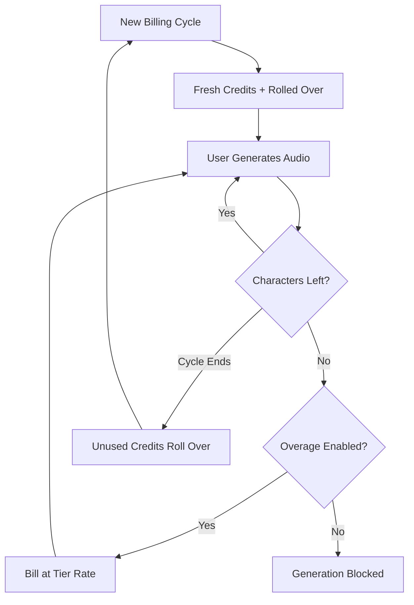

ElevenLabs ha assunto una posizione dominante nel settore delle voci AI rendendo la loro fatturazione fluida quanto la loro sintesi vocale. Il loro modello ruota attorno a un’unica unità di valore: il carattere. Che tu stia generando testo in voce, clonando una voce o doppiando un video, consumi da un pool unificato di crediti carattere.

## Come fattura ElevenLabs

La struttura dei prezzi di ElevenLabs utilizza quote mensili fisse legate ai livelli di abbonamento. Man mano che gli utenti passano a livelli superiori, ottengono più caratteri e accedono a funzionalità avanzate come la clonazione vocale professionale o i diritti commerciali.

| Piano | Prezzo | Caratteri/Mese | Tariffa per eccedenza |
| :--- | :--- | :--- | :--- |
| Free | \$0 | 10.000 | Non disponibile |
| Starter | \$5/mese | 30.000 | ~\$0,30/1K caratteri |
| Creator | \$22/mese | 100.000 | ~\$0,24/1K caratteri |
| Pro | \$99/mese | 500.000 | ~\$0,15/1K caratteri |
| Scale | \$330/mese | 2.000.000 | ~\$0,10/1K caratteri |

1. **Prezzi basati sui caratteri**: i caratteri sono la valuta universale sulla piattaforma. Text-to-Speech, doppiaggio e clonazione vocale attingono tutti dallo stesso saldo, semplificando il monitoraggio dell’utilizzo.
2. **Meccaniche di rollover**: i caratteri non utilizzati vengono trasferiti al ciclo di fatturazione successivo invece di scadere. ElevenLabs applica un limite per evitare accumuli infiniti, garantendo che gli utenti conservino il valore del proprio abbonamento.
3. **Eccedenze a scaglioni**: le eccedenze vengono gestite in base al livello di abbonamento. I piani inferiori hanno le eccedenze disabilitate di default per sicurezza, mentre i livelli superiori consentono addebiti opzionali per mantenere la continuità del servizio.

## Cosa lo rende unico

Diverse scelte strategiche rendono il modello di fatturazione di ElevenLabs particolarmente efficace per fidelizzare gli utenti e incentivare gli upgrade.

- **Rollover dei caratteri**: i crediti a rollover riducono l’ansia del “usalo o perdilo” portando avanti l’investimento non utilizzato. Questo mantiene il valore dell’abbonamento anche durante periodi di minore attività.
- **Prezzi a scaglioni per le eccedenze**: le tariffe per le eccedenze diminuiscono all’aumentare del piano, creando un forte incentivo all’upgrade. Gli utenti trovano spesso i livelli superiori più attraenti grazie al costo inferiore per l’utilizzo aggiuntivo.
- **Consumo unificato**: un singolo pool di caratteri per tutti i servizi elimina l’onere cognitivo di gestire quote separate. Gli utenti devono monitorare un solo numero per comprendere la capacità residua.
- **Eccedenze opzionali**: gli utenti professionali possono attivare le eccedenze per garantire la continuità, mentre gli utenti occasionali beneficiano della sicurezza di un limite rigido.



## Ricrea questo modello con Dodo Payments

Puoi replicare questo modello sofisticato utilizzando la fatturazione basata sui crediti e il monitoraggio dell’utilizzo di Dodo Payments.

<Steps>
<Step title="Create a Custom Unit Credit Entitlement">
Per prima cosa, definisci l’unità “Characters” che fungerà da valuta della tua piattaforma.

1. Vai su **Entitlements** nella dashboard di Dodo.
2. Crea un nuovo **Credit Entitlement**.
3. Imposta il **Credit Type** su **Custom Unit**.
4. Chiama l’unità “Characters”.
5. Imposta la **Precision** a 0, poiché i caratteri sono sempre unità intere.
6. Imposta la **Credit Expiry** su 30 giorni per allinearla al ciclo di fatturazione mensile.
7. Attiva il **Rollover** con queste impostazioni:
    - **Max Rollover Percentage**: 100% (permette a tutti i caratteri non utilizzati di essere trasferiti).
    - **Rollover Timeframe**: 1 mese.
    - **Max Rollover Count**: 1 (i crediti possono essere trasferiti una sola volta, poi scadono).
</Step>

<Step title="Create Tiered Subscription Products">
Crea cinque prodotti di abbonamento. Allegherai lo stesso entitlement “Characters” a ciascuno, ma con configurazioni diverse per ogni livello.

| Prodotto | Prezzo | Crediti/Ciclo | Eccedenza abilitata | Prezzo eccedenza (per 1K caratteri) |
| :--- | :--- | :--- | :--- | :--- |
| Free | \$0/mese | 10.000 | No | - |
| Starter | \$5/mese | 30.000 | Sì (opt-in) | \$0,30 |
| Creator | \$22/mese | 100.000 | Sì | \$0,24 |
| Pro | \$99/mese | 500.000 | Sì | \$0,15 |
| Scale | \$330/mese | 2.000.000 | Sì | \$0,10 |

Quando alleghi l’entitlement dei crediti a ogni prodotto, deseleziona **Import Default Credit Settings**. Questo ti consente di impostare il **Price Per Unit** specifico per le eccedenze su quel determinato livello. Imposta il **Comportamento delle eccedenze** su **Bill overage at billing** e configura una **Soglia di saldo basso** al 10% della quota del livello.

<Step title="Create a Usage Meter">
Il contatore di utilizzo collega l’attività della tua applicazione al sistema di crediti.

1. Crea un nuovo meter denominato `tts.characters`.
2. Imposta l’**Aggregation** su **Sum**. Questo sommerà la proprietà `characters` di ogni evento che invii.
3. Collega questo meter al tuo entitlement dei crediti “Characters”.
4. Imposta **Meter units per credit** su 1. Questo garantisce che un carattere utilizzato nella tua app equivalga a un credito detratto dal saldo.
</Step>

<Step title="Send Usage Events">
Integra il monitoraggio dell’utilizzo nel codice della tua applicazione. Ogni volta che un utente genera audio, invia un evento a Dodo.

```typescript
import DodoPayments from 'dodopayments';

async function trackGeneration(
  customerId: string,
  text: string, 
  service: 'tts' | 'dubbing' | 'cloning'
) {
  const characterCount = text.length;

  const client = new DodoPayments({
    bearerToken: process.env.DODO_PAYMENTS_API_KEY,
  });

  await client.usageEvents.ingest({
    events: [{
      event_id: `gen_${Date.now()}_${Math.random().toString(36).slice(2)}`,
      customer_id: customerId,
      event_name: 'tts.characters',
      timestamp: new Date().toISOString(),
      metadata: {
        characters: characterCount,
        service: service,
        voice_id: 'voice_abc123'
      }
    }]
  });
}
```

</Step>

<Step title="Handle Low Balance and Overage">
Usa i webhook per tenere aggiornati gli utenti sull’utilizzo dei caratteri.

```typescript
import DodoPayments from 'dodopayments';
import express from 'express';

const app = express();
app.use(express.raw({ type: 'application/json' }));

const client = new DodoPayments({
  bearerToken: process.env.DODO_PAYMENTS_API_KEY,
  webhookKey: process.env.DODO_PAYMENTS_WEBHOOK_KEY,
});

app.post('/webhooks/dodo', async (req, res) => {
  try {
    const event = client.webhooks.unwrap(req.body.toString(), {
      headers: {
        'webhook-id': req.headers['webhook-id'] as string,
        'webhook-signature': req.headers['webhook-signature'] as string,
        'webhook-timestamp': req.headers['webhook-timestamp'] as string,
      },
    });

    switch (event.type) {
      case 'credit.balance_low':
        await notifyUser(event.data.customer_id, 
          'You are running low on characters. Consider upgrading your plan for more characters and lower overage rates.'
        );
        break;
      case 'credit.deducted':
        await logUsage(event.data);
        break;
      case 'credit.overage_charged':
        await notifyUser(event.data.customer_id,
          'You have exceeded your character quota. Overage charges will appear on your next invoice.'
        );
        break;
    }

    res.json({ received: true });
  } catch (error) {
    res.status(401).json({ error: 'Invalid signature' });
  }
});
```

</Step>

<Step title="Create Checkout">
Quando un utente è pronto a iscriversi, crea una sessione checkout per il livello scelto.

```typescript
const session = await client.checkoutSessions.create({
  product_cart: [
    { product_id: 'prod_elevenlabs_pro', quantity: 1 }
  ],
  customer: { email: 'creator@example.com' },
  return_url: 'https://yourapp.com/dashboard'
});
```

</Step>
</Steps>

## Accelera con lo Stream Ingestion Blueprint

Per monitorare l’output audio insieme alla fatturazione basata sui caratteri, lo [Stream Ingestion Blueprint](/developer-resources/ingestion-blueprints/stream) offre un modo snello per misurare il consumo di larghezza di banda.

```bash
npm install @dodopayments/ingestion-blueprints
```

```typescript
import { Ingestion, trackStreamBytes } from '@dodopayments/ingestion-blueprints';

const ingestion = new Ingestion({
  apiKey: process.env.DODO_PAYMENTS_API_KEY,
  environment: 'live_mode',
  eventName: 'tts.audio_bytes',
});

// After generating audio, track the output size
const audioBuffer = await generateSpeech(text, voiceId);

await trackStreamBytes(ingestion, {
  customerId: customerId,
  bytes: audioBuffer.byteLength,
  metadata: {
    voice_id: voiceId,
    service: 'tts',
    format: 'mp3',
  },
});
```

Usa lo Stream Blueprint per monitorare la larghezza di banda audio insieme al tuo sistema di crediti basato sui caratteri. Questo ti offre visibilità sui costi infrastrutturali reali per generazione.

<Tip>
Lo Stream Blueprint supporta anche il batching per scenari ad alto volume. Consulta la [documentazione completa del blueprint](/developer-resources/ingestion-blueprints/stream) per modelli di utilizzo avanzati.
</Tip>

## Incentivo all’upgrade: prezzi a scaglioni per le eccedenze

La parte più brillante del modello ElevenLabs è come utilizza le tariffe per le eccedenze per spingere gli upgrade. Rendendo il costo per carattere più economico sui livelli superiori, spostano la conversazione da “quanto mi serve?” a “quanto posso risparmiare?”.

| Livello | Caratteri inclusi | Eccedenza (per 1K) | Costo effettivo a 500K caratteri |
| :--- | :--- | :--- | :--- |
| Creator | 100.000 | \$0,24 | \$22 + (400 * \$0,24) = \$118 |
| Pro | 500.000 | \$0,15 | \$99 (nessuna eccedenza) |

Un utente che consuma regolarmente 500.000 caratteri con il piano Creator paga \$118 al mese tra abbonamento e eccedenze. Passare al piano Pro copre lo stesso utilizzo per \$99, risparmiando \$19 al mese. La tariffa più bassa per le eccedenze sui livelli superiori significa che, all’aumentare dell’utilizzo, l’upgrade diventa la decisione finanziaria ovvia.

Con Dodo Payments, implementi questo deselezionando la casella **Import Default Credit Settings** quando alleghi i crediti ai tuoi prodotti di abbonamento. Questo ti dà il pieno controllo sul **Price Per Unit** per ogni livello specifico, permettendoti di premiare i clienti con il maggior potere d’acquisto con le migliori tariffe.

## Principali funzionalità Dodo utilizzate

<CardGroup cols={2}>
  <Card title="Credit-Based Billing" icon="coins" href="/features/credit-based-billing">
    Gestisci le quote di caratteri, i rollover e le scadenze.
  </Card>
  <Card title="Subscriptions" icon="calendar" href="/features/subscription">
    Configura i livelli ricorrenti che forniscono quote mensili di caratteri.
  </Card>
  <Card title="Usage-Based Billing" icon="chart-line" href="/features/usage-based-billing/introduction">
    Monitora il consumo di caratteri in tempo reale su tutti i servizi.
  </Card>
  <Card title="Event Ingestion" icon="bolt" href="/features/usage-based-billing/event-ingestion">
    Invia dati di utilizzo ad alto volume a Dodo con latenza minima.
  </Card>
  <Card title="Webhooks" icon="webhook" href="/developer-resources/webhooks/intents/credit">
    Rispondi in tempo reale a saldi bassi ed eventi di eccedenza.
  </Card>
  <Card title="Stream Ingestion Blueprint" icon="tower-broadcast" href="/developer-resources/ingestion-blueprints/stream">
    Monitora la larghezza di banda dello streaming audio per la fatturazione basata sull’utilizzo.
  </Card>
</CardGroup>
