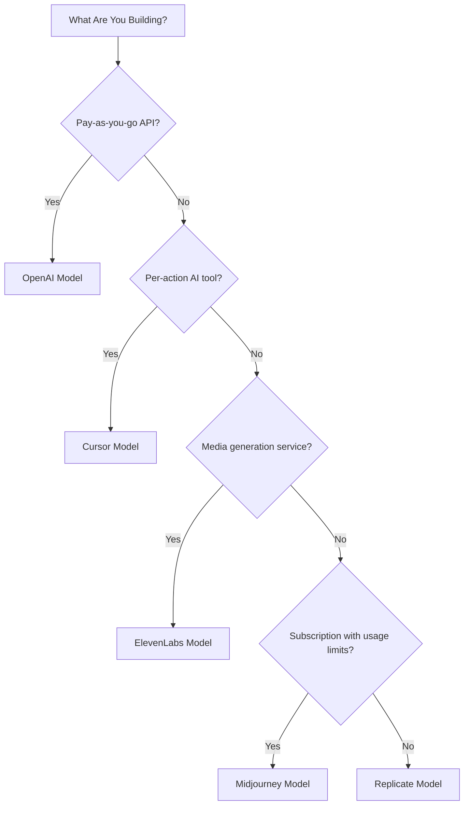

## I cinque modelli

| App | Metrica principale | Innovazione unica | Funzionalità Dodo |
| :--- | :--- | :--- | :--- |
| OpenAI | Token (denominati in valuta fiat) | Crediti fiat prepagati con saldo a vita | Fatturazione basata sui crediti (Crediti fiat) |
| Cursor | Richieste premium | Consumo di crediti ponderato per modello (costi diversi per modello) | Fatturazione basata sui crediti (Unità personalizzate) |
| ElevenLabs | Caratteri | Quote di caratteri con rollover + tariffazione a scaglioni per eccedenze | Fatturazione basata sui crediti (Rollover + Overage) |
| Midjourney | Tempo GPU | "Modalità Relax" fallback illimitato dopo la quota | Abbonamento + contatori di utilizzo |
| Replicate | Secondi di esecuzione | Metering puro specifico per hardware al secondo | Fatturazione basata esclusivamente sull'utilizzo |

## Comprendere i modelli di credito

| Modello | Esempio | Funzionalità Dodo | Tipo di unità |
| :--- | :--- | :--- | :--- |
| Crediti prepagati denominati in valuta fiat | OpenAI API (\$5 credit top-up, no withdrawal) | Fatturazione basata sui crediti (Crediti fiat) | Unità virtuali denominate in dollari |
| Crediti virtuali di utilizzo | Cursor Premium Requests, ElevenLabs Characters | Fatturazione basata sui crediti (Unità personalizzate) | Unità arbitrarie (richieste, caratteri) |
| Rilevamento di consumo puro | Replicate per-second billing | Fatturazione basata sull'utilizzo (Contatori) | Misurazione diretta (secondi, byte) |
| Abbonamento + eccedenza misurata | Midjourney Fast Hours with Relax fallback | Abbonamento + contatori di utilizzo | Basato sul tempo con soglia gratuita |

<Info>
I crediti fiat nella fatturazione basata sui crediti di Dodo rappresentano valori denominati in dollari della piattaforma senza valore monetario al di fuori del tuo ecosistema. I clienti non possono ritirarli come contanti.
</Info>

## Quale modello dovresti usare?

- Costruire una piattaforma API pay-as-you-go: modello OpenAI (Crediti fiat)
- Costruire uno strumento AI con prezzi per azione: modello Cursor (Crediti unità personalizzate)
- Costruire un servizio di generazione media: modello ElevenLabs (Crediti con rollover)
- Creare un servizio in abbonamento con limiti di utilizzo: modello Midjourney (Abbonamento + contatori di utilizzo)
- Costruire una piattaforma di infrastruttura/calcolo: modello Replicate (Metering puro)

<CardGroup cols={2}>
  <Card title="OpenAI" icon="/images/logos/openai.svg" href="/developer-resources/billing-deconstructions/openai">
    Riproduci il modello di crediti prepagati basato sui token.
  </Card>
  <Card title="Cursor" icon="/images/logos/cursor.svg" href="/developer-resources/billing-deconstructions/cursor">
    Costruisci limiti di utilizzo ponderati per modello.
  </Card>
  <Card title="ElevenLabs" icon="/images/logos/elevenlabs.svg" href="/developer-resources/billing-deconstructions/elevenlabs">
    Implementa quote di caratteri con rollover ed eccedenze.
  </Card>
  <Card title="Midjourney" icon="/images/logos/midjourney.svg" href="/developer-resources/billing-deconstructions/midjourney">
    Combina abbonamenti con fallback basato sull'utilizzo.
  </Card>
  <Card title="Replicate" icon="/images/logos/replicate.svg" href="/developer-resources/billing-deconstructions/replicate">
    Configura un rilevamento del consumo puro al secondo.
  </Card>
</CardGroup>

## Funzionalità di Dodo

<CardGroup cols={2}>
  <Card title="Credit-Based Billing" href="/features/credit-based-billing">
    Gestisci crediti prepagati e unità virtuali.
  </Card>
  <Card title="Usage-Based Billing" href="/features/usage-based-billing/introduction">
    Misura il consumo in tempo reale.
  </Card>
  <Card title="Subscriptions" href="/features/subscription">
    Gestisci la fatturazione ricorrente e la gestione dei piani.
  </Card>
  <Card title="Hybrid Billing" href="/features/hybrid-billing">
    Combina più modelli di fatturazione per la massima flessibilità.
  </Card>
</CardGroup>

## Blueprint di ingestione

Ogni scomposizione include l'integrazione con gli [Ingestion Blueprints](/features/usage-based-billing/ingestion-blueprints) di Dodo, SDK preconfigurati che gestiscono automaticamente il tracciamento degli eventi. Invece di costruire manualmente gli eventi di utilizzo, usa un blueprint per ottenere un monitoraggio pronto per la produzione in pochi minuti.

<CardGroup cols={3}>
  <Card title="LLM Blueprint" icon="brain-circuit" href="/developer-resources/ingestion-blueprints/llm">
    Tracciamento automatico dei token per OpenAI, Anthropic, Groq e altri.
  </Card>
  <Card title="Stream Blueprint" icon="tower-broadcast" href="/developer-resources/ingestion-blueprints/stream">
    Monitora la larghezza di banda dello streaming audio e video.
  </Card>
  <Card title="Time Range Blueprint" icon="clock" href="/developer-resources/ingestion-blueprints/time-range">
    Fattura per durata di calcolo fino al millisecondo.
  </Card>
</CardGroup>
