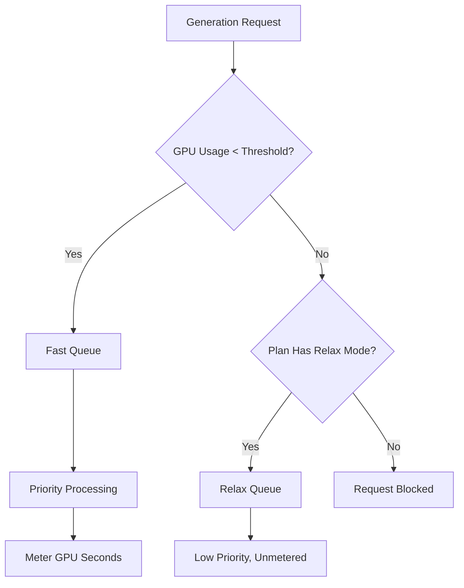

Midjourney è una piattaforma di intelligenza artificiale generativa che utilizza un modello di fatturazione unico basato sul tempo GPU anziché sul semplice conteggio per immagine. Questo approccio garantisce che i render complessi e ad alta risoluzione costino di più rispetto a bozze rapide a bassa risoluzione.

## Come fattura Midjourney

I piani di abbonamento di Midjourney concedono agli utenti un numero specifico di «Fast GPU Hours» ogni mese. Queste ore rappresentano il tempo computazionale reale impiegato per le tue generazioni.

| Piano | Prezzo | Fast GPU Hours | Relax Mode | Stealth Mode |
| :--- | :--- | :--- | :--- | :--- |
| Basic | \$10/mese | ~3,3 ore | No | No |
| Standard | \$30/mese | 15 ore | Illimitato | No |
| Pro | \$60/mese | 30 ore | Illimitato | Sì |
| Mega | \$120/mese | 60 ore | Illimitato | Sì |

1. **Livelli di prezzo**: Midjourney offre quattro livelli di abbonamento che vanno da \$10 a \$120 al mese, ciascuno con una quantità prestabilita di Fast GPU Hours.
2. **Relax Mode**: I piani Standard e superiori includono generazioni illimitate tramite una coda a bassa priorità una volta esaurite le ore Fast, assicurando che gli utenti non incontrino un blocco netto nell’uso.
3. **Ore GPU extra**: Gli utenti possono acquistare tempo GPU Fast aggiuntivo per circa \$4 all’ora se necessitano risultati immediati dopo aver consumato la loro allocazione mensile.
4. **Misurazione in secondi GPU**: L’utilizzo viene tracciato dal tempo computazionale reale speso nelle generazioni, quindi i render complessi costano più delle bozze semplici.
5. **Circuito comunitario**: Gli utenti attivi possono guadagnare ore GPU bonus valutando le immagini nella galleria, contribuendo ad addestrare i modelli e ricompensando la community.
## Cosa lo rende unico

Il modello di Midjourney è efficace perché allinea il costo con il valore e l’uso delle risorse.

* **Fatturazione in base al tempo GPU** allinea il costo all’uso delle risorse, garantendo che i render complessi abbiano un prezzo equo rispetto alle bozze semplici.
* **Relax Mode** offre un fallback illimitato che riduce l’abbandono mantenendo l’accesso al servizio anche dopo il superamento dei limiti mensili.
* **La separazione Fast vs Relax** incentiva gli upgrade offrendo elaborazione prioritaria agli utenti che apprezzano la velocità e i risultati immediati.
* **Ore GPU extra** forniscono un’opzione flessibile di ricarica per gli utenti avanzati che hanno bisogno di capacità aggiuntiva ad alta priorità a metà mese.

## Ricrea questo modello con Dodo Payments

Puoi replicare questo modello usando Dodo Payments combinando abbonamenti con misuratori di utilizzo e logica a livello applicativo.

<Steps>

<Step title="Create a Usage Meter">

Per prima cosa, crea un misuratore per tracciare i secondi GPU utilizzati da ogni cliente.

* **Nome del misuratore**: `gpu.fast_seconds`
* **Aggregazione**: **Somma** (sommare la proprietà `gpu_seconds` da ogni evento)

Traccerai solo gli eventi in cui la modalità di generazione è «fast». Le generazioni in Relax mode non sono misurate ai fini della fatturazione.

</Step>

<Step title="Create Subscription Products with Usage Pricing">

Crea i tuoi prodotti di abbonamento e collega il misuratore d’uso con una soglia gratuita.

| Prodotto | Prezzo base | Soglia gratuita (secondi) | Tariffa per eccedenza |
| :--- | :--- | :--- | :--- |
| Basic | \$10/mese | 12.000 (3,3 ore) | N/D (Cap massimo) |
| Standard | \$30/mese | 54.000 (15 ore) | \$0,00 (Relax Mode) |
| Pro | \$60/mese | 108.000 (30 ore) | \$0,00 (Relax Mode) |
| Mega | \$120/mese | 216.000 (60 ore) | \$0,00 (Relax Mode) |

Per il piano Basic disabiliterai l’eccedenza per applicare un cap massimo. Per gli altri piani, la «Relax Mode» è gestita dalla logica della tua applicazione quando il misuratore mostra che la soglia è stata superata.

</Step>

<Step title="Implement Application-Level Relax Mode">

L’intuizione principale è che la Relax Mode non è una funzione di fatturazione. È il tuo routing applicativo che invia le richieste a una coda più lenta quando il misuratore Dodo indica che la soglia è stata raggiunta.

```typescript
async function handleGenerationRequest(customerId: string, prompt: string) {
  const usage = await getCustomerUsage(customerId, 'gpu.fast_seconds');
  const subscription = await getSubscription(customerId);
  const threshold = getThresholdForPlan(subscription.product_id);
  
  if (usage.current >= threshold) {
    if (subscription.product_id === 'prod_basic') {
      throw new Error('Fast GPU hours exhausted. Upgrade to Standard for Relax Mode.');
    }
    
    // Relax Mode. Route to low-priority queue
    return await queueGeneration(customerId, prompt, {
      priority: 'low',
      mode: 'relax',
      model: 'standard'
    });
  }
  
  // Fast Mode. Priority processing
  return await queueGeneration(customerId, prompt, {
    priority: 'high',
    mode: 'fast',
    model: 'premium'
  });
}
```

</Step>

<Step title="Send Usage Events (Fast Mode Only)">

Invia a Dodo solo gli eventi di utilizzo relativi a generazioni effettuate in modalità Fast.

```typescript
import DodoPayments from 'dodopayments';

async function trackFastGeneration(customerId: string, gpuSeconds: number, jobId: string) {
  // Only track Fast mode generations. Relax mode is free and unlimited
  const client = new DodoPayments({
    bearerToken: process.env.DODO_PAYMENTS_API_KEY,
  });

  await client.usageEvents.ingest({
    events: [{
      event_id: `gen_${jobId}`,
      customer_id: customerId,
      event_name: 'gpu.fast_seconds',
      timestamp: new Date().toISOString(),
      metadata: {
        gpu_seconds: gpuSeconds,
        resolution: '1024x1024',
        mode: 'fast'
      }
    }]
  });
}
```

</Step>

<Step title="Sell Extra Fast Hours (One-Time Top-Up)">

Crea un prodotto di pagamento una tantum per «Extra Fast GPU Hour» a \$4. Quando un cliente lo acquista, puoi assegnare soglie aggiuntive o crediti nella tua applicazione.

```typescript
// After customer purchases extra hours
const session = await client.checkoutSessions.create({
  product_cart: [
    { product_id: 'prod_extra_gpu_hour', quantity: 5 }
  ],
  customer: { customer_id: customerId },
  return_url: 'https://yourapp.com/dashboard'
});
```

</Step>

<Step title="Create Checkout for Subscription">

Infine, crea una sessione di checkout per il piano di abbonamento.

```typescript
const session = await client.checkoutSessions.create({
  product_cart: [
    { product_id: 'prod_mj_standard', quantity: 1 }
  ],
  customer: { email: 'artist@example.com' },
  return_url: 'https://yourapp.com/studio'
});
```

</Step>

</Steps>

## Accelerare con il Blueprint di Time Range Ingestion

Il [Time Range Ingestion Blueprint](/developer-resources/ingestion-blueprints/time-range) semplifica il tracciamento del tempo GPU fornendo helper dedicati per la fatturazione basata sulla durata.

```bash
npm install @dodopayments/ingestion-blueprints
```

```typescript
import { Ingestion, trackTimeRange } from '@dodopayments/ingestion-blueprints';

const ingestion = new Ingestion({
  apiKey: process.env.DODO_PAYMENTS_API_KEY,
  environment: 'live_mode',
  eventName: 'gpu.fast_seconds',
});

// Track generation time after a Fast mode job completes
const startTime = Date.now();
const result = await runGeneration(prompt, settings);
const durationMs = Date.now() - startTime;

await trackTimeRange(ingestion, {
  customerId: customerId,
  durationMs: durationMs,
  metadata: {
    mode: 'fast',
    resolution: '1024x1024',
  },
});
```

Il blueprint gestisce la conversione della durata e il formato degli eventi. Devi solo fornire l’ID cliente e il tempo trascorso.

<Tip>
Il Time Range Blueprint supporta millisecondi, secondi e minuti. Consulta la [documentazione completa del blueprint](/developer-resources/ingestion-blueprints/time-range) per tutte le opzioni di durata e le best practice.
</Tip>

## L’architettura Fast vs Relax

Il sistema a doppia coda funziona instradando le richieste in base allo stato attuale dell’utilizzo.



1. Tutte le richieste passano attraverso la tua applicazione.
2. L’applicazione controlla il misuratore d’uso Dodo rispetto alla soglia gratuita del piano.
3. Se l’utilizzo è sotto la soglia, la richiesta va nella coda Fast e viene misurata.
4. Se l’utilizzo supera la soglia, la richiesta va nella coda Relax, che non viene misurata e ha priorità inferiore.
5. Il piano Basic non ha fallback Relax, quindi le richieste vengono bloccate una volta raggiunto il limite.

<Info>
La Relax Mode è un modello a livello applicativo, non una funzione di fatturazione di Dodo. Dodo traccia il tuo uso Fast GPU e ti segnala quando la soglia è superata. La tua applicazione decide se bloccare l’utente o instradarlo verso una coda più lenta.
</Info>

## Principali funzionalità Dodo utilizzate

<CardGroup cols={2}>
  <Card title="Subscriptions" icon="calendar" href="/features/subscription">
    Gestire la fatturazione ricorrente e i livelli di piano.
  </Card>
  <Card title="Usage-Based Billing" icon="bolt" href="/features/usage-based-billing/introduction">
    Tracciare e fatturare in base al consumo effettivo delle risorse.
  </Card>
  <Card title="Event Ingestion" icon="input-pipe" href="/features/usage-based-billing/event-ingestion">
    Inviare eventi di utilizzo ad alto volume all’API di Dodo.
  </Card>
  <Card title="Meters" icon="gauge" href="/features/usage-based-billing/meters">
    Definire come gli eventi di utilizzo vengono aggregati e fatturati.
  </Card>
  <Card title="One-Time Payments" icon="credit-card" href="/features/one-time-payment-products">
    Vendere ore extra o ricariche come acquisti una tantum.
  </Card>
  <Card title="Time Range Blueprint" icon="clock" href="/developer-resources/ingestion-blueprints/time-range">
    Tracciamento semplificato del tempo GPU con helper basati sulla durata.
  </Card>
</CardGroup>
