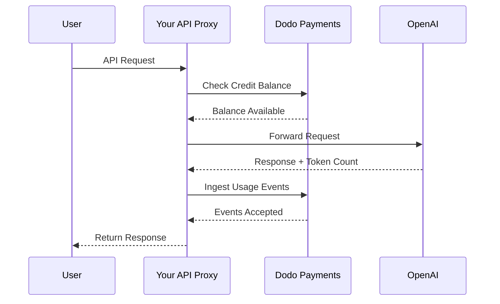
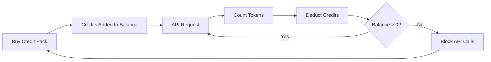

Il modello di fatturazione di OpenAI è il punto di riferimento per le aziende AI. Combina crediti prepagati in valuta fiat per l'utilizzo dell'API con abbonamenti a tariffa fissa per i prodotti consumer. Questo approccio ibrido garantisce entrate prevedibili permettendo agli sviluppatori di scalare il proprio utilizzo senza attriti.

## Perché il modello di OpenAI è lo standard

L'industria dell'AI affronta sfide uniche che la fatturazione SaaS tradizionale non sempre risolve. Il modello di OpenAI risolve diversi di questi problemi contemporaneamente.

1. **Entrate prevedibili e basso rischio**: richiedendo crediti prepagati per l'utilizzo dell'API, OpenAI elimina il rischio che gli utenti accumulino bollette ingenti che non possono pagare. Ottieni i soldi in anticipo e l'utente ottiene il servizio mentre lo utilizza.
2. **Scalabilità per gli sviluppatori**: un top-up da 5 \$ è una barriera di ingresso bassa. Man mano che l'applicazione cresce, gli sviluppatori possono automatizzare i ricarichi o acquistare pacchetti più grandi. La frizione per iniziare è quasi zero, ma il limite per la crescita è illimitato.
3. **Psicologia dell'utente**: denominare i crediti in valuta fiat (USD) invece di "token" o "punti" astratti rende il valore chiaro. Si percepisce come un conto bancario per i servizi AI, il che costruisce fiducia e rende più semplice il budgeting per le aziende.

## Come fattura OpenAI

OpenAI adotta due modelli di fatturazione distinti pensati per bisogni utente differenti.

1. **API (Pay-as-you-go)**: l'API utilizza crediti prepagati denominati in valuta fiat. Gli utenti ricaricano i propri conti con 5 \$, 10 \$, 50 \$ o più. Questi crediti mostrano un valore in dollari ma non hanno valore monetario al di fuori di OpenAI. OpenAI fattura per token con tariffe diverse per i token in ingresso e in uscita. I crediti non scadono mai e quando il saldo dell'utente arriva a 0 \$, le chiamate API falliscono immediatamente.
2. **ChatGPT Plus, Team e Enterprise**: sono abbonamenti a tariffa fissa. ChatGPT Plus costa 20 \$ al mese, mentre il piano Team costa 25 \$ per utente al mese. Questi piani hanno limiti di utilizzo morbidi in cui agli utenti viene assegnato un modello più piccolo invece di essere bloccati.
3. **Fasce tariffarie basate sulla spesa**: man mano che spendi più soldi nel tempo, sblocchi limiti di velocità API più elevati. Si tratta di un sistema di scalabilità dell'accesso basato sulla fiducia legato direttamente alla tua storia di fatturazione.

| Modello | Prezzi | Token in ingresso | Token in uscita |
| :--- | :--- | :--- | :--- |
| GPT-4o | Basato sull'utilizzo | 2,50 \$ / 1M | 10,00 \$ / 1M |
| GPT-4o-mini | Basato sull'utilizzo | 0,15 \$ / 1M | 0,60 \$ / 1M |
| o1 | Basato sull'utilizzo | 15,00 \$ / 1M | 60,00 \$ / 1M |

| Piano | Prezzo | Tipo |
| :--- | :--- | :--- |
| Free | 0 \$ | Accesso limitato |
| Plus | 20 \$ / mese | Abbonamento con limiti morbidi |
| Team | 25 \$ / utente / mese | Abbonamento per postazione |
| Enterprise | Personalizzato | Fatturazione su fattura |
## Cosa lo rende unico

La strategia di fatturazione di OpenAI ha diverse caratteristiche chiave che la rendono efficace per i servizi AI.

- **Crediti denominati in valuta fiat**: i crediti si percepiscono come denaro perché sono espressi in USD. Questo rende i prezzi trasparenti e facili da comprendere per gli sviluppatori.
- **Nessuna scadenza**: saldi che non scadono mai riducono la pressione del "usali o li perdi". Gli utenti si sentono a proprio agio nel ricaricare cifre maggiori perché sanno che il valore non scomparirà.
- **Misurazione multidimensionale**: i token in ingresso e in uscita vengono tracciati separatamente ma detratti dallo stesso saldo di credito. Questo permette a OpenAI di prezzi diversi per i token di uscita più costosi rispetto a quelli di ingresso più economici.
- **Livelli di fiducia**: collegare i limiti di velocità alla spesa totale incoraggia gli utenti a restare sulla piattaforma e premia i clienti a lungo termine con prestazioni migliori.
## Vantaggi strategici

Questo modello crea una potente ruota di rinforzo. I costi di ingresso bassi attirano gli sviluppatori. I crediti prepagati forniscono liquidità immediata. La scalabilità basata sull'utilizzo garantisce che, quando gli sviluppatori hanno successo, anche OpenAI abbia successo. Il lato abbonamento fornisce una base di entrate stabile e prevedibile proveniente da utenti non sviluppatori.

## Costruisci questo con Dodo Payments

Puoi replicare il modello di fatturazione di OpenAI usando Dodo Payments. Useremo Credit-Based Billing per l'API e abbonamenti standard per la parte ChatGPT Plus.

<Steps>
  <Step title="Create a Fiat Credit Entitlement">
    Inizia creando un diritto al credito nel tuo cruscotto Dodo Payments. Questo agirà come saldo centrale per i tuoi utenti.

    * **Tipo di credito:** Crediti fiat (USD)
    * **Scadenza del credito:** Mai
    * **Rollover:** Non necessario (dato che non scadono)
    * **Overage:** Disabilitato

    Disabilitare l'overage assicura che le chiamate API falliscano quando il saldo arriva a 0 \$, proprio come OpenAI.
  </Step>

  <Step title="Create Top-Up Products">
    Crea prodotti di pagamento una tantum per diversi pacchetti di credito. Potresti offrire opzioni da 5 \$, 10 \$, 50 \$ e 100 \$. Collega l'assegnazione di credito fiat a ciascun prodotto.

    Imposta i crediti erogati per prodotto in centesimi. Per un pacchetto da 50 \$, erogherai 5000 crediti.

    ```typescript
    import DodoPayments from 'dodopayments';

    const client = new DodoPayments({
      bearerToken: process.env.DODO_PAYMENTS_API_KEY,
    });

    const session = await client.checkoutSessions.create({
      product_cart: [
        { product_id: 'prod_credit_pack_50', quantity: 1 }
      ],
      customer: { email: 'developer@example.com' },
      return_url: 'https://yourapp.com/dashboard'
    });
    ```

  </Step>

  <Step title="Create Usage Meters">
    Crea due contatori separati per tracciare l'utilizzo dei token.

    * `llm.input_tokens`: aggregazione Sum sulla proprietà `tokens`.
    * `llm.output_tokens`: aggregazione Sum sulla proprietà `tokens`.
    Collega entrambi i contatori al diritto al credito fiat. Sarà necessario configurare le "Unità del contatore per credito" per ciascuno.

    ### Calcolo delle unità del contatore per credito

    Per eguagliare il prezzo GPT-4o di OpenAI (2,50 \$ per 1M di token in ingresso), devi calcolare quanti token corrispondono a 1 \$ (100 centesimi).

    * **Token in ingresso:** 1.000.000 token / 2,50 \$ = 400.000 token per 1 \$.
    * **Token in uscita:** 1.000.000 token / 10,00 \$ = 100.000 token per 1 \$.
    Nel cruscotto Dodo imposteresti le "Unità del contatore per credito" a 400.000 per l'ingresso e a 100.000 per l'uscita.
  </Step>

  <Step title="Send Usage Events">
    Dopo ogni richiesta LLM, invia i dati di utilizzo a Dodo Payments. Puoi inviare sia gli eventi di ingresso che di uscita in una singola richiesta.

    ```typescript
    await client.usageEvents.ingest({
      events: [{
        event_id: `req_${requestId}`,
        customer_id: customerId,
        event_name: 'llm.input_tokens',
        timestamp: new Date().toISOString(),
        metadata: {
          model: 'gpt-4o',
          tokens: 1500
        }
      }, {
        event_id: `req_${requestId}_out`,
        customer_id: customerId,
        event_name: 'llm.output_tokens',
        timestamp: new Date().toISOString(),
        metadata: {
          model: 'gpt-4o',
          tokens: 800
        }
      }]
    });
    ```

  </Step>

  <Step title="Handle Balance Depletion">
    Dovresti controllare il saldo dell'utente prima di elaborare una richiesta API. Se il saldo è zero o negativo, restituisci un errore 402.

    ```typescript
    async function checkCreditsBeforeRequest(customerId: string) {
      const balance = await client.creditEntitlements.balances.retrieve(customerId, {
        credit_entitlement_id: 'credit_entitlement_id',
      });

      if (balance.available <= 0) {
        throw new Error('Insufficient credits. Please top up your account.');
      }
    }
    ```

    ### Gestione dei webhook per saldo basso

    Non aspettare che l'utente arrivi a 0 \$ per avvisarlo. Usa webhook per attivare un'email o una notifica in-app quando il saldo scende sotto una certa soglia.

    ```typescript
    import DodoPayments from 'dodopayments';
    import express from 'express';

    const app = express();
    app.use(express.raw({ type: 'application/json' }));

    const client = new DodoPayments({
      bearerToken: process.env.DODO_PAYMENTS_API_KEY,
      webhookKey: process.env.DODO_PAYMENTS_WEBHOOK_KEY,
    });

    app.post('/webhooks/dodo', async (req, res) => {
      try {
        const event = client.webhooks.unwrap(req.body.toString(), {
          headers: {
            'webhook-id': req.headers['webhook-id'] as string,
            'webhook-signature': req.headers['webhook-signature'] as string,
            'webhook-timestamp': req.headers['webhook-timestamp'] as string,
          },
        });

        if (event.type === 'credit.balance_low') {
          const { customer_id, available_balance } = event.data;
          await sendLowBalanceEmail(customer_id, available_balance);
        }

        res.json({ received: true });
      } catch (error) {
        res.status(401).json({ error: 'Invalid signature' });
      }
    });
    ```

    <Tip>
      OpenAI invia queste email quando il saldo dell'utente è quasi esaurito, dando loro il tempo di ricaricare senza interruzioni del servizio.
    </Tip>
  </Step>

  <Step title="Build the ChatGPT Subscription Side (Optional)">
    Se vuoi offrire un piano in abbonamento come ChatGPT Plus, crea un prodotto di abbonamento separato in Dodo Payments. Questi non necessitano di assegnazioni di credito.
    Per un piano Team, utilizza la fatturazione basata sui posti aggiungendo add-on per ogni utente aggiuntivo.
    ```typescript
    const session = await client.checkoutSessions.create({
      product_cart: [
        { product_id: 'prod_plus_subscription', quantity: 1 }
      ],
      customer: { email: 'user@example.com' },
      return_url: 'https://yourapp.com/billing'
    });
    ```

    ### Implementare limiti morbidi

    Per replicare i limiti morbidi di OpenAI, puoi tracciare l'utilizzo per i tuoi utenti in abbonamento usando gli stessi contatori ma senza collegarli a un diritto al credito. Nella logica applicativa, controlla l'utilizzo per l'attuale periodo di fatturazione.
    ```typescript
    async function checkSubscriptionUsage(customerId: string) {
      const usage = await getUsageForCurrentPeriod(customerId);
      
      if (usage > SOFT_CAP_THRESHOLD) {
        // Route to a smaller model instead of blocking
        return 'gpt-4o-mini';
      }
      
      return 'gpt-4o';
    }
    ```

  </Step>
</Steps>

## Accelera con il blueprint LLM Ingestion

I passaggi sopra mostrano come costruire manualmente e inviare eventi di utilizzo. Per implementazioni in produzione, il [LLM Ingestion Blueprint](/developer-resources/ingestion-blueprints/llm) fornisce un tracciamento automatico dei token che avvolge direttamente il tuo client OpenAI.

```bash
npm install @dodopayments/ingestion-blueprints
```

```typescript
import { createLLMTracker } from '@dodopayments/ingestion-blueprints';
import OpenAI from 'openai';

const openai = new OpenAI({ apiKey: process.env.OPENAI_API_KEY });

const tracker = createLLMTracker({
  apiKey: process.env.DODO_PAYMENTS_API_KEY,
  environment: 'live_mode',
  eventName: 'llm.chat_completion',
});

const trackedClient = tracker.wrap({
  client: openai,
  customerId: customerId,
});

// Every API call now automatically tracks token usage
const response = await trackedClient.chat.completions.create({
  model: 'gpt-4o',
  messages: [{ role: 'user', content: prompt }],
});

// inputTokens, outputTokens, and totalTokens are sent automatically
console.log('Tokens used:', response.usage);
```

Il blueprint cattura `inputTokens`, `outputTokens` e `totalTokens` da ogni risposta API e li invia come metadati dell'evento. Configura il tuo contatore per aggregare sulla proprietà token appropriata.

<Tip>
Il blueprint LLM supporta OpenAI, Anthropic, Groq, Google Gemini, OpenRouter e il Vercel AI SDK. Consulta la [documentazione completa del blueprint](/developer-resources/ingestion-blueprints/llm) per esempi specifici del provider e configurazioni avanzate.
</Tip>

## Implementare fasce tariffarie basate sulla spesa

Le fasce tariffarie di OpenAI sono un modo potente per gestire la capacità. Puoi implementarlo tracciando la spesa totale a vita di un cliente.

1. **Monitora la spesa a vita:** Ascolta i webhook `payment.succeeded` e aggiorna un campo `total_spend` nel tuo database per quel cliente.
2. **Definisci le fasce:** Crea una mappatura degli importi spesi ai limiti di velocità.
   * Fascia 1: spesa 0 \$ - 50 \$ -> 3 RPM
   * Fascia 2: spesa 50 \$ - 250 \$ -> 10 RPM
   * Fascia 3: spesa superiore a 250 \$ -> 50 RPM
3. **Applica i limiti:** Nel middleware API, controlla la fascia del cliente e applica il limite di velocità corrispondente.

```typescript
async function getRateLimitForCustomer(customerId: string) {
  const customer = await db.customers.findUnique({ where: { id: customerId } });
  const totalSpend = customer.total_spend;

  if (totalSpend >= 25000) return TIER_3_LIMITS; // $250.00
  if (totalSpend >= 5000) return TIER_2_LIMITS;  // $50.00
  return TIER_1_LIMITS;
}
```

## Esempio di implementazione completa: il proxy API

In uno scenario reale, avrai probabilmente un proxy API che si interpone tra i tuoi utenti e il provider LLM. Questo proxy gestisce l'autenticazione, i controlli di credito e la segnalazione dell'utilizzo.



```typescript
import DodoPayments from 'dodopayments';
import OpenAI from 'openai';

const client = new DodoPayments({
  bearerToken: process.env.DODO_PAYMENTS_API_KEY,
});
const openai = new OpenAI({ apiKey: process.env.OPENAI_API_KEY });

export async function handleApiRequest(req, res) {
  const { customerId, prompt, model } = req.body;

  try {
    // 1. Check credit balance
    const balance = await client.creditEntitlements.balances.retrieve(customerId, {
      credit_entitlement_id: 'credit_entitlement_id',
    });

    if (balance.available <= 0) {
      return res.status(402).json({ error: 'Insufficient credits. Please top up.' });
    }

    // 2. Call OpenAI
    const completion = await openai.chat.completions.create({
      model: model,
      messages: [{ role: 'user', content: prompt }],
    });

    const { prompt_tokens, completion_tokens } = completion.usage;

    // 3. Ingest usage events to Dodo
    await client.usageEvents.ingest({
      events: [
        {
          event_id: `req_${completion.id}_in`,
          customer_id: customerId,
          event_name: 'llm.input_tokens',
          timestamp: new Date().toISOString(),
          metadata: { model, tokens: prompt_tokens }
        },
        {
          event_id: `req_${completion.id}_out`,
          customer_id: customerId,
          event_name: 'llm.output_tokens',
          timestamp: new Date().toISOString(),
          metadata: { model, tokens: completion_tokens }
        }
      ]
    });

    // 4. Return response to user
    res.json(completion);

  } catch (error) {
    console.error('API Error:', error);
    res.status(500).json({ error: 'Internal server error' });
  }
}
```

## Gestione dei casi limite

Quando costruisci un sistema di fatturazione complesso come quello di OpenAI, incontrerai diversi casi limite che richiedono attenzione.

### Condizioni di gara

Se un utente ha un saldo molto basso e invia più richieste simultaneamente, potrebbe superare il limite di credito prima che il primo evento venga elaborato. Per evitarlo, puoi implementare un piccolo "buffer" o usare un lock distribuito sul saldo del cliente durante la richiesta.

### Latenza nell'ingestione degli eventi

Dodo Payments elabora gli eventi in modo asincrono. Ciò significa che potrebbe esserci un leggero ritardo tra una chiamata API e la detrazione del credito. Per la maggior parte dei casi d'uso, questo è accettabile. Se hai bisogno di un'applicazione in tempo reale rigorosa, puoi mantenere una cache locale del saldo dell'utente e aggiornarla in modo ottimistico.

### Gestione dei rimborsi

Se rimborsi l'acquisto di un pacchetto di credito, Dodo Payments gestirà automaticamente il diritto al credito se configurato. Tuttavia, dovresti assicurarti che la logica applicativa rifletta immediatamente questa modifica per evitare che gli utenti utilizzino crediti che non possiedono più.

### Supporto multi-modello

Se supporti più modelli con prezzi diversi, hai due opzioni:
1. **Contatori separati:** crea contatori separati per ogni modello (ad esempio `gpt-4o.input_tokens`, `gpt-4o-mini.input_tokens`).
2. **Eventi ponderati:** usa un unico contatore ma moltiplica il valore `tokens` per un peso prima di inviarlo a Dodo. Ad esempio, se GPT-4o costa 10 volte più di GPT-4o-mini, potresti inviare 10 volte i token per le richieste GPT-4o.
OpenAI utilizza internamente l'approccio dei contatori separati per mantenere registrazioni chiare dell'utilizzo per modello.

## Panoramica architetturale



I contatori tracciano i token e detrattono il valore corrispondente dal saldo di credito dell'utente in base alle tariffe configurate.

## Conclusione

Replicare il modello di fatturazione di OpenAI con Dodo Payments ti offre il meglio di entrambi i mondi: la flessibilità della fatturazione basata sull'utilizzo e la prevedibilità dei crediti prepagati. Seguendo questa guida, puoi costruire un sistema di fatturazione che scala con i tuoi utenti proteggendo i tuoi margini.

Che tu stia costruendo il prossimo grande LLM o uno strumento AI di nicchia, questi modelli ti aiuteranno a creare un'esperienza professionale e orientata agli sviluppatori. Questo approccio garantisce che la tua infrastruttura di fatturazione sia scalabile e affidabile quanto i modelli AI che offri ai tuoi clienti.

## Principali funzionalità Dodo utilizzate

Esplora le funzionalità che rendono possibile questa implementazione.

<CardGroup cols={2}>
  <Card title="Credit-Based Billing" icon="coins" href="/features/credit-based-billing">
    Gestisci crediti fiat prepagati e assegnazioni per i tuoi utenti.
  </Card>
  <Card title="Usage-Based Billing" icon="chart-line" href="/features/usage-based-billing/introduction">
    Traccia l'utilizzo granulare come i token e fatturalo in tempo reale.
  </Card>
  <Card title="One-Time Payments" icon="credit-card" href="/features/one-time-payment-products">
    Vendi pacchetti di credito e ricariche con un flusso di checkout semplice.
  </Card>
  <Card title="Event Ingestion" icon="bolt" href="/features/usage-based-billing/event-ingestion">
    Invia facilmente dati di utilizzo ad alto volume a Dodo Payments.
  </Card>
  <Card title="Webhooks" icon="webhook" href="/developer-resources/webhooks/intents/credit">
    Rimani aggiornato sui cambiamenti del saldo credito e sugli avvisi di saldo basso.
  </Card>
  <Card title="LLM Ingestion Blueprint" icon="brain-circuit" href="/developer-resources/ingestion-blueprints/llm">
    Tracciamento automatico dei token per OpenAI e altri provider LLM.
  </Card>
</CardGroup>

## Conclusion

Replicating OpenAI's billing model with Dodo Payments gives you the best of both worlds: the flexibility of usage-based billing and the predictability of prepaid credits. By following this guide, you can build a billing system that scales with your users while protecting your margins.

Whether you're building the next big LLM or a niche AI tool, these patterns will help you create a professional, developer-friendly experience. This approach ensures that your billing infrastructure is as scalable and reliable as the AI models you're delivering to your customers.

## Key Dodo Features Used

Explore the features that make this implementation possible.

<CardGroup cols={2}>
  <Card title="Credit-Based Billing" icon="coins" href="/features/credit-based-billing">
    Manage prepaid fiat credits and entitlements for your users.
  </Card>
  <Card title="Usage-Based Billing" icon="chart-line" href="/features/usage-based-billing/introduction">
    Track granular usage like tokens and bill for it in real-time.
  </Card>
  <Card title="One-Time Payments" icon="credit-card" href="/features/one-time-payment-products">
    Sell credit packs and top-ups with a simple checkout flow.
  </Card>
  <Card title="Event Ingestion" icon="bolt" href="/features/usage-based-billing/event-ingestion">
    Send high-volume usage data to Dodo Payments with ease.
  </Card>
  <Card title="Webhooks" icon="webhook" href="/developer-resources/webhooks/intents/credit">
    Stay updated on credit balance changes and low balance alerts.
  </Card>
  <Card title="LLM Ingestion Blueprint" icon="brain-circuit" href="/developer-resources/ingestion-blueprints/llm">
    Automatic token tracking for OpenAI and other LLM providers.
  </Card>
</CardGroup>
