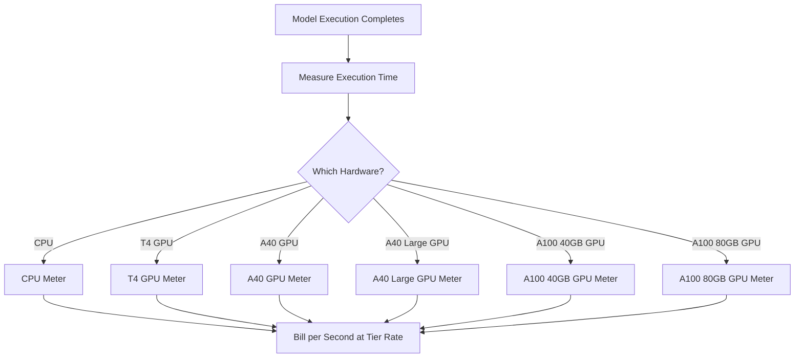

Replicate è una piattaforma per l'esecuzione di modelli di machine learning open source nel cloud. Il loro modello di fatturazione è uno degli esempi più puri di pricing basato sull'utilizzo nell'industria dell'IA. Non ci sono costi di abbonamento mensile né tariffe fisse per ogni esecuzione del modello. Invece, addebitano l'esatto tempo di calcolo consumato, fino al secondo, con tariffe che variano in base all'hardware sottostante.

Questo approccio funziona bene per i carichi di lavoro IA perché i tempi di esecuzione sono imprevedibili. Un singolo utente potrebbe eseguire un modello leggero per pochi secondi o un modello generativo enorme per diversi minuti. Collegando il costo alle risorse di calcolo piuttosto che al modello stesso, Replicate mantiene la trasparenza e la scalabilità dei prezzi.

## Come fattura Replicate

Il pricing di Replicate è scollegato dal modello specifico in esecuzione. Che tu stia generando un'immagine con SDXL o eseguendo Llama 3, la fatturazione è determinata dal livello hardware e dalla durata dell'esecuzione. Questo permette loro di ospitare migliaia di modelli open source senza necessità di piani tariffari separati per ciascuno.

| Hardware | Prezzo al secondo | Prezzo all'ora |
| :--- | :--- | :--- |
| NVIDIA CPU | \$0.000100 | \$0.36 |
| NVIDIA T4 GPU | \$0.000225 | \$0.81 |
| NVIDIA A40 GPU | \$0.000575 | \$2.07 |
| NVIDIA A40 (Large) GPU | \$0.000725 | \$2.61 |
| NVIDIA A100 (40GB) GPU | \$0.001150 | \$4.14 |
| NVIDIA A100 (80GB) GPU | \$0.001400 | \$5.04 |



1. **Tariffe specifiche per hardware**: il costo al secondo varia in base alle risorse di calcolo richieste. Ogni livello hardware ha un diverso punto di prezzo.
2. **Modello puramente basato sull'utilizzo**: non ci sono costi mensili, sovrapprezzi o limiti. Gli utenti vengono fatturati per il tempo di calcolo effettivo (ad es. “12,4 secondi su un A100”) piuttosto che per generazione.
3. **Granularità al secondo**: i tradizionali provider cloud fatturano per ora o minuto, provocando sprechi nei task di breve durata. La fatturazione al secondo elimina questa inefficienza sia per piccoli esperimenti sia per carichi di produzione ampi.

<Info>
Anche gli avvii a freddo sono fatturabili. La prima richiesta a un modello spesso impiega 10-30 secondi per caricare il modello in memoria. Questo tempo di caricamento viene fatturato allo stesso tasso del tempo di esecuzione.
</Info>
## Cosa lo rende unico

* **Misurazione specifica per hardware:** lo stesso modello costa di più su hardware superiore. Gli utenti possono scegliere tra velocità e costo. Una GPU T4 funziona per attività non sensibili al tempo, mentre un A100 gestisce applicazioni in tempo reale.
* **Granularità al secondo:** la fatturazione viene calcolata al secondo, quindi gli utenti non pagano mai in eccesso per task brevi.
* **Nessun abbonamento:** nessun impegno iniziale. Si scala infinitamente con l'utilizzo, rendendolo ideale per startup e sviluppatori che sperimentano diversi modelli.
* **Agnotismo del modello:** la logica di fatturazione resta la stessa indipendentemente dal tipo di attività (generazione di immagini, elaborazione testi, trascrizione audio o sintesi video). Questo permette alla piattaforma di supportare un vasto ecosistema di modelli senza tabelle tariffarie complesse.

## Costruisci questo con Dodo Payments

Puoi replicare questo modello di fatturazione usando le funzionalità di fatturazione basata sull'utilizzo di Dodo Payments. La chiave è utilizzare più metriche per tenere traccia dei diversi livelli hardware e collegarle a un singolo prodotto.

<Steps>
  <Step title="Create Usage Meters (One Per Hardware Class)">
    Crea metriche separate per ogni livello hardware. Ogni tipo di hardware ha un diverso costo al secondo, quindi la misurazione indipendente permette a Dodo di segmentare ciascun livello e offrire fatturazione dettagliata.

    | Nome metrica | Nome evento | Aggregazione | Proprietà |
    | :--- | :--- | :--- | :--- |
    | CPU Compute | `compute.cpu` | Sum | `execution_seconds` |
    | GPU T4 Compute | `compute.gpu_t4` | Sum | `execution_seconds` |
    | GPU A40 Compute | `compute.gpu_a40` | Sum | `execution_seconds` |
    | GPU A40 Large Compute | `compute.gpu_a40_large` | Sum | `execution_seconds` |
    | GPU A100 40GB Compute | `compute.gpu_a100_40` | Sum | `execution_seconds` |
    | GPU A100 80GB Compute | `compute.gpu_a100_80` | Sum | `execution_seconds` |

    L’aggregazione `Sum` sulla proprietà `execution_seconds` calcola il tempo totale di calcolo per ciascun livello hardware nel periodo di fatturazione.
  </Step>

  <Step title="Create a Usage-Based Product">
    Crea un nuovo prodotto nella dashboard di Dodo Payments:

    * **Tipo di pricing:** Usage Based Billing
    * **Prezzo base:** \$0/mese (nessuna tariffa di abbonamento)
    * **Frequenza di fatturazione:** Mensile

    Collega tutte le metriche con il loro prezzo per unità:

    | Metrica | Prezzo per unità (al secondo) |
    | :--- | :--- |
    | compute.cpu | \$0.000100 |
    | compute.gpu_t4 | \$0.000225 |
    | compute.gpu_a40 | \$0.000575 |
    | compute.gpu_a40_large | \$0.000725 |
    | compute.gpu_a100_40 | \$0.001150 |
    | compute.gpu_a100_80 | \$0.001400 |

    Imposta la **Soglia gratuita** a 0 per tutte le metriche. Ogni secondo di esecuzione è fatturabile.
  </Step>

  <Step title="Send Usage Events">
    Invia eventi di utilizzo a Dodo ogni volta che un'esecuzione di modello è completata. Includi un unico `event_id` per ogni previsione per garantire l'idempotenza.

    ```typescript
    import DodoPayments from 'dodopayments';

    type HardwareTier = 'cpu' | 'gpu_t4' | 'gpu_a40' | 'gpu_a40_large' | 'gpu_a100_40' | 'gpu_a100_80';

    const client = new DodoPayments({
      bearerToken: process.env.DODO_PAYMENTS_API_KEY,
    });

    async function trackModelExecution(
      customerId: string,
      modelId: string,
      hardware: HardwareTier,
      executionSeconds: number,
      predictionId: string
    ) {
      const eventName = `compute.${hardware}`;

      await client.usageEvents.ingest({
        events: [{
          event_id: `pred_${predictionId}`,
          customer_id: customerId,
          event_name: eventName,
          timestamp: new Date().toISOString(),
          metadata: {
            execution_seconds: executionSeconds,
            model_id: modelId,
            hardware: hardware
          }
        }]
      });
    }

    // Example: SDXL image generation on A100
    await trackModelExecution(
      'cus_abc123',
      'stability-ai/sdxl',
      'gpu_a100_80',
      8.3,  // 8.3 seconds of A100 time
      'pred_xyz789'
    );
    ```

  </Step>

  <Step title="Measure Execution Time Precisely">
    Avvolgi l'esecuzione del modello con un timing preciso usando `performance.now()`. Approssima al decimo di secondo più vicino per la fatturazione.

    ```typescript
    async function runModelWithMetering(
      customerId: string,
      modelId: string,
      hardware: HardwareTier,
      input: Record<string, unknown>
    ) {
      const predictionId = `pred_${Date.now()}`;
      const startTime = performance.now();

      try {
        const result = await executeModel(modelId, input, hardware);
        const executionSeconds = (performance.now() - startTime) / 1000;
        const billedSeconds = Math.round(executionSeconds * 10) / 10;

        await trackModelExecution(
          customerId,
          modelId,
          hardware,
          billedSeconds,
          predictionId
        );

        return result;
      } catch (error) {
        // Still bill for compute time even on failure
        const executionSeconds = (performance.now() - startTime) / 1000;
        if (executionSeconds > 1) {
          await trackModelExecution(
            customerId,
            modelId,
            hardware,
            Math.round(executionSeconds * 10) / 10,
            predictionId
          );
        }
        throw error;
      }
    }
    ```

  </Step>

  <Step title="Create Checkout">
    Quando un utente si registra, crea una sessione di checkout per il prodotto basato sull'utilizzo. Dodo gestisce automaticamente la fatturazione ricorrente e le fatture.

    ```typescript
    const session = await client.checkoutSessions.create({
      product_cart: [
        { product_id: 'prod_compute_payg', quantity: 1 }
      ],
      customer: { email: 'ml-engineer@company.com' },
      return_url: 'https://yourplatform.com/dashboard'
    });
    ```

  </Step>
</Steps>

## Accelera con il blueprint Time Range Ingestion

Il [Time Range Ingestion Blueprint](/developer-resources/ingestion-blueprints/time-range) semplifica il tracciamento del calcolo al secondo. Crea un’istanza di ingestion per ogni livello hardware e usa `trackTimeRange` per inviare eventi in modo più ordinato.

```bash
npm install @dodopayments/ingestion-blueprints
```

```typescript
import { Ingestion, trackTimeRange } from '@dodopayments/ingestion-blueprints';

// Create one ingestion instance per hardware tier
function createHardwareIngestion(hardware: string) {
  return new Ingestion({
    apiKey: process.env.DODO_PAYMENTS_API_KEY,
    environment: 'live_mode',
    eventName: `compute.${hardware}`,
  });
}

const ingestions: Record<string, Ingestion> = {
  cpu: createHardwareIngestion('cpu'),
  gpu_t4: createHardwareIngestion('gpu_t4'),
  gpu_a40: createHardwareIngestion('gpu_a40'),
  gpu_a40_large: createHardwareIngestion('gpu_a40_large'),
  gpu_a100_40: createHardwareIngestion('gpu_a100_40'),
  gpu_a100_80: createHardwareIngestion('gpu_a100_80'),
};

// Track execution after a model run completes
const startTime = performance.now();
const result = await executeModel(modelId, input, hardware);
const durationMs = performance.now() - startTime;

await trackTimeRange(ingestions[hardware], {
  customerId: customerId,
  durationMs: durationMs,
  metadata: {
    model_id: modelId,
    hardware: hardware,
  },
});
```

Il blueprint gestisce la formattazione della durata e la costruzione degli eventi. Combinato con istanze di ingestion per hardware, questo pattern si lega perfettamente alla misurazione multi-livello di Replicate.

<Tip>
Per job di lunga durata, combina il Blueprint Time Range con il tracciamento heartbeat basato su intervalli. Consulta la [documentazione completa del blueprint](/developer-resources/ingestion-blueprints/time-range) per pattern avanzati.
</Tip>

## Stima dei costi per gli utenti

Poiché la fatturazione basata sull'utilizzo può essere imprevedibile, fornisci agli utenti stime dei costi prima di avviare un modello. Questo riduce fatture inattese e costruisce fiducia.

### Esempi di calcolo dei costi

| Modello | Hardware | Tempo medio | Costo per esecuzione |
| :--- | :--- | :--- | :--- |
| SDXL (immagine) | A100 80GB | ~8 sec | ~\$0.0112 |
| Llama 3 (testo) | A100 40GB | ~3 sec | ~\$0.0035 |
| Whisper (audio) | GPU T4 | ~15 sec | ~\$0.0034 |

### Costruire un calcolatore dei costi

```typescript
function estimateCost(hardware: HardwareTier, estimatedSeconds: number): number {
  const rates: Record<HardwareTier, number> = {
    'cpu': 0.000100,
    'gpu_t4': 0.000225,
    'gpu_a40': 0.000575,
    'gpu_a40_large': 0.000725,
    'gpu_a100_40': 0.001150,
    'gpu_a100_80': 0.001400
  };

  return Number((rates[hardware] * estimatedSeconds).toFixed(4));
}

// Show the user before running: "This will cost approximately $0.0098"
const estimate = estimateCost('gpu_a100_80', 8.5);
```

## Enterprise: Capacità riservata

Per i clienti enterprise che necessitano di disponibilità garantita e nessun cold start, Replicate offre “Private Instances” a tariffa oraria fissa.

Con Dodo Payments, modellalo come prodotto in abbonamento:

* **Tipo di prodotto:** Subscription
* **Prezzo:** Prezzo mensile fisso (es. “Reserved A100 Instance - \$500/month”)
* **Ciclo di fatturazione:** Mensile

Puoi comunque inviare eventi di utilizzo per monitoraggio e analisi, ma l'abbonamento copre il costo. Man mano che il volume di un utente cresce, passare dal pay-as-you-go alla capacità riservata diventa spesso più conveniente.

## Avanzato: metering heartbeat

Per task che durano diversi minuti o ore, inviare un singolo evento alla fine è rischioso. Se il processo si arresta in modo anomalo, perdi i dati di utilizzo. Un approccio migliore è inviare eventi di utilizzo ogni 30-60 secondi durante l'esecuzione.

```typescript
async function runLongTaskWithHeartbeat(
  customerId: string,
  modelId: string,
  hardware: HardwareTier
) {
  const predictionId = `pred_${Date.now()}`;
  let totalSeconds = 0;

  const heartbeatInterval = setInterval(async () => {
    try {
      await trackModelExecution(
        customerId,
        modelId,
        hardware,
        30,
        `${predictionId}_${totalSeconds}`
      );
      totalSeconds += 30;
    } catch (error) {
      console.error('Heartbeat tracking failed:', error, { predictionId, totalSeconds });
    }
  }, 30000);

  try {
    await executeLongTask();
  } finally {
    clearInterval(heartbeatInterval);
  }
}
```

## Principali funzionalità Dodo utilizzate

<CardGroup cols={2}>
  <Card title="Usage-Based Billing" icon="chart-line" href="/features/usage-based-billing/introduction">
    Configura prodotti che fatturano in base al consumo.
  </Card>
  <Card title="Meters" icon="gauge" href="/features/usage-based-billing/meters">
    Definisci le metriche che desideri monitorare e fatturare.
  </Card>
  <Card title="Event Ingestion" icon="bolt" href="/features/usage-based-billing/event-ingestion">
    Invia dati di utilizzo a Dodo in tempo reale.
  </Card>
  <Card title="Subscriptions" icon="calendar" href="/features/subscription">
    Gestisci la fatturazione ricorrente per capacità riservata e piani enterprise.
  </Card>
  <Card title="Time Range Blueprint" icon="clock" href="/developer-resources/ingestion-blueprints/time-range">
    Tracciamento del calcolo al secondo con helper per la durata.
  </Card>
</CardGroup>
