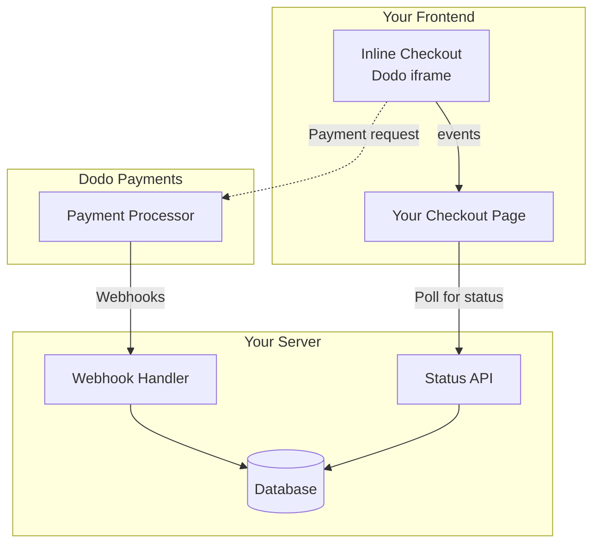

## Panoramica

Il checkout inline ti consente di creare esperienze di checkout completamente integrate che si fondono perfettamente con il tuo sito web o applicazione. A differenza del [checkout overlay](/developer-resources/overlay-checkout), che si apre come un modale sopra la tua pagina, il checkout inline incorpora il modulo di pagamento direttamente nel layout della tua pagina.

Utilizzando il checkout inline, puoi:

- Creare esperienze di checkout completamente integrate con la tua app o sito web
- Consentire a Dodo Payments di catturare in modo sicuro le informazioni sui clienti e sui pagamenti in un frame di checkout ottimizzato
- Visualizzare articoli, totali e altre informazioni da Dodo Payments sulla tua pagina
- Utilizzare metodi e eventi SDK per costruire esperienze di checkout avanzate

<Frame>
    
</Frame>

## Come Funziona

Il checkout inline funziona incorporando un frame sicuro di Dodo Payments nel tuo sito web o app.

Il frame di checkout gestisce la raccolta delle informazioni sui clienti e la cattura dei dettagli di pagamento. La tua pagina visualizza l'elenco degli articoli, i totali e le opzioni per modificare ciò che è presente nel checkout. L'SDK consente alla tua pagina e al frame di checkout di interagire tra loro.

Dodo Payments crea automaticamente un abbonamento quando un checkout viene completato, pronto per essere attivato da te.

<Note>
Il frame del checkout inline gestisce in modo sicuro tutte le informazioni di pagamento sensibili, garantendo la conformità PCI senza certificazioni aggiuntive da parte tua.
</Note>

## Cosa Rende un Buon Checkout Inline?

È importante che i clienti sappiano da chi stanno acquistando, cosa stanno acquistando e quanto stanno pagando.

Per costruire un checkout inline che sia conforme e ottimizzato per la conversione, la tua implementazione deve includere:

<Frame caption="Example inline checkout layout showing required elements">
    
</Frame>

1. **Informazioni ricorrenti**: Se ricorrente, con quale frequenza si ripete e il totale da pagare al rinnovo. Se è una prova, quanto dura la prova.
2. **Descrizioni degli articoli**: Una descrizione di ciò che viene acquistato.
3. **Totali delle transazioni**: Totali delle transazioni, inclusi subtotale, totale delle tasse e totale generale. Assicurati di includere anche la valuta.
4. **Footer di Dodo Payments**: L'intero frame di checkout inline, incluso il footer del checkout che contiene informazioni su Dodo Payments, i nostri termini di vendita e la nostra politica sulla privacy.
5. **Politica di rimborso**: Un link alla tua politica di rimborso, se differente dalla politica standard di rimborso di Dodo Payments.

<Warning>
Mostra sempre l'intero frame del checkout inline, compreso il footer. Rimuovere o nascondere le informazioni legali viola i requisiti di conformità.
</Warning>

## Percorso del Cliente

Il flusso di checkout è determinato dalla configurazione della tua sessione di checkout. A seconda di come configuri la sessione di checkout, i clienti vivranno un checkout che può presentare tutte le informazioni su una singola pagina o attraverso più passaggi.

<Steps>
<Step title="Customer opens checkout">

Puoi aprire il checkout inline passando articoli o una transazione esistente. Usa l'SDK per mostrare e aggiornare le informazioni sulla pagina, e i metodi dell'SDK per aggiornare gli articoli in base all'interazione del cliente.
    

</Step>

<Step title="Customer enters their details">

Il checkout inline chiede prima ai clienti di inserire il proprio indirizzo email, selezionare il proprio paese e (dove richiesto) inserire il proprio codice postale. Questo passaggio raccoglie tutte le informazioni necessarie per determinare le tasse e le opzioni di pagamento disponibili.

Puoi precompilare i dettagli del cliente e presentare indirizzi salvati per semplificare l'esperienza.

</Step>

<Step title="Customer selects payment method">

Dopo aver inserito i propri dettagli, ai clienti vengono presentati i metodi di pagamento disponibili e il modulo di pagamento. Le opzioni possono includere carta di credito o debito, PayPal, Apple Pay, Google Pay e altri metodi di pagamento locali in base alla loro posizione.

Visualizza i metodi di pagamento salvati se disponibili per accelerare il checkout.


</Step>

<Step title="Checkout completed">

Dodo Payments instrada ogni pagamento al miglior acquirente per quella vendita per ottenere la migliore possibilità di successo. I clienti entrano in un flusso di successo che puoi costruire.


</Step>

<Step title="Dodo Payments creates subscription">

Dodo Payments crea automaticamente un abbonamento per il cliente, pronto per essere attivato da te. Il metodo di pagamento utilizzato dal cliente viene mantenuto in archivio per i rinnovi o le modifiche all'abbonamento.


</Step>
</Steps>

## Inizio Veloce

Inizia con il Checkout Inline di Dodo Payments in poche righe di codice:

```typescript
import { DodoPayments } from "dodopayments-checkout";

// Initialize the SDK for inline mode
DodoPayments.Initialize({
  mode: "test",
  displayType: "inline",
  onEvent: (event) => {
    console.log("Checkout event:", event);
  },
});

// Open checkout in a specific container
DodoPayments.Checkout.open({
  checkoutUrl: "https://test.dodopayments.com/session/cks_123",
  elementId: "dodo-inline-checkout" // ID of the container element
});
```

<Tip>
Assicurati di avere un elemento contenitore con il corrispondente `id` sulla tua pagina: `<div id="dodo-inline-checkout"></div>`.
</Tip>

## Guida all'Integrazione Passo-Passo

<Steps>
<Step title="Install the SDK">

Installa l'SDK di Dodo Payments Checkout:

<CodeGroup>

```bash npm
npm install dodopayments-checkout
```

```bash yarn
yarn add dodopayments-checkout
```

```bash pnpm
pnpm add dodopayments-checkout
```

</CodeGroup>

</Step>

<Step title="Initialize the SDK for Inline Display">

Inizializza l'SDK e specifica `displayType: 'inline'`. Dovresti anche ascoltare l'evento `checkout.breakdown` per aggiornare la tua UI con i calcoli in tempo reale di tasse e totali.

```typescript
import { DodoPayments } from "dodopayments-checkout";

DodoPayments.Initialize({
  mode: "test",
  displayType: "inline",
  onEvent: (event) => {
    if (event.event_type === "checkout.breakdown") {
      const breakdown = event.data?.message;
      // Update your UI with breakdown.subTotal, breakdown.tax, breakdown.total, etc.
    }
  },
});
```

</Step>

<Step title="Create a Container Element">

Aggiungi un elemento al tuo HTML dove il frame del checkout sarà iniettato:

```html
<div id="dodo-inline-checkout"></div>
```

</Step>

<Step title="Open the Checkout">

Richiama `DodoPayments.Checkout.open()` con `checkoutUrl` e `elementId` del tuo contenitore:

```typescript
DodoPayments.Checkout.open({
  checkoutUrl: "https://test.dodopayments.com/session/cks_123",
  elementId: "dodo-inline-checkout"
});
```

</Step>

<Step title="Test Your Integration">

1. Avvia il tuo server di sviluppo:

```bash
npm run dev
```

2. Testa il flusso di checkout:
   - Inserisci i tuoi dettagli email e indirizzo nel frame inline.
   - Verifica che il tuo riepilogo ordine personalizzato si aggiorni in tempo reale.
   - Testa il flusso di pagamento utilizzando credenziali di test.
   - Conferma che i reindirizzamenti funzionino correttamente.

<Check>
Dovresti vedere eventi `checkout.breakdown` registrati nella console del browser se hai aggiunto un console log nel callback `onEvent`.
</Check>

</Step>

<Step title="Go Live">

Quando sei pronto per la produzione:

1. Cambia la modalità in `'live'`:

```typescript
DodoPayments.Initialize({
  mode: "live",
  displayType: "inline",
  onEvent: (event) => {
    // Handle events
  }
});
```

2. Aggiorna i tuoi URL di checkout per utilizzare sessioni di checkout live dal tuo backend.
3. Testa il flusso completo in produzione.

</Step>
</Steps>

## Esempio Completo in React

Questo esempio dimostra come implementare un riepilogo ordini personalizzato accanto al checkout inline, mantenendoli sincronizzati tramite l'evento `checkout.breakdown`.

```tsx
"use client";

import { useEffect, useState } from 'react';
import { DodoPayments, CheckoutBreakdownData } from 'dodopayments-checkout';

export default function CheckoutPage() {
  const [breakdown, setBreakdown] = useState<Partial<CheckoutBreakdownData>>({});

  useEffect(() => {
    // 1. Initialize the SDK
    DodoPayments.Initialize({
      mode: 'test',
      displayType: 'inline',
      onEvent: (event) => {
        // 2. Listen for the 'checkout.breakdown' event
        if (event.event_type === "checkout.breakdown") {
          const message = event.data?.message as CheckoutBreakdownData;
          if (message) setBreakdown(message);
        }
      }
    });

    // 3. Open the checkout in the specified container
    DodoPayments.Checkout.open({
      checkoutUrl: 'https://test.dodopayments.com/session/cks_123',
      elementId: 'dodo-inline-checkout'
    });

    return () => DodoPayments.Checkout.close();
  }, []);

  const format = (amt: number | null | undefined, curr: string | null | undefined) => 
    amt != null && curr ? `${curr} ${(amt/100).toFixed(2)}` : '0.00';

  const currency = breakdown.currency ?? breakdown.finalTotalCurrency ?? '';

  return (
    <div className="flex flex-col md:flex-row min-h-screen">
      {/* Left Side - Checkout Form */}
      <div className="w-full md:w-1/2 flex items-center">
        <div id="dodo-inline-checkout" className='w-full' />
      </div>

      {/* Right Side - Custom Order Summary */}
      <div className="w-full md:w-1/2 p-8 bg-gray-50">
        <h2 className="text-2xl font-bold mb-4">Order Summary</h2>
        <div className="space-y-2">
          {breakdown.subTotal && (
            <div className="flex justify-between">
              <span>Subtotal</span>
              <span>{format(breakdown.subTotal, currency)}</span>
            </div>
          )}
          {breakdown.discount && (
            <div className="flex justify-between">
              <span>Discount</span>
              <span>{format(breakdown.discount, currency)}</span>
            </div>
          )}
          {breakdown.tax != null && (
            <div className="flex justify-between">
              <span>Tax</span>
              <span>{format(breakdown.tax, currency)}</span>
            </div>
          )}
          <hr />
          {(breakdown.finalTotal ?? breakdown.total) && (
            <div className="flex justify-between font-bold text-xl">
              <span>Total</span>
              <span>{format(breakdown.finalTotal ?? breakdown.total, breakdown.finalTotalCurrency ?? currency)}</span>
            </div>
          )}
        </div>
      </div>
    </div>
  );
}

```

## Riferimento API

### Configurazione

#### Opzioni di Inizializzazione

```typescript
interface InitializeOptions {
  mode: "test" | "live";
  displayType: "inline"; // Required for inline checkout
  onEvent: (event: CheckoutEvent) => void;
}
```

| Opzione | Tipo | Obbligatorio | Descrizione |
|--------|------|----------|-------------|
| `mode` | `"test" \| "live"` | Sì | Modalità dell'ambiente. |
| `displayType` | `"inline" \| "overlay"` | Sì | Deve essere impostato su `"inline"` per incorporare il checkout. |
| `onEvent` | `function` | Sì | Funzione di callback per gestire gli eventi di checkout. |

#### Opzioni di Checkout

```typescript
export type FontSize = "xs" | "sm" | "md" | "lg" | "xl" | "2xl";
export type FontWeight = "normal" | "medium" | "bold" | "extraBold";

interface CheckoutOptions {
  checkoutUrl: string;
  elementId: string; // Required for inline checkout
  options?: {
    showTimer?: boolean;
    showSecurityBadge?: boolean;
    manualRedirect?: boolean;
    themeConfig?: ThemeConfig;
    payButtonText?: string;
    fontSize?: FontSize;
    fontWeight?: FontWeight;
  };
}
```

| Opzione | Tipo | Obbligatorio | Descrizione |
|--------|------|----------|-------------|
| `checkoutUrl` | `string` | Sì | URL della sessione di checkout. |
| `elementId` | `string` | Sì | L'`id` dell'elemento DOM in cui il checkout deve essere renderizzato. |
| `options.showTimer` | `boolean` | No | Mostra o nasconde il timer del checkout. Impostazione predefinita `true`. Quando disabilitato, riceverai l'evento `checkout.link_expired` quando la sessione scade. |
| `options.showSecurityBadge` | `boolean` | No | Mostra o nasconde il badge di sicurezza. Impostazione predefinita `true`. |
| `options.manualRedirect` | `boolean` | No | Quando abilitato, il checkout non esegue automaticamente il redirect al completamento. Riceverai invece gli eventi `checkout.status` e `checkout.redirect_requested` per gestire manualmente il redirect. |
| `options.themeConfig` | `ThemeConfig` | No | Configurazione del tema personalizzata. |
| `options.payButtonText` | `string` | No | Testo personalizzato da visualizzare sul pulsante di pagamento. |
| `options.fontSize` | `FontSize` | No | Dimensione globale del font per il checkout. |
| `options.fontWeight` | `FontWeight` | No | Spessore globale del font per il checkout. |

### Metodi

#### Apri Checkout

Apre il frame di checkout nel contenitore specificato.

```typescript
DodoPayments.Checkout.open({
  checkoutUrl: "https://test.dodopayments.com/session/cks_123",
  elementId: "dodo-inline-checkout"
});
```

Puoi anche passare opzioni aggiuntive per personalizzare il comportamento del checkout:

```typescript
DodoPayments.Checkout.open({
  checkoutUrl: "https://test.dodopayments.com/session/cks_123",
  elementId: "dodo-inline-checkout",
  options: {
    showTimer: false,
    showSecurityBadge: false,
    manualRedirect: true,
    payButtonText: "Pay Now",
  },
});
```

Quando usi `manualRedirect`, gestisci il completamento del checkout nel tuo callback `onEvent`:

```typescript
DodoPayments.Initialize({
  mode: "test",
  displayType: "inline",
  onEvent: (event) => {
    if (event.event_type === "checkout.status") {
      const status = event.data?.message?.status;
      // Handle status: "succeeded", "failed", or "processing"
    }
    if (event.event_type === "checkout.redirect_requested") {
      const redirectUrl = event.data?.message?.redirect_to;
      // Redirect the customer manually
      window.location.href = redirectUrl;
    }
    if (event.event_type === "checkout.link_expired") {
      // Handle expired checkout session
    }
  },
});
```

#### Chiudi Checkout

Rimuove programmaticamente il frame di checkout e pulisce i listener degli eventi.

```typescript
DodoPayments.Checkout.close();
```

#### Controlla Stato

Restituisce se il frame di checkout è attualmente iniettato.

```typescript
const isOpen = DodoPayments.Checkout.isOpen();
// Returns: boolean
```

### Eventi

L'SDK fornisce eventi in tempo reale tramite il callback `onEvent`. Per il checkout inline, `checkout.breakdown` è particolarmente utile per sincronizzare la tua UI.

| Tipo di evento | Descrizione |
|------------|-------------|
| `checkout.opened` | Il frame del checkout è stato caricato. |
| `checkout.form_ready` | Il modulo di checkout è pronto per ricevere input dell'utente. Utile per nascondere gli stati di caricamento e mostrare l'interfaccia del checkout. |
| `checkout.breakdown` | Generato quando prezzi, tasse o sconti vengono aggiornati. |
| `checkout.customer_details_submitted` | I dati del cliente sono stati inviati. |
| `checkout.pay_button_clicked` | Generato quando il cliente clicca il pulsante di pagamento. Utile per analisi e tracciamento dei funnel di conversione. |
| `checkout.redirect` | Il checkout effettuerà un redirect (ad esempio verso una pagina bancaria). |
| `checkout.error` | Si è verificato un errore durante il checkout. |
| `checkout.link_expired` | Generato quando la sessione di checkout scade. Ricevuto solo quando `showTimer` è impostato su `false`. |
| `checkout.status` | Generato quando `manualRedirect` è abilitato. Contiene lo stato del checkout (`succeeded`, `failed` o `processing`). |
| `checkout.redirect_requested` | Generato quando `manualRedirect` è abilitato. Contiene l'URL verso cui reindirizzare il cliente. |

#### Dati di Breakdown del Checkout

L'evento `checkout.breakdown` fornisce i seguenti dati:

```typescript
interface CheckoutBreakdownData {
  subTotal?: number;          // Amount in cents
  discount?: number;         // Amount in cents
  tax?: number;              // Amount in cents
  total?: number;            // Amount in cents
  currency?: string;         // e.g., "USD"
  finalTotal?: number;       // Final amount including adjustments
  finalTotalCurrency?: string; // Currency for the final total
}
```

#### Dati dell'Evento di Stato del Checkout

Quando `manualRedirect` è abilitato, ricevi l'evento `checkout.status` con i seguenti dati:

```typescript
interface CheckoutStatusEventData {
  message: {
    status?: "succeeded" | "failed" | "processing";
  };
}
```

#### Dati dell'Evento di Reindirizzamento del Checkout Richiesto

Quando `manualRedirect` è abilitato, ricevi l'evento `checkout.redirect_requested` con i seguenti dati:

```typescript
interface CheckoutRedirectRequestedEventData {
  message: {
    redirect_to?: string;
  };
}
```

#### Comprendere l'Evento di Breakdown

L'evento `checkout.breakdown` è il metodo principale per mantenere sincronizzata l'interfaccia della tua applicazione con lo stato del checkout Dodo Payments.

**Quando si attiva:**
- **All'inizializzazione**: Immediatamente dopo che il frame di checkout è stato caricato e pronto.
- **Al cambio di indirizzo**: Ogni volta che il cliente seleziona un paese o inserisce un codice postale che comporta un ricalcolo delle tasse.

**Dettagli dei Campi:**

| Campo | Descrizione |
|-------|-------------|
| `subTotal` | La somma di tutti gli articoli nella sessione prima che vengano applicati sconti o tasse. |
| `discount` | Il valore totale di tutti gli sconti applicati. |
| `tax` | L'importo delle tasse calcolate. In modalità `inline`, questo valore si aggiorna dinamicamente mentre l'utente interagisce con i campi dell'indirizzo. |
| `total` | Il risultato matematico di `subTotal - discount + tax` nella valuta base della sessione. |
| `currency` | Il codice valuta ISO (ad esempio `"USD"`) per i valori standard di subtotale, sconto e tasse. |
| `finalTotal` | L'importo effettivamente addebitato al cliente. Può includere rettifiche di cambio valuta o commissioni dei metodi di pagamento locali che non fanno parte della suddivisione base dei prezzi. |
| `finalTotalCurrency` | La valuta in cui il cliente sta realmente pagando. Può differire da `currency` se è attiva la parità del potere d'acquisto o la conversione in valuta locale. |

**Consigli chiave per l'integrazione:**

1.  **Formattazione della valuta**: i prezzi vengono sempre restituiti come interi nell'unità monetaria più piccola (ad esempio centesimi per USD, yen per JPY). Per visualizzarli, dividili per 100 (o la potenza di 10 appropriata) oppure usa una libreria di formattazione come `Intl.NumberFormat`.
2.  **Gestione degli stati iniziali**: quando il checkout viene caricato per la prima volta, `tax` e `discount` possono essere `0` o `null` finché l'utente non fornisce le informazioni di fatturazione o non applica un codice. La tua UI dovrebbe gestire questi stati in modo elegante (ad esempio mostrandone un trattino `—` o nascondendo la riga).
3.  **"Totale finale" vs "Totale"**: mentre `total` ti fornisce il calcolo standard del prezzo, `finalTotal` è la fonte di verità per la transazione. Se `finalTotal` è presente, riflette esattamente ciò che verrà addebitato sulla carta del cliente, incluse eventuali rettifiche dinamiche.
4.  **Feedback in tempo reale**: usa il campo `tax` per mostrare agli utenti che le tasse vengono calcolate in tempo reale. Ciò conferisce una sensazione "live" alla tua pagina di checkout e riduce l'attrito durante la compilazione dell'indirizzo.

## Opzioni di Implementazione

### Installazione tramite Package Manager

Installa tramite npm, yarn o pnpm come mostrato nella [Guida all'Integrazione Passo-Passo](#step-by-step-integration-guide).

### Implementazione CDN

Per un'integrazione rapida senza un passaggio di build, puoi utilizzare il nostro CDN:

```html
<!DOCTYPE html>
<html lang="en">
<head>
    <meta charset="UTF-8">
    <meta name="viewport" content="width=device-width, initial-scale=1.0">
    <title>Dodo Payments Inline Checkout</title>
    
    <!-- Load DodoPayments -->
    <script src="https://cdn.jsdelivr.net/npm/dodopayments-checkout@latest/dist/index.js"></script>
    <script>
        // Initialize the SDK
        DodoPaymentsCheckout.DodoPayments.Initialize({
            mode: "test",
            displayType: "inline",
            onEvent: (event) => {
                console.log('Checkout event:', event);
            }
        });
    </script>
</head>
<body>
    <div id="dodo-inline-checkout"></div>

    <script>
        // Open the checkout
        DodoPaymentsCheckout.DodoPayments.Checkout.open({
            checkoutUrl: "https://test.dodopayments.com/session/cks_123",
            elementId: "dodo-inline-checkout"
        });
    </script>
</body>
</html>
```

### Personalizzazione del Tema

Puoi personalizzare l'aspetto del checkout passando un oggetto `themeConfig` nel parametro `options` all'apertura del checkout. La configurazione del tema supporta sia la modalità chiara che scura, permettendoti di personalizzare colori, bordi, testo, pulsanti e raggio dei bordi.

<Info>
Questa sezione copre la configurazione del tema **lato client** usando l'SDK Checkout. Puoi anche configurare i temi **lato server** quando crei una sessione di checkout tramite l'API usando il parametro `theme_config`. Consulta [Checkout Theme Customization](/features/checkout#checkout-theme-customization) per la configurazione a livello di API.
</Info>

#### Configurazione base del tema

```typescript
DodoPayments.Checkout.open({
  checkoutUrl: "https://checkout.dodopayments.com/session/cks_123",
  options: {
    themeConfig: {
      light: {
        bgPrimary: "#FFFFFF",
        textPrimary: "#344054",
        buttonPrimary: "#A6E500",
      },
      dark: {
        bgPrimary: "#0D0D0D",
        textPrimary: "#FFFFFF",
        buttonPrimary: "#A6E500",
      },
      radius: "8px",
    },
  },
});
```

#### Configurazione completa del tema

Tutte le proprietà del tema disponibili:

```typescript
DodoPayments.Checkout.open({
  checkoutUrl: "https://checkout.dodopayments.com/session/cks_123",
  options: {
    themeConfig: {
      light: {
        // Background colors
        bgPrimary: "#FFFFFF",        // Primary background color
        bgSecondary: "#F9FAFB",      // Secondary background color (e.g., tabs)
        
        // Border colors
        borderPrimary: "#D0D5DD",     // Primary border color
        borderSecondary: "#6B7280",  // Secondary border color
        inputFocusBorder: "#D0D5DD", // Input focus border color
        
        // Text colors
        textPrimary: "#344054",       // Primary text color
        textSecondary: "#6B7280",    // Secondary text color
        textPlaceholder: "#667085",  // Placeholder text color
        textError: "#D92D20",        // Error text color
        textSuccess: "#10B981",      // Success text color
        
        // Button colors
        buttonPrimary: "#A6E500",           // Primary button background
        buttonPrimaryHover: "#8CC500",      // Primary button hover state
        buttonTextPrimary: "#0D0D0D",       // Primary button text color
        buttonSecondary: "#F3F4F6",         // Secondary button background
        buttonSecondaryHover: "#E5E7EB",     // Secondary button hover state
        buttonTextSecondary: "#344054",     // Secondary button text color
      },
      dark: {
        // Background colors
        bgPrimary: "#0D0D0D",
        bgSecondary: "#1A1A1A",
        
        // Border colors
        borderPrimary: "#323232",
        borderSecondary: "#D1D5DB",
        inputFocusBorder: "#323232",
        
        // Text colors
        textPrimary: "#FFFFFF",
        textSecondary: "#909090",
        textPlaceholder: "#9CA3AF",
        textError: "#F97066",
        textSuccess: "#34D399",
        
        // Button colors
        buttonPrimary: "#A6E500",
        buttonPrimaryHover: "#8CC500",
        buttonTextPrimary: "#0D0D0D",
        buttonSecondary: "#2A2A2A",
        buttonSecondaryHover: "#3A3A3A",
        buttonTextSecondary: "#FFFFFF",
      },
      radius: "8px", // Border radius for inputs, buttons, and tabs
    },
  },
});
```

#### Solo modalità chiara

Se vuoi personalizzare solo il tema chiaro:

```typescript
DodoPayments.Checkout.open({
  checkoutUrl: "https://checkout.dodopayments.com/session/cks_123",
  options: {
    themeConfig: {
      light: {
        bgPrimary: "#FFFFFF",
        textPrimary: "#000000",
        buttonPrimary: "#0070F3",
      },
      radius: "12px",
    },
  },
});
```

#### Solo modalità scura

Se vuoi personalizzare solo il tema scuro:

```typescript
DodoPayments.Checkout.open({
  checkoutUrl: "https://checkout.dodopayments.com/session/cks_123",
  options: {
    themeConfig: {
      dark: {
        bgPrimary: "#000000",
        textPrimary: "#FFFFFF",
        buttonPrimary: "#0070F3",
      },
      radius: "12px",
    },
  },
});
```

#### Sovrascrittura parziale del tema

Puoi sovrascrivere solo proprietà specifiche. Il checkout userà i valori predefiniti per le proprietà non specificate:

```typescript
DodoPayments.Checkout.open({
  checkoutUrl: "https://checkout.dodopayments.com/session/cks_123",
  options: {
    themeConfig: {
      light: {
        buttonPrimary: "#FF6B6B", // Only override primary button color
      },
      radius: "16px", // Override border radius
    },
  },
});
```

#### Configurazione del tema con altre opzioni

Puoi combinare la configurazione del tema con altre opzioni di checkout:

```typescript
DodoPayments.Checkout.open({
  checkoutUrl: "https://checkout.dodopayments.com/session/cks_123",
  options: {
    showTimer: true,
    showSecurityBadge: true,
    manualRedirect: false,
    themeConfig: {
      light: {
        bgPrimary: "#FFFFFF",
        buttonPrimary: "#A6E500",
      },
      dark: {
        bgPrimary: "#0D0D0D",
        buttonPrimary: "#A6E500",
      },
      radius: "8px",
    },
  },
});
```

#### Tipi TypeScript

Per gli utenti TypeScript, tutti i tipi di configurazione del tema vengono esportati:

```typescript
import { ThemeConfig, ThemeModeConfig } from "dodopayments-checkout";

const themeConfig: ThemeConfig = {
  light: {
    bgPrimary: "#FFFFFF",
    // ... other properties
  },
  dark: {
    bgPrimary: "#0D0D0D",
    // ... other properties
  },
  radius: "8px",
};
```

## Aggiorna metodo di pagamento

Il checkout inline supporta **gli aggiornamenti del metodo di pagamento** per gli abbonamenti. Quando un cliente deve aggiornare il metodo di pagamento — sia per un abbonamento attivo sia per riattivare un abbonamento in attesa — puoi visualizzare il flusso di aggiornamento direttamente nel layout della tua pagina.

### Come funziona

1. Chiama l'[Update Payment Method API](/features/subscription#update-payment-method-for-active-subscription) per ottenere un `payment_link`:

```typescript
const response = await client.subscriptions.updatePaymentMethod('sub_123', {
  type: 'new',
  return_url: 'https://example.com/return'
});
```

2. Passa il `payment_link` restituito come `checkoutUrl` per aprire il checkout inline:

```typescript
DodoPayments.Checkout.open({
  checkoutUrl: response.payment_link,
  elementId: "dodo-inline-checkout"
});
```

Il frame inline renderizza solo il modulo di raccolta del metodo di pagamento. I clienti possono inserire nuovi dati della carta o selezionare un metodo salvato senza lasciare la tua pagina.

### Per abbonamenti in attesa

Quando aggiorni il metodo di pagamento per un abbonamento in stato `on_hold`, Dodo Payments crea automaticamente un addebito per eventuali importi dovuti. Monitora i webhook `payment.succeeded` e `subscription.active` per confermare la riattivazione.

```typescript
const response = await client.subscriptions.updatePaymentMethod('sub_123', {
  type: 'new',
  return_url: 'https://example.com/return'
});

if (response.payment_id) {
  // Charge created for remaining dues
  // Open inline checkout for payment collection
  DodoPayments.Checkout.open({
    checkoutUrl: response.payment_link,
    elementId: "dodo-inline-checkout"
  });
}
```

<Tip>
Puoi anche usare un metodo di pagamento salvato esistente invece di raccogliere nuovi dati passando `type: 'existing'` con un `payment_method_id` all'Update Payment Method API.
</Tip>

## Gestione degli errori

L'SDK fornisce informazioni dettagliate sugli errori tramite il sistema di eventi. Implementa sempre una corretta gestione degli errori nel tuo callback `onEvent`:

```typescript
DodoPayments.Initialize({
  mode: "test",
  displayType: "inline",
  onEvent: (event: CheckoutEvent) => {
    if (event.event_type === "checkout.error") {
      console.error("Checkout error:", event.data?.message);
      // Handle error appropriately
    }
  }
});
```

<Warning>
Gestisci sempre l'evento `checkout.error` per offrire una buona esperienza utente in caso di problemi.
</Warning>

## Migliori pratiche

1. **Design reattivo**: assicurati che il tuo elemento contenitore abbia larghezza e altezza sufficienti. L'iframe di solito si espande per riempire il contenitore.
2. **Sincronizzazione**: usa l'evento `checkout.breakdown` per mantenere sincronizzato il tuo riepilogo ordini personalizzato o le tabelle dei prezzi con ciò che l'utente vede nel frame del checkout.
3. **Stati scheletro**: mostra un indicatore di caricamento nel tuo contenitore finché non viene attivato l'evento `checkout.opened`.
4. **Pulizia**: richiama `DodoPayments.Checkout.close()` quando il tuo componente viene smontato per pulire l'iframe e i listener degli eventi.

<Info>
Per implementazioni in modalità scura, si consiglia di usare `#0d0d0d` come colore di sfondo per un'integrazione visiva ottimale con il frame del checkout inline.
</Info>

## Validazione dello stato di pagamento

<Warning>
Non fare affidamento esclusivamente sugli eventi del checkout inline per determinare il successo o il fallimento del pagamento. Implementa sempre la validazione lato server usando webhook e/o polling.
</Warning>

### Perché la validazione lato server è essenziale

Sebbene eventi del checkout inline come `checkout.status` forniscano feedback in tempo reale, non dovrebbero essere l'unica fonte di verità per lo stato del pagamento. Problemi di rete, crash del browser o utenti che chiudono la pagina possono causare la perdita di eventi. Per garantire una validazione affidabile del pagamento:

1. **Il tuo server dovrebbe ascoltare gli eventi webhook** - Dodo Payments invia webhook per i cambiamenti dello stato di pagamento
2. **Implementa un meccanismo di polling** - Il tuo frontend dovrebbe interrogare il server per aggiornamenti di stato
3. **Combina entrambi gli approcci** - Usa i webhook come fonte principale e il polling come fallback

### Architettura consigliata



### Passaggi di implementazione

**1. Ascolta gli eventi del checkout** - Quando l'utente clicca su paga, inizia a prepararti per verificare lo stato:

```typescript
onEvent: (event) => {
  if (event.event_type === 'checkout.status') {
    // Start polling your server for confirmed status
    startPolling();
  }
}
```

**2. Interroga il tuo server** - Crea un endpoint che verifichi lo stato del pagamento nel database (aggiornato tramite webhook):

```typescript
// Poll every 2 seconds until status is confirmed
const interval = setInterval(async () => {
  const { status } = await fetch(`/api/payments/${paymentId}/status`).then(r => r.json());
  if (status === 'succeeded' || status === 'failed') {
    clearInterval(interval);
    handlePaymentResult(status);
  }
}, 2000);
```

**3. Gestisci i webhook lato server** - Aggiorna il tuo database quando Dodo invia i webhook `payment.succeeded` o `payment.failed`. Consulta la nostra [documentazione sui webhook](/developer-resources/webhooks) per i dettagli.

### Gestione dei reindirizzamenti (3DS, Google Pay, UPI)

Quando usi `manualRedirect: true`, alcuni metodi di pagamento richiedono di reindirizzare l'utente fuori dalla tua pagina per l'autenticazione:

- **3D Secure (3DS)** - Autenticazione della carta
- **Google Pay** - Autenticazione del portafoglio in alcuni flussi
- **UPI** - Reindirizzamenti dei metodi di pagamento indiani

Quando è richiesto un reindirizzamento, riceverai l'evento `checkout.redirect_requested`. Reindirizza l'utente all'URL fornito:

```typescript
if (event.event_type === 'checkout.redirect_requested') {
  const redirectUrl = event.data?.message?.redirect_to;
  // Save payment ID before redirect, then redirect
  sessionStorage.setItem('pendingPaymentId', paymentId);
  window.location.href = redirectUrl;
}
```

Dopo che l'autenticazione è completata (successo o fallimento), l'utente torna sulla tua pagina. **Non presumere il successo solo perché è tornato.** Invece:

1. Verifica se l'utente sta tornando da un reindirizzamento (ad esempio tramite `sessionStorage`)
2. Inizia a interrogare il tuo server per lo stato di pagamento confermato
3. Mostra uno stato "Verifica pagamento..." durante il polling
4. Visualizza un'interfaccia di successo/fallimento basata sullo stato confermato dal server

<Tip>
Verifica sempre lo stato del pagamento lato server dopo i reindirizzamenti. Il ritorno dell'utente alla tua pagina significa solo che l'autenticazione è terminata, non che il pagamento abbia avuto successo.
</Tip>

## Risoluzione dei problemi

<AccordionGroup>
<Accordion title="Checkout frame is not appearing">
- Verifica che `elementId` corrisponda all'`id` di un `div` che esiste effettivamente nel DOM.
- Assicurati che `displayType: 'inline'` sia stato passato a `Initialize`.
- Controlla che `checkoutUrl` sia valido.
</Accordion>

<Accordion title="Taxes are not updating in my UI">
- Assicurati di ascoltare l'evento `checkout.breakdown`.
- Le tasse vengono calcolate solo dopo che l'utente ha inserito un paese e un codice postale validi nel frame del checkout.
</Accordion>
</AccordionGroup>

## Abilitazione dei portafogli digitali

Per informazioni dettagliate su come impostare Apple Pay, Google Pay e altri portafogli digitali, consulta la pagina <a href="/features/payment-methods/digital-wallets">Digital Wallets</a>.

### Configurazione rapida per Apple Pay

<Steps>
<Step title="Download domain association file">
Scarica il [file di associazione del dominio Apple Pay](http://checkout.dodopayments.com/.well-known/apple-developer-merchantid-domain-association).
</Step>

<Step title="Request activation">
Invia una email a **support@dodopayments.com** con l'URL del tuo dominio di produzione e richiedi l'attivazione di Apple Pay.
</Step>

<Step title="Test after confirmation">
Una volta confermato, verifica che Apple Pay compaia nel checkout e testa l'intero flusso.
</Step>
</Steps>

<Warning>
Apple Pay richiede la verifica del dominio prima di essere disponibile in produzione. Contatta il supporto prima di andare live se prevedi di offrire Apple Pay.
</Warning>

## Supporto browser

L'SDK Dodo Payments Checkout supporta i seguenti browser:

- Chrome (ultima versione)
- Firefox (ultima versione)
- Safari (ultima versione)
- Edge (ultima versione)
- IE11+

## Checkout inline vs overlay

Scegli il tipo di checkout più adatto al tuo caso d'uso:

| Funzionalità | Checkout inline | Checkout overlay |
|---------|-----------------|------------------|
| Profondità dell'integrazione | Completamente incorporato nella pagina | Modal sopra la pagina |
| Controllo del layout | Controllo totale | Limitato |
| Identità visiva | Integrato | Separato dalla pagina |
| Sforzo di implementazione | Maggiore | Minore |
| Consigliato per | Pagine di checkout personalizzate, flussi ad alta conversione | Integrazione rapida, pagine esistenti |

<Tip>
Usa il **checkout inline** quando vuoi il massimo controllo sull'esperienza di checkout e un branding senza soluzione di continuità. Usa il **checkout overlay** per un'integrazione più veloce con modifiche minime alle pagine esistenti.
</Tip>

## Risorse correlate

<CardGroup cols={2}>
<Card title="Overlay Checkout" icon="layer-group" href="/developer-resources/overlay-checkout">
    Usa il checkout overlay per un'integrazione rapida basata su modali.
</Card>

<Card title="Checkout Sessions API" icon="code" href="/api-reference/checkout-sessions/create">
    Crea sessioni di checkout per alimentare le tue esperienze di pagamento.
</Card>

<Card title="Webhooks" icon="webhook" href="/developer-resources/webhooks">
    Gestisci gli eventi di pagamento lato server con i webhook.
</Card>

<Card title="Integration Guide" icon="book" href="/developer-resources/integration-guide">
    Guida completa all'integrazione di Dodo Payments.
</Card>
</CardGroup>

Per ulteriore aiuto, visita la nostra Discord community (https://discord.gg/bYqAp4ayYh) o contatta il nostro team di supporto per sviluppatori.
