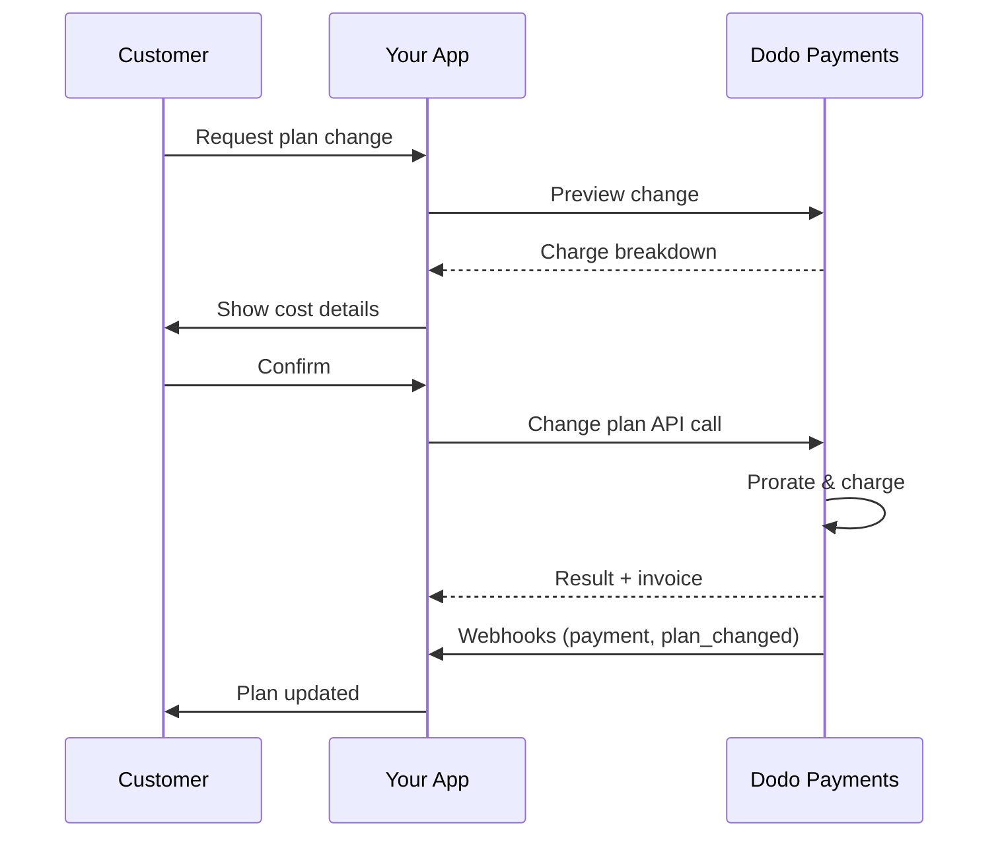
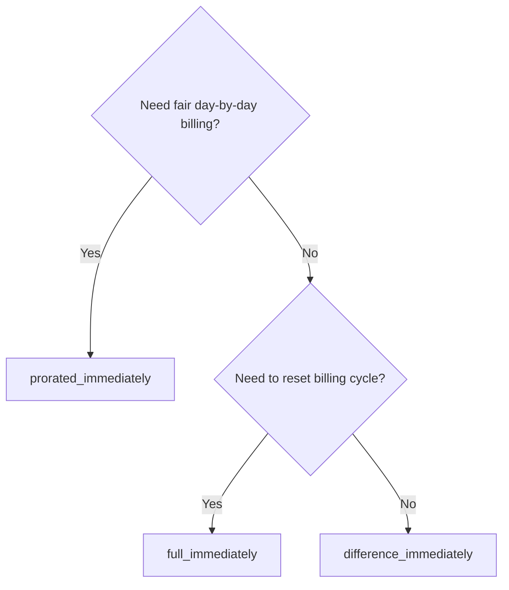
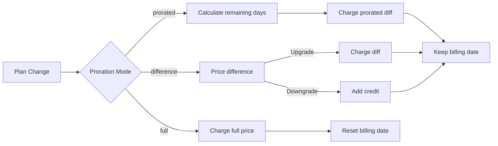

{/* LOCKED_PATTERN_6d744560e4135463c359b094ae69cd5f */}
{/* LOCKED_PATTERN_e019618386b2aca726eb1801e3e74076 */}
  Documentazione API completa per aggiornare gli abbonamenti.
</Card>
{/* LOCKED_PATTERN_1e8b2499d330dcc44e5e284a3600fd11 */}
  Controlla gli importi addebitati prima di cambiare piano.
</Card>
{/* LOCKED_PATTERN_782a37ccd4cc5a4159c5497e7f1d4c54 */}
  Configurazione passo passo dell’abbonamento.
</Card>
</CardGroup>

## Cos'è un upgrade o downgrade dell'abbonamento?

Cambiare piano consente di spostare un cliente tra livelli di abbonamento o quantità. Usalo per:
- Allineare i prezzi all’utilizzo o alle funzionalità
- Passare da mensile ad annuale (o viceversa)
- Regolare la quantità per prodotti basati sui posti

<Info>
Le modifiche al piano possono generare un addebito immediato a seconda della modalità di proration selezionata.
</Info>

## Quando utilizzare le modifiche di piano

- Eseguire upgrade quando un cliente necessita di più funzionalità, utilizzo o posti
- Eseguire downgrade quando l’utilizzo diminuisce
- Migrare gli utenti verso un nuovo prodotto o prezzo senza cancellare l’abbonamento

## Flusso di modifica del piano



## Requisiti

Prima di implementare i cambiamenti di piano di abbonamento, assicurati di avere:

- Un account commerciante Dodo Payments con prodotti di abbonamento attivi
- Credenziali API (chiave API e chiave segreta webhook) dal dashboard
- Un abbonamento attivo esistente da modificare
- Endpoint webhook configurato per gestire eventi di abbonamento

<Info>
Per istruzioni di configurazione dettagliate, consulta la nostra [Guida all'integrazione](/developer-resources/integration-guide#dashboard-setup).
</Info>

## Guida all'Implementazione Passo-Passo

Segui questa guida completa per implementare i cambiamenti di piano di abbonamento nella tua applicazione:

<Steps>
{/* LOCKED_PATTERN_b0d6d45bb453480975a9fb2d18d04caf */}
Prima di implementare, determina:
- Quali prodotti di abbonamento possono essere modificati e verso quali altri
- Quale modalità di proration si adatta al tuo modello di business
- Come gestire elegantemente i fallimenti nelle modifiche di piano
- Quali eventi webhook monitorare per la gestione dello stato

<Tip>
Testa accuratamente le modifiche di piano in modalità test prima di effettuare la produzione.
</Tip>
</Step>

{/* LOCKED_PATTERN_44f780199a4b76d6c063b33d8f599e9a */}
Seleziona l'approccio di fatturazione che si allinea alle esigenze del tuo business:

<Tabs>
<Tab title="prorated_immediately">
Ideale per: applicazioni SaaS che vogliono addebitare in modo equo il tempo non utilizzato
- Calcola l'importo esatto pro rata in base al tempo restante del ciclo
- Addebita un importo pro rata basato sul tempo non utilizzato rimanente nel ciclo
- Fornisce fatturazione trasparente ai clienti
</Tab>

<Tab title="difference_immediately">
Ideale per: scenari di upgrade/downgrade chiari
- Upgrade: addebita immediatamente la differenza (es. $30→$80 = addebito di $50)
- Downgrade: accredita il valore residuo per i rinnovi futuri
- Semplifica la logica di fatturazione e la comunicazione con i clienti
</Tab>

<Tab title="full_immediately">
Ideale per: quando vuoi reimpostare il ciclo di fatturazione
- Addebita immediatamente l'intero importo del nuovo piano
- Ignora il tempo rimanente del piano precedente
- Utile per transizioni da annuale a mensile
</Tab>
</Tabs>
</Step>

{/* LOCKED_PATTERN_62685552c5becb87cfeddbb400a3e69b */}
Usa l'API Change Plan per modificare i dettagli dell'abbonamento:

<ParamField path="subscription_id" type="string" required>
L'ID dell'abbonamento attivo da modificare.
</ParamField>

<ParamField path="product_id" type="string" required>
Il nuovo ID prodotto per cui cambiare l'abbonamento.
</ParamField>

<ParamField path="quantity" type="integer" default="1">
Numero di unità per il nuovo piano (per prodotti basati sui posti).
</ParamField>

<ParamField path="proration_billing_mode" type="string" required>
Come gestire la fatturazione immediata: `prorated_immediately`, `full_immediately` o `difference_immediately`.
</ParamField>

<ParamField path="addons" type="array">
Addon opzionali per il nuovo piano. Lasciare vuoto rimuove gli addon esistenti.
</ParamField>

{/* LOCKED_PATTERN_dbe6ce0c854d65ccfe8e10a6cd58e3a8 */}
Controlla il comportamento quando il pagamento del cambio piano fallisce:
- `prevent_change`: Mantiene l'abbonamento sul piano corrente finché il pagamento non riesce
- `apply_change` (impostazione predefinita): Applica immediatamente la modifica del piano indipendentemente dall'esito del pagamento

Se non specificato, utilizza l'impostazione predefinita a livello aziendale.
</ParamField>
</Step>

{/* LOCKED_PATTERN_5c8c73c93c2f49c93ec60fbfa164dd3a */}
Configura la gestione dei webhook per monitorare gli esiti delle modifiche di piano:

- `subscription.active`: modifica di piano riuscita, abbonamento aggiornato
- `subscription.plan_changed`: piano dell'abbonamento modificato (upgrade/downgrade/aggiornamento addon)
- `subscription.on_hold`: addebito per il cambio piano fallito, abbonamento in pausa
- `payment.succeeded`: addebito immediato per il cambio piano riuscito
- `payment.failed`: addebito immediato fallito

<Warning>
Verifica sempre le firme dei webhook e implementa l'elaborazione idempotente degli eventi.
</Warning>
</Step>

{/* LOCKED_PATTERN_df7c84793753eaba82a0d637e200faa6 */}
Basandoti sugli eventi webhook, aggiorna la tua applicazione:
- Concedi/revoca funzionalità in base al nuovo piano
- Aggiorna la dashboard del cliente con i nuovi dettagli del piano
- Invia email di conferma sulle modifiche di piano
- Registra le variazioni di fatturazione per scopi di audit
</Step>

{/* LOCKED_PATTERN_bee75f9c04c9720f2dc211cbed62a7c6 */}
Testa approfonditamente la tua implementazione:
- Verifica tutte le modalità di proration con scenari differenti
- Controlla che la gestione dei webhook funzioni correttamente
- Monitora i tassi di successo delle modifiche di piano
- Imposta avvisi per le modifiche di piano fallite

<Check>
La tua implementazione della modifica dei piani di abbonamento è ora pronta per l'uso in produzione.
</Check>
</Step>
</Steps>

## Anteprima delle modifiche di piano

Prima di confermare una modifica di piano, utilizza l'API Preview per mostrare ai clienti esattamente quanto verrà addebitato:

<Tabs>
<Tab title="Node.js SDK">

```javascript
const preview = await client.subscriptions.previewChangePlan('sub_123', {
  product_id: 'prod_pro',
  quantity: 1,
  proration_billing_mode: 'prorated_immediately'
});

// Show customer the charge before confirming
console.log('Immediate charge:', preview.immediate_charge.summary);
console.log('New plan details:', preview.new_plan);
```

</Tab>

<Tab title="Python SDK">

```python
preview = client.subscriptions.preview_change_plan(
    subscription_id="sub_123",
    product_id="prod_pro",
    quantity=1,
    proration_billing_mode="prorated_immediately"
)

# Show customer the charge before confirming
print("Immediate charge:", preview.immediate_charge.summary)
print("New plan details:", preview.new_plan)
```

</Tab>
</Tabs>

<Tip>
Usa l'API preview per costruire finestre di conferma che mostrino ai clienti l'importo esatto che verrà addebitato prima che confermino la modifica del piano.
</Tip>

## API Change Plan

Usa l'API Change Plan per modificare prodotto, quantità e comportamento di proration di un abbonamento attivo.

### Esempi rapidi

<Tabs>
  <Tab title="Node.js SDK">

    ```javascript
    import DodoPayments from 'dodopayments';

    const client = new DodoPayments({
      bearerToken: process.env.DODO_PAYMENTS_API_KEY,
      environment: 'test_mode', // defaults to 'live_mode'
    });

    async function changePlan() {
      const result = await client.subscriptions.changePlan('sub_123', {
        product_id: 'prod_new',
        quantity: 3,
        proration_billing_mode: 'prorated_immediately',
        on_payment_failure: 'prevent_change', // Optional: control behavior on payment failure
      });
      console.log(result.status, result.invoice_id, result.payment_id);
    }

    changePlan();
    ```

  </Tab>
  <Tab title="Python SDK">

    ```python
    import os
    from dodopayments import DodoPayments

    client = DodoPayments(
        bearer_token=os.environ.get("DODO_PAYMENTS_API_KEY"),
        environment="test_mode",  # defaults to "live_mode"
    )

    result = client.subscriptions.change_plan(
        subscription_id="sub_123",
        product_id="prod_new",
        quantity=3,
        proration_billing_mode="prorated_immediately",
        on_payment_failure="prevent_change",  # Optional: control behavior on payment failure
    )
    print(result.status, result.get("invoice_id"), result.get("payment_id"))
    ```

  </Tab>
  <Tab title="Go SDK">

    ```go
    package main

    import (
      "context"
      "fmt"
      "github.com/dodopayments/dodopayments-go"
      "github.com/dodopayments/dodopayments-go/option"
    )

    func main() {
      client := dodopayments.NewClient(option.WithBearerToken("YOUR_TOKEN"))
      res, err := client.Subscriptions.ChangePlan(context.TODO(), dodopayments.SubscriptionChangePlanParams{
        SubscriptionID: dodopayments.F("sub_123"),
        ProductID:             dodopayments.F("prod_new"),
        Quantity:              dodopayments.F(int64(3)),
        ProrationBillingMode:  dodopayments.F(dodopayments.SubscriptionChangePlanParamsProrationBillingModeProratedImmediately),
        OnPaymentFailure:      dodopayments.F(dodopayments.OnPaymentFailurePreventChange), // Optional
      })
      if err != nil { panic(err) }
      fmt.Println(res.Status, res.InvoiceID, res.PaymentID)
    }
    ```

  </Tab>
  <Tab title="HTTP">

    ```bash
    curl -X POST "$DODO_API_BASE/subscriptions/sub_123/change-plan" \
      -H "Authorization: Bearer $DODO_PAYMENTS_API_KEY" \
      -H "Content-Type: application/json" \
      -d '{
        "product_id": "prod_new",
        "quantity": 3,
        "proration_billing_mode": "prorated_immediately",
        "on_payment_failure": "prevent_change"
      }'
    ```

  </Tab>
</Tabs>

```json Success
{
  "status": "processing",
  "subscription_id": "sub_123",
  "invoice_id": "inv_789",
  "payment_id": "pay_456",
  "proration_billing_mode": "prorated_immediately"
}
```

<Note>
Campi come <code>invoice_id</code> e <code>payment_id</code> vengono restituiti solamente quando durante la modifica del piano viene creato un addebito immediato e/o una fattura. Fai sempre affidamento sugli eventi webhook (ad es. <code>payment.succeeded</code>, <code>subscription.plan_changed</code>) per confermare gli esiti.
</Note>

<Warning>
Se l’addebito immediato fallisce, l’abbonamento potrebbe passare allo stato `subscription.on_hold` finché il pagamento non riesce.
</Warning>

## Gestione degli addon

Quando cambi i piani di abbonamento, puoi anche modificare gli addon:

```javascript
// Add addons to the new plan
await client.subscriptions.changePlan('sub_123', {
  product_id: 'prod_new',
  quantity: 1,
  proration_billing_mode: 'difference_immediately',
  addons: [
    { addon_id: 'addon_123', quantity: 2 }
  ]
});

// Remove all existing addons
await client.subscriptions.changePlan('sub_123', {
  product_id: 'prod_new',
  quantity: 1,
  proration_billing_mode: 'difference_immediately',
  addons: [] // Empty array removes all existing addons
});
```

<Info>
Gli addon sono inclusi nel calcolo del proration e verranno addebitati secondo la modalità di proration selezionata.
</Info>

## Modalità di proration

Scegli come fatturare il cliente quando cambi piano:

#### `prorated_immediately`
- Addebita la differenza parziale nel ciclo corrente
- Se sei in prova, addebita immediatamente e passa ora al nuovo piano
- Downgrade: può generare un credito pro rata applicato ai rinnovi futuri

#### `full_immediately`
- Addebita immediatamente l'intero importo del nuovo piano
- Ignora il tempo rimanente del piano precedente

<Info>
I crediti creati dai downgrade usando <code>difference_immediately</code> sono associati all'abbonamento e distinti dai <a href="/features/customer-credit">Crediti cliente</a>. Si applicano automaticamente ai rinnovi futuri dello stesso abbonamento e non sono trasferibili tra abbonamenti.
</Info>

#### `difference_immediately`
- Upgrade: addebita immediatamente la differenza di prezzo tra il piano vecchio e quello nuovo
- Downgrade: aggiunge il valore residuo come credito interno all'abbonamento e lo applica automaticamente ai rinnovi

| Feature | `prorated_immediately` | `difference_immediately` | `full_immediately` |
|---------|----------------------|------------------------|-------------------|
| **Addebito per upgrade** | Differenza pro rata per i giorni rimanenti | Differenza di prezzo totale tra i piani | Prezzo intero del nuovo piano |
| **Credito per downgrade** | Credito pro rata per i giorni rimanenti | Differenza di prezzo totale come credito | Nessun credito |
| **Ciclo di fatturazione** | Invariato | Invariato | Si resetta a oggi |
| **Comportamento in prova** | Termina la prova, addebito immediato | Termina la prova, addebito immediato | Termina la prova, addebito intero |
| **Ideale per** | Fatturazione equa basata sul tempo | Calcoli semplici per upgrade/downgrade | Reimpostare i cicli di fatturazione |
| **Complessità** | Media (calcolo giorni) | Bassa (sottrazione semplice) | Bassa (addebito completo) |



### Scenari di esempio

Usa questi numeri canonici in modo coerente:
- Piano attuale: **Basic** a **$30/mese**
- Obiettivo upgrade: **Pro** a **$80/mese**
- Obiettivo downgrade (da Pro): **Starter** a **$20/mese**
- Ciclo di fatturazione: **30 giorni**, iniziato il **1° gennaio**
- La modifica del piano avviene il **16 gennaio** (15 giorni rimanenti, 15 giorni utilizzati)

<AccordionGroup>
  {/* LOCKED_PATTERN_1a58b4dbcc060de029ff28c82c80a6fe */}

    ```
    Step 1: Calculate unused credit from current plan
      Unused days = 15 out of 30 days
      Credit = $30 × (15/30) = $15.00

    Step 2: Calculate prorated cost of new plan
      Remaining days = 15 out of 30 days
      New plan cost = $80 × (15/30) = $40.00

    Step 3: Calculate immediate charge
      Charge = New plan cost − Credit
      Charge = $40.00 − $15.00 = $25.00

    → Customer pays $25.00 now
    → Next renewal (Feb 1): $80.00/month
    ```

    ```javascript
    await client.subscriptions.changePlan('sub_123', {
      product_id: 'prod_pro',
      quantity: 1,
      proration_billing_mode: 'prorated_immediately'
    })
    ```

  </Accordion>

  {/* LOCKED_PATTERN_807a82fa1b52ee9a606ce1f9c1d8b613 */}

    ```
    Step 1: Calculate unused credit from current plan
      Unused days = 15 out of 30 days
      Credit = $80 × (15/30) = $40.00

    Step 2: Calculate prorated cost of new plan
      Remaining days = 15 out of 30 days
      New plan cost = $20 × (15/30) = $10.00

    Step 3: Calculate credit balance
      Credit = $40.00 − $10.00 = $30.00

    → No charge — $30.00 credit added to subscription
    → Credit auto-applies to future renewals
    → Next renewal (Feb 1): $20.00 − $30.00 credit = $0.00
    → Following renewal (Mar 1): $20.00 − $10.00 remaining credit = $10.00
    ```

    ```javascript
    await client.subscriptions.changePlan('sub_123', {
      product_id: 'prod_starter',
      quantity: 1,
      proration_billing_mode: 'prorated_immediately'
    })
    ```

  </Accordion>

  {/* LOCKED_PATTERN_67905dd0e892a1412bd0f1a567dd0a62 */}

    ```
    Immediate charge = New plan price − Old plan price
                     = $80 − $30
                     = $50.00

    → Customer pays $50.00 now (regardless of cycle position)
    → Next renewal (Feb 1): $80.00/month
    ```

    ```javascript
    await client.subscriptions.changePlan('sub_123', {
      product_id: 'prod_pro',
      quantity: 1,
      proration_billing_mode: 'difference_immediately'
    })
    ```

  </Accordion>

  {/* LOCKED_PATTERN_b17ed67d3062fadb798904adf781b844 */}

    ```
    Credit = Old plan price − New plan price
           = $80 − $20
           = $60.00

    → No charge — $60.00 credit added to subscription
    → Credit auto-applies to future renewals
    → Next renewal: $20.00 − $20.00 (from credit) = $0.00
    → Following renewal: $20.00 − $20.00 (from credit) = $0.00
    → Third renewal: $20.00 − $20.00 (from remaining credit) = $0.00
    ```

    ```javascript
    await client.subscriptions.changePlan('sub_123', {
      product_id: 'prod_starter',
      quantity: 1,
      proration_billing_mode: 'difference_immediately'
    })
    ```

  </Accordion>

  {/* LOCKED_PATTERN_0cb1a5657302a3970059ca925841dcd5 */}

    ```
    Immediate charge = Full new plan price = $80.00

    → Customer pays $80.00 now
    → No credit for unused time on old plan
    → Billing cycle resets to today (January 16)
    → Next renewal: February 16 at $80.00/month
    ```

    ```javascript
    await client.subscriptions.changePlan('sub_123', {
      product_id: 'prod_pro',
      quantity: 1,
      proration_billing_mode: 'full_immediately'
    })
    ```

  </Accordion>

  {/* LOCKED_PATTERN_6edab7762bdaeaf6cef5f85bafdb8832 */}

    ```
    Current: Basic plan ($30/month), no add-ons
    New: Pro plan ($80/month) + Extra Seats add-on ($10/seat × 3 seats = $30/month)
    Change on day 16 of 30 (15 days remaining)

    Step 1: Credit from current plan
      Credit = $30 × (15/30) = $15.00

    Step 2: Prorated cost of new plan + add-ons
      New plan = $80 × (15/30) = $40.00
      Add-ons = $30 × (15/30) = $15.00
      Total new = $55.00

    Step 3: Immediate charge
      Charge = $55.00 − $15.00 = $40.00

    → Customer pays $40.00 now
    → Next renewal: $80.00 + $30.00 = $110.00/month
    ```

    ```javascript
    await client.subscriptions.changePlan('sub_123', {
      product_id: 'prod_pro',
      quantity: 1,
      proration_billing_mode: 'prorated_immediately',
      addons: [
        { addon_id: 'addon_seats', quantity: 3 }
      ]
    })
    ```

  </Accordion>
</AccordionGroup>

### Come ciascuna modalità elabora la fatturazione



<Tip>
Scegli `prorated_immediately` per una contabilità equa temporale; opta per `full_immediately` per riavviare la fatturazione; usa `difference_immediately` per upgrade semplici e crediti automatici nei downgrade.
</Tip>

## Gestione dei fallimenti di pagamento

Controlla cosa succede quando un pagamento per una modifica di piano fallisce usando il parametro `on_payment_failure`.

### Modalità di fallimento del pagamento

<Tabs>
{/* LOCKED_PATTERN_9a289e347ae0d2762cd8b5bae425d96d */}
**Comportamento**: Mantieni l'abbonamento sul piano attuale finché il pagamento non riesce.

- La modifica del piano viene contrassegnata come "in sospeso"
- Il cliente mantiene l'accesso al piano corrente
- L'abbonamento passa allo stato `active` solo dopo il pagamento riuscito
- Utile quando desideri assicurarti del pagamento prima di concedere funzionalità aggiornate

```javascript
await client.subscriptions.changePlan('sub_123', {
  product_id: 'prod_pro',
  quantity: 1,
  proration_billing_mode: 'prorated_immediately',
  on_payment_failure: 'prevent_change'
});
```

</Tab>

{/* LOCKED_PATTERN_389bf4efb62466ceba65070629169973 */}
**Comportamento**: Applica immediatamente la modifica del piano indipendentemente dall'esito del pagamento.

- La modifica del piano viene applicata anche se il pagamento fallisce
- Il cliente ottiene subito accesso al nuovo piano
- L'abbonamento potrebbe passare allo stato `on_hold` se il pagamento fallisce
- Adatto per upgrade non critici o quando ti fidi del cliente

```javascript
await client.subscriptions.changePlan('sub_123', {
  product_id: 'prod_pro',
  quantity: 1,
  proration_billing_mode: 'prorated_immediately',
  on_payment_failure: 'apply_change' // This is the default
});
```

</Tab>
</Tabs>

<Info>
Se non specificato, il parametro `on_payment_failure` utilizza l'impostazione predefinita a livello aziendale configurata nella dashboard.
</Info>

### Quando usare ciascuna modalità

| Scenario | Modalità consigliata | Motivo |
|----------|------------------|--------|
| Upgrade a funzionalità premium | `prevent_change` | Assicurarsi del pagamento prima di concedere l'accesso |
| Aumento della quantità (più posti) | `prevent_change` | Evitare l'utilizzo senza pagamento |
| Downgrade dei piani | `apply_change` | Il cliente sta riducendo la spesa |
| Clienti enterprise affidabili | `apply_change` | Rischio di mancato pagamento più basso |
| Conversione da prova a pagamento | `prevent_change` | Momento critico del pagamento |

## Gestione dei webhook

Monitora lo stato dell'abbonamento tramite i webhook per confermare modifiche di piano e pagamenti.

### Tipi di eventi da gestire
- `subscription.active`: abbonamento attivato
- `subscription.plan_changed`: piano dell’abbonamento modificato (upgrade/downgrade/modifiche addon)
- `subscription.on_hold`: addebito fallito, abbonamento in pausa
- `subscription.renewed`: rinnovo riuscito
- `payment.succeeded`: pagamento per cambio piano o rinnovo riuscito
- `payment.failed`: pagamento fallito

<Info>
Consigliamo di guidare la logica di business dagli eventi di abbonamento e di usare gli eventi di pagamento per la conferma e la riconciliazione.
</Info>

### Verifica delle firme e gestione degli intent

<Tabs>
  {/* LOCKED_PATTERN_ad56e9578b99d8d029bf3ec794be6fc4 */}

    ```javascript
    import { NextRequest, NextResponse } from 'next/server';
    
    export async function POST(req) {
      const webhookId = req.headers.get('webhook-id');
      const webhookSignature = req.headers.get('webhook-signature');
      const webhookTimestamp = req.headers.get('webhook-timestamp');
      const secret = process.env.DODO_WEBHOOK_SECRET;
    
      const payload = await req.text();
      // verifySignature is a placeholder – in production, use a Standard Webhooks library
      const { valid, event } = await verifySignature(
        payload,
        { id: webhookId, signature: webhookSignature, timestamp: webhookTimestamp },
        secret
      );
      if (!valid) return NextResponse.json({ error: 'Invalid signature' }, { status: 400 });
    
      switch (event.type) {
        case 'subscription.active':
          // mark subscription active in your DB
          break;
        case 'subscription.plan_changed':
          // refresh entitlements and reflect the new plan in your UI
          break;
        case 'subscription.on_hold':
          // notify user to update payment method
          break;
        case 'subscription.renewed':
          // extend access window
          break;
        case 'payment.succeeded':
          // reconcile payment for plan change
          break;
        case 'payment.failed':
          // log and alert
          break;
        default:
          // ignore unknown events
          break;
      }
    
      return NextResponse.json({ received: true });
    }
    ```

  </Tab>
  <Tab title="Express.js">

    ```javascript
    import express from 'express';
    
    const app = express();
    app.post('/webhooks/dodo', express.raw({ type: 'application/json' }), async (req, res) => {
      const webhookId = req.header('webhook-id');
      const webhookSignature = req.header('webhook-signature');
      const webhookTimestamp = req.header('webhook-timestamp');
      const secret = process.env.DODO_WEBHOOK_SECRET;
      const payload = req.body.toString('utf8');
    
      const { valid, event } = await verifySignature(
        payload,
        { id: webhookId, signature: webhookSignature, timestamp: webhookTimestamp },
        secret
      );
      if (!valid) return res.status(400).send('Invalid signature');
    
      // handle events like above
      res.json({ received: true });
    });
    
    app.listen(3000);
    ```

  </Tab>
</Tabs>

<Note>
Per gli schemi completi dei payload, consulta i <a href="/developer-resources/webhooks/intents/subscription">payload webhook Subscription</a> e i <a href="/developer-resources/webhooks/intents/payment">payload webhook Payment</a>.
</Note>

## Best Practices

Segui queste raccomandazioni per affidabili modifiche di piano dell’abbonamento:

### Strategia di modifica del piano
- **Testa a fondo**: testa sempre le modifiche di piano in modalità test prima di andare in produzione
- **Scegli la proration con attenzione**: seleziona la modalità che si adatta al tuo modello di business
- **Gestisci i fallimenti con grazia**: implementa un’adeguata gestione degli errori e logiche di retry
- **Monitora i tassi di successo**: monitora i tassi di successo/fallimento delle modifiche di piano e indaga i problemi

### Implementazione dei webhook
- **Verifica le firme**: convalida sempre le firme dei webhook per garantirne l’autenticità
- **Implementa l'idempotenza**: gestisci duplicati degli eventi webhook senza problemi
- **Elabora in modo asincrono**: non bloccare le risposte dei webhook con operazioni pesanti
- **Registra tutto**: mantieni log dettagliati per debugging e audit

### Esperienza utente
- **Comunica chiaramente**: informa i clienti sui cambiamenti di fatturazione e sui tempi
- **Fornisci conferme**: invia conferme via email per le modifiche di piano riuscite
- **Gestisci i casi limite**: considera periodi di prova, prorazioni e pagamenti falliti
- **Aggiorna l'interfaccia immediatamente**: riflette le modifiche di piano nella UI dell'applicazione

## Problemi comuni e soluzioni

Risolvere i problemi tipici incontrati durante le modifiche di piano dell’abbonamento:

<AccordionGroup>
{/* LOCKED_PATTERN_112861435a085998aa537e347e24f368 */}
**Sintomi**: la chiamata API ha esito positivo ma l’abbonamento rimane sul piano precedente

**Cause comuni**:
- Elaborazione webhook fallita o ritardata
- Stato dell'applicazione non aggiornato dopo aver ricevuto i webhook
- Problemi di transazione del database durante l’aggiornamento dello stato

**Soluzioni**:
- Implementa una gestione robusta dei webhook con logica di retry
- Usa operazioni idempotenti per gli aggiornamenti di stato
- Aggiungi monitoraggio per rilevare e segnalare eventi webhook persi
- Verifica che l’endpoint webhook sia accessibile e risponda correttamente
</Accordion>

{/* LOCKED_PATTERN_653656c823b0f191581a523ab18f0f3f */}
**Sintomi**: il cliente esegue un downgrade ma non vede il saldo del credito

**Cause comuni**:
- Aspettative sulla modalità di proration: i downgrade accreditano l'intera differenza di prezzo con `difference_immediately`, mentre `prorated_immediately` crea un credito pro rata basato sul tempo rimanente nel ciclo
- I crediti sono specifici per l'abbonamento e non si trasferiscono tra abbonamenti
- Il saldo del credito non è visibile nella dashboard cliente

**Soluzioni**:
- Usa `difference_immediately` per i downgrade quando desideri crediti automatici
- Spiega ai clienti che i crediti si applicano ai rinnovi futuri dello stesso abbonamento
- Implementa un portale clienti per mostrare i saldi dei crediti
- Controlla l'anteprima della prossima fattura per vedere i crediti applicati
</Accordion>

{/* LOCKED_PATTERN_1b0516ec68b4083dc4d6ae9b330f3f1a */}
**Sintomi**: eventi webhook rifiutati a causa di firma non valida

**Cause comuni**:
- Chiave segreta webhook errata
- Corpo della richiesta raw modificato prima della verifica della firma
- Algoritmo di verifica della firma sbagliato

**Soluzioni**:
- Verifica di usare il corretto `DODO_WEBHOOK_SECRET` dalla dashboard
- Leggi il corpo raw della richiesta prima di qualsiasi middleware di parsing JSON
- Usa la libreria standard di verifica webhook per la tua piattaforma
- Testa la verifica delle firme webhook in ambiente di sviluppo
</Accordion>

{/* LOCKED_PATTERN_638d7c911003cceda8c7d34ff8a2c381 */}
**Sintomi**: l’API restituisce errore 422 Unprocessable Entity

**Cause comuni**:
- ID abbonamento o ID prodotto non valido
- Abbonamento non in stato attivo
- Mancano parametri obbligatori
- Prodotto non disponibile per modifiche di piano

**Soluzioni**:
- Verifica che l’abbonamento esista ed sia attivo
- Controlla che l’ID prodotto sia valido e disponibile
- Assicurati che tutti i parametri richiesti siano forniti
- Consulta la documentazione API per i requisiti dei parametri
</Accordion>

{/* LOCKED_PATTERN_7917a64bf4b26c933f2e4649e9278a56 */}
**Sintomi**: modifica del piano avviata ma l’addebito immediato fallisce

**Cause comuni**:
- Fondi insufficienti sul metodo di pagamento del cliente
- Metodo di pagamento scaduto o non valido
- La banca ha rifiutato la transazione
- Il rilevamento frodi ha bloccato l'addebito

**Soluzioni**:
- Gestisci correttamente gli eventi webhook `payment.failed`
- Avvisa il cliente di aggiornare il metodo di pagamento
- Implementa logica di retry per fallimenti temporanei
- Valuta di consentire modifiche di piano con addebiti immediati falliti
</Accordion>

{/* LOCKED_PATTERN_20276630e99e95ac9f5cdd0b347713bb */}
**Sintomi**: l’addebito della modifica del piano fallisce e l’abbonamento passa allo stato `on_hold`

**Cosa succede**:
Quando l’addebito della modifica del piano fallisce, l’abbonamento viene automaticamente posto nello stato `on_hold`. L’abbonamento non si rinnoverà automaticamente finché il metodo di pagamento non viene aggiornato.

**Soluzione**: Aggiorna il metodo di pagamento per riattivare l’abbonamento

Per riattivare un abbonamento dallo stato `on_hold` dopo un cambio piano fallito:

1. **Aggiorna il metodo di pagamento** usando l’API Update Payment Method
2. **Creazione automatica dell’addebito**: l’API crea automaticamente un addebito per i residui
3. **Generazione della fattura**: viene generata una fattura per l’addebito
4. **Elaborazione del pagamento**: il pagamento viene processato con il nuovo metodo
5. **Riattivazione**: al pagamento riuscito, l’abbonamento viene riattivato nello stato `active`

<CodeGroup>

```javascript Node.js
// Reactivate subscription from on_hold after failed plan change
async function reactivateAfterFailedPlanChange(subscriptionId) {
  // Update payment method - automatically creates charge for remaining dues
  const response = await client.subscriptions.updatePaymentMethod(subscriptionId, {
    type: 'new',
    return_url: 'https://example.com/return'
  });
  
  if (response.payment_id) {
    console.log('Charge created for remaining dues:', response.payment_id);
    console.log('Payment link:', response.payment_link);
    
    // Redirect customer to payment_link to complete payment
    // Monitor webhooks for:
    // 1. payment.succeeded - charge succeeded
    // 2. subscription.active - subscription reactivated
  }
  
  return response;
}

// Or use existing payment method if available
async function reactivateWithExistingPaymentMethod(subscriptionId, paymentMethodId) {
  const response = await client.subscriptions.updatePaymentMethod(subscriptionId, {
    type: 'existing',
    payment_method_id: paymentMethodId
  });
  
  // Monitor webhooks for payment.succeeded and subscription.active
  return response;
}
```

```python Python
# Reactivate subscription from on_hold after failed plan change
def reactivate_after_failed_plan_change(subscription_id):
    # Update payment method - automatically creates charge for remaining dues
    response = client.subscriptions.update_payment_method(
        subscription_id=subscription_id,
        type="new",
        return_url="https://example.com/return"
    )
    
    if response.payment_id:
        print("Charge created for remaining dues:", response.payment_id)
        print("Payment link:", response.payment_link)
        
        # Redirect customer to payment_link to complete payment
        # Monitor webhooks for:
        # 1. payment.succeeded - charge succeeded
        # 2. subscription.active - subscription reactivated
    
    return response

# Or use existing payment method if available
def reactivate_with_existing_payment_method(subscription_id, payment_method_id):
    response = client.subscriptions.update_payment_method(
        subscription_id=subscription_id,
        type="existing",
        payment_method_id=payment_method_id
    )
    
    # Monitor webhooks for payment.succeeded and subscription.active
    return response
```

</CodeGroup>

**Eventi webhook da monitorare**:
- `subscription.on_hold`: abbonamento in pausa (ricevuto quando l’addebito della modifica del piano fallisce)
- `payment.succeeded`: pagamento dei residui riuscito (dopo l’aggiornamento del metodo di pagamento)
- `subscription.active`: abbonamento riattivato dopo il pagamento riuscito

**Best practice**:
- Avvisa immediatamente i clienti quando un addebito per cambio piano fallisce
- Fornisci istruzioni chiare su come aggiornare il metodo di pagamento
- Monitora gli eventi webhook per tracciare lo stato di riattivazione
- Valuta di implementare logica di retry automatica per fallimenti temporanei dei pagamenti

{/* LOCKED_PATTERN_d215ea1d00e95d5e9d5b4b6085f2443f */}
Consulta la documentazione API completa per aggiornare i metodi di pagamento e riattivare gli abbonamenti.
</Card>
</Accordion>
</AccordionGroup>

## Testare la tua implementazione

Segui questi passaggi per testare a fondo l’implementazione delle modifiche di piano dell’abbonamento:

<Steps>
{/* LOCKED_PATTERN_f5ce79c6f425de558f6fdd6cea5793f5 */}
- Usa chiavi API di test e prodotti di test
- Crea abbonamenti di test con diversi tipi di piano
- Configura un endpoint webhook di test
- Imposta monitoraggio e logging
</Step>

{/* LOCKED_PATTERN_3705b8701c8873992c57281c42adf8d6 */}
- Testa `prorated_immediately` con varie posizioni del ciclo di fatturazione
- Testa `difference_immediately` per upgrade e downgrade
- Testa `full_immediately` per resettare i cicli di fatturazione
- Verifica che i calcoli dei crediti siano corretti
</Step>

{/* LOCKED_PATTERN_9fb1eaf73e8951f61d7daf19366cdfdf */}
- Verifica che vengano ricevuti tutti gli eventi webhook rilevanti
- Testa la verifica della firma webhook
- Gestisci con cura gli eventi webhook duplicati
- Testa scenari di fallimento dell’elaborazione webhook
</Step>

{/* LOCKED_PATTERN_7d448c9309210902a86e740b08deae34 */}
- Testa con ID abbonamento non validi
- Testa con metodi di pagamento scaduti
- Testa guasti di rete e timeout
- Testa con fondi insufficienti
</Step>

{/* LOCKED_PATTERN_099bec4eb7633497929a085e7b0160cd */}
- Imposta avvisi per modifiche di piano fallite
- Monitora i tempi di elaborazione dei webhook
- Tieni traccia dei tassi di successo delle modifiche di piano
- Esamina i ticket del supporto clienti relativi ai problemi di modifica di piano
</Step>
</Steps>

## Gestione degli errori

Gestisci con eleganza gli errori API comuni nella tua implementazione:

### Codici di stato HTTP

<AccordionGroup>
<Accordion title="200 OK">
Richiesta di modifica del piano elaborata con successo. L’abbonamento viene aggiornato e l’elaborazione del pagamento è iniziata.
</Accordion>

<Accordion title="400 Bad Request">
Parametri della richiesta non validi. Verifica che tutti i campi obbligatori siano forniti e correttamente formattati.
</Accordion>

{/* LOCKED_PATTERN_618fe88bddcc0059b0b92c4342a4dcfc */}
Chiave API non valida o mancante. Verifica che il tuo `DODO_PAYMENTS_API_KEY` sia corretto e abbia i permessi adeguati.
</Accordion>

<Accordion title="404 Not Found">
ID abbonamento non trovato o non appartenente al tuo account.
</Accordion>

<Accordion title="422 Unprocessable Entity">
L’abbonamento non può essere modificato (es. già cancellato, prodotto non disponibile, ecc.).
</Accordion>

<Accordion title="500 Internal Server Error">
Si è verificato un errore del server. Ritenta la richiesta dopo una breve attesa.
</Accordion>
</AccordionGroup>

### Formato di risposta errori

```json
{
  "error": {
    "code": "subscription_not_found",
    "message": "The subscription with ID 'sub_123' was not found",
    "details": {
      "subscription_id": "sub_123"
    }
  }
}
```

## Prossimi passi

- Consulta la <a href="/api-reference/subscriptions/change-plan">API Change Plan</a>
- Esplora i <a href="/features/customer-credit">Crediti cliente</a>
- Implementa avvisi per `subscription.on_hold`
- Dai un'occhiata alla nostra <a href="/developer-resources/webhooks">Guida all'integrazione webhook</a>
