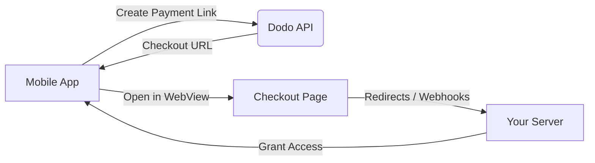

## Introduzione

Dodo Payments consente agli sviluppatori di vendere beni e servizi digitali nelle app iOS, gestendo aspetti complessi come la conformità fiscale, la conversione di valuta e i pagamenti. Questa guida completa dettaglia come integrare Dodo Payments nella tua app iOS, specificamente per strumenti SaaS, abbonamenti a contenuti e utilità digitali.

## Panoramica

Dodo Payments funge da **Merchant of Record (MoR)**, gestendo aspetti critici della tua attività digitale:

<Tabs>
{/* LOCKED_PATTERN_7b95db5ad22ff10e01a4218d7aa6d6be */}
- Riscossione e versamento delle imposte (IVA, GST e altre imposte regionali)
- Pagamenti globali secondo le policy e i metodi di pagamento locali
- Conversione valuta e cambio
- Chargeback e prevenzione delle frodi
- Fatturazione e ricevute per il cliente finale
- Conformità alle normative regionali
</Tab>

{/* LOCKED_PATTERN_da399a11cc5287c02436800c294d28be */}
- Un'API unificata per piattaforme web e mobile
- Supporto per check-out in-app (UPI, carte, portafogli, BNPL)
- Supporto globale per payout (Payoneer, Wise, bonifici bancari locali)
- Dashboard di analisi e reportistica
- Elaborazione dei pagamenti sicura
</Tab>
</Tabs>

## Casi d'uso

<CardGroup cols={2}>
{/* LOCKED_PATTERN_25273516451e819dcf5729a5b31c3fb9 */}
- Accesso a contenuti o funzionalità premium
- Fatturazione ricorrente con opzioni flessibili, prove gratuite, proporzionalità o upgrade e downgrade
</Card>

{/* LOCKED_PATTERN_032df751886a698341277e548837215d */}
- Accesso pay-per-course
- Pacchetti di contenuti raggruppati
- Licenze a vita o rinnovabili
- Integrazione del monitoraggio dei progressi
</Card>

{/* LOCKED_PATTERN_88cb7887605391efc00e89ceac393617 */}
- Acquisti una tantum (PDF, musica, strumenti)
- Consegna di asset digitali
- Gestione delle chiavi di licenza
</Card>

{/* LOCKED_PATTERN_53b689678a845fbab7f78be1484fe51d */}
- Abbonamenti Software-as-a-Service
- Fatturazione basata sull'utilizzo
- Piani per team e aziende
</Card>
</CardGroup>

## Flusso di integrazione

Puoi integrare Dodo Payments nella tua app utilizzando la nostra soluzione di checkout ospitato o browser in-app.

### Passaggi di integrazione

<Steps>
{/* LOCKED_PATTERN_eaf7186d297d5feae774885072c1deff */}
Il processo inizia con l'app mobile che crea un link di pagamento interagendo con l'API Dodo.
</Step>

{/* LOCKED_PATTERN_b32fbf0225071fa4e66b7da8eafe9ef9 */}
L'API Dodo risponde fornendo un URL di checkout all'app mobile.
</Step>

{/* LOCKED_PATTERN_d976b5e50a0a8a20a8206d907f16914f */}
L'app mobile quindi apre questo URL di checkout all'interno di una WebView, conducendo l'utente alla pagina di checkout.
</Step>

{/* LOCKED_PATTERN_44d5bb8ba746348cda77bbdfc76b7fa5 */}
Al completamento del processo di checkout, la pagina di checkout comunica con il tuo server tramite redirect o webhook.
</Step>

{/* LOCKED_PATTERN_5f4ad8be947cf24adc5f501029294d3c */}
Infine, il tuo server concede l'accesso al contenuto o al servizio acquistato, completando il ciclo della transazione nell'app mobile.
</Step>
</Steps>

{/* LOCKED_PATTERN_b9b6430ebe2f8c301db006aee204f66d */}
Per una guida completa per sviluppatori, esplora la nostra Guida all'integrazione mobile.
</Card>

## Disponibilità Regionale

Dodo Payments consente flussi alternativi di acquisto in-app solo nelle regioni dell'App Store in cui Apple consente esplicitamente pagamenti esterni, o dove un regolatore o un'ordinanza del tribunale lo impone.

### Regioni Supportate

<AccordionGroup>
{/* LOCKED_PATTERN_2d6a072cfe841357c870b65ab28b5291 */}
Supportato nella misura consentita dagli ordini giudiziari in corso e dalle linee guida aggiornate di Apple.

- Disponibile in base a specifiche disposizioni imposte dai tribunali
- Soggetto alla conformità di Apple ai requisiti legali
- Deve seguire le linee guida di implementazione di Apple
</Accordion>

{/* LOCKED_PATTERN_4ec7a4d0b0e955daa950f2acd6b96083 */}
Supportato tramite i Termini Alternativi UE di Apple e l'Autorizzazione all'Acquisto Esterno.

- Abilitato tramite i Termini Alternativi UE di Apple
- Richiede l'approvazione dell'Autorizzazione all'Acquisto Esterno
- Deve conformarsi ai requisiti del Digital Markets Act dell'UE
</Accordion>

{/* LOCKED_PATTERN_6bb22099c6c9aa7ba0a1c7dba319d124 */}
Supportato tramite l'Autorizzazione all'Acquisto Esterno di StoreKit per i binari esclusivi per la Corea.

- Disponibile tramite l'Autorizzazione all'Acquisto Esterno di StoreKit
- Richiede un pacchetto app specifico per la Corea
- Deve conformarsi alla legge sulle telecomunicazioni coreana
</Accordion>
</AccordionGroup>

<Warning>
Rivedi sempre e conformati agli specifici obblighi regionali di Apple e ai requisiti di App Store Connect prima di abilitare Dodo Payments per qualsiasi vetrina. L'utilizzo di flussi di pagamento alternativi in regioni non supportate può portare al rifiuto o alla rimozione dell'app.
</Warning>

<Note>
Per alcuni modelli di business - come i servizi o certe categorie di contenuti - Apple potrebbe non richiedere affatto l'utilizzo dell'acquisto in-app (IAP). Dodo Payments supporta anche questi modelli. Verifica sempre la classificazione della tua app e le linee guida più recenti di Apple per determinare se l'IAP è obbligatorio per il tuo caso d'uso.
</Note>

### Scopri di più

Per una suddivisione dettagliata delle politiche globali, dei precedenti legali e degli approcci strategici per bypassare le commissioni dell'App Store, consulta la nostra guida completa:

{/* LOCKED_PATTERN_4c4ef7dc147bdbe9f5385b01ed7a302b */}
Scopri dove e come puoi implementare legalmente flussi di pagamento alternativi, con indicazioni regionali aggiornate e consigli sulla conformità.
</Card>