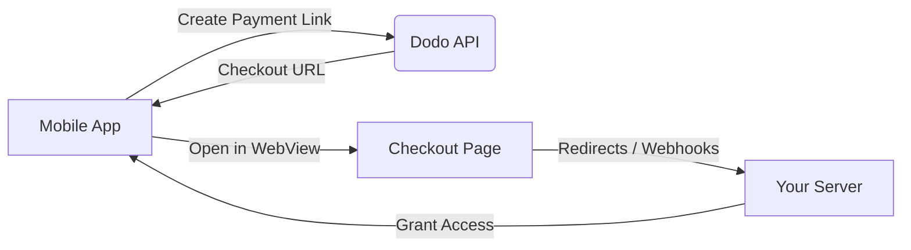

## Introduzione

Dodo Payments consente agli sviluppatori di vendere beni e servizi digitali nelle app iOS, gestendo aspetti complessi come la conformità fiscale, la conversione di valuta e i pagamenti. Questa guida completa dettaglia come integrare Dodo Payments nella tua app iOS, specificamente per strumenti SaaS, abbonamenti a contenuti e utilità digitali.

## Panoramica

Dodo Payments funge da **Merchant of Record (MoR)**, gestendo aspetti critici della tua attività digitale:

<Tabs>
<Tab title="Cosa Gestiamo">
- Raccolta e versamento delle tasse (IVA, GST e altre tasse regionali)
- Pagamenti globali secondo le politiche e i metodi di pagamento locali
- Conversione di valuta e cambio estero
- Chargeback e prevenzione delle frodi
- Fatturazione e ricevute per il cliente finale
- Conformità alle normative regionali
</Tab>

<Tab title="Cosa Ottieni">
- Un'API unificata per piattaforme web e mobili
- Supporto per pagamenti in-app (UPI, carte, portafogli, BNPL)
- Supporto per pagamenti globali (Payoneer, Wise, bonifici bancari locali)
- Dashboard di analisi e reportistica
- Elaborazione dei pagamenti sicura
</Tab>
</Tabs>

## Casi d'uso

<CardGroup cols={2}>
<Card title="Abbonamenti" icon="repeat">
- Accesso a contenuti o funzionalità premium
- Fatturazione ricorrente con opzioni flessibili, prove gratuite, proration o aggiornamenti e downgrade
</Card>

<Card title="Corsi e Apprendimento" icon="graduation-cap">
- Accesso a pagamento per corso
- Pacchetti di contenuti raggruppati
- Licenze a vita o rinnovabili
- Integrazione del tracciamento dei progressi
</Card>

<Card title="Download Digitali" icon="download">
- Acquisti una tantum (PDF, musica, strumenti)
- Consegna di asset digitali
- Gestione delle chiavi di licenza
</Card>

<Card title="Strumenti SaaS" icon="screwdriver-wrench">
- Abbonamenti Software-as-a-Service
- Fatturazione basata sull'uso
- Piani per team e imprese
</Card>
</CardGroup>

## Flusso di integrazione

Puoi integrare Dodo Payments nella tua app utilizzando la nostra soluzione di checkout ospitato o browser in-app.

### Passaggi di integrazione

<Steps>
<Step title="App Mobile a Dodo API">
Il processo inizia con l'app mobile che crea un link di pagamento interagendo con l'API Dodo.
</Step>

<Step title="Dodo API a App Mobile">
L'API Dodo risponde fornendo un URL di checkout all'app mobile.
</Step>

<Step title="App Mobile a Pagina di Checkout">
L'app mobile apre quindi questo URL di checkout all'interno di un WebView, portando l'utente alla pagina di checkout.
</Step>

<Step title="Pagina di Checkout al Tuo Server">
Al termine del processo di checkout, la pagina di checkout comunica con il tuo server tramite reindirizzamenti o webhook.
</Step>

<Step title="Tuo Server a App Mobile">
Infine, il tuo server concede accesso ai contenuti o servizi acquistati, completando il ciclo di transazione nell'app mobile.
</Step>
</Steps>

<Card title="Guida all'Integrazione Mobile" icon="mobile" href="/developer-resources/mobile-integration">
Per una guida completa per gli sviluppatori, esplora la nostra Guida all'Integrazione Mobile.
</Card>

## Disponibilità Regionale

Dodo Payments consente flussi alternativi di acquisto in-app solo nelle regioni dell'App Store in cui Apple consente esplicitamente pagamenti esterni, o dove un regolatore o un'ordinanza del tribunale lo impone.

### Regioni Supportate

<AccordionGroup>
<Accordion title="Stati Uniti">
Supportato nella misura consentita dalle attuali ordinanze del tribunale e dalle linee guida aggiornate di Apple.

- Disponibile sotto specifiche disposizioni imposte dal tribunale
- Soggetto alla conformità di Apple ai requisiti legali
- Deve seguire le linee guida di implementazione di Apple
</Accordion>

<Accordion title="App Store dell'Unione Europea (UE)">
Supportato tramite i Termini Alternativi dell'UE di Apple e l'Entitlement per Acquisti Esterni.

- Abilitato tramite i Termini Alternativi dell'UE di Apple
- Richiede approvazione dell'Entitlement per Acquisti Esterni
- Deve conformarsi ai requisiti del Digital Markets Act dell'UE
</Accordion>

<Accordion title="Corea del Sud">
Supportato tramite l'Entitlement per Acquisti Esterni di StoreKit per binari solo per la Corea.

- Disponibile tramite l'Entitlement per Acquisti Esterni di StoreKit
- Richiede un binario dell'app specifico per la Corea
- Deve conformarsi alla legge sulle telecomunicazioni coreana
</Accordion>
</AccordionGroup>

<Warning>
Rivedi sempre e rispetta i diritti specifici per regione di Apple e i requisiti di App Store Connect prima di abilitare Dodo Payments per qualsiasi punto vendita. L'uso di flussi di pagamento alternativi in regioni non supportate può comportare il rifiuto o la rimozione dell'app.
</Warning>

<Note>
Per alcuni modelli di business - come servizi o determinate categorie di contenuti - Apple potrebbe non richiedere affatto l'uso di acquisti in-app (IAP). Dodo Payments supporta anche questi modelli. Verifica sempre la classificazione della tua app e le ultime linee guida di Apple per determinare se l'IAP è obbligatorio per il tuo caso d'uso.
</Note>

### Scopri di più

Per una suddivisione dettagliata delle politiche globali, dei precedenti legali e degli approcci strategici per bypassare le commissioni dell'App Store, consulta la nostra guida completa:

<Card title="Evitare le Commissioni dell'App Store e del Play Store: Un Playbook Strategico e Legale" icon="shield-check" href="/features/bypassing-app-store-fees">
Scopri dove e come puoi implementare legalmente flussi di pagamento alternativi, con indicazioni regionali aggiornate e suggerimenti per la conformità.
</Card>