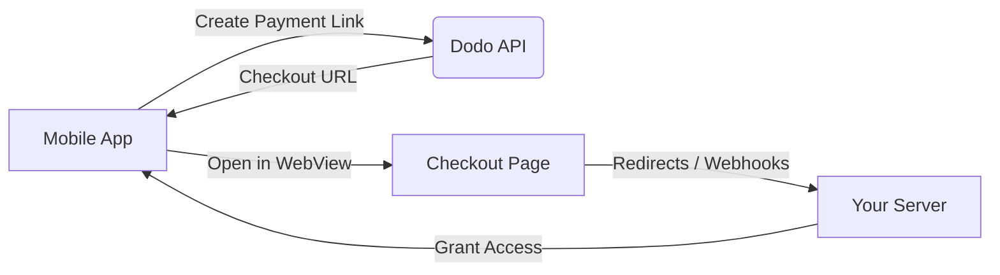

## Introduzione

Dodo Payments consente agli sviluppatori di vendere beni e servizi digitali nelle app iOS, gestendo aspetti complessi come la conformità fiscale, la conversione di valuta e i pagamenti. Questa guida completa dettaglia come integrare Dodo Payments nella tua app iOS, specificamente per strumenti SaaS, abbonamenti a contenuti e utilità digitali.

## Panoramica

Dodo Payments funge da **Merchant of Record (MoR)**, gestendo aspetti critici della tua attività digitale:

<Tabs>
<Tab title="What We Handle">
- Riscossione e versamento delle imposte (IVA, GST e altre imposte regionali)
- Pagamenti globali secondo le policy e i metodi di pagamento locali
- Conversione valuta e cambio
- Chargeback e prevenzione delle frodi
- Fatturazione e ricevute per il cliente finale
- Conformità alle normative regionali
</Tab>

<Tab title="What You Get">
- Un'API unificata per piattaforme web e mobile
- Supporto per check-out in-app (UPI, carte, portafogli, BNPL)
- Supporto globale per payout (Payoneer, Wise, bonifici bancari locali)
- Dashboard di analisi e reportistica
- Elaborazione dei pagamenti sicura
</Tab>
</Tabs>

## Casi d'uso

<CardGroup cols={2}>
<Card title="Subscriptions" icon="repeat">
- Accesso a contenuti o funzionalità premium
- Fatturazione ricorrente con opzioni flessibili, prove gratuite, proporzionalità o upgrade e downgrade
</Card>

<Card title="Courses and Learning" icon="graduation-cap">
- Accesso pay-per-course
- Pacchetti di contenuti raggruppati
- Licenze a vita o rinnovabili
- Integrazione del monitoraggio dei progressi
</Card>

<Card title="Digital Downloads" icon="download">
- Acquisti una tantum (PDF, musica, strumenti)
- Consegna di asset digitali
- Gestione delle chiavi di licenza
</Card>

<Card title="SaaS Tools" icon="screwdriver-wrench">
- Abbonamenti Software-as-a-Service
- Fatturazione basata sull'utilizzo
- Piani per team e aziende
</Card>
</CardGroup>

## Flusso di integrazione

Puoi integrare Dodo Payments nella tua app utilizzando la nostra soluzione di checkout ospitato o browser in-app.

### Passaggi di integrazione

<Steps>
<Step title="Mobile App to Dodo API">
Il processo inizia con l'app mobile che crea un link di pagamento interagendo con l'API Dodo.
</Step>

<Step title="Dodo API to Mobile App">
L'API Dodo risponde fornendo un URL di checkout all'app mobile.
</Step>

<Step title="Mobile App to Checkout Page">
L'app mobile quindi apre questo URL di checkout all'interno di una WebView, conducendo l'utente alla pagina di checkout.
</Step>

<Step title="Checkout Page to Your Server">
Al completamento del processo di checkout, la pagina di checkout comunica con il tuo server tramite redirect o webhook.
</Step>

<Step title="Your Server to Mobile App">
Infine, il tuo server concede l'accesso al contenuto o al servizio acquistato, completando il ciclo della transazione nell'app mobile.
</Step>
</Steps>

<Card title="Mobile Integration Guide" icon="mobile" href="/developer-resources/mobile-integration">
Per una guida completa per sviluppatori, esplora la nostra Guida all'integrazione mobile.
</Card>

## Disponibilità Regionale

Dodo Payments consente flussi alternativi di acquisto in-app solo nelle regioni dell'App Store in cui Apple consente esplicitamente pagamenti esterni, o dove un regolatore o un'ordinanza del tribunale lo impone.

### Regioni Supportate

<AccordionGroup>
<Accordion title="United States">
Supportato nella misura consentita dagli ordini giudiziari in corso e dalle linee guida aggiornate di Apple.

- Disponibile in base a specifiche disposizioni imposte dai tribunali
- Soggetto alla conformità di Apple ai requisiti legali
- Deve seguire le linee guida di implementazione di Apple
</Accordion>

<Accordion title="European Union (EU) App Store">
Supportato tramite i Termini Alternativi UE di Apple e l'Autorizzazione all'Acquisto Esterno.

- Abilitato tramite i Termini Alternativi UE di Apple
- Richiede l'approvazione dell'Autorizzazione all'Acquisto Esterno
- Deve conformarsi ai requisiti del Digital Markets Act dell'UE
</Accordion>

<Accordion title="South Korea">
Supportato tramite l'Autorizzazione all'Acquisto Esterno di StoreKit per i binari esclusivi per la Corea.

- Disponibile tramite l'Autorizzazione all'Acquisto Esterno di StoreKit
- Richiede un pacchetto app specifico per la Corea
- Deve conformarsi alla legge sulle telecomunicazioni coreana
</Accordion>
</AccordionGroup>

<Warning>
Rivedi sempre e conformati agli specifici obblighi regionali di Apple e ai requisiti di App Store Connect prima di abilitare Dodo Payments per qualsiasi vetrina. L'utilizzo di flussi di pagamento alternativi in regioni non supportate può portare al rifiuto o alla rimozione dell'app.
</Warning>

<Note>
Per alcuni modelli di business - come i servizi o certe categorie di contenuti - Apple potrebbe non richiedere affatto l'utilizzo dell'acquisto in-app (IAP). Dodo Payments supporta anche questi modelli. Verifica sempre la classificazione della tua app e le linee guida più recenti di Apple per determinare se l'IAP è obbligatorio per il tuo caso d'uso.
</Note>

### Scopri di più

Per una suddivisione dettagliata delle politiche globali, dei precedenti legali e degli approcci strategici per bypassare le commissioni dell'App Store, consulta la nostra guida completa:

<Card title="Bypassing App Store & Play Store Fees: A Strategic and Legal Playbook" icon="shield-check" href="/features/bypassing-app-store-fees">
Scopri dove e come puoi implementare legalmente flussi di pagamento alternativi, con indicazioni regionali aggiornate e consigli sulla conformità.
</Card>