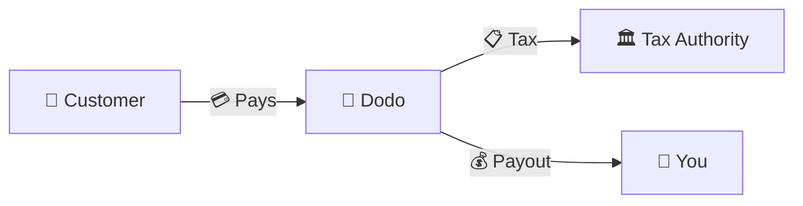
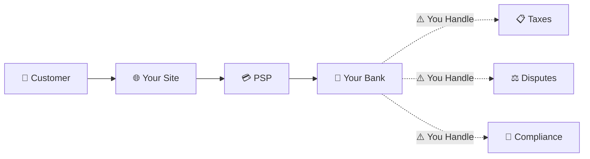
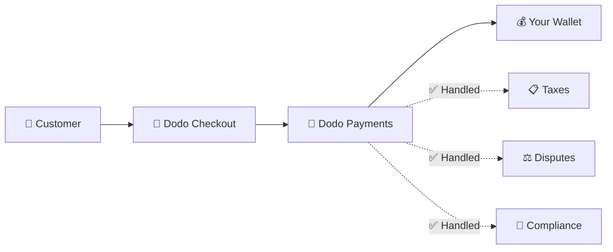
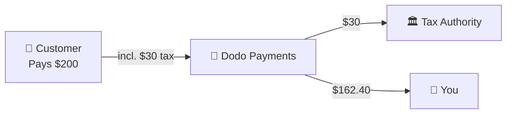

Dodo Payments opera come **Merchant of Record (MoR)** — diventiamo il venditore legale dei tuoi prodotti digitali, assumendoci la responsabilità per pagamenti, tasse, frodi e conformità, così puoi concentrarti completamente sulla costruzione del tuo prodotto.

<CardGroup cols={3}>
{/* LOCKED_PATTERN_0dfe8c9e68953181aad63120292193bb */}
Conformità fiscale gestita automaticamente
</Card>

{/* LOCKED_PATTERN_a7f32ee62695527a537b82d99f01c4bc */}
Carte, portafogli e metodi locali
</Card>

{/* LOCKED_PATTERN_cb6e35d755bb02c3f1254b1c5a9c4c73 */}
Gestiamo tutti i trasferimenti
</Card>
</CardGroup>

## Che cos'è un Merchant of Record?

Un **Merchant of Record** è l'entità legale che appare sull'estratto conto della carta di credito del tuo cliente e assume la responsabilità per la transazione. Quando utilizzi Dodo Payments come tuo MoR:

- **Noi siamo il venditore legale** — Dodo appare sugli estratti conto bancari e sulle ricevute
- **Tu sei il creatore del prodotto** — Tu costruisci, prezzi e consegni il tuo prodotto
- **Noi gestiamo il back office** — Tasse, controversie, conformità e supporto alla fatturazione
- **Tu ricevi pagamenti netti** — Entrate depositate direttamente sul tuo conto

<Note>
Considera un Merchant of Record come l'assunzione di un team finanziario globale che si occupa di fatturazione, tasse e pagamenti in ogni paese — senza che tu alzi un dito.
</Note>

## Perché utilizzare un Merchant of Record?

Vendere prodotti digitali a livello globale significa navigare tra IVA in Europa, GST in Australia, Sales Tax negli Stati Uniti e innumerevoli altri requisiti. Ogni giurisdizione ha regole, tassi, soglie e scadenze di dichiarazione diverse.

| La tua responsabilità | Senza MoR | Con Dodo come MoR |
|---------------------|:-----------:|:----------------:|
| Registrazione IVA/GST | ❌ Tu | ✅ Dodo |
| Calcolo delle Tasse | ❌ Tu | ✅ Dodo |
| Dichiarazione e Ritenuta Fiscale | ❌ Tu | ✅ Dodo |
| Responsabilità Chargeback | ❌ Tu | ✅ Dodo |
| Conformità PCI | ❌ Tu | ✅ Dodo |
| Supporto Multi-Valuta | ❌ Complesso | ✅ Integrato |
| Metodi di Pagamento Locali | ❌ Integrare Ognuno | ✅ 30+ Inclusi |

<Tip>
**Esempio**: vendere un abbonamento da €50/mese a un cliente francese?

**Senza MoR**: Registrati per l'IVA francese, addebita €60 (20% IVA), presenta dichiarazioni trimestrali francesi, gestisci audit — in francese.

**Con Dodo**: raccogliamo €60, versiamo €10 di IVA alla Francia e ti paghiamo €50 meno le commissioni. Tu scrivi il codice.
</Tip>

## PSP vs. MoR: Differenze Chiave

Comprendere la differenza tra un **Payment Service Provider** (come Stripe) e un **Merchant of Record** è essenziale.

### Payment Service Provider (PSP)

Un PSP elabora le transazioni ma ti lascia come venditore legale:

<Warning>
Con un PSP, **tu** sei responsabile della registrazione fiscale, della riscossione, della dichiarazione e del versamento in ogni giurisdizione in cui hai clienti.
</Warning>

### Merchant of Record (Dodo)

Un MoR diventa il venditore legale, gestendo la conformità end-to-end:

<Check>
Con Dodo come MoR, ci occupiamo di tasse, controversie e conformità. Ricevi pagamenti netti senza alcuna burocrazia.
</Check>

### Confronto Affiancato

| Aspetto | PSP (Stripe, ecc.) | MoR (Dodo) |
|--------|:------------------:|:----------:|
| Venditore Legale | La tua Azienda | Dodo |
| Sul Estratto Conto del Cliente | Il Tuo Nome | Dodo |
| Registrazione Fiscale | ❌ Tu | ✅ Dodo |
| Calcolo delle Tasse | ❌ Tu | ✅ Dodo |
| Ritenuta Fiscale | ❌ Tu | ✅ Dodo |
| Rischio Chargeback | ❌ Tu | ✅ Dodo |
| Conformità PCI | ❌ Tu | ✅ Dodo |
| Configurazione per il Globale | Complesso | Semplice |

<Info>
**Importante**: sia i PSP che i MoR gestiscono l'elaborazione dei pagamenti. La differenza principale è **chi è legalmente responsabile** della conformità fiscale e della responsabilità sulle transazioni.
</Info>

## Come Funziona la Conformità Fiscale

Dodo gestisce l'intero ciclo di vita fiscale automaticamente:

<Steps>
{/* LOCKED_PATTERN_9939f53f87faa28f5e85c7bcd4aa5d90 */}
Rileviamo il paese del cliente e determiniamo quali regole fiscali si applicano — IVA, GST, Sales Tax o altri requisiti locali.
</Step>

{/* LOCKED_PATTERN_70142fc485c0e1d535a43e599b490143 */}
La corretta aliquota fiscale viene calcolata in base al tipo di prodotto, alla posizione del cliente e allo status B2B/B2C. I clienti business dell’UE con numeri IVA validi ricevono automaticamente l’applicazione del reverse charge.
</Step>

{/* LOCKED_PATTERN_44b82b1d71e9f255cf562f67916ee9b7 */}
L’imposta viene mostrata chiaramente e riscossa al momento del pagamento. I clienti vedono esattamente cosa stanno pagando.
</Step>

{/* LOCKED_PATTERN_1a778e95cb3812007334c0b47194f9ac */}
Presentiamo le dichiarazioni e versiamo le imposte riscosse alle autorità competenti secondo i tempi previsti. Tu non vedi mai un modulo fiscale.
</Step>
</Steps>

## Flusso di Entrate

Ecco come si muove il denaro dal cliente al tuo conto:

### Esempio di Suddivisione dei Pagamenti

| Voce | Importo |
|-----------|-------:|
| Pagamento del Cliente | $200.00 |
| Tassa di Vendita (15% IVA) | −$30.00 |
| Commissione Piattaforma Dodo (4%) | −$8.00 |
| Elaborazione del Pagamento | −$0.60 |
| **Il Tuo Pagamento** | **$162.40** |

## Quando Scegliere MoR vs. PSP

<Tabs>
{/* LOCKED_PATTERN_1d2e428d12b1ee53f2d946d9302bede1 */}
**Dodo Payments è ideale se tu:**

- Vendi prodotti digitali, SaaS o abbonamenti
- Hai clienti in più paesi
- Vuoi evitare grattacapi legati alla registrazione fiscale
- Preferisci una conformità esternalizzata prevedibile
- Apprezzi la rapidità di ingresso sul mercato rispetto al massimo controllo
- Non vuoi gestire controversie e frodi
</Tab>

{/* LOCKED_PATTERN_9020967e8e2c9a3ebc575f4072e18e76 */}
**Un PSP potrebbe fare al caso tuo se tu:**

- Operi principalmente in un solo paese
- Hai team finanziari e di conformità interni
- Hai bisogno di controllo assoluto sull’esperienza di checkout
- Lavori con margini estremamente ridotti
- Vendi beni fisici (i MoR si concentrano sul digitale)
</Tab>
</Tabs>

<Note>
Molte aziende iniziano con un PSP e passano a un MoR mentre si espandono a livello internazionale. Dodo offre supporto alla migrazione per rendere questa transizione fluida.
</Note>

## Domande Frequenti

<AccordionGroup>
{/* LOCKED_PATTERN_03db007d1397fc75cc7c059a12f7514d */}
Dodo Payments appare come merchant. Inseriamo il riferimento al tuo prodotto/brand dove i limiti di caratteri lo consentono e i clienti ricevono ricevute dettagliate con le informazioni sul tuo prodotto.
</Accordion>

{/* LOCKED_PATTERN_14efbd55af6b9971cc9bb290118d1ce5 */}
Sì. Tu controlli prezzi, branding, consegna del prodotto e comunicazione diretta. Dodo gestisce la parte meccanica della fatturazione, ma i clienti sanno che stanno comprando da te. Il tuo brand appare in modo prominente nel checkout, nelle email e nelle fatture.
</Accordion>

{/* LOCKED_PATTERN_5e87ff5ce15f8c25ec293008878ec1c8 */}
Per le vendite B2B nell’UE, i clienti possono inserire il proprio numero IVA al checkout. Lo convalidiamo e applichiamo automaticamente il reverse charge — l’imposta viene spostata sulla dichiarazione IVA dell’acquirente invece di essere riscossa.
</Accordion>

{/* LOCKED_PATTERN_828a96aed23c294d40585d542017c689 */}
Dodo opera come soluzione completa utilizzando la nostra infrastruttura di pagamento. Questa integrazione ci permette di assumere la responsabilità fiscale e per le frodi. Stiamo lavorando per offrire in futuro un’integrazione con altri processor di pagamento.
</Accordion>

{/* LOCKED_PATTERN_7d718a1b657f28e952148f962ca6593e */}
Avvia i rimborsi dalla tua dashboard. Elaboriamo il rimborso nel metodo di pagamento e nella valuta originali del cliente. Gli importi fiscali vengono adeguati e riconciliati automaticamente.
</Accordion>

{/* LOCKED_PATTERN_dc7f113144600495109fc2c229c89f70 */}
Dodo gestisce le **tasse sulle vendite** (IVA, GST, Sales Tax) sulle transazioni dei clienti. Rimani responsabile per l’imposta sul reddito della tua azienda, l’imposta societaria e gli obblighi fiscali relativi ai pagamenti che ricevi.
</Accordion>

{/* LOCKED_PATTERN_04ec30ba2875e1ca25e9a1ae1dcc112d */}
Accettiamo pagamenti da oltre 220 paesi e regioni con espansione continua. Vedi l’elenco completo:

{/* LOCKED_PATTERN_1baa59aa331aff639990872bb61046bd */}
Visualizza tutti i 220+ paesi e regioni dove accettiamo pagamenti.
</Card>
</Accordion>
</AccordionGroup>

## Inizia

<CardGroup cols={2}>
{/* LOCKED_PATTERN_a6e00712f4bf1e0645985bccec8d5def */}
Registrati gratuitamente e accetta pagamenti globali in pochi minuti.
</Card>

{/* LOCKED_PATTERN_d858044e80838a32f52c51b21b17f5eb */}
Confronto dettagliato con esempi e casi d’uso.
</Card>

{/* LOCKED_PATTERN_4e501d9df0a1b75ab7c08a16b87219c5 */}
Scopri quali aziende supportiamo.
</Card>

{/* LOCKED_PATTERN_6053eaa23d9fa4210c02c58e94af8536 */}
Ricevi orientamento personalizzato dal nostro team.
</Card>
</CardGroup>
