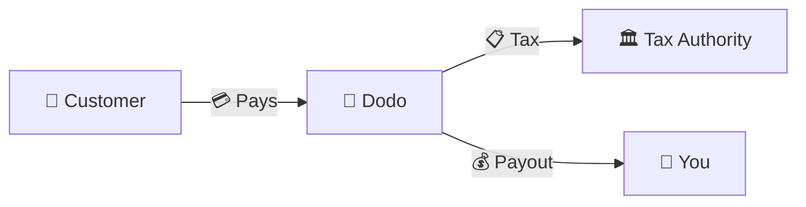
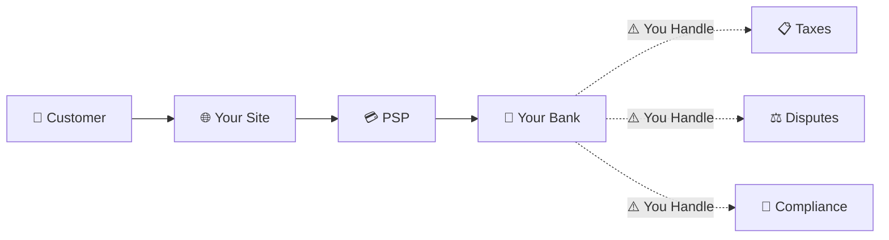
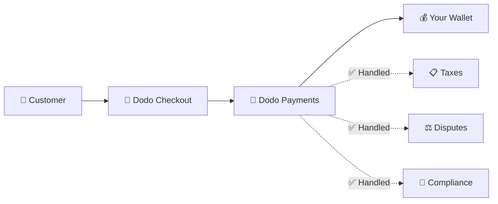
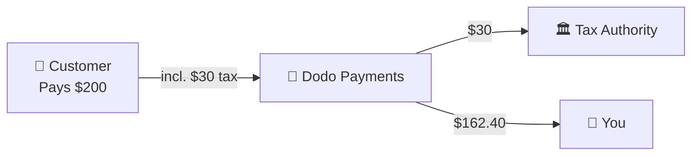

Dodo Payments opera come **Merchant of Record (MoR)** — diventiamo il venditore legale dei tuoi prodotti digitali, assumendoci la responsabilità per pagamenti, tasse, frodi e conformità, così puoi concentrarti completamente sulla costruzione del tuo prodotto.

<CardGroup cols={3}>
<Card title="220+ Regioni" icon="globe">
Conformità fiscale gestita automaticamente
</Card>

<Card title="30+ Metodi di Pagamento" icon="credit-card">
Carte, portafogli e metodi locali
</Card>

<Card title="Nessuna Dichiarazione Fiscale" icon="file-invoice">
Gestiamo tutte le ritenute
</Card>
</CardGroup>

## Che cos'è un Merchant of Record?

Un **Merchant of Record** è l'entità legale che appare sull'estratto conto della carta di credito del tuo cliente e assume la responsabilità per la transazione. Quando utilizzi Dodo Payments come tuo MoR:

- **Noi siamo il venditore legale** — Dodo appare sugli estratti conto bancari e sulle ricevute
- **Tu sei il creatore del prodotto** — Tu costruisci, prezzi e consegni il tuo prodotto
- **Noi gestiamo il back office** — Tasse, controversie, conformità e supporto alla fatturazione
- **Tu ricevi pagamenti netti** — Entrate depositate direttamente sul tuo conto

<Note>
Pensa a un Merchant of Record come all'assunzione di un team finanziario globale che gestisce fatturazione, tasse e pagamenti in ogni paese — senza che tu debba alzare un dito.
</Note>

## Perché utilizzare un Merchant of Record?

Vendere prodotti digitali a livello globale significa navigare tra IVA in Europa, GST in Australia, Sales Tax negli Stati Uniti e innumerevoli altri requisiti. Ogni giurisdizione ha regole, tassi, soglie e scadenze di dichiarazione diverse.

| La tua responsabilità | Senza MoR | Con Dodo come MoR |
|---------------------|:-----------:|:----------------:|
| Registrazione IVA/GST | ❌ Tu | ✅ Dodo |
| Calcolo delle Tasse | ❌ Tu | ✅ Dodo |
| Dichiarazione e Ritenuta Fiscale | ❌ Tu | ✅ Dodo |
| Responsabilità Chargeback | ❌ Tu | ✅ Dodo |
| Conformità PCI | ❌ Tu | ✅ Dodo |
| Supporto Multi-Valuta | ❌ Complesso | ✅ Integrato |
| Metodi di Pagamento Locali | ❌ Integrare Ognuno | ✅ 30+ Inclusi |

<Tip>
**Esempio**: Vendere un abbonamento di €50/mese a un cliente francese?

**Senza MoR**: Registrati per l'IVA francese, addebita €60 (20% IVA), presenta dichiarazioni trimestrali francesi, gestisci audit — in francese.

**Con Dodo**: Raccogliamo €60, versiamo €10 di IVA in Francia e ti paghiamo €50 meno le commissioni. Tu scrivi codice.
</Tip>

## PSP vs. MoR: Differenze Chiave

Comprendere la differenza tra un **Payment Service Provider** (come Stripe) e un **Merchant of Record** è essenziale.

### Payment Service Provider (PSP)

Un PSP elabora le transazioni ma ti lascia come venditore legale:

<Warning>
Con un PSP, **tu** sei responsabile per la registrazione fiscale, la raccolta, la dichiarazione e la ritenuta in ogni giurisdizione in cui hai clienti.
</Warning>

### Merchant of Record (Dodo)

Un MoR diventa il venditore legale, gestendo la conformità end-to-end:

<Check>
Con Dodo come MoR, gestiamo tasse, controversie e conformità. Ricevi pagamenti netti senza burocrazia.
</Check>

### Confronto Affiancato

| Aspetto | PSP (Stripe, ecc.) | MoR (Dodo) |
|--------|:------------------:|:----------:|
| Venditore Legale | La tua Azienda | Dodo |
| Sul Estratto Conto del Cliente | Il Tuo Nome | Dodo |
| Registrazione Fiscale | ❌ Tu | ✅ Dodo |
| Calcolo delle Tasse | ❌ Tu | ✅ Dodo |
| Ritenuta Fiscale | ❌ Tu | ✅ Dodo |
| Rischio Chargeback | ❌ Tu | ✅ Dodo |
| Conformità PCI | ❌ Tu | ✅ Dodo |
| Configurazione per il Globale | Complesso | Semplice |

<Info>
**Importante**: Sia i PSP che i MoR gestiscono l'elaborazione dei pagamenti. La differenza chiave è **chi è legalmente responsabile** per la conformità fiscale e la responsabilità delle transazioni.
</Info>

## Come Funziona la Conformità Fiscale

Dodo gestisce l'intero ciclo di vita fiscale automaticamente:

<Steps>
<Step title="Posizione del Cliente">
Rileviamo il paese del cliente e determiniamo quali regole fiscali si applicano — IVA, GST, Sales Tax o altri requisiti locali.
</Step>

<Step title="Calcolo delle Aliquote">
L'aliquota fiscale corretta viene calcolata in base al tipo di prodotto, alla posizione del cliente e allo stato B2B/B2C. I clienti aziendali dell'UE con numeri di IVA validi ottengono l'applicazione del reverse charge.
</Step>

<Step title="Raccolta al Checkout">
La tassa è chiaramente visualizzata e raccolta al checkout. I clienti vedono esattamente cosa stanno pagando.
</Step>

<Step title="Dichiarazione e Ritenuta">
Presentiamo le dichiarazioni e paghiamo le tasse raccolte alle autorità competenti secondo il programma. Non vedrai mai un modulo fiscale.
</Step>
</Steps>

## Flusso di Entrate

Ecco come si muove il denaro dal cliente al tuo conto:

### Esempio di Suddivisione dei Pagamenti

| Voce | Importo |
|-----------|-------:|
| Pagamento del Cliente | $200.00 |
| Tassa di Vendita (15% IVA) | −$30.00 |
| Commissione Piattaforma Dodo (4%) | −$8.00 |
| Elaborazione del Pagamento | −$0.60 |
| **Il Tuo Pagamento** | **$162.40** |

## Quando Scegliere MoR vs. PSP

<Tabs>
<Tab title="Scegli Dodo (MoR)">
**Dodo Payments è ideale se:**

- Vendi prodotti digitali, SaaS o abbonamenti
- Hai clienti in più paesi
- Vuoi evitare mal di testa per la registrazione fiscale
- Preferisci una conformità prevedibile e esternalizzata
- Valuti la velocità di immissione sul mercato rispetto al massimo controllo
- Non vuoi gestire controversie e frodi
</Tab>

<Tab title="Considera un PSP">
**Un PSP potrebbe adattarsi a te se:**

- Operi principalmente in un paese
- Hai team finanziari e di conformità interni
- Hai bisogno di controllo assoluto sull'esperienza di checkout
- Lavori con margini estremamente ridotti
- Vendi beni fisici (i MoR si concentrano sul digitale)
</Tab>
</Tabs>

<Note>
Molte aziende iniziano con un PSP e passano a un MoR man mano che si espandono a livello internazionale. Dodo offre supporto per la migrazione per rendere questa transizione senza soluzione di continuità.
</Note>

## Domande Frequenti

<AccordionGroup>
<Accordion title="Cosa appare sull'estratto conto della carta di credito del mio cliente?">
Dodo Payments appare come il merchant. Includiamo il riferimento al tuo prodotto/marchio dove i limiti di caratteri lo consentono, e i clienti ricevono ricevute dettagliate che mostrano le informazioni sul tuo prodotto.
</Accordion>

<Accordion title="Possiedo ancora la relazione con il cliente?">
Sì. Controlli i prezzi, il branding, la consegna del prodotto e la comunicazione diretta. Dodo gestisce la meccanica di fatturazione, ma i clienti sanno che stanno acquistando da te. Il tuo marchio appare in modo prominente al checkout, nelle email e nelle fatture.
</Accordion>

<Accordion title="Come funziona il reverse charge IVA B2B?">
Per le vendite B2B nell'UE, i clienti possono inserire il loro numero di IVA al checkout. Lo convalidiamo e applichiamo automaticamente il reverse charge — la tassa passa alla dichiarazione IVA dell'acquirente invece di essere raccolta.
</Accordion>

<Accordion title="Posso utilizzare il mio processore di pagamento?">
Dodo opera come una soluzione completa utilizzando la nostra infrastruttura di pagamento. Questa integrazione è ciò che ci consente di assumere la responsabilità fiscale e per frodi. Stiamo lavorando per fornire un'integrazione con altri processori di pagamento in futuro.
</Accordion>

<Accordion title="Come funzionano i rimborsi?">
Inizia i rimborsi dal tuo dashboard. Elaboriamo il rimborso nel metodo di pagamento originale del cliente e nella valuta. Gli importi fiscali vengono automaticamente regolati e riconciliati.
</Accordion>

<Accordion title="E per quanto riguarda la mia imposta sul reddito?">
Dodo gestisce **tasse sulle vendite** (IVA, GST, Sales Tax) sulle transazioni dei clienti. Rimani responsabile per l'imposta sul reddito della tua azienda, l'imposta sulle società e gli obblighi fiscali sui pagamenti che ricevi.
</Accordion>

<Accordion title="In quali paesi posso vendere?">
Accettiamo pagamenti da oltre 220 paesi e regioni con espansione continua. Vedi l'elenco completo:

<Card title="Regioni Supportate" icon="globe" href="/miscellaneous/list-of-countries-we-accept-payments-from">
Visualizza tutti i 220+ paesi e regioni in cui accettiamo pagamenti.
</Card>
</Accordion>
</AccordionGroup>

## Inizia

<CardGroup cols={2}>
<Card title="Crea Account" icon="rocket" href="https://app.dodopayments.com/signup">
Iscriviti gratuitamente e accetta pagamenti globali in pochi minuti.
</Card>

<Card title="Approfondimento MoR vs PG" icon="scale-balanced" href="/features/mor-vs-pg">
Confronto dettagliato con esempi e casi d'uso.
</Card>

<Card title="Politica di Accettazione" icon="building-shield" href="/miscellaneous/merchant-acceptance">
Scopri quali attività supportiamo.
</Card>

<Card title="Parla con Noi" icon="envelope" href="mailto:founders@dodopayments.com">
Ricevi indicazioni personalizzate dal nostro team.
</Card>
</CardGroup>
