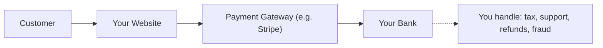
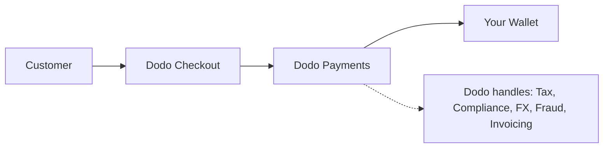

## Introduzione

Questa guida confronta il modello MoR con l'approccio tradizionale del Payment Gateway, aiutandoti a comprendere i vantaggi che Dodo Payments porta alla tua azienda.

## La Differenza Fondamentale

| Caratteristica                     | MoR (Dodo Payments)         | Payment Gateway (PG Tradizionale)           |
|------------------------------------|--------------------------------------------|--------------------------------------------|
| Venditore Legale                   | Dodo Payments (MoR)                        | La tua Azienda                             |
| Raccolta e Versamento delle Tasse  | Gestito da Dodo                            | Sei responsabile                           |
| Onere di Conformità e Regolamentazione | Dodo si assume la responsabilità          | Gestisci le leggi locali e le chargeback   |
| Valuta di Liquidazione             | USD, EUR, INR e oltre 25 altre supportate  | Dipende dal tuo conto merchant              |
| Gestione del Rischio               | Protezione integrata da frodi e chargeback | Configuri i tuoi strumenti (es. Stripe Radar) |
| Pagamenti                         | Pagamenti globali aggregati e semplificati | Diretti dal PG a te, con configurazione bancaria |

## Cosa Significa per Te

Con **Dodo come MoR**, diventiamo il venditore legale per i tuoi clienti, permettendoti di:

- Saltare la creazione di entità locali
- Evitare di gestire IVA, GST o imposta sulle vendite
- Offrire più metodi di pagamento a livello globale
- Ridurre il rischio legale
- Lanciare più rapidamente in nuovi mercati

<Note>
Immagina di vendere un abbonamento digitale a un utente in Francia. Con Dodo Payments, raccogliamo il pagamento, presentiamo l'IVA alle autorità francesi e ti inviamo il ricavo netto. Niente mal di testa fiscali. Niente avvocati. Solo crescita.
</Note>

Inoltre, il modello MoR semplifica l'intero tuo back office. In qualità di tuo MoR, Dodo gestisce la conformità PCI, la rilevazione delle frodi, la conversione delle valute e persino il supporto alla fatturazione dei clienti, liberando il tuo team per concentrarsi su prodotto e crescita.

## Confronto Visivo

**Flusso di Ricavi: Payment Gateway**

**Flusso di Ricavi: Merchant of Record (Dodo)**

## Perché È Importante per le Aziende SaaS e Digitali

Man mano che la tua azienda cresce, gestire tasse, conformità e preferenze di pagamento globali può diventare opprimente. Con un payment gateway, sei responsabile per:

- Registrazione e presentazione dell'IVA/GST in più giurisdizioni
- Gestione della conversione delle valute e delle chargeback
- Fornire checkout e metodi di pagamento localizzati

Con Dodo Payments come tuo MoR:
- Espandi a livello globale senza creare entità locali
- Le tasse vengono calcolate, raccolte e versate per tuo conto
- Accedi a una libreria di metodi di pagamento su misura per i tuoi clienti
- Agiamo come il tuo buffer legale e partner operativo

<Tip>
"Pensa a un payment gateway come a un tunnel. Ora immagina il Merchant of Record come un tunnel, un treno, un autista e il personale di biglietteria tutto in uno."
</Tip>

## Chi Dovrebbe Usare MoR?

Dodo Payments è perfetto per:
- Aziende SaaS e di prodotti digitali
- Creatori indipendenti e imprenditori solitari
- Aziende globali con clienti in oltre 100 paesi
- Aziende che non vogliono gestire tasse e conformità internamente

Se stai espandendo a livello internazionale, vendendo abbonamenti, o semplicemente vuoi ridurre i mal di testa operativi, MoR è la scelta più intelligente.

## Quando Usare Invece un Payment Gateway

Ci sono casi in cui utilizzare solo un payment gateway potrebbe avere senso:
- La tua azienda opera solo in un paese
- Hai già risorse interne per finanza e conformità
- Richiedi il controllo completo sull'esperienza di fatturazione dei clienti
- Sei molto sensibile ai costi con margini sottili su larga scala

<Note>
Per molte startup, utilizzare un gateway può essere sufficiente inizialmente - ma man mano che la complessità cresce, passare a un MoR può risparmiare tempo, ridurre il rischio e accelerare la crescita internazionale.
</Note>

## Perché Scegliere Dodo Payments

Dodo Payments offre:
- Stack di pagamenti, tasse e conformità tutto in uno
- Supporto FX in tempo reale e multi-valuta
- Accesso a oltre 30 metodi di pagamento
- Fatturazione basata su posti, abbonamenti e pagamenti una tantum
- Gestione automatizzata delle tasse in oltre 150 paesi
- Prevenzione delle frodi integrata e conformità PCI

Che tu sia un fondatore solitario o un team SaaS in crescita, Dodo semplifica le complessità della vendita a livello globale.

## Scopri di Più

<CardGroup cols={2}>
<Card title="Supporto Valuta Adattivo" icon="money-bill-wave" href="/features/adaptive-currency">
Scopri come Dodo presenta automaticamente i prezzi nelle valute locali dei tuoi clienti
</Card>

<Card title="Metodi di Pagamento Supportati" icon="credit-card" href="/features/payment-methods">
Scopri i 30+ metodi di pagamento disponibili tramite Dodo Payments
</Card>
</CardGroup>

## Pronto a Passare?

Unisciti a oltre 3.000 aziende digitali che utilizzano Dodo Payments per vendere a livello globale, senza confini o colli di bottiglia.

<CardGroup cols={2}>
<Card title="Iscriviti Gratis" icon="user-plus" href="https://app.dodopayments.com/signup">
Crea il tuo account Dodo Payments e inizia a vendere a livello globale oggi stesso
</Card>

<Card title="Parla con le Vendite" icon="envelope" href="mailto:founders@dodopayments.com">
Ricevi indicazioni personalizzate dal nostro team
</Card>
</CardGroup>

<Tip>
Lascia che Dodo si occupi delle cose difficili - così puoi concentrarti sulla creazione di un ottimo prodotto.
</Tip>