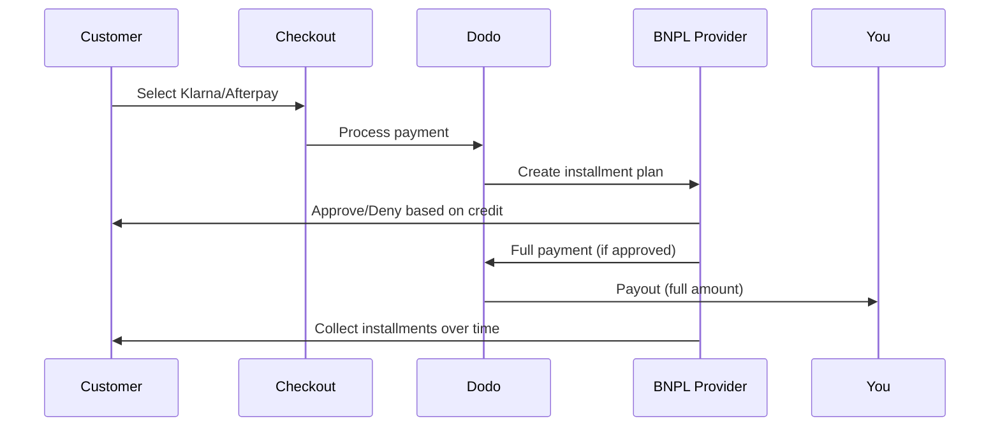

Compra Ora Paga Dopo (BNPL) consente ai clienti di suddividere gli acquisti in rate senza interessi, aumentando il valore medio degli ordini del 20-50% e i tassi di conversione del 10-30% per le transazioni idonee.

## Perché offrire BNPL?

<CardGroup cols={3}>
{/* LOCKED_PATTERN_b97f9be1eb159e011a6342413e37bd80 */}
I clienti spendono di più quando possono dilazionare i pagamenti nel tempo. Il valore medio dell'ordine aumenta dal 20 al 50%.
</Card>

{/* LOCKED_PATTERN_b8dc04ad87db956cb850399b43c82817 */}
Eliminando gli attriti nei pagamenti al checkout. I tassi di conversione migliorano dal 10 al 30% per articoli di alto valore.
</Card>

{/* LOCKED_PATTERN_e1c4683cab6a6bdfa91140cb62e2921c */}
I fornitori BNPL gestiscono il rischio di credito e la riscossione. Ricevi il pagamento completo in anticipo.
</Card>
</CardGroup>

## Fornitori Supportati

### Klarna

| Caratteristica | Dettagli |
| :------ | :------ |
| **Disponibilità** | USA + 19 paesi europei |
| **Valute** | USD, EUR, GBP, DKK, NOK, SEK, CZK, RON, PLN, CHF |
| **Minimo** | $50.01 (o equivalente) |
| **Abbonamenti** | No |

**Paesi Supportati:** Austria, Belgio, Repubblica Ceca, Danimarca, Finlandia, Francia, Germania, Grecia, Irlanda, Italia, Paesi Bassi, Norvegia, Polonia, Portogallo, Romania, Spagna, Svezia, Svizzera, Regno Unito, Stati Uniti

**Opzioni di Pagamento:**
- **Paga in 4** — Suddividi in 4 pagamenti senza interessi
- **Paga in 30 giorni** — Pagamento completo dovuto in 30 giorni
- **Finanziamento** — Piani di rateizzazione a lungo termine

### Afterpay (Clearpay)

| Caratteristica | Dettagli |
| :------ | :------ |
| **Disponibilità** | USA, Regno Unito |
| **Valute** | USD, GBP |
| **Minimo** | $50.01 (o equivalente) |
| **Abbonamenti** | No |

**Opzioni di Pagamento:**
- **Paga in 4** — 4 pagamenti senza interessi ogni 2 settimane

<Note>
Nel Regno Unito, Afterpay opera come "Clearpay" ma utilizza lo stesso tipo di API (`afterpay_clearpay`).
</Note>

### Billie

| Caratteristica | Dettagli |
| :------ | :------ |
| **Disponibilità** | Globale |
| **Valute** | GBP |
| **Minimo** | Nessuno |
| **Abbonamenti** | No |

**Informazioni su Billie:**
Billie è una soluzione B2B Compra Ora Paga Dopo che consente alle aziende di offrire termini di pagamento flessibili ai propri clienti. È progettata per transazioni business-to-business dove gli acquirenti necessitano di opzioni di pagamento basate su fattura.

**Opzioni di Pagamento:**
- **Pagamento Fattura** — Paga entro i termini di pagamento concordati
- **Termini Flessibili** — Programmi di pagamento favorevoli per le aziende

## Configurazione

### Tipi di Metodi API

| Tipo | Fornitore |
| :--- | :------- |
| `klarna` | Klarna |
| `afterpay_clearpay` | Afterpay / Clearpay |
| `billie` | Billie (B2B) |

### Esempio

```javascript
const session = await client.checkoutSessions.create({
  product_cart: [{ product_id: 'prod_123', quantity: 1 }],
  allowed_payment_method_types: [
    'klarna',
    'afterpay_clearpay',
    'credit',
    'debit'
  ],
  customer: {
    email: 'customer@example.com',
    name: 'Jane Smith'
  },
  billing_address: {
    country: 'US',
    zipcode: '10001'
  },
  return_url: 'https://example.com/success'
});
```

<Warning>
Includi sempre `credit` e `debit` come fallback. Non tutti i clienti sono idonei a BNPL e le transazioni inferiori a $50,01 non saranno qualificate.
</Warning>

## Importo Minimo della Transazione

**Sia Klarna che Afterpay richiedono un minimo di $50.01 USD** (o equivalente nelle valute supportate).

Le transazioni sotto questa soglia:
- Le opzioni BNPL non appariranno al checkout
- Non viene sollevato alcun errore — le opzioni semplicemente non vengono visualizzate
- I pagamenti con carta rimangono disponibili

Questo è comportamento previsto. Non includere BNPL in `allowed_payment_method_types` per prodotti sotto i $50.

## Come Funzionano le Rate



**Punti Chiave:**
- Ricevi il **pagamento completo in anticipo** dal fornitore di BNPL
- Il fornitore di BNPL gestisce **il rischio di credito e le riscossioni**
- Il cliente paga direttamente il fornitore in **4 rate** (tipicamente)
- **Nessun chargeback** da fallimenti delle rate — il rischio è del fornitore

## Test

### Dati di Test per Klarna

Usa questi dettagli in modalità test:

| Campo | Approvato | Negato |
| :---- | :------- | :----- |
| **Data di Nascita** | 07-10-1970 | 07-10-1970 |
| **Nome** | Test | Test |
| **Cognome** | Persona-us | Persona-us |
| **Email** | customer@email.us | customer+denied@email.us |
| **Indirizzo** | Amsterdam Ave | Amsterdam Ave |
| **Numero Civico** | 509 | 509 |
| **Città** | New York | New York |
| **Stato** | New York | New York |
| **Codice Postale** | 10024-3941 | 10024-3941 |
| **Telefono** | +13106683312 | +13106354386 |

<Note>
La transazione deve essere almeno di $50 affinché Klarna appaia come opzione.
</Note>

### Test di Afterpay

<Steps>
{/* LOCKED_PATTERN_50be67b06aca0719749c0148b14ededb */}
Scegli Afterpay nel checkout e clicca Paga.
</Step>

{/* LOCKED_PATTERN_e69c9723c2cfe705ec0ec6c279278116 */}
Usa qualsiasi email valida e indirizzo di spedizione.
</Step>

{/* LOCKED_PATTERN_f705651ecb928289d18b7053fe33fbad */}
Per testare un fallimento: chiudi la finestra modale di Afterpay nella pagina di reindirizzamento. Lo stato del pagamento passa a `requires_payment_method`.
</Step>
</Steps>

## Migliori Pratiche

<AccordionGroup>
{/* LOCKED_PATTERN_fbd77987b33e84be7392d40b156b399b */}
BNPL funziona meglio per prodotti da $100 a $1000. La proposta di valore di "pagare nel tempo" è più convincente in questa fascia.
</Accordion>

{/* LOCKED_PATTERN_73212def30811547cb4565bbe3cf9728 */}
"4 pagamenti da $25" è più convincente di "$100 con Klarna". Mostra l'importo per ogni pagamento quando possibile.
</Accordion>

{/* LOCKED_PATTERN_b91d7612271491e0d73908c4d5f59440 */}
Sotto i $50, BNPL non appare comunque. Sotto i $100, la maggior parte dei clienti preferisce le carte. Concentrati sulla promozione di BNPL per articoli di valore più elevato.
</Accordion>

{/* LOCKED_PATTERN_09f1d72b973f5ae340cb9d61176e092c */}
I fornitori BNPL richiedono le informazioni di fatturazione per i controlli di credito. Assicurati che il tuo checkout raccolga tutti i dettagli completi dell'indirizzo.
</Accordion>

{/* LOCKED_PATTERN_40dceba4d9d5358ae7f9b7ccd887c8b1 */}
I clienti devono capire che stanno stipulando un contratto di credito con Klarna/Afterpay, non con te.
</Accordion>
</AccordionGroup>

## Limitazioni

### Nessun Abbonamento
I metodi di pagamento BNPL **non supportano pagamenti ricorrenti**. Per prodotti in abbonamento, usa carte o altri metodi compatibili con ricorrenti.

### Approvazione Basata sul Credito
I fornitori di BNPL eseguono controlli di credito istantanei. Non tutti i clienti saranno approvati. I tassi di approvazione variano in base a:
- Storia creditizia del cliente con il fornitore
- Importo della transazione
- Posizione del cliente

### Mappatura di valuta e paese

Ogni valuta è limitata alla propria regione corrispondente:

| Valuta | Paesi supportati |
| :------- | :------------------ |
| **USD** | Solo Stati Uniti |
| **EUR** | Tutti i paesi europei supportati (Austria, Belgio, Repubblica Ceca, Danimarca, Finlandia, Francia, Germania, Grecia, Irlanda, Italia, Paesi Bassi, Norvegia, Polonia, Portogallo, Romania, Spagna, Svezia, Svizzera) |
| **GBP** | Regno Unito e tutti i paesi europei supportati |

Altre valute supportate da Klarna (DKK, NOK, SEK, CZK, RON, PLN, CHF) funzionano nei rispettivi paesi.

{/* LOCKED_PATTERN_6fa96040307d68e9fa44436559d63ee8 */}
Ad esempio, una transazione in USD mostrerà le opzioni BNPL solo ai clienti negli Stati Uniti. Una transazione in EUR mostrerà le opzioni BNPL in tutti i paesi europei supportati. Una transazione in GBP mostrerà le opzioni BNPL ai clienti nel Regno Unito e in tutti i paesi europei supportati.
{/* LOCKED_PATTERN_07427f62e4e59df6149fbd24d60de439 */}

| Fornitore | Valute supportate |
| :------- | :------------------- |
| Klarna | USD, EUR, GBP, DKK, NOK, SEK, CZK, RON, PLN, CHF |
| Afterpay | USD (US), GBP (UK) |

## Risoluzione dei problemi

<AccordionGroup>
{/* LOCKED_PATTERN_4de1f796f92552e68d790659c1400cdb */}
**Verifica:**
1. L'importo della transazione è di almeno $50,01?
2. Il cliente si trova in un paese supportato?
3. La valuta è supportata dal fornitore BNPL?
4. Il metodo BNPL è incluso in `allowed_payment_method_types`?

**Soluzione:** Nella maggior parte dei casi la transazione è inferiore al minimo. Verifica che l'importo soddisfi la soglia di $50,01.
</Accordion>

{/* LOCKED_PATTERN_d83228e73178d33af019cc137eea6331 */}
**Cause:**
- Storia creditizia insufficiente con il fornitore
- Troppi piani di rate attivi
- Verifica dell'identità fallita

**Soluzione:** Questo è previsto per alcuni clienti. Assicurati che siano disponibili fallback con carta. Non esporre dettagli specifici sui rifiuti.
</Accordion>

{/* LOCKED_PATTERN_b83fcfa7ee1d57953629ef78553f40c7 */}
**Causa:** il cliente non ha completato il flusso di autenticazione con il fornitore BNPL.

**Soluzione:** Il pagamento andrà in timeout e fallirà. Il cliente può riprovare o usare un metodo diverso.
</Accordion>
</AccordionGroup>

## Pagine correlate

<CardGroup cols={2}>
{/* LOCKED_PATTERN_014d7e4ef5d99df996cbbae24da710a6 */}
Vedi tutti i metodi di pagamento supportati.
</Card>

{/* LOCKED_PATTERN_15f99901a394e4ce133a078d90e6360d */}
Guida completa all'implementazione del checkout.
</Card>

{/* LOCKED_PATTERN_969f11f876a6712c92c3c11cb433bf1f */}
Tutti i dati di test per i metodi di pagamento.
</Card>

{/* LOCKED_PATTERN_0da642f750ba9399c6c82f3cf51c812c */}
Supporto valute e conversione.
</Card>
</CardGroup>