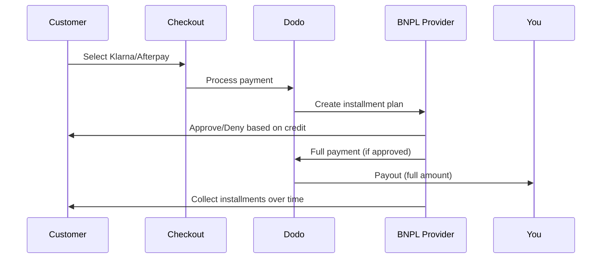

Compra Ora Paga Dopo (BNPL) consente ai clienti di suddividere gli acquisti in rate senza interessi, aumentando il valore medio degli ordini del 20-50% e i tassi di conversione del 10-30% per le transazioni idonee.

## Perché offrire BNPL?

<CardGroup cols={3}>
<Card title="Maggiore AOV" icon="chart-line">
I clienti spendono di più quando possono dilazionare i pagamenti nel tempo. Il valore medio degli ordini aumenta del 20-50%.
</Card>

<Card title="Migliore Conversione" icon="percent">
Rimuovendo la frizione nei pagamenti al checkout. I tassi di conversione migliorano del 10-30% per articoli di alto valore.
</Card>

<Card title="Zero Rischio" icon="shield-check">
I fornitori di BNPL gestiscono il rischio di credito e le riscossioni. Ricevi il pagamento completo in anticipo.
</Card>
</CardGroup>

## Fornitori Supportati

### Klarna

| Caratteristica | Dettagli |
| :------ | :------ |
| **Disponibilità** | USA + 19 paesi europei |
| **Valute** | USD, EUR, GBP, DKK, NOK, SEK, CZK, RON, PLN, CHF |
| **Minimo** | $50.01 (o equivalente) |
| **Abbonamenti** | No |

**Paesi Supportati:** Austria, Belgio, Repubblica Ceca, Danimarca, Finlandia, Francia, Germania, Grecia, Irlanda, Italia, Paesi Bassi, Norvegia, Polonia, Portogallo, Romania, Spagna, Svezia, Svizzera, Regno Unito, Stati Uniti

**Opzioni di Pagamento:**
- **Paga in 4** — Suddividi in 4 pagamenti senza interessi
- **Paga in 30 giorni** — Pagamento completo dovuto in 30 giorni
- **Finanziamento** — Piani di rateizzazione a lungo termine

### Afterpay (Clearpay)

| Caratteristica | Dettagli |
| :------ | :------ |
| **Disponibilità** | USA, Regno Unito |
| **Valute** | USD, GBP |
| **Minimo** | $50.01 (o equivalente) |
| **Abbonamenti** | No |

**Opzioni di Pagamento:**
- **Paga in 4** — 4 pagamenti senza interessi ogni 2 settimane

<Note>
Nel Regno Unito, Afterpay opera come "Clearpay" ma utilizza lo stesso tipo di API (`afterpay_clearpay`).
</Note>

### Billie

| Caratteristica | Dettagli |
| :------ | :------ |
| **Disponibilità** | Globale |
| **Valute** | GBP |
| **Minimo** | Nessuno |
| **Abbonamenti** | No |

**Informazioni su Billie:**
Billie è una soluzione B2B Compra Ora Paga Dopo che consente alle aziende di offrire termini di pagamento flessibili ai propri clienti. È progettata per transazioni business-to-business dove gli acquirenti necessitano di opzioni di pagamento basate su fattura.

**Opzioni di Pagamento:**
- **Pagamento Fattura** — Paga entro i termini di pagamento concordati
- **Termini Flessibili** — Programmi di pagamento favorevoli per le aziende

## Configurazione

### Tipi di Metodi API

| Tipo | Fornitore |
| :--- | :------- |
| `klarna` | Klarna |
| `afterpay_clearpay` | Afterpay / Clearpay |
| `billie` | Billie (B2B) |

### Esempio

```javascript
const session = await client.checkoutSessions.create({
  product_cart: [{ product_id: 'prod_123', quantity: 1 }],
  allowed_payment_method_types: [
    'klarna',
    'afterpay_clearpay',
    'credit',
    'debit'
  ],
  customer: {
    email: 'customer@example.com',
    name: 'Jane Smith'
  },
  billing_address: {
    country: 'US',
    zipcode: '10001'
  },
  return_url: 'https://example.com/success'
});
```

<Warning>
Includi sempre `credit` e `debit` come fallback. Non tutti i clienti sono idonei per BNPL, e le transazioni sotto i $50.01 non saranno qualificate.
</Warning>

## Importo Minimo della Transazione

**Sia Klarna che Afterpay richiedono un minimo di $50.01 USD** (o equivalente nelle valute supportate).

Le transazioni sotto questa soglia:
- Le opzioni BNPL non appariranno al checkout
- Non viene sollevato alcun errore — le opzioni semplicemente non vengono visualizzate
- I pagamenti con carta rimangono disponibili

Questo è un comportamento previsto. Non includere BNPL in `allowed_payment_method_types` per i prodotti sotto i $50.

## Come Funzionano le Rate



**Punti Chiave:**
- Ricevi il **pagamento completo in anticipo** dal fornitore di BNPL
- Il fornitore di BNPL gestisce **il rischio di credito e le riscossioni**
- Il cliente paga direttamente il fornitore in **4 rate** (tipicamente)
- **Nessun chargeback** da fallimenti delle rate — il rischio è del fornitore

## Test

### Dati di Test per Klarna

Usa questi dettagli in modalità test:

| Campo | Approvato | Negato |
| :---- | :------- | :----- |
| **Data di Nascita** | 07-10-1970 | 07-10-1970 |
| **Nome** | Test | Test |
| **Cognome** | Persona-us | Persona-us |
| **Email** | customer@email.us | customer+denied@email.us |
| **Indirizzo** | Amsterdam Ave | Amsterdam Ave |
| **Numero Civico** | 509 | 509 |
| **Città** | New York | New York |
| **Stato** | New York | New York |
| **Codice Postale** | 10024-3941 | 10024-3941 |
| **Telefono** | +13106683312 | +13106354386 |

<Note>
La transazione deve essere almeno $50 affinché Klarna appaia come opzione.
</Note>

### Test di Afterpay

<Steps>
<Step title="Seleziona Afterpay">
Scegli Afterpay al checkout e fai clic su Paga.
</Step>

<Step title="Pagamento riuscito">
Usa qualsiasi email e indirizzo di spedizione validi.
</Step>

<Step title="Autenticazione fallita">
Per testare il fallimento: chiudi il modulo Afterpay nella pagina di reindirizzamento. Lo stato del pagamento transita in `requires_payment_method`.
</Step>
</Steps>

## Migliori Pratiche

<AccordionGroup>
<Accordion title="Targetizza articoli di alto valore">
BNPL funziona meglio per prodotti da $100 a $1000. La proposta di valore di "paga nel tempo" è più convincente in questo intervallo.
</Accordion>

<Accordion title="Mostra gli importi delle rate">
"4 pagamenti da $25" è più convincente di "$100 con Klarna". Visualizza l'importo per pagamento quando possibile.
</Accordion>

<Accordion title="Non forzare BNPL per prodotti di basso valore">
Sotto $50, BNPL non apparirà comunque. Sotto $100, la maggior parte dei clienti preferisce le carte. Concentrati sulla promozione di BNPL su articoli di alto valore.
</Accordion>

<Accordion title="Raccogli l'indirizzo di fatturazione">
I fornitori di BNPL richiedono informazioni di fatturazione per i controlli di credito. Assicurati che il tuo checkout raccolga i dettagli completi dell'indirizzo.
</Accordion>

<Accordion title="Imposta aspettative chiare">
I clienti devono capire che stanno entrando in un accordo di credito con Klarna/Afterpay, non con te.
</Accordion>
</AccordionGroup>

## Limitazioni

### Nessun Abbonamento
I metodi di pagamento BNPL **non supportano pagamenti ricorrenti**. Per prodotti in abbonamento, usa carte o altri metodi compatibili con ricorrenti.

### Approvazione Basata sul Credito
I fornitori di BNPL eseguono controlli di credito istantanei. Non tutti i clienti saranno approvati. I tassi di approvazione variano in base a:
- Storia creditizia del cliente con il fornitore
- Importo della transazione
- Posizione del cliente

### Restrizioni di Valuta
| Fornitore | Valute |
| :------- | :--------- |
| Klarna | USD, EUR, GBP, DKK, NOK, SEK, CZK, RON, PLN, CHF |
| Afterpay | USD, GBP |

## Risoluzione dei Problemi

<AccordionGroup>
<Accordion title="BNPL non appare al checkout">
**Controlla:**
1. Importo della transazione almeno $50.01?
2. Posizione del cliente in un paese supportato?
3. Valuta supportata dal fornitore di BNPL?
4. Metodo BNPL incluso in `allowed_payment_method_types`?

**Soluzione:** La causa più comune è che la transazione è sotto il minimo. Verifica che l'importo soddisfi la soglia di $50.01.
</Accordion>

<Accordion title="Cliente negato dal fornitore di BNPL">
**Cause:**
- Storia creditizia insufficiente con il fornitore
- Troppi piani di rate attivi
- Verifica dell'identità fallita

**Soluzione:** Questo è previsto per alcuni clienti. Assicurati che le opzioni di fallback con carta siano disponibili. Non esporre motivi specifici di negazione.
</Accordion>

<Accordion title="Pagamento bloccato in attesa">
**Causa:** Il cliente non ha completato il flusso di autenticazione con il fornitore di BNPL.

**Soluzione:** Il pagamento scadrà e fallirà. Il cliente può riprovare o usare un metodo diverso.
</Accordion>
</AccordionGroup>

## Pagine Correlate

<CardGroup cols={2}>
<Card title="Panoramica dei Metodi di Pagamento" icon="credit-card" href="/features/payment-methods">
Guarda tutti i metodi di pagamento supportati.
</Card>

<Card title="Guida al Checkout" icon="book" href="/developer-resources/checkout-session">
Guida completa all'implementazione del checkout.
</Card>

<Card title="Processo di Test" icon="flask" href="/miscellaneous/testing-process">
Tutti i dati di test per i metodi di pagamento.
</Card>

<Card title="Valuta Adattiva" icon="globe" href="/features/adaptive-currency">
Supporto della valuta e conversione.
</Card>
</CardGroup>