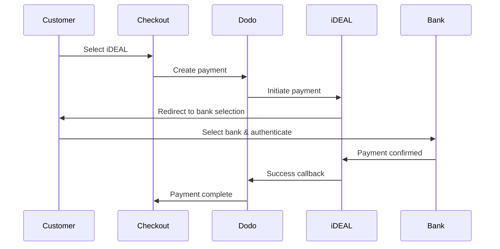

I clienti europei preferiscono fortemente i metodi di pagamento locali che si integrano con i loro sistemi bancari. Offrire questi metodi può aumentare i tassi di conversione dal 20 al 40% nei mercati di riferimento.

## Perché i Metodi di Pagamento Locali Europei?

<CardGroup cols={3}>
{/* LOCKED_PATTERN_efcf455d16a3d54177d3ce475c882342 */}
iDEAL cattura ~60% dei pagamenti online olandesi. Non offrirlo significa perdere clienti.
</Card>

{/* LOCKED_PATTERN_6b22bf3bf0cf724ac8ed217c65843a32 */}
i pagamenti autenticati dalla banca hanno tassi di frode quasi nulli e nessun chargeback.
</Card>

{/* LOCKED_PATTERN_4a1acead7202a8a596c7a76e46cacb00 */}
La maggior parte dei metodi europei fornisce conferma immediata del pagamento.
</Card>
</CardGroup>

## Metodi Supportati

| Metodo | Paese | Quota di Mercato | Valuta | Abbonamenti |
| :----- | :------ | :----------- | :------- | :-----------: |
| **iDEAL** | Paesi Bassi | ~60% | EUR | No |
| **Bancontact** | Belgio | ~50% | EUR | No |
| **EPS** | Austria | ~30% | EUR | No |
| **Multibanco** | Portogallo | ~40% | EUR | No |

## iDEAL (Paesi Bassi)

iDEAL è il metodo di pagamento online dominante nei Paesi Bassi, collegandosi direttamente a tutte le principali banche olandesi.

### Come Funziona



### Banche Supportate

Tutte le principali banche olandesi sono supportate:
- ABN AMRO
- ASN Bank
- Bunq
- ING
- Knab
- Rabobank
- RegioBank
- Revolut
- SNS
- Triodos Bank
- Van Lanschot

### Configurazione

```javascript
const session = await client.checkoutSessions.create({
  product_cart: [{ product_id: 'prod_123', quantity: 1 }],
  allowed_payment_method_types: ['ideal', 'credit', 'debit'],
  billing_currency: 'EUR',
  billing_address: {
    country: 'NL',
    zipcode: '1012JS'
  },
  return_url: 'https://example.com/success'
});
```

## Bancontact (Belgio)

Bancontact è lo schema di pagamento nazionale del Belgio, utilizzato da praticamente tutte le banche belghe per i pagamenti online.

### Caratteristiche
- Funziona con le carte di debito belghe esistenti
- Supporto per app mobile (Payconiq by Bancontact)
- Conferma del pagamento istantanea
- Nessuna registrazione aggiuntiva necessaria per i clienti

### Configurazione

```javascript
const session = await client.checkoutSessions.create({
  product_cart: [{ product_id: 'prod_123', quantity: 1 }],
  allowed_payment_method_types: ['bancontact_card', 'credit', 'debit'],
  billing_currency: 'EUR',
  billing_address: {
    country: 'BE',
    zipcode: '1000'
  },
  return_url: 'https://example.com/success'
});
```

## EPS (Austria)

EPS (Standard di Pagamento Elettronico) consente trasferimenti bancari online diretti per i clienti austriaci.

### Caratteristiche
- Integrazione diretta con le banche austriache
- Conferma del pagamento in tempo reale
- Alta fiducia tra i consumatori austriaci
- Nessun chargeback

### Banche Supportate

Principali banche austriache, tra cui:
- Erste Bank
- Bank Austria
- Raiffeisen
- BAWAG
- Volksbank

### Configurazione

```javascript
const session = await client.checkoutSessions.create({
  product_cart: [{ product_id: 'prod_123', quantity: 1 }],
  allowed_payment_method_types: ['eps', 'credit', 'debit'],
  billing_currency: 'EUR',
  billing_address: {
    country: 'AT',
    zipcode: '1010'
  },
  return_url: 'https://example.com/success'
});
```

## Multibanco (Portogallo)

Multibanco è la rete interbancaria del Portogallo, che offre sia pagamenti online che pagamenti tramite ATM.

### Opzioni di Pagamento

1. **Online Banking** — Trasferimento diretto tramite internet banking
2. **Pagamento ATM** — Il cliente riceve un riferimento per pagare presso qualsiasi ATM Multibanco
3. **Mobile Banking** — Pagamento tramite app bancarie

### Come Funziona il Pagamento ATM

Per i pagamenti ATM, i clienti ricevono un riferimento per il pagamento:

```
Entity: 12345
Reference: 123 456 789
Amount: €50.00
Expiry: 24 hours
```

Il cliente può pagare presso qualsiasi ATM portoghese o tramite online banking utilizzando questo riferimento.

### Configurazione

```javascript
const session = await client.checkoutSessions.create({
  product_cart: [{ product_id: 'prod_123', quantity: 1 }],
  allowed_payment_method_types: ['multibanco', 'credit', 'debit'],
  billing_currency: 'EUR',
  billing_address: {
    country: 'PT',
    zipcode: '1000-001'
  },
  return_url: 'https://example.com/success'
});
```

<Note>
I pagamenti Multibanco presso ATM possono avere un ritardo tra il checkout e il pagamento effettivo. Monitora i webhook per la conferma del pagamento.
</Note>

## Tipi di Metodi API

| Tipo | Metodo | Paese |
| :--- | :----- | :------ |
| `ideal` | iDEAL | Netherlands |
| `bancontact_card` | Bancontact | Belgium |
| `eps` | EPS | Austria |
| `multibanco` | Multibanco | Portugal |

## Checkout Europeo Multi-Paese

Per le aziende che servono più paesi europei, includere tutti i metodi regionali:

```javascript
const session = await client.checkoutSessions.create({
  product_cart: [{ product_id: 'prod_123', quantity: 1 }],
  allowed_payment_method_types: [
    'ideal',           // Netherlands
    'bancontact_card', // Belgium
    'eps',             // Austria
    'multibanco',      // Portugal
    'credit',          // Fallback
    'debit'            // Fallback
  ],
  billing_currency: 'EUR',
  return_url: 'https://example.com/success'
});
```

Dodo mostra automaticamente solo i metodi rilevanti in base alla posizione del cliente. Un cliente olandese vedrà iDEAL; un cliente belga vedrà Bancontact.

## Testing

I metodi di pagamento europei possono essere testati in modalità sandbox. Il flusso di test simula il processo di autenticazione bancaria.

<Steps>
{/* LOCKED_PATTERN_540056f13df545529727751bb5b93f77 */}
Usa le tue chiavi API di test di Dodo Payments.
</Step>

{/* LOCKED_PATTERN_7920d15f7caeeea70ea62bd0d8d57403 */}
Imposta il paese dell'indirizzo di fatturazione per abbinarlo al metodo di pagamento:
- `NL` per iDEAL
- `BE` per Bancontact
- `AT` per EPS
- `PT` per Multibanco
</Step>

{/* LOCKED_PATTERN_69cef9ebb6025284f3e6858b286f99d9 */}
Segui il flusso di autenticazione bancaria simulato nell'ambiente di test.
</Step>
</Steps>

## Migliori Pratiche

<AccordionGroup>
{/* LOCKED_PATTERN_6e39e352c5d82a18aefb4abc54215eac */}
Se vendi a clienti olandesi, includi iDEAL. Non farlo è come non accettare Visa negli Stati Uniti — perderai vendite significative.
</Accordion>

{/* LOCKED_PATTERN_9c635a5b2c09ad8acceb0ae222fad819 */}
I metodi di pagamento europei richiedono l'EUR. Assicurati che i tuoi prezzi supportino transazioni in Euro.
</Accordion>

{/* LOCKED_PATTERN_5a50cae3439b9921374aaa8c0461b4a3 */}
Tutti i metodi europei comportano reindirizzamenti ai siti bancari. Assicurati che la gestione degli URL di ritorno sia robusta e consideri gli utenti che abbandonano il flusso.
</Accordion>

{/* LOCKED_PATTERN_3a32b87fb89df99c7fb6cbcd532fcd01 */}
Non tutti i clienti europei hanno accesso a questi metodi regionali (turisti, espatriati, ecc.). Includi sempre `credit` e `debit` come fallback.
</Accordion>

{/* LOCKED_PATTERN_f4321c6674f862219007fe7c6201edc2 */}
I pagamenti Multibanco presso ATM possono richiedere ore per completarsi. Non bloccare l'evasione in attesa del pagamento immediato — usa i webhook per la conferma asincrona.
</Accordion>
</AccordionGroup>

## Risoluzione dei problemi

<AccordionGroup>
{/* LOCKED_PATTERN_ccd66af742dc9530dea0480f544f049c */}
**Verifica:**
1. Il paese di fatturazione del cliente corrisponde al paese del metodo?
2. La valuta è impostata su EUR?
3. Il metodo è incluso in `allowed_payment_method_types`?

**Soluzione:** I metodi europei sono strettamente regionali. Un cliente con paese di fatturazione `DE` (Germania) non vedrà iDEAL, che è riservato all'Olanda.
</Accordion>

{/* LOCKED_PATTERN_e65da29a30abf8b0bab16429c0abbf51 */}
**Cause:**
- Cliente ha annullato durante l'autenticazione bancaria
- Il sistema di autenticazione della banca non disponibile temporaneamente
- Cliente ha inserito credenziali errate

**Soluzione:** Il cliente dovrebbe riprovare. Se persiste, suggerisci di provare un altro metodo di pagamento.
</Accordion>

{/* LOCKED_PATTERN_6ec718ef8b359d908bb220922e56ef7a */}
**Cause:**
- Cliente ha chiuso il browser durante il reindirizzamento bancario
- Problemi di rete durante l'autenticazione
- URL di ritorno mal configurato

**Soluzione:** Verifica che l'URL di ritorno sia corretto e accessibile. Assicurati che gestisca sia stati di successo che insuccesso.
</Accordion>

{/* LOCKED_PATTERN_fc8a3a43e2635e2d30bc6ced94d88e30 */}
**Causa:** Il cliente ha ricevuto il riferimento di pagamento ma non ha ancora pagato.

**Soluzione:** Questo è previsto per i pagamenti ATM. Attendi la conferma tramite webhook. Il riferimento scade generalmente in 24-72 ore.
</Accordion>
</AccordionGroup>

## Conformità PSD2

Tutti i metodi di pagamento europei sono conformi alle normative PSD2 (Direttiva sui Servizi di Pagamento 2):

- **Autenticazione Forte del Cliente (SCA)** — Integrata nel flusso di autenticazione bancaria
- **Comunicazione Sicura** — Tutti i dati trasmessi tramite canali sicuri
- **Protezione dei Consumatori** — Completa conformità ai diritti dei consumatori dell'UE

## Pagine Correlate

<CardGroup cols={2}>
{/* LOCKED_PATTERN_014d7e4ef5d99df996cbbae24da710a6 */}
Vedi tutti i metodi di pagamento supportati.
</Card>

{/* LOCKED_PATTERN_0da642f750ba9399c6c82f3cf51c812c */}
Supporto valutario e conversione automatica.
</Card>

{/* LOCKED_PATTERN_15f99901a394e4ce133a078d90e6360d */}
Guida completa all'implementazione del checkout.
</Card>

<Card title="Webhooks" icon="webhook" href="/developer-resources/webhooks">
Gestisci le conferme dei pagamenti in modo asincrono.
</Card>
</CardGroup>