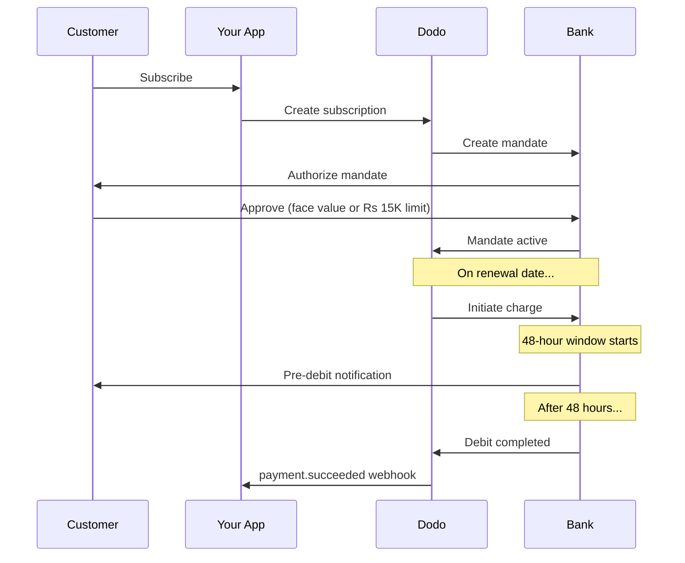

L'India dispone di un'infrastruttura di pagamento unica dominata da UPI (oltre il 60% delle transazioni digitali) e dalle carte Rupay. Dodo Payments supporta entrambi con piena conformità RBI per i mandati di sottoscrizione.

## Perché i metodi di pagamento indiani sono importanti

<CardGroup cols={3}>
<Card title="UPI Dominance" icon="mobile">
UPI elabora oltre 10 miliardi di transazioni al mese. Molti clienti indiani non dispongono di carte internazionali.
</Card>

<Card title="Low Transaction Costs" icon="indian-rupee-sign">
UPI ha commissioni di transazione quasi nulle. Ottimo per transazioni ad alto volume e valore inferiore.
</Card>

<Card title="Subscription Support" icon="repeat">
A differenza della maggior parte dei metodi di pagamento alternativi, UPI e Rupay supportano i pagamenti ricorrenti tramite mandati RBI.
</Card>
</CardGroup>

## Metodi supportati

| Metodo | Tipo | Abbonamenti | Importo minimo |
| :----- | :--- | :-----------: | :--------- |
| **UPI Collect** | QR code / VPA | Sì* | ₹1 |
| **Rupay Credit** | Carta | Sì* | ₹1 |
| **Rupay Debit** | Carta | Sì* | ₹1 |

*Gli abbonamenti richiedono mandati conformi alla RBI con regole speciali di elaborazione.

## Configurazione

### Tipi di metodo API

| Tipo | Descrizione |
| :--- | :---------- |
| `upi_collect` | UPI tramite QR code o inserimento VPA |
| `credit` | Carte di credito incluse Rupay |
| `debit` | Carte di debito incluse Rupay |

### Esempio: checkout focalizzato sull'India

```javascript
const session = await client.checkoutSessions.create({
  product_cart: [{ product_id: 'prod_123', quantity: 1 }],
  allowed_payment_method_types: [
    'upi_collect',
    'credit',
    'debit'
  ],
  billing_currency: 'INR',
  customer: {
    email: 'customer@example.in',
    name: 'Priya Sharma',
    phone_number: '+919876543210'
  },
  billing_address: {
    country: 'IN',
    zipcode: '560001'
  },
  return_url: 'https://example.com/success'
});
```

### Requisiti per UPI

Perché UPI appaia al checkout:
1. **Paese di fatturazione** deve essere l'India (`IN`)
2. **Valuta** deve essere INR
3. Per i commercianti non indiani: **Adaptive Currency** deve essere abilitata

<Warning>
Se sei un commerciante non indiano e Adaptive Currency non è abilitata, UPI non sarà disponibile per i tuoi clienti.
</Warning>

## Abbonamenti con mandati RBI

Gli abbonamenti con metodi di pagamento indiani operano sotto le normative RBI (Reserve Bank of India) con requisiti unici.

### Come funzionano i mandati RBI



### Tipi di mandati

| Importo dell'abbonamento | Tipo di mandato | Limite |
| :------------------ | :----------- | :---- |
| **Inferiore a Rs 15.000** | Mandato on-demand | Rs 15.000 |
| **Rs 15.000 o superiore** | Mandato ad importo fisso | Importo esatto dell'abbonamento |

**Importante per modifiche ai piani:** se un upgrade comporta una quota superiore al limite del mandato esistente, l'addebito verrà annullato e il cliente dovrà ri-autorizzare.

### Il ritardo di elaborazione di 48 ore

Questa è la differenza più importante rispetto ai pagamenti con carta internazionali:

<Steps>
<Step title="Charge Initiated (Day 0)">
Alla data di rinnovo programmata, Dodo avvia l'addebito con la banca.
</Step>

<Step title="Pre-Debit Notification">
Il cliente riceve una notifica dalla propria banca circa il prossimo addebito.
</Step>

<Step title="48-Hour Window">
Il cliente può annullare il mandato durante questo periodo tramite la propria app bancaria.
</Step>

<Step title="Debit Completed (~48-51 hours)">
Dopo 48 ore (più fino a 3 ore aggiuntive per l'elaborazione bancaria), i fondi vengono addebitati.
</Step>

<Step title="Webhook Sent">
Il webhook `payment.succeeded` viene inviato dopo l'addebito effettivo, non all'avvio.
</Step>
</Steps>

<Warning>
**Non concedere benefici all'inizio dell'addebito.** Attendi il webhook `payment.succeeded`, che arriva circa 48-51 ore dopo la data di addebito programmata.
</Warning>

### Gestire la finestra di 48 ore

```javascript
// DON'T do this:
async function handleSubscriptionRenewal(subscription) {
  // ❌ Bad: Granting access immediately when charge is initiated
  grantPremiumAccess(subscription.customer_id);
}

// DO this:
async function handlePaymentWebhook(event) {
  if (event.type === 'payment.succeeded') {
    // ✅ Good: Only grant access after payment is confirmed
    grantPremiumAccess(event.data.customer_id);
  }
  
  if (event.type === 'payment.failed') {
    // Handle failed payment (mandate cancelled, insufficient funds)
    revokePremiumAccess(event.data.customer_id);
  }
}
```

### Eventi webhook per abbonamenti indiani

| Evento | Quando | Azione |
| :---- | :--- | :----- |
| `subscription.active` | Mandato autorizzato | Registra l'inizio dell'abbonamento |
| `payment.succeeded` | ~48h dopo la data dell'addebito | Concedi/prosegui l'accesso |
| `payment.failed` | Addebito non riuscito | Notifica il cliente, sospendi l'accesso |
| `subscription.on_hold` | Pagamento non riuscito | Richiedi l'aggiornamento del metodo di pagamento |
| `subscription.active` | Riattivato dopo il pagamento | Ripristina l'accesso |

## Test

### ID di test UPI

| Stato | UPI ID |
| :----- | :----- |
| Successo | `success@upi` |
| Fallimento | `failure@upi` |

### Numeri di test delle carte indiane

| Marca | Scenario | Numero carta | Scadenza | CVV |
| :---- | :------- | :---------- | :----- | :-- |
| Visa | Successo | `4576238912771450` | 06/32 | 123 |
| Visa | Rifiutata | `4706131211212123` | 06/32 | 123 |
| Mastercard | Successo | `5409162669381034` | 06/32 | 123 |
| Mastercard | Rifiutata | `5105105105105100` | 06/32 | 123 |

## Migliori pratiche

<AccordionGroup>
<Accordion title="Plan for the 48-hour delay">
Progetta la tua applicazione per gestire il divario tra l'inizio dell'addebito e il pagamento effettivo. Considera:
- Periodi di tolleranza per l'accesso all'abbonamento
- Comunicazione chiara ai clienti sui tempi di elaborazione
- Esecuzione basata sui webhook, non sulla data
</Accordion>

<Accordion title="Handle mandate cancellations">
I clienti possono cancellare i mandati tramite le loro app bancarie in qualsiasi momento. Monitora i webhook `subscription.on_hold` e invita i clienti a ri-sottoscrivere o aggiornare i metodi di pagamento.
</Accordion>

<Accordion title="Set appropriate mandate amounts">
Per prezzi variabili (es. basati sull'utilizzo), considera se un mandato on-demand da Rs 15.000 sia sufficiente. Se gli addebiti potrebbero superare questa soglia, i clienti dovranno ri-autorizzare.
</Accordion>

<Accordion title="Offer UPI prominently">
Per i clienti indiani, UPI dovrebbe essere l'opzione di pagamento principale. Molti utenti lo preferiscono alle carte per familiarità e minore attrito.
</Accordion>
</AccordionGroup>

## Risoluzione dei problemi

<AccordionGroup>
<Accordion title="UPI not appearing at checkout">
**Controlla:**
1. Paese di fatturazione impostato su `IN`?
2. Valuta impostata su `INR`?
3. Se commerciante non indiano: Adaptive Currency abilitata?
4. `upi_collect` incluso in `allowed_payment_method_types`?

**Soluzione:** Verifica che l'indirizzo di fatturazione abbia `country: "IN"` e `billing_currency: "INR"`.
</Accordion>

<Accordion title="Subscription charge failed after upgrade">
**Causa:** Il nuovo importo supera il limite del mandato esistente (soglia Rs 15.000).

**Soluzione:** Il cliente deve aggiornare il metodo di pagamento per stabilire un nuovo mandato con il limite corretto.
</Accordion>

<Accordion title="Subscription on hold but customer claims they didn't cancel">
**Causa:** Il cliente potrebbe aver annullato il mandato durante la finestra di 48 ore o la banca ha rifiutato l'addebito.

**Soluzione:** Il cliente deve ri-autorizzare il mandato o aggiornare il metodo di pagamento.
</Accordion>

<Accordion title="Payment deduction delayed beyond 48 hours">
**Causa:** I ritardi delle API bancarie possono estendere l'elaborazione di 2-3 ore aggiuntive.

**Soluzione:** Questo è previsto. Progetta il sistema per gestire ritardi variabili fino a circa 51 ore in totale.
</Accordion>

<Accordion title="Mandate cancelled but subscription still active">
**Causa:** Caso limite nelle normative RBI — la cancellazione del mandato durante la finestra di elaborazione non annulla immediatamente l'abbonamento.

**Soluzione:** Il prossimo addebito fallirà e l'abbonamento passerà a `on_hold`. Monitora i webhook per `payment.failed`.
</Accordion>
</AccordionGroup>

## Pagine correlate

<CardGroup cols={2}>
<Card title="Payment Methods Overview" icon="credit-card" href="/features/payment-methods">
Vedi tutti i metodi di pagamento supportati.
</Card>

<Card title="Subscriptions" icon="repeat" href="/features/subscription">
Documentazione completa sugli abbonamenti, inclusi i mandati RBI.
</Card>

<Card title="Webhooks" icon="webhook" href="/developer-resources/webhooks">
Gestione dei webhook per gli eventi di pagamento.
</Card>

<Card title="Testing Process" icon="flask" href="/miscellaneous/testing-process">
Tutti i dati di test, inclusi ID UPI e carte indiane.
</Card>
</CardGroup>