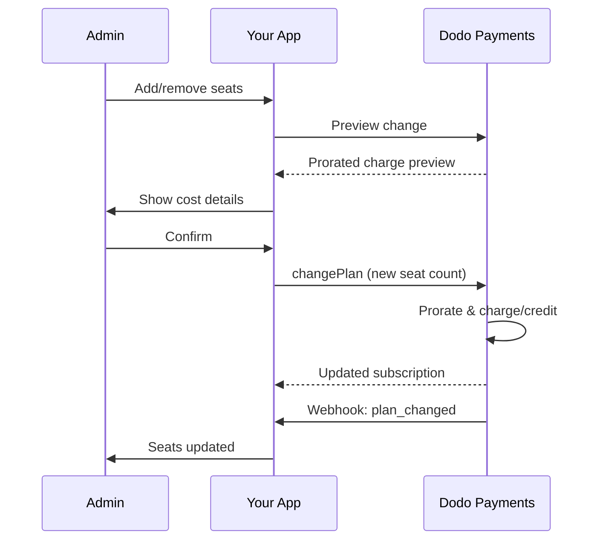

<Info>
La fatturazione basata sui posti consente di addebitare i clienti in base al numero di utenti, membri del team o licenze necessarie. È il modello di prezzo standard per strumenti di collaborazione di team, software enterprise e prodotti SaaS B2B.
</Info>

<CardGroup cols={2}>
<Card title="Implementation Tutorial" icon="code" href="/developer-resources/seat-based-pricing">
  Guida passo dopo passo con esempi di codice.
</Card>

<Card title="Add-ons Documentation" icon="puzzle" href="/features/addons">
  Scopri il sistema di componenti aggiuntivi che alimenta la fatturazione basata sui posti.
</Card>

<Card title="Subscription Management" icon="repeat" href="/features/subscription">
  Gestisci abbonamenti basati sui posti e modifiche dei piani.
</Card>

<Card title="Webhooks" icon="bell" href="/developer-resources/webhooks/intents/subscription">
  Traccia i cambiamenti dei posti con i webhook delle sottoscrizioni.
</Card>
</CardGroup>

---

## Cos'è la Fatturazione Basata sui Posti?

La fatturazione basata sui posti (nota anche come tariffazione per utente o per posto) addebita ai clienti in base al numero di utenti che accedono al tuo prodotto. Invece di una tariffa fissa, il prezzo scala con la dimensione del team.

### Casi d'Uso Comuni

| Settore | Esempio | Modello di Prezzo |
|----------|---------|---------------|
| Collaborazione di Team | Slack, Notion, Asana | Per utente attivo/mese |
| Strumenti per Sviluppatori | GitHub, GitLab, Jira | Per posto/mese |
| Software CRM | Salesforce, HubSpot | Per licenza utente |
| Strumenti di Design | Figma, Canva | Per posto editor |
| Software di Sicurezza | 1Password, Okta | Per utente/mese |
| Videoconferenze | Zoom, Teams | Per licenza host |

### Vantaggi della Tariffazione Basata sui Posti

**Per la Tua Azienda:**
- I ricavi crescono naturalmente man mano che i clienti crescono
- Prezzi prevedibili che i clienti possono pianificare
- Chiara via di aggiornamento da individuale a team a aziendale
- Maggiore valore nel tempo man mano che i team si espandono

**Per i Tuoi Clienti:**
- Pagano solo per ciò che usano
- Facile da comprendere e prevedere i costi
- Flessibilità per aggiungere/rimuovere utenti secondo necessità
- Prezzi equi che corrispondono alla dimensione del team

---

## Come Funziona la Fatturazione Basata sui Posti in Dodo Payments

Dodo Payments implementa la fatturazione basata sui posti utilizzando il sistema di **Add-on**. Ecco come funziona:

### Panoramica dell'Architettura

Un abbonamento Team Pro costa $99/mese e include 5 posti. Se hai più di 5 utenti, paghi $15/mese aggiuntivi per ogni posto extra.

Ad esempio, se il tuo team necessita di 15 posti:
- Piano base: $99/mese (include 5 posti)
- Add-on: 10 posti extra × $15/mese = $150/mese
- Costo mensile totale: $99 + $150 = $249 per 15 posti

### Componenti Chiave

| Componente | Scopo | Esempio |
|-----------|---------|---------|
| Prodotto Base | Abbonamento principale con posti inclusi | "Piano Team - $99/mese (5 posti inclusi)" |
| Add-on per Posto | Addebito per posto per utenti aggiuntivi | "Posto Extra - $15/mese ciascuno" |
| Quantità | Numero di posti aggiuntivi acquistati | 10 posti extra |

---

## Strategie di Prezzo

Scegli la strategia di prezzo basata sui posti che si adatta alla tua azienda:

### Strategia 1: Base + Add-on per Posto

Includi un numero fisso di posti nel piano base, addebita per i posti aggiuntivi.

**Esempio:**

```
Starter Plan: $49/month
├── Includes: 3 seats
├── Extra seats: $10/month each
└── 8 total seats = $49 + (5 × $10) = $99/month
```

**Ideale per:** Prodotti in cui piccoli team possono funzionare con l'offerta base.

### Strategia 2: Prezzo Puro per Posto

Addebita una tariffa fissa per posto senza tariffa base.

**Esempio:**

```
Per User: $12/month
├── 5 users = $60/month
├── 20 users = $240/month
└── 100 users = $1,200/month
```

**Implementazione:** Imposta il prezzo del piano base a $0, utilizza solo l'add-on per posto.

**Ideale per:** Prezzi semplici e trasparenti; modelli basati sull'uso.

### Strategia 3: Prezzo per Posto a Tiers

Piani base diversi con tariffe per posto diverse.

**Esempio:**

```
Starter: $0/month base + $15/seat
├── Lower features, higher per-seat cost

Professional: $99/month base + $10/seat
├── More features, lower per-seat cost

Enterprise: $499/month base + $7/seat
└── All features, volume discount on seats
```

**Implementazione:** Crea prodotti separati per ciascun livello con prezzi di add-on diversi.

**Ideale per:** Incoraggiare gli aggiornamenti a livelli superiori; vendite aziendali.

### Strategia 4: Pacchetti di Posti

Vendi posti in pacchetti piuttosto che singolarmente.

**Esempio:**

```
5-Seat Pack: $50/month ($10/seat)
10-Seat Pack: $80/month ($8/seat)
25-Seat Pack: $175/month ($7/seat)
```

**Implementazione:** Crea più add-on per diverse dimensioni dei pacchetti.

**Ideale per:** Semplificare le decisioni di acquisto; incoraggiare impegni più grandi.

---

## Configurare la Fatturazione Basata sui Posti

### Passo 1: Pianifica la Tua Tariffazione

Prima dell'implementazione, definisci la tua struttura di prezzo:

<Steps>
<Step title="Define Base Plan">
Decidi cosa includere nell'abbonamento base:
- Prezzo base (può essere $0 per un puro modello per posto)
- Numero di posti inclusi
- Funzionalità disponibili a questo livello
</Step>

<Step title="Set Seat Pricing">
Determina il costo per posto aggiuntivo:
- Prezzo per ogni posto addizionale
- Eventuali sconti per volume (tramite più componenti aggiuntivi)
- Numero massimo di posti consentiti (se applicabile)
</Step>

<Step title="Consider Billing Frequency">
Allinea il prezzo dei posti con il tuo ciclo di fatturazione:
- Abbonamenti mensili → addebiti mensili per i posti
- Abbonamenti annuali → addebiti annuali per i posti (spesso scontati)
</Step>
</Steps>

### Passo 2: Crea l'Add-on per Posto

Nel tuo dashboard di Dodo Payments:

1. Naviga a **Prodotti** → **Add-On**
2. Clicca su **Crea Add-On**
3. Configura l'add-on:

| Campo | Valore | Note |
|-------|-------|-------|
| Nome | "Posto Aggiuntivo" o "Membro del Team" | Nome chiaro e user-friendly |
| Descrizione | "Aggiungi un altro membro del team al tuo spazio di lavoro" | Spiega cosa ottengono i clienti |
| Prezzo | Il tuo prezzo per posto | es. $10.00 |
| Valuta | Corrispondi al tuo prodotto base | Deve essere la stessa valuta |
| Categoria Fiscale | Stessa del prodotto base | Garantisce una gestione fiscale coerente |

<Tip>
Crea nomi descrittivi per gli add-on che abbiano senso sulle fatture. "Posto aggiuntivo per il team" è più chiaro di "Add-on posto" per i clienti che rivedono i loro addebiti.
</Tip>

### Passo 3: Crea l'Abbonamento Base

Crea il tuo prodotto di abbonamento:

1. Naviga a **Prodotti** → **Crea Prodotto**
2. Seleziona **Abbonamento**
3. Configura prezzi e dettagli
4. Nella sezione **Add-On**, allega il tuo add-on per posto

### Passo 4: Collega l'Add-on al Prodotto

Collega l'add-on per posto al tuo abbonamento:

1. Modifica il tuo prodotto di abbonamento
2. Scorri fino alla sezione **Add-On**
3. Clicca su **Aggiungi Add-On**
4. Seleziona il tuo add-on per posto
5. Salva le modifiche

<Check>
Il tuo prodotto di abbonamento ora supporta la tariffazione basata sui posti. I clienti possono acquistare qualsiasi quantità di posti aggiuntivi durante il checkout.
</Check>

---

## Gestire i Posti

### Aggiungere Posti a Nuovi Abbonamenti

Quando crei una sessione di checkout, specifica la quantità di posti:

```typescript
const session = await client.checkoutSessions.create({
  product_cart: [{
    product_id: 'prod_team_plan',
    quantity: 1,
    addons: [{
      addon_id: 'addon_seat',
      quantity: 10  // 10 additional seats
    }]
  }],
  customer: { email: 'admin@company.com' },
  return_url: 'https://yourapp.com/success'
});
```

### Modificare il Numero di Posti su Abbonamenti Esistenti

Utilizza l'API Change Plan per regolare i posti:

```typescript
// Add 5 more seats to existing subscription
await client.subscriptions.changePlan('sub_123', {
  product_id: 'prod_team_plan',
  quantity: 1,
  proration_billing_mode: 'prorated_immediately',
  addons: [{
    addon_id: 'addon_seat',
    quantity: 15  // New total: 15 additional seats
  }]
});
```

### Rimuovere Posti

Per ridurre il numero di posti, specifica la quantità inferiore:

```typescript
// Reduce from 15 to 8 additional seats
await client.subscriptions.changePlan('sub_123', {
  product_id: 'prod_team_plan',
  quantity: 1,
  proration_billing_mode: 'difference_immediately',
  addons: [{
    addon_id: 'addon_seat',
    quantity: 8  // Reduced to 8 additional seats
  }]
});
```

### Rimuovere Tutti i Posti Aggiuntivi

Passa un array vuoto di add-on per rimuovere tutti gli add-on:

```typescript
// Remove all additional seats, keep only base plan seats
await client.subscriptions.changePlan('sub_123', {
  product_id: 'prod_team_plan',
  quantity: 1,
  proration_billing_mode: 'difference_immediately',
  addons: []  // Removes all add-ons
});
```

---

## Ripartizione per Modifiche ai Posti

Quando i clienti aggiungono o rimuovono posti a metà ciclo, la ripartizione determina come vengono fatturati.



### Modalità di Prorata

| Modalità | Aggiunta dei posti | Rimozione dei posti |
|------|-------------|----------------|
| `prorated_immediately` | Addebita i giorni restanti del ciclo | Accredito per i giorni inutilizzati |
| `difference_immediately` | Addebita il prezzo pieno del posto | Accredito applicato ai rinnovi futuri |
| `full_immediately` | Addebita il prezzo pieno del posto, resetta il ciclo di fatturazione | Nessun accredito |

### Esempi di Prorata

**Scenario: ciclo di fatturazione di 15 giorni rimanenti, aggiunta di 5 posti a $10/posto**

<Tabs>
<Tab title="prorated_immediately">

```
Prorated charge = ($10 × 5 seats) × (15 days / 30 days)
                = $50 × 0.5
                = $25 immediate charge
```

Il cliente paga $25 ora, poi $50/mese al rinnovo.
</Tab>

<Tab title="difference_immediately">

```
Immediate charge = $10 × 5 seats = $50
```

Il cliente paga l'intero importo di $50 ora, indipendentemente dalla posizione del ciclo.
</Tab>

<Tab title="full_immediately">

```
Immediate charge = Full subscription + add-ons
Billing cycle resets to today
```

Il cliente paga l'intero importo, inizia un nuovo ciclo di fatturazione.
</Tab>
</Tabs>

**Scenario: rimozione di 3 posti a metà ciclo con prorated_immediately**

```
Current: Team Plan ($99/month) + 10 extra seats × $10/seat = $199/month
Change: Remove 3 seats (10 → 7 extra seats) on day 20 of 30-day cycle
Remaining: 10 days

Credit for removed seats:
  = ($10 × 3 seats) × (10 days / 30 days)
  = $30 × 0.333
  = $10.00 credit

→ $10.00 credit added to subscription
→ Next renewal: $99 + (7 × $10) = $169.00/month
→ Credit auto-applies: $169.00 − $10.00 = $159.00 on next invoice
```

<Tip>
**Scelta di una modalità di prorata per le modifiche dei posti**: usa `prorated_immediately` per una fatturazione equa basata sui giorni quando i team regolano frequentemente i posti. Usa `difference_immediately` per una matematica più semplice che addebita o accredita il prezzo pieno del posto. Consulta la [Guida alla Prorata](/developer-resources/subscription-upgrade-downgrade#proration-modes) per confronti dettagliati.
</Tip>

### Anteprima prima della modifica

Esegui sempre un'anteprima della prorata prima di apportare modifiche:

```typescript
const preview = await client.subscriptions.previewChangePlan('sub_123', {
  product_id: 'prod_team_plan',
  quantity: 1,
  proration_billing_mode: 'prorated_immediately',
  addons: [{ addon_id: 'addon_seat', quantity: 20 }]
});

console.log('Immediate charge:', preview.immediate_charge.summary);
// Show customer: "Adding 5 seats will cost $25 today"
```

---

## Monitorare i posti con i webhook

Monitora le variazioni dei posti ascoltando i webhook delle sottoscrizioni:

### Eventi rilevanti

| Evento | Quando viene attivato | Caso d'uso |
|-------|----------------|----------|
| `subscription.active` | Nuova sottoscrizione attivata | Provisiona i posti iniziali |
| `subscription.plan_changed` | Posti aggiunti/rimossi | Aggiorna il conteggio dei posti nella tua app |
| `subscription.renewed` | Sottoscrizione rinnovata | Conferma che il numero di posti sia invariato |
| `subscription.cancelled` | Sottoscrizione cancellata | Deprovisiona tutti i posti |

### Esempio di handler per webhook

```typescript
app.post('/webhooks/dodo', async (req, res) => {
  const event = req.body;

  switch (event.type) {
    case 'subscription.active':
      // New subscription - provision seats
      const seats = calculateTotalSeats(event.data);
      await provisionSeats(event.data.customer_id, seats);
      break;

    case 'subscription.plan_changed':
      // Seats changed - update access
      const newSeats = calculateTotalSeats(event.data);
      await updateSeatCount(event.data.subscription_id, newSeats);
      break;

    case 'subscription.cancelled':
      // Subscription cancelled - deprovision
      await deprovisionAllSeats(event.data.subscription_id);
      break;
  }

  res.json({ received: true });
});

function calculateTotalSeats(subscriptionData) {
  const baseSeats = 5;  // Included in plan
  const addonSeats = subscriptionData.addons?.reduce(
    (total, addon) => total + addon.quantity, 0
  ) || 0;
  return baseSeats + addonSeats;
}
```

---

## Applicare i limiti dei posti

La tua applicazione deve far rispettare i limiti dei posti. Dodo Payments tiene traccia della fatturazione, ma tu controlli l'accesso.

### Strategie di enforcement

<Tabs>
<Tab title="Hard Limit">
Impedisci rigorosamente di aggiungere utenti oltre il conteggio dei posti.

```typescript
async function inviteUser(teamId: string, email: string) {
  const team = await getTeam(teamId);
  const subscription = await getSubscription(team.subscriptionId);
  const totalSeats = calculateTotalSeats(subscription);
  const usedSeats = await countTeamMembers(teamId);

  if (usedSeats >= totalSeats) {
    throw new Error('No seats available. Please upgrade your plan.');
  }

  await sendInvitation(teamId, email);
}
```

</Tab>

<Tab title="Soft Limit with Warning">
Consenti il superamento con un avviso e un periodo di grazia.

```typescript
async function inviteUser(teamId: string, email: string) {
  const team = await getTeam(teamId);
  const { totalSeats, usedSeats } = await getSeatInfo(team);

  if (usedSeats >= totalSeats) {
    // Allow but flag for billing
    await flagOverage(teamId, usedSeats - totalSeats + 1);
    await notifyAdmin(team.adminEmail, 'You have exceeded your seat limit');
  }

  await sendInvitation(teamId, email);
}
```

</Tab>

<Tab title="Auto-Upgrade">
Aggiungi automaticamente posti quando viene raggiunto il limite.

```typescript
async function inviteUser(teamId: string, email: string) {
  const team = await getTeam(teamId);
  const { totalSeats, usedSeats, subscriptionId } = await getSeatInfo(team);

  if (usedSeats >= totalSeats) {
    // Automatically add a seat
    await client.subscriptions.changePlan(subscriptionId, {
      product_id: team.productId,
      quantity: 1,
      proration_billing_mode: 'prorated_immediately',
      addons: [{ addon_id: 'addon_seat', quantity: totalSeats - baseSeats + 1 }]
    });

    await notifyAdmin(team.adminEmail, 'A new seat was added to your plan');
  }

  await sendInvitation(teamId, email);
}
```

</Tab>
</Tabs>

---

## Modelli avanzati

### Tipologie di posti diverse

Offri tipi di posti diversi con prezzi differenti:

```
Full Seats: $20/month - Full access to all features
View-Only Seats: $5/month - Read-only access
Guest Seats: $0/month - Limited external collaborator access
```

**Implementazione:** crea add-on separati per ciascun tipo di posto.

```typescript
const session = await client.checkoutSessions.create({
  product_cart: [{
    product_id: 'prod_team_plan',
    quantity: 1,
    addons: [
      { addon_id: 'addon_full_seat', quantity: 10 },
      { addon_id: 'addon_viewer_seat', quantity: 25 },
      { addon_id: 'addon_guest_seat', quantity: 50 }
    ]
  }]
});
```

### Sconti annuali sui posti

Offri prezzi scontati annuali per i posti:

```
Monthly: $15/seat/month
Annual: $12/seat/month (20% savings)
```

**Implementazione:** crea prodotti separati per i piani mensili e annuali con prezzi diversi per gli add-on.

### Requisiti minimi di posti

Richiedi un numero minimo di posti per determinati piani:

```typescript
async function validateSeatCount(planId: string, seatCount: number) {
  const minimums = {
    'prod_starter': 1,
    'prod_team': 5,
    'prod_enterprise': 25
  };

  if (seatCount < minimums[planId]) {
    throw new Error(`${planId} requires at least ${minimums[planId]} seats`);
  }
}
```

---

## Best Practice

### Best practice di prezzo

- **Comunicazione chiara**: mostra il prezzo per posto in modo evidente sulla pagina dei prezzi
- **Posti inclusi**: considera l'inclusione di alcuni posti nel prezzo base per ridurre l'attrito
- **Sconti per volume**: offri tariffe per posto inferiori per team più grandi per conquistare clienti enterprise
- **Incentivi annuali**: sconta i piani annuali per migliorare il cash flow e la retention

### Best practice tecniche

- **Cache dei conteggi dei posti**: memorizza localmente i conteggi dei posti dell'abbonamento per evitare chiamate API ad ogni richiesta
- **Sincronizzazione regolare**: sincronizza periodicamente il conteggio locale con Dodo Payments tramite API
- **Gestione dei fallimenti**: se una modifica dei posti fallisce, mostra messaggi di errore chiari e opzioni di ripetizione
- **Audit trail**: registra tutte le modifiche dei posti per dispute sulla fatturazione e conformità

### Best practice per l'esperienza utente

- **Feedback in tempo reale**: mostra immediatamente l'impatto sui costi quando si regolano i posti
- **Passaggi di conferma**: richiedi una conferma prima delle modifiche di fatturazione
- **Trasparenza della prorata**: spiega chiaramente gli addebiti prorata prima di applicarli
- **Downgrade semplici**: non rendere difficile ridurre i posti (costruisce fiducia)

---

## Risoluzione dei problemi

<AccordionGroup>
<Accordion title="Seat count mismatch between app and billing">
**Sintomo**: la tua app mostra un conteggio dei posti diverso da quello dell'abbonamento.

**Cause**:
- Webhook non ricevuto o elaborato
- Condizione di race durante la modifica dei posti
- Dati cache non aggiornati

**Soluzioni**:
1. Implementa handler per webhook per `subscription.plan_changed`
2. Aggiungi un pulsante "Sincronizza con la fatturazione" che recuperi l'abbonamento corrente
3. Imposta TTL della cache per garantire aggiornamenti regolari
</Accordion>

<Accordion title="Proration charges unexpected">
**Sintomo**: cliente confuso dall'importo addebitato a metà ciclo.

**Cause**:
- Modalità di prorata non comunicata chiaramente
- Il cliente non ha visto l'anteprima prima di confermare

**Soluzioni**:
1. Usa sempre `previewChangePlan` prima di apportare modifiche
2. Mostra un dettaglio chiaro: "Aggiungere X posti = $Y oggi (prorata per Z giorni)"
3. Documenta la tua politica di prorata nel centro assistenza
</Accordion>

<Accordion title="Add-on not appearing in checkout">
**Sintomo**: add-on per posti non disponibile durante il checkout.

**Cause**:
- Add-on non collegato al prodotto
- Add-on archiviato o eliminato
- Disallineamento di valuta tra prodotto e add-on

**Soluzioni**:
1. Verifica che l'add-on sia collegato nelle impostazioni del prodotto
2. Controlla lo stato dell'add-on nella dashboard Add-On
3. Assicurati che le valute corrispondano esattamente
</Accordion>

<Accordion title="Cannot reduce seats below current usage">
**Sintomo**: il cliente vuole ridurre i posti ma ha utenti assegnati.

**Soluzioni**:
1. Mostra quali utenti devono essere rimossi prima di ridurre i posti
2. Implementa un flusso di lavoro: rimuovi utenti → riduci posti
3. Considera un periodo di grazia prima di far rispettare la riduzione dei posti
</Accordion>
</AccordionGroup>

---

## Documentazione correlata

<CardGroup cols={2}>
<Card title="Seat-Based Pricing Tutorial" icon="code" href="/developer-resources/seat-based-pricing">
  Guida all'implementazione completa con codice.
</Card>

<Card title="Add-ons" icon="puzzle" href="/features/addons">
  Comprendi a fondo il sistema di add-on.
</Card>

<Card title="Plan Changes & Proration" icon="arrows-rotate" href="/developer-resources/subscription-upgrade-downgrade">
  Gestisci le modifiche alle sottoscrizioni.
</Card>

<Card title="Subscription Webhooks" icon="bell" href="/developer-resources/webhooks/intents/subscription">
  Traccia gli eventi di sottoscrizione.
</Card>
</CardGroup>
