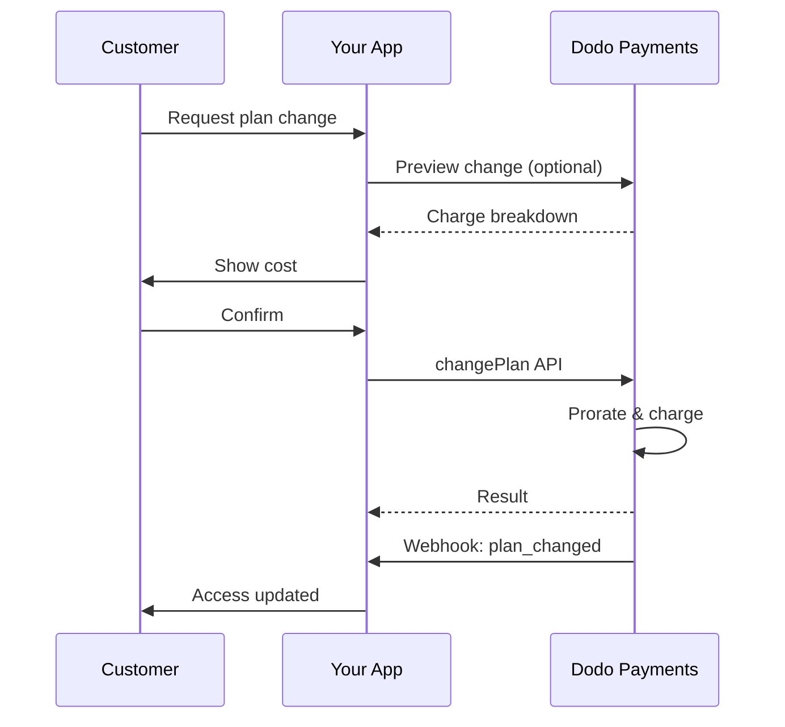
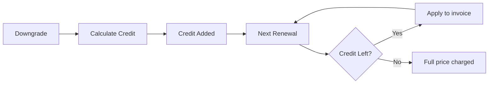

<Info>
Le sottoscrizioni ti consentono di vendere accesso continuativo con rinnovi automatici. Usa cicli di fatturazione flessibili, prove gratuite, modifiche ai piani e componenti aggiuntivi per personalizzare i prezzi per ogni cliente.
</Info>

<CardGroup cols={2}>
{/* LOCKED_PATTERN_e9c6633804a4afc7b38ae988f7ecf803 */}
Controlla le modifiche dei piani con prorata e aggiornamenti di quantità.
</Card>

{/* LOCKED_PATTERN_318ae84db3b63552ee4c3b3e5131957c */}
Autorizza un mandato ora e addebita più tardi con importi personalizzati.
</Card>

{/* LOCKED_PATTERN_97c52f9aea0902ad308a569911ddfd12 */}
Consenti ai clienti di gestire piani, fatturazione e cancellazioni.
</Card>

{/* LOCKED_PATTERN_1cd9a7ac4415843b5e77e9a9493bae92 */}
Reagisci agli eventi del ciclo di vita come creato, rinnovato e annullato.
</Card>
</CardGroup>

## Cosa Sono gli Abbonamenti?

Gli abbonamenti sono prodotti ricorrenti che i clienti acquistano secondo un programma. Sono ideali per:

- **Licenze SaaS**: App, API o accesso alla piattaforma
- **Abbonamenti**: Comunità, programmi o club
- **Contenuti digitali**: Corsi, media o contenuti premium
- **Piani di supporto**: SLA, pacchetti di successo o manutenzione

## Vantaggi Chiave

- **Entrate prevedibili**: Fatturazione ricorrente con rinnovi automatici
- **Cicli flessibili**: Mensili, annuali, intervalli personalizzati e prove
- **Agilità del piano**: Ripartizione per aggiornamenti e riduzioni
- **Add-on e posti**: Allegare aggiornamenti opzionali e quantificabili
- **Checkout senza soluzione di continuità**: Checkout ospitato e portale clienti
- **Sviluppatore-first**: API chiare per creazione, modifiche e tracciamento dell'uso

## Creazione di Abbonamenti

Crea prodotti in abbonamento nel tuo dashboard di Dodo Payments, quindi vendili tramite checkout o la tua API. Separare i prodotti dagli abbonamenti attivi ti consente di versionare i prezzi, allegare add-on e monitorare le prestazioni in modo indipendente.

### Creazione di un prodotto in abbonamento

Configura i campi nel dashboard per definire come il tuo abbonamento viene venduto, rinnovato e fatturato. Le sezioni di seguito corrispondono direttamente a ciò che vedi nel modulo di creazione.

#### Dettagli del prodotto

- **Nome del prodotto** (obbligatorio): Il nome visualizzato nel checkout, nel portale clienti e nelle fatture.
- **Descrizione del prodotto** (obbligatoria): Una chiara dichiarazione di valore che appare nel checkout e nelle fatture.
- **Immagine del prodotto** (obbligatoria): PNG/JPG/WebP fino a 3 MB. Utilizzata nel checkout e nelle fatture.
- **Marca**: Associa il prodotto a un marchio specifico per la tematizzazione e le email.
- **Categoria fiscale** (obbligatoria): Scegli la categoria (ad esempio, SaaS) per determinare le regole fiscali.

<Tip>
Scegli la categoria fiscale più accurata per garantire la corretta riscossione delle tasse per area geografica.
</Tip>

#### Prezzi

- **Tipo di Prezzo**: Scegli <b>Abbonamento</b> (questa guida). Le alternative sono Pagamento Singolo e Fatturazione Basata sull'Uso.
- **Prezzo** (obbligatorio): Prezzo ricorrente base con valuta.
- **Sconto Applicabile (%)**: Percentuale di sconto opzionale applicata al prezzo base; riflessa nel checkout e nelle fatture.
- **Ripeti pagamento ogni** (obbligatorio): Intervallo per i rinnovi, ad esempio, ogni 1 Mese. Seleziona la cadenza (mesi o anni) e la quantità.
- **Periodo di Abbonamento** (obbligatorio): Termine totale per il quale l'abbonamento rimane attivo (ad esempio, 10 Anni). Dopo la scadenza di questo periodo, i rinnovi si fermano a meno che non vengano estesi.
- **Giorni di Periodo di Prova** (obbligatorio): Imposta la durata della prova in giorni. Usa 0 per disabilitare le prove. Il primo addebito avviene automaticamente al termine della prova.
- **Seleziona add-on**: Allegare fino a 10 add-on che i clienti possono acquistare insieme al piano base.

<Warning>
Modificare i prezzi di un prodotto attivo influisce sugli acquisti futuri. Le sottoscrizioni esistenti seguono le impostazioni di cambio piano e prorata configurate.
</Warning>

<Info>
I componenti aggiuntivi sono ideali per extra quantificabili come posti o spazio di archiviazione. Puoi controllare le quantità consentite e il comportamento della prorata quando i clienti li modificano.
</Info>

#### Impostazioni avanzate

- **Prezzi inclusivi di tasse**: Visualizza i prezzi inclusivi delle tasse applicabili. Il calcolo finale delle tasse varia comunque in base alla posizione del cliente.
- **Genera chiavi di licenza**: Emissione di una chiave unica a ciascun cliente dopo l'acquisto. Vedi la guida sulle <a href="/features/license-keys">Chiavi di Licenza</a>.
- **Consegna di prodotti digitali**: Consegna automatica di file o contenuti dopo l'acquisto. Scopri di più in <a href="/features/digital-product-delivery">Consegna di Prodotti Digitali</a>.
- **Metadati**: Allegare coppie chiave-valore personalizzate per tagging interno o integrazioni client. Vedi <a href="/api-reference/metadata">Metadati</a>.

<Tip>
Usa i metadati per memorizzare identificatori dal tuo sistema (es. accountId) in modo da poter riconciliare eventi e fatture successivamente.
</Tip>

## Prove di Abbonamento

Le prove consentono ai clienti di accedere agli abbonamenti senza pagamento immediato. Il primo addebito avviene automaticamente al termine della prova.

### Configurazione delle Prove

Imposta **Trial Period Days** nella sezione prezzi del prodotto (usa `0` per disabilitare). Puoi sovrascriverlo durante la creazione delle sottoscrizioni:

```typescript
// Via subscription creation
const subscription = await client.subscriptions.create({
  customer_id: 'cus_123',
  product_id: 'prod_monthly',
  trial_period_days: 14  // Overrides product's trial period
});

// Via checkout session
const session = await client.checkoutSessions.create({
  product_cart: [{ product_id: 'prod_monthly', quantity: 1 }],
  subscription_data: { trial_period_days: 14 }
});
```

<Warning>
Il valore `trial_period_days` deve essere compreso tra 0 e 10.000 giorni.
</Warning>

### Rilevamento dello Stato della Prova

<Warning>
Attualmente non esiste un campo diretto per rilevare lo stato della prova. La seguente è una soluzione alternativa che richiede la richiesta dei pagamenti, il che è inefficiente. Stiamo lavorando a una soluzione più efficiente.
</Warning>

Per determinare se un abbonamento è in prova, recupera l'elenco dei pagamenti per l'abbonamento. Se c'è esattamente un pagamento con importo 0, l'abbonamento è in periodo di prova:

```typescript
const subscription = await client.subscriptions.retrieve('sub_123');
const payments = await client.payments.list({
  subscription_id: subscription.subscription_id
});

// Check if subscription is in trial
const isInTrial = payments.items.length === 1 && 
                  payments.items[0].total_amount === 0;
```

### Aggiornamento del Periodo di Prova

Estendi la prova aggiornando `next_billing_date`:

```typescript
await client.subscriptions.update('sub_123', {
  next_billing_date: '2025-02-15T00:00:00Z'  // New trial end date
});
```

<Warning>
Non puoi impostare `next_billing_date` su un tempo passato. La data deve essere nel futuro.
</Warning>

## Modifiche ai Piani di Abbonamento

Le modifiche ai piani ti consentono di aggiornare o ridurre gli abbonamenti, regolare le quantità o migrare a prodotti diversi. Ogni modifica attiva un addebito immediato in base alla modalità di ripartizione che selezioni.

<Tip>
Puoi cambiare i piani di sottoscrizione e aggiornare la prossima data di fatturazione direttamente dalla dashboard Dodo Payments. Questo offre un modo rapido per modificare le sottoscrizioni in risposta a richieste di supporto clienti, upgrade promozionali o migrazioni di piano senza effettuare chiamate API.
</Tip>

<Tip>
**Abilita i cambi piano self-service:** Vuoi che i clienti possano effettuare upgrade o downgrade delle proprie sottoscrizioni tramite il Customer Portal? Aggiungi i tuoi prodotti di sottoscrizione a una Product Collection e attiva "Allow Subscription Updates" nelle impostazioni di sottoscrizione.
</Tip>



{/* LOCKED_PATTERN_cbe0de1faffb3a1f552c6ce10c001527 */}
  Raggruppa i prodotti correlati in collezioni per abilitare percorsi di upgrade/downgrade fluidi nel Customer Portal.
</Card>

### Modalità di prorata

Scegli come vengono fatturati i clienti quando cambiano piano:

<Info>
**Confronto rapido delle tre modalità di prorata:**

| | `prorated_immediately` | `difference_immediately` | `full_immediately` |
|---|---|---|---|
| **Upgrade** | Addebito proporzionale per i giorni rimanenti | Viene addebitata l'intera differenza di prezzo | Viene addebitato l'intero prezzo del nuovo piano |
| **Downgrade** | Credito proporzionale per i giorni rimanenti | L'intera differenza di prezzo come credito | Nessun credito, addebito completo |
| **Ciclo di fatturazione** | Rimane invariato | Rimane invariato | Si resetta a oggi |
| **Ideale per** | Fatturazione equa basata sul tempo | Semplici cambi di livello | Ripristino del ciclo di fatturazione |
</Info>

#### `prorated_immediately`
Addebita un importo proporzionale in base al tempo rimanente nell'attuale ciclo di fatturazione. Ideale per una fatturazione equa che tiene conto del tempo inutilizzato.

```typescript
await client.subscriptions.changePlan('sub_123', {
  product_id: 'prod_pro',
  quantity: 1,
  proration_billing_mode: 'prorated_immediately'
});
```

#### `difference_immediately`
Addebita immediatamente la differenza di prezzo (upgrade) o aggiunge credito per i rinnovi futuri (downgrade). Ideale per scenari semplici di upgrade/downgrade.

```typescript
// Upgrade: charges $50 (difference between $30 and $80)
// Downgrade: credits remaining value, auto-applied to renewals
await client.subscriptions.changePlan('sub_123', {
  product_id: 'prod_pro',
  quantity: 1,
  proration_billing_mode: 'difference_immediately'
});
```

<Info>
I crediti derivanti da downgrade che utilizzano `difference_immediately` sono riferiti alla sottoscrizione e si applicano automaticamente ai rinnovi futuri. Sono distinti dai <a href="/features/customer-credit">Customer Credits</a>.
</Info>

Quando un cliente effettua un downgrade con `difference_immediately`, il valore inutilizzato diventa un credito riferito alla sottoscrizione che compensa automaticamente i rinnovi futuri:



#### `full_immediately`
Addebita immediatamente l'importo completo del nuovo piano, ignorando il tempo restante. Ideale per ripristinare i cicli di fatturazione.

```typescript
await client.subscriptions.changePlan('sub_123', {
  product_id: 'prod_monthly',
  quantity: 1,
  proration_billing_mode: 'full_immediately'
});
```

<AccordionGroup>
{/* LOCKED_PATTERN_77fa8030551e310988f32a1810cb0d32 */}

**Scenario**: Un cliente con il piano Basic (30 USD/mese) effettua un upgrade al piano Pro (80 USD/mese) il giorno 16 di un ciclo di 30 giorni utilizzando `prorated_immediately`.

```
Unused credit from Basic = $30 × (15 remaining / 30 total) = $15.00
Prorated cost of Pro     = $80 × (15 remaining / 30 total) = $40.00
────────────────────────────────────────────────────────────────────
Immediate charge         = $40.00 − $15.00 = $25.00
```

Il prossimo rinnovo avverrà nella data di fatturazione originale: **80,00 USD/mese**.

<Tip>
Per esempi di calcolo più dettagliati e casi limite, consulta la nostra [Upgrade & Downgrade Guide](/developer-resources/subscription-upgrade-downgrade).
</Tip>

</Accordion>
{/* LOCKED_PATTERN_6272a737f845c6ce57dfe1823485561c */}

**Scenario**: Un cliente con il piano Pro (80 USD/mese) effettua un downgrade al piano Starter (20 USD/mese) usando `difference_immediately`.

```
Credit = Old plan − New plan = $80 − $20 = $60.00
```

I 60 USD di credito si applicano automaticamente ai rinnovi futuri:
- Rinnovo 1: 20 USD − 20 USD (credito) = **0,00 USD** (credito residuo 40 USD)
- Rinnovo 2: 20 USD − 20 USD (credito) = **0,00 USD** (credito residuo 20 USD)  
- Rinnovo 3: 20 USD − 20 USD (credito) = **0,00 USD** (credito esaurito)
- Rinnovo 4: **20,00 USD** (prezzo pieno)

<Info>
Scopri di più su come vengono gestiti i crediti nella [Upgrade & Downgrade Guide](/developer-resources/subscription-upgrade-downgrade).
</Info>

</Accordion>
</AccordionGroup>

### Modifiche ai piani con componenti aggiuntivi

Modifica i componenti aggiuntivi quando cambi piano. I componenti aggiuntivi sono inclusi nei calcoli della prorata:

```typescript
await client.subscriptions.changePlan('sub_123', {
  product_id: 'prod_pro',
  quantity: 1,
  proration_billing_mode: 'difference_immediately',
  addons: [{ addon_id: 'addon_extra_seats', quantity: 2 }]  // Add add-ons
  // addons: []  // Empty array removes all existing add-ons
});
```

<Info>
I cambi di piano attivano addebiti immediati. Gli addebiti falliti possono portare la sottoscrizione nello stato `on_hold`. Monitora le modifiche tramite gli eventi webhook `subscription.plan_changed`.
</Info>

### Anteprima delle modifiche ai piani

Prima di confermare un cambio piano, visualizza in anteprima l'addebito esatto e la sottoscrizione risultante:

```typescript
const preview = await client.subscriptions.previewChangePlan('sub_123', {
  product_id: 'prod_pro',
  quantity: 1,
  proration_billing_mode: 'prorated_immediately'
});

// Show customer the charge before confirming
console.log('You will be charged:', preview.immediate_charge.summary);
```

{/* LOCKED_PATTERN_4cf51d80aab5581e90ca5178574dd95f */}
  Visualizza in anteprima le modifiche ai piani prima di applicarle.
</Card>

## Stati delle sottoscrizioni

Le sottoscrizioni possono trovarsi in stati differenti durante il loro ciclo di vita:

- **`active`**: la sottoscrizione è attiva e si rinnova automaticamente
- **`on_hold`**: la sottoscrizione è sospesa a causa di un pagamento fallito. È necessario aggiornare il metodo di pagamento per riattivarla
- **`cancelled`**: la sottoscrizione è annullata e non si rinnoverà
- **`expired`**: la sottoscrizione ha raggiunto la data di fine
- **`pending`**: la sottoscrizione è in fase di creazione o elaborazione

### Stato "On Hold"

Una sottoscrizione entra nello stato `on_hold` quando:

- un pagamento di rinnovo fallisce (fondi insufficienti, carta scaduta, ecc.)
- un addebito per il cambio piano fallisce
- l'autorizzazione del metodo di pagamento fallisce

<Warning>
Quando una sottoscrizione è nello stato `on_hold`, non si rinnova automaticamente. È necessario aggiornare il metodo di pagamento per riattivare la sottoscrizione.
</Warning>

### Riattivazione dallo stato "On Hold"

Per riattivare una sottoscrizione dallo stato `on_hold`, aggiorna il metodo di pagamento. Questo processo automaticamente:

1. crea un addebito per i debiti residui
2. genera una fattura
3. elabora il pagamento utilizzando il nuovo metodo di pagamento
4. riattiva la sottoscrizione nello stato `active` al completamento del pagamento

```typescript
// Reactivate subscription from on_hold
const response = await client.subscriptions.updatePaymentMethod('sub_123', {
  type: 'new',
  return_url: 'https://example.com/return'
});

// For on_hold subscriptions, a charge is automatically created
if (response.payment_id) {
  console.log('Charge created:', response.payment_id);
  // Redirect customer to response.payment_link to complete payment
  // Monitor webhooks for payment.succeeded and subscription.active
}
```

<Info>
Dopo aver aggiornato con successo il metodo di pagamento per una sottoscrizione `on_hold`, riceverai gli eventi webhook `payment.succeeded` seguiti da `subscription.active`.
</Info>

## Gestione API

<AccordionGroup>
{/* LOCKED_PATTERN_90c830137a1db85369b1d7f3d01ae82f */}
Usa `POST /subscriptions` per creare sottoscrizioni programmaticamente a partire dai prodotti, con prove e componenti aggiuntivi opzionali.

{/* LOCKED_PATTERN_80e2d112f65019b30c4a8db2b540611a */}
Visualizza l'API per creare sottoscrizioni.
</Card>
</Accordion>

{/* LOCKED_PATTERN_7db9c1f9990c40bba57aa6671f00c67e */}
Usa `PATCH /subscriptions/{id}` per aggiornare quantità, cancellare alla prossima data di fatturazione o modificare i metadati.

{/* LOCKED_PATTERN_adf0aff0c53ede544a3b9267991da09d */}
Scopri come aggiornare i dettagli delle sottoscrizioni.
</Card>
</Accordion>

{/* LOCKED_PATTERN_c014ed82995c82db7ff5269f5df46531 */}
Cambia il prodotto attivo e le quantità con controlli di prorata.

{/* LOCKED_PATTERN_afa3d1700c97ae5510a3b95972626011 */}
Esamina le opzioni di cambio piano.
</Card>
</Accordion>

{/* LOCKED_PATTERN_e4be3d5898d68fb2f2f5f0e8fdf83e30 */}
Per le sottoscrizioni on-demand, addebita importi specifici a richiesta.

{/* LOCKED_PATTERN_6a5c708696bc00ef7568a4d6821875e9 */}
Addebita una sottoscrizione on-demand.
</Card>
</Accordion>

{/* LOCKED_PATTERN_ea724d9cdc0d6cfdcd00675dcff1781c */}
Usa `GET /subscriptions` per elencare tutte le sottoscrizioni e `GET /subscriptions/{id}` per recuperarne una.

{/* LOCKED_PATTERN_4728f8e0407f9ffad5b85b7c77f6a7a1 */}
Esplora le API di elenco e recupero.
</Card>
</Accordion>

{/* LOCKED_PATTERN_7f09c790a6d7f4120accee35e87f16ba */}
Recupera l'utilizzo registrato per modelli di prezzo misurati o ibridi.

{/* LOCKED_PATTERN_f3047e02844ecc96a820a081613f8e53 */}
Consulta l'API della cronologia di utilizzo.
</Card>
</Accordion>

{/* LOCKED_PATTERN_ccdbd0043049c6f6310fb5a44a412ebf */}
Aggiorna il metodo di pagamento per una sottoscrizione. Per le sottoscrizioni attive, questo aggiorna il metodo di pagamento per i rinnovi futuri. Per le sottoscrizioni nello stato `on_hold`, questo le riattiva creando un addebito per i debiti residui.

{/* LOCKED_PATTERN_d8ea2b81f4bc1c8e6e864e29c8b258c6 */}
Scopri come aggiornare i metodi di pagamento e riattivare le sottoscrizioni.
</Card>
</Accordion>
</AccordionGroup>

## Casi d'uso comuni

- **SaaS e API**: Accesso a livelli con componenti aggiuntivi per posti o utilizzo
- **Contenuti e media**: Accesso mensile con prove introduttive
- **Piani di supporto B2B**: Contratti annuali con componenti aggiuntivi di supporto premium
- **Strumenti e plugin**: Chiavi di licenza e rilasci versionati

## Esempi di integrazione

### Checkout Sessions (sottoscrizioni)
Quando crei sessioni di checkout, includi il tuo prodotto di sottoscrizione e componenti aggiuntivi opzionali:

```typescript
const session = await client.checkoutSessions.create({
  product_cart: [
    {
      product_id: 'prod_subscription',
      quantity: 1
    }
  ]
});
```

### Modifiche ai piani con prorata
Effettua upgrade o downgrade di una sottoscrizione e controlla il comportamento della prorata:

```typescript
await client.subscriptions.changePlan('sub_123', {
  product_id: 'prod_new',
  quantity: 1,
  proration_billing_mode: 'difference_immediately'
});
```

### Annulla alla prossima data di fatturazione
Programma una cancellazione che entra in vigore alla fine del periodo di fatturazione corrente:

```typescript
await client.subscriptions.update('sub_123', {
  cancel_at_next_billing_date: true
});
```

### Sottoscrizioni on-demand
Crea una sottoscrizione on-demand e addebita in seguito secondo necessità:

```typescript
const onDemand = await client.subscriptions.create({
  customer_id: 'cus_123',
  product_id: 'prod_on_demand',
  on_demand: true
});

await client.subscriptions.createCharge(onDemand.id, {
  amount: 4900,
  currency: 'USD',
  description: 'Extra usage for September'
});
```

### Aggiorna il metodo di pagamento per una sottoscrizione attiva
Aggiorna il metodo di pagamento per una sottoscrizione attiva:

```typescript
// Update with new payment method
const response = await client.subscriptions.updatePaymentMethod('sub_123', {
  type: 'new',
  return_url: 'https://example.com/return'
});

// Or use existing payment method
await client.subscriptions.updatePaymentMethod('sub_123', {
  type: 'existing',
  payment_method_id: 'pm_abc123'
});
```

### Riattiva la sottoscrizione da on_hold
Riattiva una sottoscrizione sospesa a causa di un pagamento fallito:

```typescript
// Update payment method - automatically creates charge for remaining dues
const response = await client.subscriptions.updatePaymentMethod('sub_123', {
  type: 'new',
  return_url: 'https://example.com/return'
});

if (response.payment_id) {
  // Charge created for remaining dues
  // Redirect customer to response.payment_link
  // Monitor webhooks: payment.succeeded → subscription.active
}
```

## Sottoscrizioni con mandati conformi alla RBI

  Le sottoscrizioni UPI e con carte indiane operano secondo i regolamenti della RBI (Reserve Bank of India) con requisiti di mandato specifici:

  ### Limiti del mandato

  Il tipo e l'importo del mandato dipendono dall'addebito ricorrente della tua sottoscrizione:

  - **Addebiti inferiori a Rs 15.000:** creiamo un mandato on-demand per Rs 15.000 INR. L'importo della sottoscrizione viene addebitato periodicamente secondo la frequenza della sottoscrizione, fino al limite del mandato.
  - **Addebiti pari o superiori a Rs 15.000:** creiamo un mandato di sottoscrizione (o mandato on-demand) per l'esatto importo della sottoscrizione.

Per informazioni dettagliate sui mandati conformi alla RBI per i metodi di pagamento indiani, consulta la pagina <a href="/features/payment-methods/india">India Payment Methods</a>.

  ### Considerazioni su upgrade e downgrade

  **Importante:** quando esegui upgrade o downgrade delle sottoscrizioni, considera attentamente i limiti del mandato:

  - Se un upgrade/downgrade comporta un importo superiore a Rs 15.000 e supera il limite di pagamento on-demand esistente, l'addebito della transazione potrebbe fallire.
  - In tali casi, il cliente potrebbe dover aggiornare il metodo di pagamento o modificare nuovamente la sottoscrizione per stabilire un nuovo mandato con il limite corretto.

  ### Autorizzazione per addebiti di alto valore

  Per gli addebiti di sottoscrizione pari o superiori a Rs 15.000:

  - La banca del cliente richiederà l'autorizzazione della transazione.
  - Se il cliente non autorizza la transazione, questa fallirà e la sottoscrizione verrà messa in sospeso.

  ### Ritardo di elaborazione di 48 ore

  **Cronologia di elaborazione:** gli addebiti ricorrenti su carte indiane e sottoscrizioni UPI seguono un modello di elaborazione unico:

  - Gli addebiti vengono **avviati** nella data programmata in base alla frequenza della sottoscrizione.
  - La **deduzione** effettiva dal conto del cliente avviene solo dopo **48 ore** dall'avvio del pagamento.
  - Questa finestra di 48 ore può estendersi fino a **2-3 ore aggiuntive** in base alle risposte delle API bancarie.

  ### Finestra di cancellazione del mandato

  Durante la finestra di elaborazione di 48 ore:

  - I clienti possono cancellare il mandato tramite le loro app bancarie.
  - Se un cliente cancella il mandato durante questo periodo, la sottoscrizione rimane **attiva** (si tratta di un caso limite specifico per le sottoscrizioni AutoPay con carte indiane e UPI).
  - Tuttavia, la deduzione effettiva potrebbe fallire e in tal caso metteremo la sottoscrizione **in sospeso**.

  **Gestione dei casi limite:** se offri vantaggi, crediti o utilizzo della sottoscrizione ai clienti immediatamente dopo l'avvio dell'addebito, devi gestire correttamente questa finestra di 48 ore nella tua applicazione. Considera di:

  - Ritardare l'attivazione dei benefici fino alla conferma del pagamento
  - Implementare periodi di grazia o accesso temporaneo
  - Monitorare lo stato della sottoscrizione per cancellazioni del mandato
  - Gestire gli stati di sospensione delle sottoscrizioni nella logica applicativa

  <Tip>
  Monitora i webhook delle sottoscrizioni per tracciare le variazioni dello stato dei pagamenti e gestire i casi limite in cui i mandati vengono cancellati durante la finestra di 48 ore.
  </Tip>

## Migliori pratiche

- **Inizia con livelli chiari**: 2–3 piani con differenze evidenti
- **Comunica i prezzi**: mostra totali, prorata e prossimo rinnovo
- **Usa le prove in modo ponderato**: converti con onboarding, non solo con il tempo
- **Sfrutta i componenti aggiuntivi**: mantieni i piani base semplici e vendi extra
- **Testa le modifiche**: convalida i cambi piano e la prorata in modalità test

<Info>
Le sottoscrizioni sono una base flessibile per entrate ricorrenti. Inizia in modo semplice, testa approfonditamente e iterare in base ai metriche di adozione, abbandono ed espansione.
</Info>