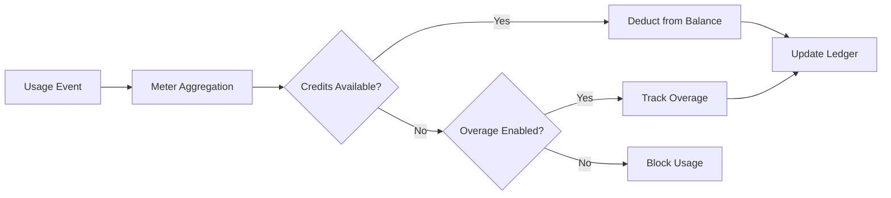

<Info>
I contatori convertono eventi grezzi in quantità fatturabili. Filtrano gli eventi e applicano funzioni di aggregazione (Count, Sum, Max, Last) per calcolare l’utilizzo per cliente.
</Info>

<Frame>

</Frame>

## Risorse API

<AccordionGroup>
<Accordion title="View Meter API References">
<CardGroup cols={2}>
<Card title="Create Meter" icon="plus" href="/api-reference/meters/create-meter">
Crea contatori in modo programmatico tramite API.
</Card>

<Card title="List Meters" icon="list" href="/api-reference/meters/get-meters">
Recupera tutti i contatori nel tuo account.
</Card>

<Card title="Get Meter" icon="eye" href="/api-reference/meters/retrieve-meter">
Recupera i dettagli di uno specifico contatore tramite ID.
</Card>

<Card title="Archive Meter" icon="arrow-rotate-right" href="/api-reference/meters/archive-meter">
Archivia un contatore per interrompere il monitoraggio dell’utilizzo.
</Card>

<Card title="Unarchive Meter" icon="arrow-rotate-left" href="/api-reference/meters/unarchive-meter">
Ripristina un contatore archiviato per riprendere il monitoraggio.
</Card>
</CardGroup>
</Accordion>
</AccordionGroup>

## Creazione di un Misuratore

<Steps>
<Step title="Basic Information">
<ParamField path="Meter Name" type="string" required>
Nome descrittivo (es. “API Requests”, “Token Usage”)
</ParamField>

<ParamField path="Event Name" type="string" required>
Nome esatto dell’evento da corrispondere (sensibile alle maiuscole). Esempi: `api.call`, `image.generated`
</ParamField>
</Step>

<Step title="Aggregation">
<ParamField path="Aggregation Type" type="string" required>
Scegli come vengono aggregati gli eventi:

- **Count**: numero totale di eventi (chiamate API, upload)
- **Sum**: somma dei valori numerici (token, byte)
- **Max**: valore massimo nel periodo (picco utenti)
- **Last**: valore più recente
</ParamField>

<ParamField path="Over Property" type="string">
Chiave dei metadati da aggregare (richiesta per tutti i tipi tranne Count). Esempi: `tokens`, `bytes`, `duration_ms`
</ParamField>

<ParamField path="Measurement Unit" type="string" required>
Etichetta dell’unità per le fatture. Esempi: `calls`, `tokens`, `GB`, `hours`
</ParamField>
</Step>

<Step title="Filtering (Optional)">
<Frame>

</Frame>

Aggiungi condizioni per filtrare quali eventi vengono conteggiati:
- **Logica AND**: Tutte le condizioni devono corrispondere
- **Logica OR**: Qualsiasi condizione può corrispondere

**Comparatori**: uguale, diverso, maggiore di, minore di, contiene

Abilita il filtraggio, scegli la logica e aggiungi condizioni con chiave della proprietà, comparatore e valore.
</Step>

<Step title="Create">
Controlla la configurazione e fai clic su **Create Meter**.
</Step>
</Steps>

## Visualizzazione Analitiche

<Frame>

</Frame>

Il tuo cruscotto dei misuratori mostra:
- **Panoramica**: Utilizzo totale e grafico dell'utilizzo
- **Eventi**: Eventi individuali ricevuti
- **Clienti**: Utilizzo e addebiti per cliente

## Fatturazione in crediti invece che in valuta

Di default, i contatori addebitano i clienti per unità in dollari (o nella valuta configurata). Puoi invece configurare un contatore per **dedurre da un saldo di crediti**: così l’utilizzo consuma crediti anziché generare un addebito monetario.

<Info>
La deduzione basata sui crediti richiede un [Credit Entitlement](/features/credit-based-billing) collegato allo stesso prodotto. Crea prima il tuo credito, poi collegalo al contatore.
</Info>

### Quando usare la deduzione basata sui crediti

| Scenario | Standard (valuta) | Basato sui crediti |
|----------|-------------------|--------------------|
| Prezzo per unità semplice ($0,01/chiamata) | ✅ Migliore soluzione | Sovraccarico inutile |
| Pacchetti prepagati di crediti (acquista 10K token, usali nel tempo) | ❌ Impossibile esprimere | ✅ Ideale |
| Uso incluso con gli abbonamenti (il piano Pro include 100K chiamate) | Possibile tramite la soglia gratuita | ✅ Meglio - i crediti si accumulano, scadono, vengono mostrati nel portale |
| Prodotti multi-contatore che condividono un pool di crediti | ❌ Ogni contatore fattura separatamente | ✅ Tutti i contatori prelevano da un unico saldo |

### Configurare un contatore per dedurre crediti

<Steps>
{/* LOCKED_PATTERN_2f001d4cc191a503bfa27e2b02a887d3 */}
Per prima cosa, crea un credito in **Prodotti → Crediti**. Definisci l’unità (ad es. “API Calls”, “Tokens”), la precisione e le impostazioni del ciclo di vita (scadenza, rollover, overage).

Consulta la [Guida alla fatturazione basata sui crediti](/features/credit-based-billing) per istruzioni dettagliate.
</Step>

{/* LOCKED_PATTERN_e56c2bce14c9ffc41b822106f30b9344 */}
Vai al tuo prodotto basato sull’utilizzo e apri la sezione di configurazione del **Contatore**.
</Step>

{/* LOCKED_PATTERN_0e1120cd860a229dcc6f92a517f37ac6 */}
Fai clic sul pulsante **+** per collegare un contatore. Configura il nome dell’evento, il tipo di aggregazione e l’unità di misura come sempre.
</Step>

{/* LOCKED_PATTERN_5742803ec5f5aba6317bae5a7cd68e62 */}
Attiva **Fattura utilizzo in crediti** nella configurazione del contatore. Questo rivela le impostazioni del credito:

{/* LOCKED_PATTERN_5164565eee83d03235035c7c8b6b2680 */}

</Frame>

{/* LOCKED_PATTERN_643db6bd6419b3403905cdf5351f1450 */}
Seleziona quale Credit Entitlement deve essere utilizzato da questo contatore.
</ParamField>

{/* LOCKED_PATTERN_f350d049ff7e758408e63c7b8b7766de */}
Il numero di unità di utilizzo necessario per dedurre 1 credito. Ad esempio:
- `1` = ogni evento del contatore deduce 1 credito
- `100` = 100 eventi del contatore deducono 1 credito
- `1000` = 1.000 chiamate API consumano 1 credito
</ParamField>
</Step>

{/* LOCKED_PATTERN_6b77ac14c64de04b72ad44281724bb0c */}
La **Soglia gratuita** è ancora applicabile: gli eventi al di sotto di questa soglia non deducono crediti.

**Esempio**: con soglia gratuita di 1.000 e unità del contatore per credito pari a 1:
- Il cliente utilizza 2.500 chiamate API
- Le prime 1.000 sono gratuite
- Le restanti 1.500 deducono 1.500 crediti dal loro saldo
</Step>
</Steps>

### Come funziona la deduzione dei crediti

Una volta configurata, la pipeline di deduzione viene eseguita automaticamente:

1. **Arrivo degli eventi** - La tua applicazione invia eventi di utilizzo tramite l’[Event Ingestion API](/features/usage-based-billing/event-ingestion)
2. **Aggregazione del contatore** - Gli eventi vengono aggregati in base alla configurazione del contatore (Count, Sum, Max, Last)
3. **Elaborazione dal worker in background** - Ogni minuto, un worker recupera i nuovi eventi dall’ultimo checkpoint
4. **I crediti vengono dedotti** - L’utilizzo aggregato viene convertito in crediti tramite il tasso `meter_units_per_credit` e dedotto usando l’ordinamento **FIFO** (i grant più vecchi vengono consumati per primi)
5. **Monitoraggio degli overage** - Se il saldo raggiunge zero e l’overage è abilitato, l’utilizzo continua e l’overage viene gestito secondo il comportamento configurato (ignorato al reset, fatturato alla fattura successiva o riportato come deficit)

{/* LOCKED_PATTERN_4907e9f6f7fbd509120d7a87afc829e9 */}
La deduzione dei crediti viene eseguita in modo asincrono (ogni ~1 minuto). Potrebbe esserci un breve ritardo tra l’ingestione degli eventi e la deduzione dal saldo. Progetta la tua applicazione per gestire questo ritardo: non basarti su controlli di saldo in tempo reale per il controllo accessi su singole richieste.
{/* LOCKED_PATTERN_176d815432e7554ac558e8631b2bc397 */}

### Più contatori, un unico pool di crediti

Puoi collegare più contatori dello stesso prodotto allo **stesso credit entitlement**. Tutti i contatori prelevano da un saldo condiviso.

**Esempio**: una piattaforma AI con due contatori:
- `text.generation` - 1 credito ogni 1.000 token
- `image.generation` - 10 crediti per immagine

Entrambi deducono dallo stesso pool “AI Credits”. Il cliente vede un unico saldo unificato nel portale.

{/* LOCKED_PATTERN_317ec56569e36d0c9e56c2648890a76e */}
Usa tassi `meter_units_per_credit` differenti tra i contatori per esprimere costi relativi. Le operazioni costose (generazione di immagini) richiedono meno unità del contatore per credito rispetto a quelle economiche (completamento di testo).
{/* LOCKED_PATTERN_4dec52ce04aa8849a8a60508baae30ae */}

<CardGroup cols={2}>
{/* LOCKED_PATTERN_2e110f22e0f3741250f140b212ae466d */}
Visualizza l’intera cronologia di deduzione dei crediti per un cliente.
</Card>
{/* LOCKED_PATTERN_83b4a13ef9031c5fd9378a998aeaa952 */}
Controlla il saldo di crediti attuale di un cliente tramite API.
</Card>
</CardGroup>

## Risoluzione dei problemi

<AccordionGroup>
<Accordion title="Events not appearing">
- Il nome dell’evento deve corrispondere esattamente (distinzioni tra maiuscole e minuscole)
- Controlla che i filtri del contatore non stiano escludendo gli eventi
- Verifica che gli ID dei clienti esistano
- Disabilita temporaneamente i filtri per testare
</Accordion>

<Accordion title="Aggregation not working">
- Verifica che Over Property corrisponda esattamente alla chiave dei metadati
- Usa numeri, non stringhe: `tokens: 150` invece di `"150"`
- Includi le proprietà richieste in tutti gli eventi
</Accordion>

<Accordion title="Filters not working">
- Rispetta esattamente le maiuscole/minuscole
- Usa gli operatori corretti per il tipo di dato
- Assicurati che gli eventi includano le proprietà filtrate
</Accordion>

<Accordion title="Wrong usage totals">
- Controlla la scheda Eventi per contare gli eventi effettivamente ricevuti
- Verifica il tipo di aggregazione (Count vs Sum)
- Assicurati che i valori siano numerici per Sum/Max
</Accordion>
</AccordionGroup>

## Prossimi passi

<CardGroup cols={2}>

<Card title="Send Events" icon="bolt" href="/features/usage-based-billing/event-ingestion">
Inizia a inviare eventi di utilizzo dalla tua applicazione ai contatori.
</Card>

<Card title="View Blueprints" icon="copy" href="/features/usage-based-billing/ingestion-blueprints">
Usa configurazioni di contatori preconfezionate per casi d’uso comuni.
</Card>
</CardGroup>
