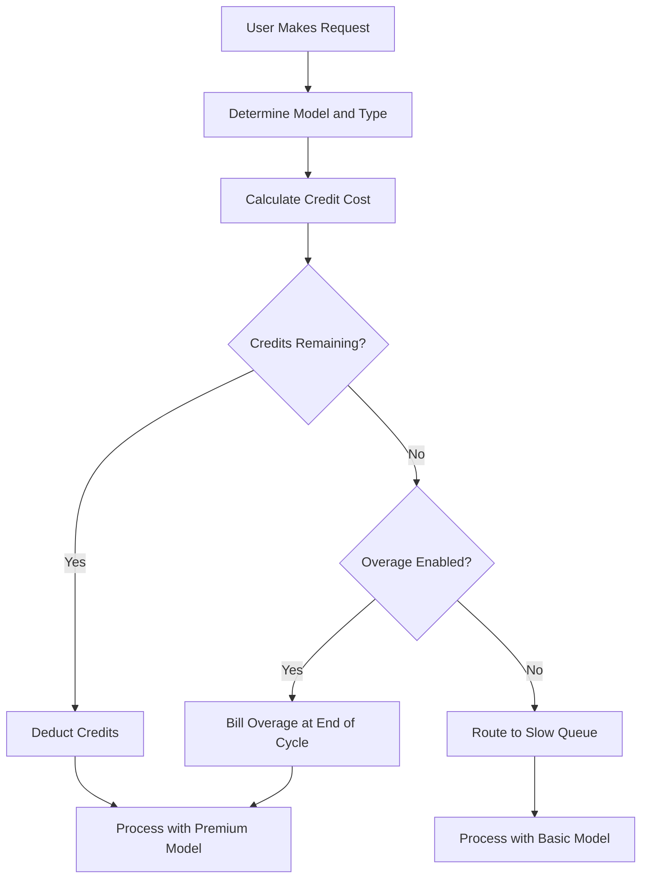

## Cursorの課金方法

Cursorは、月額サブスクリプションと減少するクレジットプールを組み合わせたハイブリッドモデルを採用しています。このアプローチにより、ユーザーには予測可能な価格を提供しながら、さまざまなAIモデルの変動コストを管理できます。

**価格帯**: CursorはHobbyからUltraまでの階層を提供し、さまざまなワークフローに合わせてプレミアムと標準アクセスのバランスを取っています。

| Plan | Price | プレミアムリクエスト | 低速リクエスト |
| :--- | :--- | :--- | :--- |
| Hobby | Free | 50/month | Unlimited |
| Pro | $20/month | 500/month | Unlimited |
| Pro+ | $60/month | Unlimited premium | - |
| Ultra | $200/month | Unlimited premium | - |

**モデル加重減少**: 各リクエストは、稼働しているモデルのコストに応じて異なる量のクレジットを消費します。これにより、Cursorは複数のプロバイダーをカバーする単一のサブスクリプションを提供しつつ、高コストの操作も適切に反映できます。

| リクエスト種別 | モデル | クレジットコスト |
| :--- | :--- | :--- |
| Tab Completion | Default | 0 |
| Chat | GPT-4o Mini | 1 |
| Chat | Claude 3.5 Sonnet | 1 |
| Composer | GPT-4o | 5 |
| Agent | Claude 3.5 Sonnet | 10 |
| Agent | o1-preview | 25 |

**クレジット枯渇と追加課金**: クレジットがなくなると、ユーザーはカットオフされる代わりに、より安価なモデルを使う「Slow」キューに移動します。あるいは、プレミアムアクセスを維持するために使用量ベースの追加課金を有効化し、リクエストごとの固定費用で処理することも可能です。



4. **Enterprise and Business**: チームは組織全体で共通のクレジットバケットを使うプール型の利用を採用しています。これにより、管理が簡素化され、使用の多いユーザーが個人の上限に達しても、他のメンバーが未使用の容量を持てるようになります。

## なぜこれが独自なのか

Cursorのモデルは、従来のSaaS課金モデルが苦戦する課題を解決することで、ユーザー体験とインフラコストのバランスを実現しています。
- **Provider Abstraction**: 単一のサブスクリプションでOpenAIやAnthropicなど複数のLLMプロバイダーを包括し、複雑な価格設定やAPIキーを裏側で処理します。
- **Weighted Depletion**: 強力なモデルほど高く課金し、価値に応じてコストを整合させることで、公平で透明な価格設計を実現しています。
- **Graceful Degradation**: 「Slow」キューは厳しい切断を防ぎ、ユーザーを製品内に留めつつ、罰則的でない形でアップグレードを促します。
- **Pooled Credits**: チーム単位のバケットにより、エンタープライズ顧客は組織全体で効率的にリソースを共有できるため、摩擦が軽減されます。

## Dodo Paymentsでこれを再現する

Dodo Paymentsのクレジット権限と使用量ベース課金を使えば、このモデルをそのまま再現できます。以下のステップで実装の流れをご案内します。

<Steps>
  <Step title="Create a Custom Unit Credit Entitlement">
    最初に、Dodoダッシュボードでクレジットシステムを定義します。このエンタイトルメントは、サブスクリプションに含まれる「プレミアムリクエスト」を表します。
  </Step>

    *   **クレジットタイプ:** カスタムユニット
    *   **単位名:** 「プレミアムリクエスト」
    *   **精度:** 0（リクエストの半分は使えないため）
    *   **クレジット有効期限:** 30日（これにより各請求サイクルでクレジットがリセットされます）
    *   **繰越:** 無効（未使用のリクエストは翌月に持ち越されません）
    *   **追加課金:** 有効
    *   **単位あたりの価格:** $0.04（初期プールが枯渇した後の各リクエストのコスト）
    *   **追加課金の振る舞い:** 請求時に追加課金する（これにより追加費用が次の請求書に加算されます）

    この設定により、ユーザーは毎月固定のリクエストプールを持ちつつ、必要に応じて追加課金で上乗せが可能になります。これはハイブリッド課金モデルの基盤です。
  <Step title="Create Subscription Products">

  <Step title="Create Subscription Products">
    各階層ごとに別々のプロダクトを作成します。すべてのプロダクトに同じクレジットエンタイトルメントを紐づけますが、量は階層ごとに変えます。これにより単一のクレジットシステムで全階層を管理でき、ユーザーのアップグレードやダウングレードも容易になります。
  </Step>

    *   **Hobby:** $0/月, サイクルあたり50クレジット
    *   **Pro:** $20/月, サイクルあたり500クレジット
    *   **Pro+:** $60/月, サイクルあたり5000クレジット（ほとんどのケースで事実上無制限）
    *   **Ultra:** $200/月, サイクルあたり50000クレジット（事実上無制限）

    ユーザーがこれらのプロダクトのいずれかに加入すると、Dodoは対応するクレジット数を自動的にアカウントに割り当てます。これは即時に行われ、シームレスなオンボーディング体験を提供します。
  </Step>

  <Step title="Create a Usage Meter Linked to Credits">
    `ai.request` という名前のメーターを、`credit_cost` プロパティに対して **Sum** 集約で作成します。このメーターを「Bill usage in Credits」トグルをオンにしてエンタイトルメントにリンクし、クレジットあたりのメーター単位を1に設定します。
    モデル加重の減少を処理するには、アプリケーション側でクレジットコストを管理します。ユーザーがリクエストを行うたびに、モデルやアクションタイプに基づいてコストを決定します。
    ```typescript
    import DodoPayments from 'dodopayments';
    
    /**
     * Determines the credit cost for a given request type and model.
     * This logic lives in your application and can be updated without
     * changing your billing configuration.
     */
    function getCreditCost(requestType: string, model: string): number {
      const costs: Record<string, Record<string, number>> = {
        'tab_completion': { 'default': 0 },
        'chat': { 'gpt-4o-mini': 1, 'gpt-4o': 1, 'claude-sonnet': 1 },
        'composer': { 'gpt-4o-mini': 2, 'gpt-4o': 5, 'claude-sonnet': 5 },
        'agent': { 'gpt-4o': 10, 'claude-sonnet': 10, 'o1': 25 }
      };
      
      // Default to 1 credit if the combination isn't found
      return costs[requestType]?.[model] ?? 1;
    }
    
    /**
     * Ingests usage events into Dodo Payments.
     * For weighted requests, we send multiple events or use a sum aggregation.
     */
    async function trackRequest(customerId: string, requestType: string, model: string) {
      const creditCost = getCreditCost(requestType, model);
      
      // Tab completions are free, so we don't need to track them for billing
      if (creditCost === 0) return;
      
      const client = new DodoPayments({
        bearerToken: process.env.DODO_PAYMENTS_API_KEY,
      });
      
      await client.usageEvents.ingest({
        events: [{
          event_id: `req_${Date.now()}_${Math.random().toString(36).slice(2)}`,
          customer_id: customerId,
          event_name: 'ai.request',
          timestamp: new Date().toISOString(),
          metadata: {
            request_type: requestType,
            model: model,
            credit_cost: creditCost
          }
        }]
      });
    }
    ```

    <Tip>
      重み付きリクエストに単一イベントを使用したい場合は、メーター集約を **Sum** に設定し、`credit_cost` のようなプロパティを合計値として使います。これは大量のデータ取り込みに対して効率的で、アプリケーションロジックも簡素化されます。
    </Tip>
  </Step>

  <Step title="Handle Credit Exhaustion (Slow Queue)">
    Dodoからの`credit.balance_low` ウェブフックを待ち受けます。ユーザーのクレジットがゼロに近づいたら、アプリケーション内で遅延キューに切り替えます。ここで「グレースフル・デグラデーション」のロジックを実装します。
    ```typescript
    import DodoPayments from 'dodopayments';
    import express from 'express';
    
    const app = express();
    app.use(express.raw({ type: 'application/json' }));
    
    const client = new DodoPayments({
      bearerToken: process.env.DODO_PAYMENTS_API_KEY,
      webhookKey: process.env.DODO_PAYMENTS_WEBHOOK_KEY,
    });
    
    app.post('/webhooks/dodo', async (req, res) => {
      try {
        const event = client.webhooks.unwrap(req.body.toString(), {
          headers: {
            'webhook-id': req.headers['webhook-id'] as string,
            'webhook-signature': req.headers['webhook-signature'] as string,
            'webhook-timestamp': req.headers['webhook-timestamp'] as string,
          },
        });
        
        if (event.type === 'credit.balance_low') {
          const customerId = event.data.customer_id;
          await updateUserTier(customerId, 'slow');
          await notifyUser(customerId, 'You have used most of your premium requests. Switching to standard models.');
        }
        
        res.json({ received: true });
      } catch (error) {
        res.status(401).json({ error: 'Invalid signature' });
      }
    });
    
    /**
     * Routes a request based on the user's current tier.
     * This function is called before every AI request to determine the model and queue.
     */
    async function routeRequest(customerId: string, requestType: string) {
      const tier = await getUserTier(customerId);
      
      if (tier === 'slow') {
        // Route to a cheaper model and a lower priority queue
        // This saves costs while keeping the user active in the product
        return { model: 'gpt-4o-mini', queue: 'standard' };
      }
      
      // Premium routing for users with remaining credits
      // This provides the best possible performance and model quality
      return { model: 'claude-sonnet', queue: 'priority' };
    }
    ```
  </Step>

  <Step title="Create Checkout">
    最後に、ユーザーがプランに加入するためのチェックアウトセッションを生成します。Dodoが支払い処理、税務コンプライアンス、クレジット割り当てを自動で処理します。
    ```typescript
    import DodoPayments from 'dodopayments';
    
    const client = new DodoPayments({
      bearerToken: process.env.DODO_PAYMENTS_API_KEY,
    });
    
    /**
     * Creates a checkout session for a new subscription.
     * This is typically called when a user clicks an "Upgrade" button.
     */
    const session = await client.checkoutSessions.create({
      product_cart: [
        { product_id: 'prod_cursor_pro', quantity: 1 }
      ],
      customer: { email: 'developer@example.com' },
      return_url: 'https://yourapp.com/dashboard'
    });
    ```
  </Step>
</Steps>

## LLM Ingestion Blueprintで加速する

上記のクレジット加重課金がコアのマネタイズを担います。プロバイダーごとの実際のトークン消費に関する詳細な分析には、[LLM Ingestion Blueprint](/developer-resources/ingestion-blueprints/llm) をクレジットシステムと並行して実行できます。

```bash
npm install @dodopayments/ingestion-blueprints
```

```typescript
import { createLLMTracker } from '@dodopayments/ingestion-blueprints';
import OpenAI from 'openai';
import Anthropic from '@anthropic-ai/sdk';

// Track raw token usage for analytics alongside credit-weighted billing
const openaiTracker = createLLMTracker({
  apiKey: process.env.DODO_PAYMENTS_API_KEY,
  environment: 'live_mode',
  eventName: 'analytics.openai_tokens',
});

const anthropicTracker = createLLMTracker({
  apiKey: process.env.DODO_PAYMENTS_API_KEY,
  environment: 'live_mode',
  eventName: 'analytics.anthropic_tokens',
});

const openai = new OpenAI({ apiKey: process.env.OPENAI_API_KEY });
const anthropic = new Anthropic({ apiKey: process.env.ANTHROPIC_API_KEY });

// Wrap each provider separately
const trackedOpenAI = openaiTracker.wrap({ client: openai, customerId: 'customer_123' });
const trackedAnthropic = anthropicTracker.wrap({ client: anthropic, customerId: 'customer_123' });

// Token tracking is automatic, credit deduction still uses your weighted system
const response = await trackedOpenAI.chat.completions.create({
  model: 'gpt-4o',
  messages: [{ role: 'user', content: 'Hello!' }],
});
```

これにより、収益化のためのクレジット加重課金と、コスト分析やマージン追跡のための生のトークン数という二層のデータが得られます。

<Tip>
LLM BlueprintはOpenAI、Anthropic、Groq、Google Geminiなどに対応しています。すべての対応プロバイダーについては、[full blueprint documentation](/developer-resources/ingestion-blueprints/llm) をご覧ください。
</Tip>

## チーム共有クレジット（Enterprise）

CursorのBusinessおよびEnterpriseプランはチーム全体でクレジットをプールします。Dodoでは、個々のユーザーではなく組織全体の単一のサブスクリプションを作成することでこれを実装できます。これによりチームの使用量が統合され、単一のエンティティとして管理され、大規模顧客の主要要件を満たします。

### 実装戦略

1.  **組織レベルの顧客:** 組織全体のためにDodoで単一の`customer_id` を作成します。この顧客はチームの請求主体を示し、共有クレジットプールを持ちます。すべての請求書とクレジット割り当てはこのIDに紐づきます。
2.  **シートベース課金:** Dodoのアドオンを利用して、ユーザーごとのプラットフォーム利用料を課金します。チームに新メンバーが追加されたら「Seat」アドオンの数量を更新します。これによりクレジットプールを分離したまま、ユーザー数に応じて収益をスケーリングできます。多次元課金を処理するクリーンな方法です。
3.  **共有利用トラッキング:** すべてのチームメンバーのリクエストを組織の`customer_id` を使って取り込みます。これにより、どのメンバーのリクエストでも同じ中央クレジットプールを消費します。内部レポートや分析のために、イベントメタデータに`user_id` を含めて個別の使用量も追跡できます。

このアプローチにより、プラットフォームに対する予測可能なユーザー単位料金と、高コストなAIリソースのための共有クレジットプールという両面のメリットが得られます。また、チームメンバーは個別の上限を管理する必要がないため、ユーザー体験も簡素化されます。

## 従来のSaaS課金との比較

従来のSaaS課金では通常、100ユニットで$10/月のような定額階層を設定し、101ユニット必要なユーザーは$50/月の階層に移る必要があります。これにより「崖」効果が生じ、ユーザーのフラストレーションや離脱を招きます。また、AI領域で重要な、使用タイプごとの変動コストも反映されません。

Cursorのモデル、Dodoによって支えられるこの仕組みは、はるかに柔軟で公平です:
*   **No "Cliff" Effects:** ユーザーは制限に達したからといってアップグレードする必要がなく、追加課金を払うか遅いパフォーマンスを受け入れるかを選べるため、製品への定着が高まり、摩擦が低減し、顧客満足度が向上して離脱も減ります。
*   **Cost Alignment:** 収益はインフラコストと直接連動します。高コストなモデルを使えば（クレジットや追加課金を通じて）より多く支払うため、マージンが保護され、高コストな機能も持続的に提供可能です。
*   **Better Retention:** ユーザーを即時に停止しないことで、制限に達しても引き続き製品を使い続けられ、長期的なロイヤルティと顧客生涯価値が高まります。これはユーザーとプロバイダー双方にとってのウィンウィンです。

## モデルの更新と進化への対応

AI課金の課題の一つは、モデルが常に更新または置き換えられる点です。新しいモデルは異なるコスト構造や性能特性を持つことがあります。Dodoのクレジットシステムでは、アプリケーションレベルでこれをスマートに処理でき、課金データのマイグレーションが不要です。

新たに高コストなモデルを導入する場合は、単に`getCreditCost` 関数を更新して高いコストを割り当てればよく、課金設定や既存のサブスクリプションを変更する必要はありません。課金とアプリケーションロジックが分離されているため、AIのスピードに合わせてプロダクトを迅速に反復でき、課金システムに縛られません。

## ユーザー通知と透明性

素晴らしいユーザー体験を提供するには、クレジット使用量についてユーザーに継続的に知らせることが重要です。透明性が信頼を築き、ユーザーがコストを効果的に管理するのに役立ちます。Dodoのウェブフックを使って、50%、80%、100%などの閾値で通知をトリガーできます。

これらの通知はメール、アプリ内アラート、Slackメッセージなどで送れます。使用状況のリアルタイムなフィードバックを提供することで、ユーザーは「スロークエ」到達前に消費を管理したりプランをアップグレードしたりするようになります。この先手のアプローチによりサポートチケットが減り、全体的なユーザー体験が向上し、製品がよりプロフェッショナルでユーザー中心に感じられます。

## セキュリティと不正防止

クレジットベースのシステムを実装する際は、セキュリティと不正防止を考慮することが重要です。クレジットには直接的な金銭的価値があるため、不正対象になりやすいです。

*   **冪等性:** 使用量イベントを取り込む際は常に一意の`event_id` を使って二重計上を防ぎます。Dodoの取り込みAPIは一意のIDを渡すことで冪等性を自動的に処理し、ネットワークリトライでユーザーに二重課金が発生することを防ぎます。
*   **レート制限:** 単一ユーザーがクレジット（やAPI予算）を速攻で使い切らないよう、アプリケーションでレート制限を実装します。これによりインフラとユーザーの財布を守れます。
*   **モニタリング:** アカウント共有や自動化された乱用を示す異常な使用パターンを監視します。Dodoの分析機能を活用すると、重大な問題になる前に対応できます。

## クレジットシステムのベストプラクティス

クレジットベースの課金システムを構築する際は、次のベストプラクティスを心がけてください:

1.  **シンプルに保つ:** クレジットシステムを複雑にしすぎないでください。ユーザーは1リクエストあたりのコストや残りクレジットを簡単に理解できるべきです。
2.  **価値を提供する:** クレジットがユーザーにとって実際の価値を提供するようにします。リクエストのコストが高すぎると、ユーザーは少額にこだわっていると感じてしまいます。
3.  **透明性を保つ:** ユーザーの現在のクレジット残高と使用履歴を常に表示します。これにより信頼が築け、混乱を減らせます。
4.  **すべてを自動化する:** DodoのウェブフックやAPIを活用して、課金プロセスを可能な限り自動化します。これにより手作業が減り、課金の正確性が担保されます。

## 使用される主なDodo機能

<CardGroup cols={2}>
  <Card title="Credit-Based Billing" icon="coins" href="/features/credit-based-billing">
    カスタムユニットで枯渇するクレジットプールと追加課金を管理します。
  </Card>
  <Card title="Subscriptions" icon="calendar" href="/features/subscription">
    複数階層の定期課金をクレジットと統合して設定します。
  </Card>
  <Card title="Usage-Based Billing" icon="chart-line" href="/features/usage-based-billing/introduction">
    イベントを追跡し、消費量に応じてリアルタイムで課金します。
  </Card>
  <Card title="Event Ingestion" icon="bolt" href="/features/usage-based-billing/event-ingestion">
    低レイテンシで大量の使用データをDodoに送信します。
  </Card>
  <Card title="Webhooks" icon="webhook" href="/developer-resources/webhooks/intents/credit">
    クレジット残高の変化に応じて反応し、ユーザー階層を自動化します。
  </Card>
  <Card title="LLM Ingestion Blueprint" icon="brain-circuit" href="/developer-resources/ingestion-blueprints/llm">
    複数のLLMプロバイダーにまたがるトークンの自動追跡。
  </Card>
</CardGroup>

When implementing a credit-based system, it's important to consider security and fraud prevention. Since credits have a direct monetary value, they can be a target for abuse.

*   **Idempotency:** Always use unique `event_id`s when ingesting usage events to prevent double-counting. Dodo's ingestion API handles idempotency automatically if you provide a unique ID, ensuring that a network retry doesn't charge the user twice.
*   **Rate Limiting:** Implement rate limiting at the application level to prevent a single user from exhausting their credits (or your API budget) too quickly. This protects your infrastructure and the user's wallet.
*   **Monitoring:** Monitor usage patterns for anomalies that might indicate account sharing or automated abuse. Dodo's analytics can help you identify these patterns, allowing you to take action before they become a major problem.

## Best Practices for Credit Systems

When building a credit-based billing system, keep these best practices in mind:

1.  **Keep it Simple:** Don't make your credit system too complex. Users should be able to easily understand how much a request costs and how many credits they have left.
2.  **Provide Value:** Ensure that the credits provide real value to the user. If the cost of a request is too high, users will feel like they're being nickel-and-dimed.
3.  **Be Transparent:** Always show the user their current credit balance and usage history. This builds trust and reduces confusion.
4.  **Automate Everything:** Use Dodo's webhooks and APIs to automate as much of the billing process as possible. This reduces manual work and ensures that your billing is always accurate.

## Key Dodo Features Used

<CardGroup cols={2}>
  <Card title="Credit-Based Billing" icon="coins" href="/features/credit-based-billing">
    Manage depleting credit pools and overages with custom units.
  </Card>
  <Card title="Subscriptions" icon="calendar" href="/features/subscription">
    Set up recurring billing for different tiers with integrated credits.
  </Card>
  <Card title="Usage-Based Billing" icon="chart-line" href="/features/usage-based-billing/introduction">
    Track events and bill based on consumption in real-time.
  </Card>
  <Card title="Event Ingestion" icon="bolt" href="/features/usage-based-billing/event-ingestion">
    Send high-volume usage data to Dodo with low latency.
  </Card>
  <Card title="Webhooks" icon="webhook" href="/developer-resources/webhooks/intents/credit">
    React to credit balance changes and automate user tiering.
  </Card>
  <Card title="LLM Ingestion Blueprint" icon="brain-circuit" href="/developer-resources/ingestion-blueprints/llm">
    Automatic token tracking across multiple LLM providers.
  </Card>
</CardGroup>
