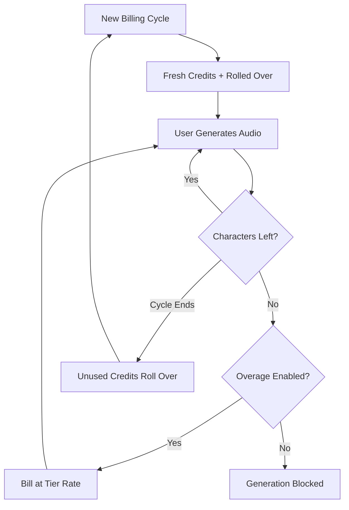

ElevenLabs は、課金体系を音声合成と同じくらい流動的にすることで、AI 音声の分野で支配的な地位を築きました。彼らのモデルは、1 つの価値単位、つまり文字に焦点を当てています。テキスト音声変換、音声クローン、ビデオの吹き替えなど、すべて統一された文字クレジットプールから消費されます。

## ElevenLabs の請求方法

ElevenLabs の価格構造は、サブスクリプション階層に紐づいた固定の月間クォータを使用しています。より上位の階層に移動するほど、文字数が増え、プロフェッショナルな音声クローンや商用利用権などの高度な機能へのアクセス権が得られます。

| Plan | Price | Characters/Month | Overage Rate |
| :--- | :--- | :--- | :--- |
| Free | \$0 | 10,000 | Not available |
| Starter | \$5/month | 30,000 | ~\$0.30/1K chars |
| Creator | \$22/month | 100,000 | ~\$0.24/1K chars |
| Pro | \$99/month | 500,000 | ~\$0.15/1K chars |
| Scale | \$330/month | 2,000,000 | ~\$0.10/1K chars |

1. **文字ベースの価格設定**: 文字はプラットフォーム全体で共通の通貨です。テキスト音声変換、吹き替え、音声クローンはいずれも同じ残高から消費され、利用状況の追跡が簡素化されます。
2. **繰り越しメカニズム**: 使われなかった文字は期限切れにならず、次の請求サイクルに繰り越されます。ElevenLabs は無限に蓄積されるのを防ぐための上限を設定し、サブスクリプションからの価値を保持します。
3. **階層別超過料金**: 超過利用はサブスクリプション階層に応じて扱われます。下位プランでは安全性のために超過課金が無効化されている一方で、上位階層ではサービス継続のためにオプトイン課金が可能です。

## 独自性

いくつかの戦略的な選択が、ElevenLabs の課金モデルをユーザーの維持とアップグレードの促進に特に効果的にしています。

- **文字の繰り越し**: 未使用のクレジットを繰り越すことで「使うか失うか」という不安を軽減し、活動が低い期間でもサブスクリプションの価値を維持します。
- **階層別超過料金**: プランが大きくなるほど超過料金が下がり、アップグレードという強いインセンティブを生み出します。追加利用のコストが低いため、ユーザーは上位階層をより魅力的に感じます。
- **統一された消費**: すべてのサービスで単一の文字プールを使用することで、別々のクォータを管理する認知的負荷を取り除きます。ユーザーは残り容量を理解するために 1 つの数字だけを追跡すればよいのです。
- **オプトイン超過課金**: プロフェッショナルユーザーは継続性のために超過課金を有効にでき、カジュアルユーザーは厳格な上限の安全性を享受できます。



## Dodo Payments で再現する

Dodo Payments のクレジットベース課金と使用量メータリングを使えば、この高度なモデルを再現できます。

<Steps>
<Step title="Create a Custom Unit Credit Entitlement">
まず、プラットフォームの通貨として機能する「Characters」単位を定義します。

1. Dodo ダッシュボードの **Entitlements** に移動します。
2. 新しい **Credit Entitlement** を作成します。
3. **Credit Type** を **Custom Unit** に設定します。
4. 単位名を「Characters」にします。
5. 文字は常に整数なので、**Precision** を 0 に設定します。
6. 月次請求サイクルに合わせるため、**Credit Expiry** を 30 日に設定します。
7. 次の設定で **Rollover** を有効にします:
    - **Max Rollover Percentage**: 100%（未使用の文字をすべて繰り越せます）。
    - **Rollover Timeframe**: 1 Month.
    - **Max Rollover Count**: 1（クレジットは一度だけ繰り越され、その後期限切れになります）。
</Step>

<Step title="Create Tiered Subscription Products">
5 つのサブスクリプション製品を作成します。それぞれに同じ「Characters」権利を付与しますが、各階層に応じた構成を行います。

| Product | Price | Credits/Cycle | Overage Enabled | Overage Price (per 1K chars) |
| :--- | :--- | :--- | :--- | :--- |
| Free | \$0/mo | 10,000 | No | - |
| Starter | \$5/mo | 30,000 | Yes (opt-in) | \$0.30 |
| Creator | \$22/mo | 100,000 | Yes | \$0.24 |
| Pro | \$99/mo | 500,000 | Yes | \$0.15 |
| Scale | \$330/mo | 2,000,000 | Yes | \$0.10 |

各製品にクレジット権利を割り当てる際には、**Import Default Credit Settings** のチェックを外します。これにより、特定の階層に対して超過利用の **Price Per Unit** を個別に設定できます。**Overage Behavior** を **Bill overage at billing** に設定し、階層クォータの 10% に **Low Balance Threshold** を構成します。
</Step>

<Step title="Create a Usage Meter">
使用量メーターを作成してアプリケーションのアクティビティをクレジットシステムに接続します。

1. 新しいメーターを `tts.characters` という名前で作成します。
2. **Aggregation** を **Sum** に設定します。これにより、送信するすべてのイベントから `characters` プロパティを合計します。
3. このメーターを「Characters」クレジット権利にリンクします。
4. **Meter units per credit** を 1 に設定します。これにより、アプリで 1 文字使用するごとに残高から 1 クレジットが差し引かれます。
</Step>

<Step title="Send Usage Events">
使用状況トラッキングをアプリケーションコードに統合します。ユーザーがオーディオを生成するたびに、Dodo にイベントを送信します。

```typescript
import DodoPayments from 'dodopayments';

async function trackGeneration(
  customerId: string,
  text: string, 
  service: 'tts' | 'dubbing' | 'cloning'
) {
  const characterCount = text.length;

  const client = new DodoPayments({
    bearerToken: process.env.DODO_PAYMENTS_API_KEY,
  });

  await client.usageEvents.ingest({
    events: [{
      event_id: `gen_${Date.now()}_${Math.random().toString(36).slice(2)}`,
      customer_id: customerId,
      event_name: 'tts.characters',
      timestamp: new Date().toISOString(),
      metadata: {
        characters: characterCount,
        service: service,
        voice_id: 'voice_abc123'
      }
    }]
  });
}
```

</Step>

<Step title="Handle Low Balance and Overage">
ウェブフックを使用して、ユーザーに文字使用状況を知らせます。

```typescript
import DodoPayments from 'dodopayments';
import express from 'express';

const app = express();
app.use(express.raw({ type: 'application/json' }));

const client = new DodoPayments({
  bearerToken: process.env.DODO_PAYMENTS_API_KEY,
  webhookKey: process.env.DODO_PAYMENTS_WEBHOOK_KEY,
});

app.post('/webhooks/dodo', async (req, res) => {
  try {
    const event = client.webhooks.unwrap(req.body.toString(), {
      headers: {
        'webhook-id': req.headers['webhook-id'] as string,
        'webhook-signature': req.headers['webhook-signature'] as string,
        'webhook-timestamp': req.headers['webhook-timestamp'] as string,
      },
    });

    switch (event.type) {
      case 'credit.balance_low':
        await notifyUser(event.data.customer_id, 
          'You are running low on characters. Consider upgrading your plan for more characters and lower overage rates.'
        );
        break;
      case 'credit.deducted':
        await logUsage(event.data);
        break;
      case 'credit.overage_charged':
        await notifyUser(event.data.customer_id,
          'You have exceeded your character quota. Overage charges will appear on your next invoice.'
        );
        break;
    }

    res.json({ received: true });
  } catch (error) {
    res.status(401).json({ error: 'Invalid signature' });
  }
});
```

</Step>

<Step title="Create Checkout">
ユーザーがサブスクライブの準備ができたら、選択した階層のチェックアウトセッションを作成します。

```typescript
const session = await client.checkoutSessions.create({
  product_cart: [
    { product_id: 'prod_elevenlabs_pro', quantity: 1 }
  ],
  customer: { email: 'creator@example.com' },
  return_url: 'https://yourapp.com/dashboard'
});
```

</Step>
</Steps>

## Stream Ingestion Blueprint で加速する

文字ベースの課金とともにオーディオ出力を追跡するには、[Stream Ingestion Blueprint](/developer-resources/ingestion-blueprints/stream) が帯域幅消費をメーターリングするための効率的な方法を提供します。

```bash
npm install @dodopayments/ingestion-blueprints
```

```typescript
import { Ingestion, trackStreamBytes } from '@dodopayments/ingestion-blueprints';

const ingestion = new Ingestion({
  apiKey: process.env.DODO_PAYMENTS_API_KEY,
  environment: 'live_mode',
  eventName: 'tts.audio_bytes',
});

// After generating audio, track the output size
const audioBuffer = await generateSpeech(text, voiceId);

await trackStreamBytes(ingestion, {
  customerId: customerId,
  bytes: audioBuffer.byteLength,
  metadata: {
    voice_id: voiceId,
    service: 'tts',
    format: 'mp3',
  },
});
```

Stream Blueprint を使用して、文字ベースのクレジットシステムと並行してオーディオ帯域幅を追跡します。これにより、生成ごとの実際のインフラコストの可視化が可能になります。

<Tip>
Stream Blueprint は高ボリュームのシナリオに対応するバッチ処理もサポートします。高度な使用パターンについては、[完全なブループリントのドキュメント](/developer-resources/ingestion-blueprints/stream) を参照してください。
</Tip>

## アップグレードのインセンティブ：階層別超過料金

ElevenLabs モデルの最も秀逸な部分は、超過料金を使ってアップグレードを促進する方法です。上位階層では 1 文字あたりのコストが安くなるため、「どれだけ必要か」ではなく「どれだけ節約できるか」という話になります。

| Tier | Included Chars | Overage (per 1K) | Effective Cost at 500K Chars |
| :--- | :--- | :--- | :--- |
| Creator | 100,000 | \$0.24 | \$22 + (400 * \$0.24) = \$118 |
| Pro | 500,000 | \$0.15 | \$99 (No overage) |

Creator プランで 500,000 文字を定期的に消費するユーザーは、月額料金に加えて超過料金で \$118 を支払います。Pro プランにアップグレードすれば、同じ使用量を \$99 でカバーでき、月額 \$19 の節約になります。上位階層での超過料金率が低いため、使用量が増えるに連れてアップグレードが明白な経済的判断になります。

Dodo Payments では、クレジットをサブスクリプション製品に割り当てる際に **Import Default Credit Settings** のチェックを外すことでこれを実現します。これにより、各階層の **Price Per Unit** を完全に制御でき、最も支払い能力のある顧客に最適な料金を提供できます。

## 使用された主な Dodo 機能

<CardGroup cols={2}>
  <Card title="Credit-Based Billing" icon="coins" href="/features/credit-based-billing">
    文字クォータ、繰り越し、有効期限を管理します。
  </Card>
  <Card title="Subscriptions" icon="calendar" href="/features/subscription">
    月次文字割当を提供する定期階層を設定します。
  </Card>
  <Card title="Usage-Based Billing" icon="chart-line" href="/features/usage-based-billing/introduction">
    サービス全体でリアルタイムの文字消費を追跡します。
  </Card>
  <Card title="Event Ingestion" icon="bolt" href="/features/usage-based-billing/event-ingestion">
    最小のレイテンシで大量の使用データを Dodo に送信します。
  </Card>
  <Card title="Webhooks" icon="webhook" href="/developer-resources/webhooks/intents/credit">
    残高不足や超過イベントにリアルタイムで対応します。
  </Card>
  <Card title="Stream Ingestion Blueprint" icon="tower-broadcast" href="/developer-resources/ingestion-blueprints/stream">
    使用量ベースの課金向けにオーディオストリーミング帯域幅を追跡します。
  </Card>
</CardGroup>
