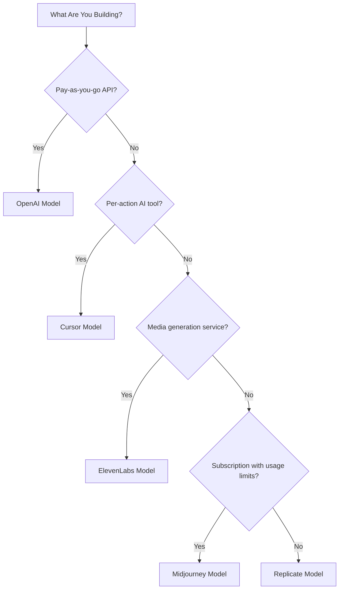

## 5つのモデル

| アプリ | 主要指標 | 独自のイノベーション | Dodo機能 |
| :--- | :--- | :--- | :--- |
| OpenAI | トークン（法定通貨建て） | 残高消滅なしの前払い法定通貨クレジット | クレジットベースの課金（法定通貨クレジット） |
| Cursor | プレミアムリクエスト | モデルごとに異なるコストで重み付けされたクレジット消費 | クレジットベースの課金（カスタム単位） |
| ElevenLabs | 文字数 | 繰越付き文字数クォータと段階的な超過料金 | クレジットベースの課金（繰越＋超過） |
| Midjourney | GPU時間 | クォータ後に「Relax Mode」無制限フォールバック | サブスクリプション＋利用メーター |
| Replicate | 実行秒数 | ハードウェア別の秒単位純メータリング | 純利用ベース課金 |

## クレジットパターンの理解

| パターン | 例 | Dodo機能 | 単位の種類 |
| :--- | :--- | :--- | :--- |
| 法定通貨建て前払いクレジット | OpenAI API (\$5クレジット追加、現金引き出し不可) | クレジットベース課金（法定通貨クレジット） | ドル建ての仮想単位 |
| 仮想利用クレジット | Cursorのプレミアムリクエスト、ElevenLabsの文字数 | クレジットベース課金（カスタム単位） | 任意単位（リクエスト、文字など） |
| 純消費メータリング | Replicateの秒単位課金 | 利用ベース課金（メーター） | 直接測定（秒、バイト） |
| サブスクリプション＋メーター付き超過 | MidjourneyのFast HoursとRelaxフォールバック | サブスクリプション＋利用メーター | 無料閾値付き時間ベース |

<Info>
Dodoのクレジットベース課金における法定通貨クレジットは、プラットフォーム内で定義されたドル価値を表し、エコシステム外では金銭的価値を持ちません。顧客はこれを現金として引き出せません。
</Info>

## どのモデルを使用すべきか？

- 従量課金APIプラットフォームを構築する: OpenAIモデル（法定通貨クレジット）
- アクション単位の課金AIツールを構築する: Cursorモデル（カスタム単位クレジット）
- メディア生成サービスを構築する: ElevenLabsモデル（繰越クレジット）
- 利用制限付きサブスクリプションサービスを構築する: Midjourneyモデル（サブスクリプション＋利用メーター）
- インフラ/コンピュートプラットフォームを構築する: Replicateモデル（純メータリング）

<CardGroup cols={2}>
  <Card title="OpenAI" icon="/images/logos/openai.svg" href="/developer-resources/billing-deconstructions/openai">
    トークンベースの前払いクレジットモデルを再現します。
  </Card>
  <Card title="Cursor" icon="/images/logos/cursor.svg" href="/developer-resources/billing-deconstructions/cursor">
    モデルごとに重み付けされた利用上限を構築します。
  </Card>
  <Card title="ElevenLabs" icon="/images/logos/elevenlabs.svg" href="/developer-resources/billing-deconstructions/elevenlabs">
    繰越と超過を備えた文字数クォータを実装します。
  </Card>
  <Card title="Midjourney" icon="/images/logos/midjourney.svg" href="/developer-resources/billing-deconstructions/midjourney">
    利用ベースのフォールバックとサブスクリプションを組み合わせます。
  </Card>
  <Card title="Replicate" icon="/images/logos/replicate.svg" href="/developer-resources/billing-deconstructions/replicate">
    秒単位の純消費メータリングを設定します。
  </Card>
</CardGroup>

## Dodoの機能

<CardGroup cols={2}>
  <Card title="Credit-Based Billing" href="/features/credit-based-billing">
    前払いクレジットと仮想単位を管理します。
  </Card>
  <Card title="Usage-Based Billing" href="/features/usage-based-billing/introduction">
    消費をリアルタイムで計測します。
  </Card>
  <Card title="Subscriptions" href="/features/subscription">
    継続的な請求とプラン管理を扱います。
  </Card>
  <Card title="Hybrid Billing" href="/features/hybrid-billing">
    最大限の柔軟性のために複数の課金モデルを組み合わせます。
  </Card>
</CardGroup>

## Ingestion Blueprints

各分解には、イベントトラッキングを自動で処理する事前構築済みSDKであるDodoの[Ingestion Blueprints](/features/usage-based-billing/ingestion-blueprints)との統合が含まれています。利用イベントを手動で構築する代わりに、ブループリントを使って数分で本番対応の計測を実現しましょう。

<CardGroup cols={3}>
  <Card title="LLM Blueprint" icon="brain-circuit" href="/developer-resources/ingestion-blueprints/llm">
    OpenAI、Anthropic、Groqなどのトークンを自動で追跡します。
  </Card>
  <Card title="Stream Blueprint" icon="tower-broadcast" href="/developer-resources/ingestion-blueprints/stream">
    音声・ビデオストリーミングの帯域幅を追跡します。
  </Card>
  <Card title="Time Range Blueprint" icon="clock" href="/developer-resources/ingestion-blueprints/time-range">
    ミリ秒単位で計算時間に基づいて請求します。
  </Card>
</CardGroup>
