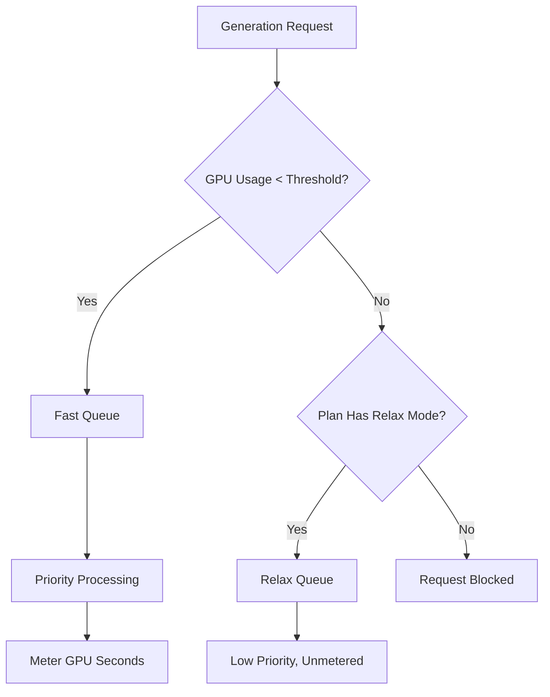

Midjourneyは、単純な画像枚数ではなくGPU時間に基づく独自の課金モデルを採用している生成AIプラットフォームです。このアプローチにより、複雑で高解像度のレンダリングは、短時間の低解像度ドラフトよりも高い費用がかかるようになっています。

## Midjourneyの課金方法

Midjourneyのサブスクリプションプランは、ユーザーに毎月特定の「Fast GPU Hours（高速GPU時間）」を付与します。これらの時間は、生成に費やされた実際の計算時間を表しています。

| Plan | Price | Fast GPU Hours | Relax Mode | Stealth Mode |
| :--- | :--- | :--- | :--- | :--- |
| Basic | \$10/month | ~3.3 hrs | No | No |
| Standard | \$30/month | 15 hrs | Unlimited | No |
| Pro | \$60/month | 30 hrs | Unlimited | Yes |
| Mega | \$120/month | 60 hrs | Unlimited | Yes |

1. **価格帯**: Midjourneyは月額\$10から\$120までの4つのサブスクリプションレベルを提供しており、それぞれに定められたFast GPU時間が含まれます。
2. **Relax Mode**: Standard以上のプランでは、Fast時間を使い切ったあとでも低優先度キューを通じて無制限に生成できるため、厳しい使用制限に達することがありません。
3. **追加GPU時間**: 月間割り当てを超えて即時の結果が必要になった場合、1時間あたり約\$4で追加のFast GPU時間を購入できます。
4. **GPU秒単位の計測**: 使用量は実際の生成に費やされた計算時間でトラッキングされるため、複雑なレンダリングほど多く課金されます。
5. **コミュニティループ**: アクティブなユーザーはギャラリーで画像を評価することでボーナスGPU時間を獲得でき、モデルの訓練とコミュニティへの還元が両立します。
## 特徴的なポイント

Midjourneyモデルが効果的なのは、コストを価値とリソース使用量に合わせているからです。

* **GPU時間課金**により、単純なドラフトと比較して複雑なレンダリングに対しても公正な価格が設定されます。
* **Relax Mode**は無制限のフォールバックを提供することで、月間上限を超えてもサービスへのアクセスを維持し、解約率を下げます。
* **FastとRelaxの分離**は、スピードと即時結果を重視するユーザーに対して優先処理を提供することでアップグレードを促します。
* **追加GPU時間**は、月中に追加の高優先度処理能力が必要なヘビーユーザーに柔軟なトップアップオプションを提供します。

## Dodo Paymentsでこのモデルを構築する

Dodo Paymentsでは、サブスクリプションと使用量メーター、アプリケーションレベルのロジックを組み合わせることでこのモデルを再現できます。

<Steps>

<Step title="Create a Usage Meter">

まず、各顧客が使用したGPU秒数をトラッキングするメーターを作成します。

* **Meter name**: `gpu.fast_seconds`
* **Aggregation**: **Sum** (sum the `gpu_seconds` property from each event)

課金対象はFastモードで生成されたイベントのみです。Relaxモードの生成は課金対象としてメーターに含めません。

</Step>

<Step title="Create Subscription Products with Usage Pricing">

サブスクリプション商品を作成し、無料しきい値を持つ使用量メーターを紐付けます。

| Product | Base Price | Free Threshold (seconds) | Overage Rate |
| :--- | :--- | :--- | :--- |
| Basic | \$10/month | 12,000 (3.3 hrs) | N/A (Hard Cap) |
| Standard | \$30/month | 54,000 (15 hrs) | \$0.00 (Relax Mode) |
| Pro | \$60/month | 108,000 (30 hrs) | \$0.00 (Relax Mode) |
| Mega | \$120/month | 216,000 (60 hrs) | \$0.00 (Relax Mode) |

Basicプランでは、ハードキャップを強制するために追加課金を無効化します。他のプランでは、メーターがしきい値を超過したときにRelax Modeをアプリケーションロジックで処理します。

</Step>

<Step title="Implement Application-Level Relax Mode">

重要な着眼点は、Relax Modeは課金機能ではないということです。Dodoの使用量メーターがしきい値に達したことを示したときに、アプリケーションでリクエストを低優先度キューへルーティングする設計です。

```typescript
async function handleGenerationRequest(customerId: string, prompt: string) {
  const usage = await getCustomerUsage(customerId, 'gpu.fast_seconds');
  const subscription = await getSubscription(customerId);
  const threshold = getThresholdForPlan(subscription.product_id);
  
  if (usage.current >= threshold) {
    if (subscription.product_id === 'prod_basic') {
      throw new Error('Fast GPU hours exhausted. Upgrade to Standard for Relax Mode.');
    }
    
    // Relax Mode. Route to low-priority queue
    return await queueGeneration(customerId, prompt, {
      priority: 'low',
      mode: 'relax',
      model: 'standard'
    });
  }
  
  // Fast Mode. Priority processing
  return await queueGeneration(customerId, prompt, {
    priority: 'high',
    mode: 'fast',
    model: 'premium'
  });
}
```

</Step>

<Step title="Send Usage Events (Fast Mode Only)">

Fastモードで生成したときのみDodoに使用量イベントを送信します。

```typescript
import DodoPayments from 'dodopayments';

async function trackFastGeneration(customerId: string, gpuSeconds: number, jobId: string) {
  // Only track Fast mode generations. Relax mode is free and unlimited
  const client = new DodoPayments({
    bearerToken: process.env.DODO_PAYMENTS_API_KEY,
  });

  await client.usageEvents.ingest({
    events: [{
      event_id: `gen_${jobId}`,
      customer_id: customerId,
      event_name: 'gpu.fast_seconds',
      timestamp: new Date().toISOString(),
      metadata: {
        gpu_seconds: gpuSeconds,
        resolution: '1024x1024',
        mode: 'fast'
      }
    }]
  });
}
```

</Step>

<Step title="Sell Extra Fast Hours (One-Time Top-Up)">

「Extra Fast GPU Hour」の一括購入商品を\$4で作成します。購入されたら、アプリケーション内で追加しきい値やクレジットを付与できます。

```typescript
// After customer purchases extra hours
const session = await client.checkoutSessions.create({
  product_cart: [
    { product_id: 'prod_extra_gpu_hour', quantity: 5 }
  ],
  customer: { customer_id: customerId },
  return_url: 'https://yourapp.com/dashboard'
});
```

</Step>

<Step title="Create Checkout for Subscription">

最後に、サブスクリプションプラン用のチェックアウトセッションを作成します。

```typescript
const session = await client.checkoutSessions.create({
  product_cart: [
    { product_id: 'prod_mj_standard', quantity: 1 }
  ],
  customer: { email: 'artist@example.com' },
  return_url: 'https://yourapp.com/studio'
});
```

</Step>

</Steps>

## Time Range Ingestion Blueprintで加速

[Time Range Ingestion Blueprint](/developer-resources/ingestion-blueprints/time-range)は、期間ベースの課金のための専用ヘルパーを提供し、GPU時間のトラッキングを簡素化します。

```bash
npm install @dodopayments/ingestion-blueprints
```

```typescript
import { Ingestion, trackTimeRange } from '@dodopayments/ingestion-blueprints';

const ingestion = new Ingestion({
  apiKey: process.env.DODO_PAYMENTS_API_KEY,
  environment: 'live_mode',
  eventName: 'gpu.fast_seconds',
});

// Track generation time after a Fast mode job completes
const startTime = Date.now();
const result = await runGeneration(prompt, settings);
const durationMs = Date.now() - startTime;

await trackTimeRange(ingestion, {
  customerId: customerId,
  durationMs: durationMs,
  metadata: {
    mode: 'fast',
    resolution: '1024x1024',
  },
});
```

このブループリントは期間の変換とイベントのフォーマットを処理します。必要なのは顧客IDと経過時間だけです。

<Tip>
Time Range Blueprintはミリ秒、秒、分をサポートしています。期間のオプションやベストプラクティスの詳細については、[完全なブループリントドキュメント](/developer-resources/ingestion-blueprints/time-range)をご覧ください。
</Tip>

## Fast vs Relaxアーキテクチャ

デュアルキューシステムは現在の使用状況に応じてリクエストをルーティングすることで機能します。



1. すべてのリクエストはアプリケーションを経由します。
2. アプリケーションはDodoの使用量メーターとプランの無料しきい値を比較します。
3. 使用量がしきい値未満であれば、リクエストはFastキューに送られ、メーターされます。
4. 使用量がしきい値を超えると、リクエストはRelaxキューに送られ、ここでは課金されず優先度が低くなります。
5. BasicプランにはRelaxのフォールバックがないため、上限に達するとリクエストはブロックされます。

<Info>
Relax ModeはDodoの課金機能ではなく、アプリケーションレベルのパターンです。DodoはFast GPU使用量をトラッキングし、しきい値を超えたことを通知します。ユーザーをブロックするか遅いキューにルーティングするかはアプリケーションが決定します。
</Info>

## 利用している主なDodo機能

<CardGroup cols={2}>
  <Card title="Subscriptions" icon="calendar" href="/features/subscription">
    定期課金とプラン階層を管理します。
  </Card>
  <Card title="Usage-Based Billing" icon="bolt" href="/features/usage-based-billing/introduction">
    実際のリソース消費に応じてトラッキングと請求を行います。
  </Card>
  <Card title="Event Ingestion" icon="input-pipe" href="/features/usage-based-billing/event-ingestion">
    大量の使用量イベントをDodo APIに送信します。
  </Card>
  <Card title="Meters" icon="gauge" href="/features/usage-based-billing/meters">
    使用量イベントの集約と請求方法を定義します。
  </Card>
  <Card title="One-Time Payments" icon="credit-card" href="/features/one-time-payment-products">
    追加時間やトップアップを一括購入として販売します。
  </Card>
  <Card title="Time Range Blueprint" icon="clock" href="/developer-resources/ingestion-blueprints/time-range">
    期間ベースのヘルパーによる簡素化されたGPU時間トラッキング。
  </Card>
</CardGroup>
