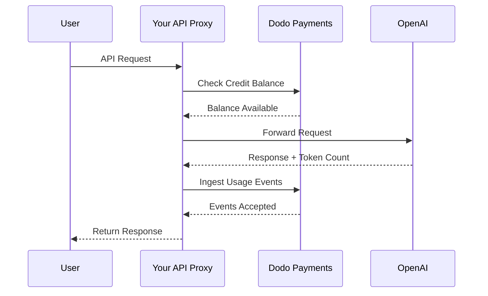
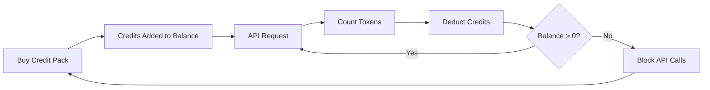

OpenAIの請求モデルはAI企業にとって金字塔です。API使用のためのプリペイド法定通貨クレジットと、消費者向け製品の定額サブスクリプションを組み合わせています。このハイブリッドなアプローチにより、予測可能な収益を確保しながら開発者が摩擦なく使用量を拡大できるようになっています。

## なぜOpenAIのモデルが標準なのか

AI業界は従来のSaaS請求では必ずしも対処できない独自の課題を抱えています。OpenAIのモデルはこれらの問題を同時に解決します。

1. **予測可能な収益と低リスク**: API使用に前払クレジットを要求することで、OpenAIはユーザーが支払えないほどの請求を抱えるリスクを排除しています。先に資金が入り、ユーザーは使用するごとにサービスを受け取ります。
2. **開発者のスケーラビリティ**: 5ドルのチャージは参入障壁が低く、アプリケーションが成長するにつれて、自動チャージや大きなパックの購入が可能になります。開始時の摩擦はほぼゼロで、成長に上限はありません。
3. **ユーザー心理**: クレジットを抽象的な「トークン」や「ポイント」ではなく法定通貨（USD）で表すことで価値を明確にします。まるでAIサービスの銀行口座のように感じられ、信頼を築き、企業が予算管理しやすくなります。

## OpenAIの請求方法

OpenAIは異なるユーザー需要に応える2つの請求モデルを運用しています。

1. **API（従量課金）**: APIは前払いの法定通貨クレジットを使用します。ユーザーは5ドル、10ドル、50ドル以上でアカウントにチャージします。これらのクレジットはドル価値を持っていますが、OpenAIの外では金銭的価値を持ちません。OpenAIは入力トークンと出力トークンで異なるレートを使用してトークン単位で課金します。クレジットは期限切れにならず、ユーザーの残高が0ドルになるとAPIコールは即座に失敗します。
2. **ChatGPT Plus、Team、Enterprise**: これらは定額制のサブスクリプションです。ChatGPT Plusは月額20ドル、Teamプランはユーザー1人あたり月額25ドルです。これらのプランには、ユーザーがブロックされる代わりに小さいモデルにダウングレードされるソフトキャップが設けられています。
3. **支出ベースのレート階層**: 時間をかけてより多く支払うと、より高いAPIレート制限がアンロックされます。これは請求履歴に直接結びついた信頼ベースのアクセススケーリングシステムです。

| モデル | 価格 | 入力トークン | 出力トークン |
| :--- | :--- | :--- | :--- |
| GPT-4o | 従量課金 | $2.50 / 100万 | $10.00 / 100万 |
| GPT-4o-mini | 従量課金 | $0.15 / 100万 | $0.60 / 100万 |
| o1 | 従量課金 | $15.00 / 100万 | $60.00 / 100万 |

| プラン | 価格 | 種類 |
| :--- | :--- | :--- |
| 無料 | $0 | 制限付きアクセス |
| Plus | $20 / 月 | ソフトキャップ付きサブスクリプション |
| Team | $25 / ユーザー / 月 | 席単位のサブスクリプション |
| Enterprise | カスタム | 請求書ベースの請求 |
## ユニークな点

OpenAIの請求戦略には、AIサービスに効果的な以下のような特徴があります。

- **法定通貨で表示されるクレジット**: クレジットはUSDで表示されるため、金銭的価値を感じられます。これにより開発者にとって価格が透明で理解しやすくなります。
- **有効期限なし**: 永久に有効な残高は「使わないと損」というプレッシャーを軽減します。ユーザーは価値が消えないと知っているため、大きな金額をチャージすることに抵抗がありません。
- **多次元のメータリング**: 入力と出力トークンは別々に追跡されますが、同じクレジット残高から差し引かれます。これにより、出力トークンを入力トークンより高価に設定することができます。
- **信頼階層**: 合計支出にレート制限を結びつけることで、ユーザーをプラットフォームに留め、長期顧客により良いパフォーマンスを提供します。

## 戦略的利点

このモデルは強力なフライホイールを生み出します。低い参入コストが開発者を引き込みます。プリペイドクレジットが即時のキャッシュフローを提供します。使用量ベースのスケーリングにより、開発者が成功すればOpenAIも成功します。サブスクリプションは開発者以外から安定した予測可能な収益基盤を提供します。

## Dodo Paymentsで再現する

Dodo Paymentsを使えば、OpenAIの請求モデルの複製が可能です。APIにはクレジットベース請求を、ChatGPT Plus側には標準的なサブスクリプションを使います。

<Steps>
  <Step title="Create a Fiat Credit Entitlement">
    まずDodo Paymentsのダッシュボードでクレジット権利を作成します。これがユーザーの中心的な残高になります。

    * **クレジットタイプ:** 法定通貨クレジット（USD）
    * **クレジット有効期限:** なし
    * **繰越:** 不要（有効期限がないため）
    * **超過利用:** 無効

    超過利用を無効にすることで、残高が0ドルになるとAPIコールが失敗する仕組みがOpenAIと同じになります。
  </Step>

  <Step title="Create Top-Up Products">
    異なるクレジットパック用に一回限りの支払い商品を作成します。5ドル、10ドル、50ドル、100ドルなどのオプションを提供するかもしれません。各商品に法定通貨クレジット権利を紐づけます。

    商品ごとのクレジット発行量はセント単位で設定します。50ドルパックであれば5000クレジットを発行します。

    ```typescript
    import DodoPayments from 'dodopayments';

    const client = new DodoPayments({
      bearerToken: process.env.DODO_PAYMENTS_API_KEY,
    });

    const session = await client.checkoutSessions.create({
      product_cart: [
        { product_id: 'prod_credit_pack_50', quantity: 1 }
      ],
      customer: { email: 'developer@example.com' },
      return_url: 'https://yourapp.com/dashboard'
    });
    ```

  </Step>
  <Step title="Create Usage Meters">
    トークン使用量を追跡するために2つのメーターを作成します。

    * `llm.input_tokens`: `tokens`プロパティに対する合計集計。
    * `llm.output_tokens`: `tokens`プロパティに対する合計集計。
    * 両方のメーターを法定通貨クレジット権利にリンクします。それぞれで「クレジットあたりのメーター単位」を設定する必要があります。

    ### クレジットあたりのメーター単位の計算

    GPT-4oの価格（入力トークン1Mあたり2.50ドル）に合わせるには、100セントに相当するトークン数を計算する必要があります。

    * **入力トークン:** 1,000,000トークン / $2.50 = $1あたり400,000トークン。
    * **出力トークン:** 1,000,000トークン / $10.00 = $1あたり100,000トークン。

    Dodoダッシュボードでは、入力用メーターで「クレジットあたりのメーター単位」を400,000、出力用で100,000に設定します。

  </Step>

  <Step title="Send Usage Events">
    各LLMリクエスト後に使用データをDodo Paymentsに送信します。入力と出力のイベントを1つのリクエストで送れます。

    ```typescript
    await client.usageEvents.ingest({
      events: [{
        event_id: `req_${requestId}`,
        customer_id: customerId,
        event_name: 'llm.input_tokens',
        timestamp: new Date().toISOString(),
        metadata: {
          model: 'gpt-4o',
          tokens: 1500
        }
      }, {
        event_id: `req_${requestId}_out`,
        customer_id: customerId,
        event_name: 'llm.output_tokens',
        timestamp: new Date().toISOString(),
        metadata: {
          model: 'gpt-4o',
          tokens: 800
        }
      }]
    });
    ```

  </Step>

  <Step title="Handle Balance Depletion">
    APIリクエストを処理する前にユーザーの残高を確認するべきです。残高がゼロまたはマイナスの場合は402エラーを返してください。

    ```typescript
    async function checkCreditsBeforeRequest(customerId: string) {
      const balance = await client.creditEntitlements.balances.retrieve(customerId, {
        credit_entitlement_id: 'credit_entitlement_id',
      });

      if (balance.available <= 0) {
        throw new Error('Insufficient credits. Please top up your account.');
      }
    }
    ```

    ### 残高不足Webhookの処理

    ユーザーが0ドルになるまで待たずに、残高が一定の閾値を下回った時点でメールやアプリ内通知をトリガーするWebhookを活用してください。

    ```typescript
    import DodoPayments from 'dodopayments';
    import express from 'express';

    const app = express();
    app.use(express.raw({ type: 'application/json' }));

    const client = new DodoPayments({
      bearerToken: process.env.DODO_PAYMENTS_API_KEY,
      webhookKey: process.env.DODO_PAYMENTS_WEBHOOK_KEY,
    });

    app.post('/webhooks/dodo', async (req, res) => {
      try {
        const event = client.webhooks.unwrap(req.body.toString(), {
          headers: {
            'webhook-id': req.headers['webhook-id'] as string,
            'webhook-signature': req.headers['webhook-signature'] as string,
            'webhook-timestamp': req.headers['webhook-timestamp'] as string,
          },
        });

        if (event.type === 'credit.balance_low') {
          const { customer_id, available_balance } = event.data;
          await sendLowBalanceEmail(customer_id, available_balance);
        }

        res.json({ received: true });
      } catch (error) {
        res.status(401).json({ error: 'Invalid signature' });
      }
    });
    ```

    <Tip>
      OpenAIはユーザーの残高がほぼ尽きたタイミングでこれらのメールを送り、サービス中断なしにチャージできる時間を提供します。
    </Tip>
  </Step>

  <Step title="Build the ChatGPT Subscription Side (Optional)">
    ChatGPT Plusのようなサブスクリプションプランを提供したい場合は、Dodo Paymentsで別のサブスクリプション商品を作成してください。これらはクレジット権利を必要としません。

    Teamプランでは、追加ユーザーごとにアドオンを追加することで席単位課金を行います。

    ```typescript
    const session = await client.checkoutSessions.create({
      product_cart: [
        { product_id: 'prod_plus_subscription', quantity: 1 }
      ],
      customer: { email: 'user@example.com' },
      return_url: 'https://yourapp.com/billing'
    });
    ```

    ### ソフトキャップの実装

    OpenAIのソフトキャップを再現するには、同じメーターを使用してサブスクリプションユーザーの使用量を追跡しますが、クレジット権利にはリンクしません。アプリケーションロジック内で現在の請求期間の使用量をチェックしてください。

    ```typescript
    async function checkSubscriptionUsage(customerId: string) {
      const usage = await getUsageForCurrentPeriod(customerId);
      
      if (usage > SOFT_CAP_THRESHOLD) {
        // Route to a smaller model instead of blocking
        return 'gpt-4o-mini';
      }
      
      return 'gpt-4o';
    }
    ```

  </Step>
</Steps>

## LLM Ingestion Blueprintで加速

上記のステップは使用イベントを手動で構築し送信する方法を示しています。プロダクション環境では、[LLM Ingestion Blueprint](/developer-resources/ingestion-blueprints/llm)がOpenAIクライアントを直接ラップし、自動トークン追跡を提供します。

```bash
npm install @dodopayments/ingestion-blueprints
```

```typescript
import { createLLMTracker } from '@dodopayments/ingestion-blueprints';
import OpenAI from 'openai';

const openai = new OpenAI({ apiKey: process.env.OPENAI_API_KEY });

const tracker = createLLMTracker({
  apiKey: process.env.DODO_PAYMENTS_API_KEY,
  environment: 'live_mode',
  eventName: 'llm.chat_completion',
});

const trackedClient = tracker.wrap({
  client: openai,
  customerId: customerId,
});

// Every API call now automatically tracks token usage
const response = await trackedClient.chat.completions.create({
  model: 'gpt-4o',
  messages: [{ role: 'user', content: prompt }],
});

// inputTokens, outputTokens, and totalTokens are sent automatically
console.log('Tokens used:', response.usage);
```

このブループリントは、すべてのAPIレスポンスから`inputTokens`、`outputTokens`、および`totalTokens`をキャプチャし、イベントメタデータとして送信します。適切なトークンプロパティで集計するようメーターを設定してください。

<Tip>
LLM BlueprintはOpenAI、Anthropic、Groq、Google Gemini、OpenRouter、Vercel AI SDKをサポートします。プロバイダー固有の例や高度な設定については[完全なブループリントドキュメント](/developer-resources/ingestion-blueprints/llm)を参照してください。
</Tip>

## 支出ベースのレート階層の実装

OpenAIのレート階層は容量管理に有効な手段です。これを実装するには、顧客の生涯支出を追跡します。

1. **生涯支出の追跡:** `payment.succeeded`のWebhookをリッスンし、その顧客の`total_spend`フィールドをデータベースで更新します。
2. **階層定義:** 支出額とレート制限のマッピングを作成します。
   * Tier 1: $0 - $50の支出 -> 3 RPM
   * Tier 2: $50 - $250の支出 -> 10 RPM
   * Tier 3: $250以上の支出 -> 50 RPM
3. **制限の適用:** APIミドルウェアで顧客の階層を確認し、対応するレート制限を適用します。

```typescript
async function getRateLimitForCustomer(customerId: string) {
  const customer = await db.customers.findUnique({ where: { id: customerId } });
  const totalSpend = customer.total_spend;

  if (totalSpend >= 25000) return TIER_3_LIMITS; // $250.00
  if (totalSpend >= 5000) return TIER_2_LIMITS;  // $50.00
  return TIER_1_LIMITS;
}
```

## 完全な実装例: APIプロキシ

実際には、ユーザーとLLMプロバイダーの間にAPIプロキシを置くケースが多いでしょう。このプロキシは認証、クレジット確認、使用報告を処理します。



```typescript
import DodoPayments from 'dodopayments';
import OpenAI from 'openai';

const client = new DodoPayments({
  bearerToken: process.env.DODO_PAYMENTS_API_KEY,
});
const openai = new OpenAI({ apiKey: process.env.OPENAI_API_KEY });

export async function handleApiRequest(req, res) {
  const { customerId, prompt, model } = req.body;

  try {
    // 1. Check credit balance
    const balance = await client.creditEntitlements.balances.retrieve(customerId, {
      credit_entitlement_id: 'credit_entitlement_id',
    });

    if (balance.available <= 0) {
      return res.status(402).json({ error: 'Insufficient credits. Please top up.' });
    }

    // 2. Call OpenAI
    const completion = await openai.chat.completions.create({
      model: model,
      messages: [{ role: 'user', content: prompt }],
    });

    const { prompt_tokens, completion_tokens } = completion.usage;

    // 3. Ingest usage events to Dodo
    await client.usageEvents.ingest({
      events: [
        {
          event_id: `req_${completion.id}_in`,
          customer_id: customerId,
          event_name: 'llm.input_tokens',
          timestamp: new Date().toISOString(),
          metadata: { model, tokens: prompt_tokens }
        },
        {
          event_id: `req_${completion.id}_out`,
          customer_id: customerId,
          event_name: 'llm.output_tokens',
          timestamp: new Date().toISOString(),
          metadata: { model, tokens: completion_tokens }
        }
      ]
    });

    // 4. Return response to user
    res.json(completion);

  } catch (error) {
    console.error('API Error:', error);
    res.status(500).json({ error: 'Internal server error' });
  }
}
```

## エッジケースの処理

OpenAIと同じくらい複雑な請求システムを構築する際には、慎重な対処が必要なエッジケースがいくつかあります。

### レースコンディション

残高が非常に少ないユーザーが同時に複数のリクエストを送信すると、最初のイベントが処理される前にクレジット限度を超えてしまうことがあります。これを防ぐために、小さな「バッファ」を実装するか、リクエスト中に顧客の残高に対して分散ロックを使用できます。

### イベント取り込みの遅延

Dodo Paymentsはイベントを非同期で処理します。このため、APIコールとクレジット差し引きの間にわずかな遅延が生じる場合があります。ほとんどのユースケースでは許容範囲です。厳密なリアルタイム制御が必要な場合は、ユーザー残高のローカルキャッシュを保持し、楽観的に更新できます。

### 返金処理

クレジットパックの購入を返金すると、Dodo Paymentsは設定に応じてクレジット権利を自動的に処理します。ただし、ユーザーが既に持っていないクレジットを使えないように、アプリケーションロジックでこの変更を即座に反映させる必要があります。

### マルチモデル対応

異なる価格の複数モデルをサポートする場合、2つの方法があります。
1. **別々のメーター:** 各モデル（例: `gpt-4o.input_tokens`、`gpt-4o-mini.input_tokens`）ごとにメーターを作成します。
2. **重み付けイベント:** 単一のメーターを使用し、Dodoに送信する前に`tokens`の値に重みを掛けます。たとえば、GPT-4oがGPT-4o-miniの10倍高価であれば、GPT-4oリクエストにはトークンを10倍にして送信できます。

OpenAIは使用量をモデルごとに明確に記録するために社内で別々のメーター方式を採用しています。

## アーキテクチャ概要



メーターはトークンを追跡し、設定したレートに応じてユーザーのクレジット残高から対応する金額を差し引きます。

## 結論

Dodo PaymentsでOpenAIの請求モデルを再現すれば、従量課金の柔軟性とプリペイドクレジットの予測可能性の両方を手に入れられます。このガイドに従うことで、ユーザーの成長に合わせてスケールしながらマージンを保護する請求システムを構築できます。

次の大規模LLMやニッチなAIツールを構築している場合でも、これらのパターンはプロフェッショナルで開発者に優しい体験を提供するのに役立ちます。このアプローチにより、提供するAIモデルと同じくらいスケーラブルで信頼できる請求インフラを実現できます。

## 使用している主なDodo機能

この実装を可能にする機能をご紹介します。

<CardGroup cols={2}>
  <Card title="Credit-Based Billing" icon="coins" href="/features/credit-based-billing">
    ユーザーのプリペイド法定通貨クレジットと権利を管理します。
  </Card>
  <Card title="Usage-Based Billing" icon="chart-line" href="/features/usage-based-billing/introduction">
    トークンのような詳細な使用量を追跡し、リアルタイムで課金します。
  </Card>
  <Card title="One-Time Payments" icon="credit-card" href="/features/one-time-payment-products">
    シンプルなチェックアウトフローでクレジットパックとチャージを販売します。
  </Card>
  <Card title="Event Ingestion" icon="bolt" href="/features/usage-based-billing/event-ingestion">
    大量の使用データをDodo Paymentsに簡単に送信します。
  </Card>
  <Card title="Webhooks" icon="webhook" href="/developer-resources/webhooks/intents/credit">
    クレジット残高の変更や残高不足アラートを受け取ることができます。
  </Card>
  <Card title="LLM Ingestion Blueprint" icon="brain-circuit" href="/developer-resources/ingestion-blueprints/llm">
    OpenAIやその他LLMプロバイダーのための自動トークン追跡。
  </Card>
</CardGroup>
