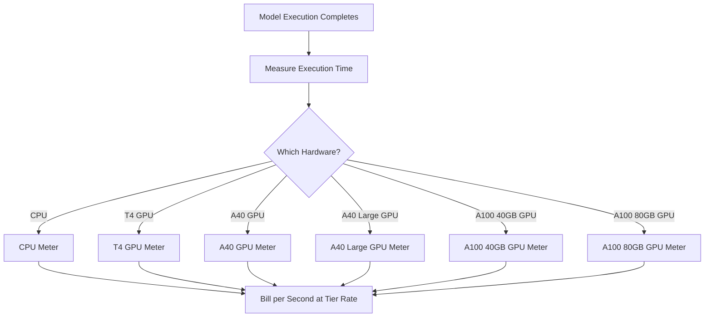

Replicateはクラウドでオープンソースの機械学習モデルを実行するためのプラットフォームです。同社の課金モデルは、AI業界で最も純粋な使用量ベースの価格設定の一例です。月額サブスクリプション料金やモデル実行ごとの定額料金はありません。代わりに、利用された正確な計算時間を秒単位で課金し、基礎となるハードウェアに応じて料金が変動します。

このアプローチは、実行時間が予測できないAIワークロードに適しています。単一のユーザーが数秒の軽量モデルを実行することもあれば、数分かかる大規模な生成モデルを動かすこともあります。モデル自体ではなく計算リソースにコストを紐づけることで、Replicateは価格を透明かつスケーラブルに維持しています。

## Replicateの請求方法

Replicateの価格設定は、実行する特定のモデルとは切り離されています。SDXLで画像を生成する場合も、Llama 3を実行する場合も、請求はハードウェア階層と実行時間によって決まります。これにより、各モデルごとに個別の料金プランを必要とせずに何千ものオープンソースモデルをホストできます。

| ハードウェア | 1秒あたりの料金 | 1時間あたりの料金 |
| :--- | :--- | :--- |
| NVIDIA CPU | \$0.000100 | \$0.36 |
| NVIDIA T4 GPU | \$0.000225 | \$0.81 |
| NVIDIA A40 GPU | \$0.000575 | \$2.07 |
| NVIDIA A40 (Large) GPU | \$0.000725 | \$2.61 |
| NVIDIA A100 (40GB) GPU | \$0.001150 | \$4.14 |
| NVIDIA A100 (80GB) GPU | \$0.001400 | \$5.04 |



1. **ハードウェア別料金**：1秒あたりのコストは必要な計算リソースによって変わります。各ハードウェア階層に異なる価格が設定されています。
2. **純粋な使用量ベースモデル**：月額料金も超過料金も制限もありません。「A100での12.4秒」といった正確な計算時間に対して請求され、1つの生成ごとではありません。
3. **1秒単位の粒度**：従来のクラウドプロバイダーは時間または分単位で課金するため、短時間のタスクでは無駄が発生します。1秒単位の課金は、小規模な実験にも大規模な本番ワークロードにも非効率を排除します。

<Info>
コールドスタートも課金対象です。モデルの最初のリクエストでは通常10〜30秒かけてモデルをメモリに読み込みます。この読み込み時間も実行時間と同じ料金で請求されます。
</Info>
## 特徴

* **ハードウェア別メータリング：** 同じモデルでもより高性能なハードウェアでは費用が高くなります。ユーザーは速度とコストを天秤にかけて選択できます。T4 GPUは時間に敏感でないタスクに、A100はリアルタイム用途に適しています。
* **1秒単位の粒度：** 課金は秒単位で計算されるため、短時間のタスクでの過剰請求が発生しません。
* **サブスクリプション不要：** 始めるためのコミットメントはゼロです。使用量に応じて無限にスケールするので、複数のモデルを試すスタートアップや開発者に最適です。
* **モデルに依存しない：** 画像生成、テキスト処理、音声転写、動画合成などタスクの種類に関係なく、課金ロジックは同じです。これにより、複雑な料金表なしに広範なモデルエコシステムをサポートできます。

## Dodo Paymentsで再現する

この課金モデルは、Dodo Paymentsの使用量ベース課金機能を使えば再現可能です。複数のメーターで異なるハードウェア階層をトラッキングし、それらを単一のプロダクトに紐づけることが鍵です。

<Steps>
  <Step title="Create Usage Meters (One Per Hardware Class)">
    各ハードウェア階層ごとに個別のメーターを作成します。ハードウェアごとに1秒あたりのコストが異なるため、独立したメータリングを行うことでDodoが各階層の価格を別々に設定し、明細付きの請求を提供できます。

    | メーター名 | イベント名 | 集計 | プロパティ |
    | :--- | :--- | :--- | :--- |
    | CPU Compute | `compute.cpu` | Sum | `execution_seconds` |
    | GPU T4 Compute | `compute.gpu_t4` | Sum | `execution_seconds` |
    | GPU A40 Compute | `compute.gpu_a40` | Sum | `execution_seconds` |
    | GPU A40 Large Compute | `compute.gpu_a40_large` | Sum | `execution_seconds` |
    | GPU A100 40GB Compute | `compute.gpu_a100_40` | Sum | `execution_seconds` |
    | GPU A100 80GB Compute | `compute.gpu_a100_80` | Sum | `execution_seconds` |

    `Sum`集計を`execution_seconds`プロパティに対して用いることで、請求期間中のハードウェア階層ごとの総計算時間を算出できます。
  </Step>

  <Step title="Create a Usage-Based Product">
    Dodo Paymentsのダッシュボードで新しいプロダクトを作成します:

    * **価格タイプ：** 使用量ベース課金
    * **ベース価格：** \$0/月（サブスクリプション料なし）
    * **請求頻度：** 月次

    すべてのメーターに1単位あたりの価格を設定して紐づけます:

    | メーター | 単位あたりの価格（1秒） |
    | :--- | :--- |
    | compute.cpu | \$0.000100 |
    | compute.gpu_t4 | \$0.000225 |
    | compute.gpu_a40 | \$0.000575 |
    | compute.gpu_a40_large | \$0.000725 |
    | compute.gpu_a100_40 | \$0.001150 |
    | compute.gpu_a100_80 | \$0.001400 |

    すべてのメーターに対して**Free Threshold**を0に設定します。実行の1秒ごとに課金対象となります。 
  </Step>

  <Step title="Send Usage Events">
    モデルの実行が完了するたびにDodoへ使用量イベントを送信します。各予測に固有の`event_id`を含めて冪等性を担保してください。

    ```typescript
    import DodoPayments from 'dodopayments';

    type HardwareTier = 'cpu' | 'gpu_t4' | 'gpu_a40' | 'gpu_a40_large' | 'gpu_a100_40' | 'gpu_a100_80';

    const client = new DodoPayments({
      bearerToken: process.env.DODO_PAYMENTS_API_KEY,
    });

    async function trackModelExecution(
      customerId: string,
      modelId: string,
      hardware: HardwareTier,
      executionSeconds: number,
      predictionId: string
    ) {
      const eventName = `compute.${hardware}`;

      await client.usageEvents.ingest({
        events: [{
          event_id: `pred_${predictionId}`,
          customer_id: customerId,
          event_name: eventName,
          timestamp: new Date().toISOString(),
          metadata: {
            execution_seconds: executionSeconds,
            model_id: modelId,
            hardware: hardware
          }
        }]
      });
    }

    // Example: SDXL image generation on A100
    await trackModelExecution(
      'cus_abc123',
      'stability-ai/sdxl',
      'gpu_a100_80',
      8.3,  // 8.3 seconds of A100 time
      'pred_xyz789'
    );
    ```

  </Step>

  <Step title="Measure Execution Time Precisely">
    `performance.now()`を使ってモデル実行の正確なタイミングを計測します。課金のために最小0.1秒単位で丸めてください。

    ```typescript
    async function runModelWithMetering(
      customerId: string,
      modelId: string,
      hardware: HardwareTier,
      input: Record<string, unknown>
    ) {
      const predictionId = `pred_${Date.now()}`;
      const startTime = performance.now();

      try {
        const result = await executeModel(modelId, input, hardware);
        const executionSeconds = (performance.now() - startTime) / 1000;
        const billedSeconds = Math.round(executionSeconds * 10) / 10;

        await trackModelExecution(
          customerId,
          modelId,
          hardware,
          billedSeconds,
          predictionId
        );

        return result;
      } catch (error) {
        // Still bill for compute time even on failure
        const executionSeconds = (performance.now() - startTime) / 1000;
        if (executionSeconds > 1) {
          await trackModelExecution(
            customerId,
            modelId,
            hardware,
            Math.round(executionSeconds * 10) / 10,
            predictionId
          );
        }
        throw error;
      }
    }
    ```

  </Step>

  <Step title="Create Checkout">
    ユーザーがサインアップしたら、使用量ベースプロダクトのチェックアウトセッションを作成します。Dodoが繰り返し課金と請求書発行を自動で処理します。

    ```typescript
    const session = await client.checkoutSessions.create({
      product_cart: [
        { product_id: 'prod_compute_payg', quantity: 1 }
      ],
      customer: { email: 'ml-engineer@company.com' },
      return_url: 'https://yourplatform.com/dashboard'
    });
    ```

  </Step>
</Steps>

## Time Range Ingestion Blueprintで加速

[Time Range Ingestion Blueprint](/developer-resources/ingestion-blueprints/time-range)は、1秒単位の計算追跡を簡素化します。ハードウェア階層ごとに1つのインジェストインスタンスを作成し、イベント送信をより整然とするために`trackTimeRange`を使用します。

```bash
npm install @dodopayments/ingestion-blueprints
```

```typescript
import { Ingestion, trackTimeRange } from '@dodopayments/ingestion-blueprints';

// Create one ingestion instance per hardware tier
function createHardwareIngestion(hardware: string) {
  return new Ingestion({
    apiKey: process.env.DODO_PAYMENTS_API_KEY,
    environment: 'live_mode',
    eventName: `compute.${hardware}`,
  });
}

const ingestions: Record<string, Ingestion> = {
  cpu: createHardwareIngestion('cpu'),
  gpu_t4: createHardwareIngestion('gpu_t4'),
  gpu_a40: createHardwareIngestion('gpu_a40'),
  gpu_a40_large: createHardwareIngestion('gpu_a40_large'),
  gpu_a100_40: createHardwareIngestion('gpu_a100_40'),
  gpu_a100_80: createHardwareIngestion('gpu_a100_80'),
};

// Track execution after a model run completes
const startTime = performance.now();
const result = await executeModel(modelId, input, hardware);
const durationMs = performance.now() - startTime;

await trackTimeRange(ingestions[hardware], {
  customerId: customerId,
  durationMs: durationMs,
  metadata: {
    model_id: modelId,
    hardware: hardware,
  },
});
```

このブループリントは期間のフォーマットやイベント構築を処理します。ハードウェアごとのインジェストインスタンスと併せることで、Replicateの多層メータリングにきれいに対応できます。

<Tip>
長時間実行されるジョブには、Time Range Blueprintとインターバルベースのハートビート追跡を組み合わせます。高度なパターンは[完全なブループリントドキュメント](/developer-resources/ingestion-blueprints/time-range)を参照してください。
</Tip>

## ユーザー向けのコスト見積もり

使用量ベースの課金は予測が難しいため、モデル実行前にユーザーへコスト見積もりを提供しましょう。驚きの請求を防ぎ、信頼を築くことができます。

### コスト計算の例

| モデル | ハードウェア | 平均時間 | 実行あたりのコスト |
| :--- | :--- | :--- | :--- |
| SDXL（画像） | A100 80GB | 約8秒 | 約\$0.0112 |
| Llama 3（テキスト） | A100 40GB | 約3秒 | 約\$0.0035 |
| Whisper（音声） | GPU T4 | 約15秒 | 約\$0.0034 |

### コスト計算機の構築

```typescript
function estimateCost(hardware: HardwareTier, estimatedSeconds: number): number {
  const rates: Record<HardwareTier, number> = {
    'cpu': 0.000100,
    'gpu_t4': 0.000225,
    'gpu_a40': 0.000575,
    'gpu_a40_large': 0.000725,
    'gpu_a100_40': 0.001150,
    'gpu_a100_80': 0.001400
  };

  return Number((rates[hardware] * estimatedSeconds).toFixed(4));
}

// Show the user before running: "This will cost approximately $0.0098"
const estimate = estimateCost('gpu_a100_80', 8.5);
```

## エンタープライズ：予約キャパシティ

確実な可用性とコールドスタートなしを求めるエンタープライズ顧客には、Replicateは「Private Instances」を固定時間料金で提供しています。

Dodo Paymentsではこれをサブスクリプション型プロダクトとしてモデル化できます:

* **プロダクトタイプ：** サブスクリプション
* **価格：** 固定月額料金（例：「Reserved A100 Instance - \$500/月」）
* **請求サイクル：** 月次

モニタリングや分析のために使用量イベントを送信し続けることもできますが、サブスクリプションがコストをカバーします。ユーザーのボリュームが増えるにつれて、従量課金から予約キャパシティへの切り替えの方がコスト効率が良くなることが多いです。

## 上級：ハートビートメータリング

数分または数時間かかるタスクでは、終了時に1つだけイベントを送信するのはリスクがあります。プロセスがクラッシュすると使用量データが失われてしまいます。よりよい方法は、実行中に30〜60秒ごとに使用量イベントを送信することです。

```typescript
async function runLongTaskWithHeartbeat(
  customerId: string,
  modelId: string,
  hardware: HardwareTier
) {
  const predictionId = `pred_${Date.now()}`;
  let totalSeconds = 0;

  const heartbeatInterval = setInterval(async () => {
    try {
      await trackModelExecution(
        customerId,
        modelId,
        hardware,
        30,
        `${predictionId}_${totalSeconds}`
      );
      totalSeconds += 30;
    } catch (error) {
      console.error('Heartbeat tracking failed:', error, { predictionId, totalSeconds });
    }
  }, 30000);

  try {
    await executeLongTask();
  } finally {
    clearInterval(heartbeatInterval);
  }
}
```

## 主なDodo機能

<CardGroup cols={2}>
  <Card title="Usage-Based Billing" icon="chart-line" href="/features/usage-based-billing/introduction">
    消費量に応じた課金を行うプロダクトを設定します。
  </Card>
  <Card title="Meters" icon="gauge" href="/features/usage-based-billing/meters">
    トラッキングと課金対象のメトリクスを定義します。
  </Card>
  <Card title="Event Ingestion" icon="bolt" href="/features/usage-based-billing/event-ingestion">
    リアルタイムでDodoに使用量データを送信します。
  </Card>
  <Card title="Subscriptions" icon="calendar" href="/features/subscription">
    予約キャパシティやエンタープライズプランの継続課金を管理します。
  </Card>
  <Card title="Time Range Blueprint" icon="clock" href="/developer-resources/ingestion-blueprints/time-range">
    秒単位の計算追跡と期間補助機能。
  </Card>
</CardGroup>
