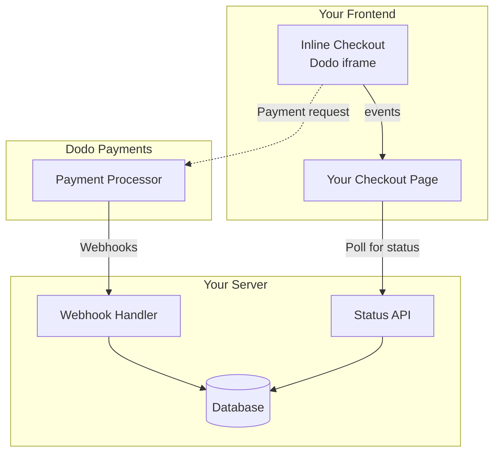

## 概要

インラインチェックアウトを使用すると、ウェブサイトやアプリケーションにシームレスに統合されたチェックアウト体験を作成できます。[オーバーレイチェックアウト](/developer-resources/overlay-checkout)とは異なり、インラインチェックアウトは支払いフォームをページレイアウトに直接埋め込みます。

インラインチェックアウトを使用すると、次のことができます：

- アプリやウェブサイトと完全に統合されたチェックアウト体験を作成する
- Dodo Paymentsが顧客と支払い情報を安全にキャプチャする最適化されたチェックアウトフレームを提供する
- Dodo Paymentsからのアイテム、合計、その他の情報をページに表示する
- SDKメソッドとイベントを使用して高度なチェックアウト体験を構築する

<Frame>
    
</Frame>

## 仕組み

インラインチェックアウトは、ウェブサイトやアプリに安全なDodo Paymentsフレームを埋め込むことで機能します。

チェックアウトフレームは、顧客情報の収集と支払い詳細のキャプチャを処理します。あなたのページには、アイテムリスト、合計、チェックアウトの内容を変更するためのオプションが表示されます。SDKを使用すると、ページとチェックアウトフレームが相互にやり取りできます。

Dodo Paymentsは、チェックアウトが完了すると自動的にサブスクリプションを作成し、あなたがプロビジョニングできるようにします。

<Note>
インラインチェックアウトフレームは、すべての機密支払い情報を安全に処理し、追加の認証なしでPCI準拠を確保します。
</Note>

## 良いインラインチェックアウトとは？

顧客が誰から購入しているのか、何を購入しているのか、いくら支払っているのかを知ることが重要です。

コンプライアンスがあり、コンバージョンに最適化されたインラインチェックアウトを構築するには、実装に次の要素を含める必要があります：

<Frame caption="Example inline checkout layout showing required elements">
    
</Frame>

1. **定期情報**：定期的な場合、どのくらいの頻度で繰り返されるかと更新時の合計金額。トライアルの場合、トライアルの期間。
2. **アイテムの説明**：購入されるものの説明。
3. **取引合計**：小計、総税、合計金額を含む取引合計。通貨も含めることを忘れないでください。
4. **Dodo Paymentsのフッター**：Dodo Paymentsに関する情報、販売条件、プライバシーポリシーを含む完全なインラインチェックアウトフレーム。
5. **返金ポリシー**：Dodo Paymentsの標準返金ポリシーと異なる場合は、返金ポリシーへのリンク。

<Warning>
インラインチェックアウトフレーム全体（フッターを含む）を常に表示してください。法的情報を削除または非表示にすると、準拠要件に違反します。
</Warning>

## 顧客の旅

チェックアウトフローは、チェックアウトセッションの設定によって決まります。チェックアウトセッションをどのように設定するかによって、顧客はすべての情報が1ページに表示されるか、複数のステップに分かれるチェックアウトを体験します。

<Steps>
<Step title="Customer opens checkout">

アイテムまたは既存のトランザクションを渡すことでインラインチェックアウトを開くことができます。SDKを使用してページ上の情報を表示および更新し、顧客のインタラクションに基づいてアイテムを更新するためのSDKメソッドを使用します。
    

</Step>

<Step title="Customer enters their details">

インラインチェックアウトは、最初に顧客にメールアドレスを入力し、国を選択し、（必要に応じて）郵便番号を入力するように求めます。このステップでは、税金と利用可能な支払いオプションを決定するために必要なすべての情報を収集します。

顧客の詳細を事前に入力し、保存された住所を提示して体験をスムーズにすることができます。

</Step>

<Step title="Customer selects payment method">

詳細を入力した後、顧客には利用可能な支払い方法と支払いフォームが表示されます。オプションには、クレジットカードまたはデビットカード、PayPal、Apple Pay、Google Pay、そして顧客の所在地に基づくその他のローカル支払い方法が含まれる場合があります。

利用可能な場合は、保存された支払い方法を表示してチェックアウトを迅速化します。


</Step>

<Step title="Checkout completed">

Dodo Paymentsは、すべての支払いをその販売に最適なアクワイアラーにルーティングし、成功の可能性を最大限に高めます。顧客は、あなたが構築できる成功ワークフローに入ります。


</Step>

<Step title="Dodo Payments creates subscription">

Dodo Paymentsは、顧客のために自動的にサブスクリプションを作成し、あなたがプロビジョニングできるようにします。顧客が使用した支払い方法は、更新やサブスクリプションの変更のためにファイルに保持されます。


</Step>
</Steps>

## クイックスタート

Dodo Paymentsのインラインチェックアウトを数行のコードで始めましょう：

```typescript
import { DodoPayments } from "dodopayments-checkout";

// Initialize the SDK for inline mode
DodoPayments.Initialize({
  mode: "test",
  displayType: "inline",
  onEvent: (event) => {
    console.log("Checkout event:", event);
  },
});

// Open checkout in a specific container
DodoPayments.Checkout.open({
  checkoutUrl: "https://test.dodopayments.com/session/cks_123",
  elementId: "dodo-inline-checkout" // ID of the container element
});
```

<Tip>
ページに該当する `id` を持つコンテナ要素があることを確認してください: `<div id="dodo-inline-checkout"></div>`。
</Tip>

## ステップバイステップの統合ガイド

<Steps>
<Step title="Install the SDK">

Dodo Payments Checkout SDKをインストールします：

<CodeGroup>

```bash npm
npm install dodopayments-checkout
```

```bash yarn
yarn add dodopayments-checkout
```

```bash pnpm
pnpm add dodopayments-checkout
```

</CodeGroup>

</Step>

<Step title="Initialize the SDK for Inline Display">

SDK を初期化し、`displayType: 'inline'` を指定します。また、`checkout.breakdown` イベントを監視して、リアルタイムの税金および合計計算で UI を更新してください。

```typescript
import { DodoPayments } from "dodopayments-checkout";

DodoPayments.Initialize({
  mode: "test",
  displayType: "inline",
  onEvent: (event) => {
    if (event.event_type === "checkout.breakdown") {
      const breakdown = event.data?.message;
      // Update your UI with breakdown.subTotal, breakdown.tax, breakdown.total, etc.
    }
  },
});
```

</Step>

<Step title="Create a Container Element">

チェックアウトフレームが挿入されるHTMLに要素を追加します：

```html
<div id="dodo-inline-checkout"></div>
```

</Step>

<Step title="Open the Checkout">

コンテナの `checkoutUrl` および `elementId` を使用して `DodoPayments.Checkout.open()` を呼び出します:

```typescript
DodoPayments.Checkout.open({
  checkoutUrl: "https://test.dodopayments.com/session/cks_123",
  elementId: "dodo-inline-checkout"
});
```

</Step>

<Step title="Test Your Integration">

1. 開発サーバーを起動します：

```bash
npm run dev
```

2. チェックアウトフローをテストします：
   - インラインフレームにメールアドレスと住所の詳細を入力します。
   - カスタム注文概要がリアルタイムで更新されることを確認します。
   - テスト資格情報を使用して支払いフローをテストします。
   - リダイレクトが正しく機能することを確認します。

<Check>
`checkout.breakdown` イベントが `onEvent` コールバック内に console log を追加していればブラウザのコンソールに記録されるのが確認できます。
</Check>

</Step>

<Step title="Go Live">

本番環境の準備ができたら：

1. モードを `'live'` に変更します:

```typescript
DodoPayments.Initialize({
  mode: "live",
  displayType: "inline",
  onEvent: (event) => {
    // Handle events
  }
});
```

2. チェックアウトURLをバックエンドからのライブチェックアウトセッションを使用するように更新します。
3. 本番環境で完全なフローをテストします。

</Step>
</Steps>

## 完全なReactの例

この例では、`checkout.breakdown` イベントを使用してインラインチェックアウトと連携しながら、カスタム注文概要を同期させる方法を示しています。

```tsx
"use client";

import { useEffect, useState } from 'react';
import { DodoPayments, CheckoutBreakdownData } from 'dodopayments-checkout';

export default function CheckoutPage() {
  const [breakdown, setBreakdown] = useState<Partial<CheckoutBreakdownData>>({});

  useEffect(() => {
    // 1. Initialize the SDK
    DodoPayments.Initialize({
      mode: 'test',
      displayType: 'inline',
      onEvent: (event) => {
        // 2. Listen for the 'checkout.breakdown' event
        if (event.event_type === "checkout.breakdown") {
          const message = event.data?.message as CheckoutBreakdownData;
          if (message) setBreakdown(message);
        }
      }
    });

    // 3. Open the checkout in the specified container
    DodoPayments.Checkout.open({
      checkoutUrl: 'https://test.dodopayments.com/session/cks_123',
      elementId: 'dodo-inline-checkout'
    });

    return () => DodoPayments.Checkout.close();
  }, []);

  const format = (amt: number | null | undefined, curr: string | null | undefined) => 
    amt != null && curr ? `${curr} ${(amt/100).toFixed(2)}` : '0.00';

  const currency = breakdown.currency ?? breakdown.finalTotalCurrency ?? '';

  return (
    <div className="flex flex-col md:flex-row min-h-screen">
      {/* Left Side - Checkout Form */}
      <div className="w-full md:w-1/2 flex items-center">
        <div id="dodo-inline-checkout" className='w-full' />
      </div>

      {/* Right Side - Custom Order Summary */}
      <div className="w-full md:w-1/2 p-8 bg-gray-50">
        <h2 className="text-2xl font-bold mb-4">Order Summary</h2>
        <div className="space-y-2">
          {breakdown.subTotal && (
            <div className="flex justify-between">
              <span>Subtotal</span>
              <span>{format(breakdown.subTotal, currency)}</span>
            </div>
          )}
          {breakdown.discount && (
            <div className="flex justify-between">
              <span>Discount</span>
              <span>{format(breakdown.discount, currency)}</span>
            </div>
          )}
          {breakdown.tax != null && (
            <div className="flex justify-between">
              <span>Tax</span>
              <span>{format(breakdown.tax, currency)}</span>
            </div>
          )}
          <hr />
          {(breakdown.finalTotal ?? breakdown.total) && (
            <div className="flex justify-between font-bold text-xl">
              <span>Total</span>
              <span>{format(breakdown.finalTotal ?? breakdown.total, breakdown.finalTotalCurrency ?? currency)}</span>
            </div>
          )}
        </div>
      </div>
    </div>
  );
}

```

## APIリファレンス

### 設定

#### 初期化オプション

```typescript
interface InitializeOptions {
  mode: "test" | "live";
  displayType: "inline"; // Required for inline checkout
  onEvent: (event: CheckoutEvent) => void;
}
```

| オプション | タイプ | 必須 | 説明 |
|--------|------|----------|-------------|
| `mode` | `"test" \| "live"` | Yes | 環境モード。 |
| `displayType` | `"inline" \| "overlay"` | Yes | チェックアウトを埋め込むには `"inline"` に設定する必要があります。 |
| `onEvent` | `function` | Yes | チェックアウトイベントを処理するコールバック関数。 |

#### チェックアウトオプション

```typescript
export type FontSize = "xs" | "sm" | "md" | "lg" | "xl" | "2xl";
export type FontWeight = "normal" | "medium" | "bold" | "extraBold";

interface CheckoutOptions {
  checkoutUrl: string;
  elementId: string; // Required for inline checkout
  options?: {
    showTimer?: boolean;
    showSecurityBadge?: boolean;
    manualRedirect?: boolean;
    payButtonText?: string;
    fontSize?: FontSize;
    fontWeight?: FontWeight;
  };
}
```

| オプション | タイプ | 必須 | 説明 |
|----------|--------|------|------|
| `checkoutUrl` | `string` | はい | チェックアウトセッションの URL。 |
| `elementId` | `string` | はい | チェックアウトを表示する DOM 要素の `id`。 |
| `options.showTimer` | `boolean` | いいえ | チェックアウトタイマーを表示または非表示にします。デフォルトは `true` です。無効にするとセッションの有効期限切れを告げる `checkout.link_expired` イベントを受信します。 |
| `options.showSecurityBadge` | `boolean` | いいえ | セキュリティバッジを表示または非表示にします。デフォルトは `true` です。 |
| `options.manualRedirect` | `boolean` | いいえ | 有効にすると、完了後にチェックアウトが自動的にリダイレクトされません。代わりに `checkout.status` と `checkout.redirect_requested` イベントを受信して、自分でリダイレクトを処理できます。 |
| `options.payButtonText` | `string` | いいえ | 支払いボタンに表示するカスタムテキスト。 |
| `options.fontSize` | `FontSize` | いいえ | チェックアウトのグローバルフォントサイズ。 |
| `options.fontWeight` | `FontWeight` | いいえ | チェックアウトのグローバルフォントウェイト。 |

### メソッド

#### チェックアウトを開く

指定されたコンテナにチェックアウトフレームを開きます。

```typescript
DodoPayments.Checkout.open({
  checkoutUrl: "https://test.dodopayments.com/session/cks_123",
  elementId: "dodo-inline-checkout"
});
```

チェックアウトの動作をカスタマイズするために追加のオプションを渡すこともできます:

```typescript
DodoPayments.Checkout.open({
  checkoutUrl: "https://test.dodopayments.com/session/cks_123",
  elementId: "dodo-inline-checkout",
  options: {
    showTimer: false,
    showSecurityBadge: false,
    manualRedirect: true,
    payButtonText: "Pay Now",
  },
});
```

`manualRedirect` を使用する場合は `onEvent` コールバック内でチェックアウト完了を処理してください:

```typescript
DodoPayments.Initialize({
  mode: "test",
  displayType: "inline",
  onEvent: (event) => {
    if (event.event_type === "checkout.status") {
      const status = event.data?.message?.status;
      // Handle status: "succeeded", "failed", or "processing"
    }
    if (event.event_type === "checkout.redirect_requested") {
      const redirectUrl = event.data?.message?.redirect_to;
      // Redirect the customer manually
      window.location.href = redirectUrl;
    }
    if (event.event_type === "checkout.link_expired") {
      // Handle expired checkout session
    }
  },
});
```

#### チェックアウトを閉じる

プログラムでチェックアウトフレームを削除し、イベントリスナーをクリーンアップします。

```typescript
DodoPayments.Checkout.close();
```

#### ステータスを確認

チェックアウトフレームが現在注入されているかどうかを返します。

```typescript
const isOpen = DodoPayments.Checkout.isOpen();
// Returns: boolean
```

### イベント

SDK は `onEvent` コールバックを通じてリアルタイムイベントを提供します。インラインチェックアウトでは、`checkout.breakdown` が UI を同期させる上で特に役立ちます。

| イベントタイプ | 説明 |
|------------|-------------|
| `checkout.opened` | チェックアウトフレームが読み込まれました。 |
| `checkout.form_ready` | チェックアウトフォームがユーザー入力に対応する準備完了。読み込み状態を隠してチェックアウト UI を表示するのに便利です。 |
| `checkout.breakdown` | 価格、税金、割引が更新されたときに発火します。 |
| `checkout.customer_details_submitted` | 顧客情報が送信されました。 |
| `checkout.pay_button_clicked` | 顧客が支払ボタンをクリックしたときに発火。分析やコンバージョンファネルの追跡に便利です。 |
| `checkout.redirect` | チェックアウトがリダイレクトを行います（例：銀行ページ）。 |
| `checkout.error` | チェックアウト中にエラーが発生しました。 |
| `checkout.link_expired` | チェックアウトセッションが期限切れになったときに発火。`showTimer` を `false` に設定した場合のみ受信します。 |
| `checkout.status` | `manualRedirect` が有効なときに発火。チェックアウトのステータス（`succeeded`、`failed`、または `processing`）を含みます。 |
| `checkout.redirect_requested` | `manualRedirect` が有効なときに発火。顧客をリダイレクトする URL を含みます。 |

#### チェックアウトの内訳データ

`checkout.breakdown` イベントは以下のデータを提供します:

```typescript
interface CheckoutBreakdownData {
  subTotal?: number;          // Amount in cents
  discount?: number;         // Amount in cents
  tax?: number;              // Amount in cents
  total?: number;            // Amount in cents
  currency?: string;         // e.g., "USD"
  finalTotal?: number;       // Final amount including adjustments
  finalTotalCurrency?: string; // Currency for the final total
}
```

#### チェックアウトステータスイベントデータ

`manualRedirect` が有効な場合、次のデータを伴う `checkout.status` イベントを受け取ります:

```typescript
interface CheckoutStatusEventData {
  message: {
    status?: "succeeded" | "failed" | "processing";
  };
}
```

#### チェックアウトリダイレクト要求イベントデータ

`manualRedirect` が有効な場合、次のデータを伴う `checkout.redirect_requested` イベントを受け取ります:

`checkout.breakdown` イベントは、アプリケーションの UI を Dodo Payments のチェックアウト状態と同期させる主要な方法です。

#### 内訳イベントの理解

The `checkout.breakdown` event is the primary way to keep your application's UI in sync with the Dodo Payments checkout state.

**発火するタイミング:**
- **初期化時**: チェックアウトフレームが読み込まれ、準備が整った直後。
- **住所変更時**: 顧客が国を選択したり、税金の再計算を引き起こす郵便番号を入力したとき。

**フィールドの詳細:**

| フィールド | 説明 |
|-------|-------------|
| `subTotal` | 割引や税金を適用する前のすべての行項目の合計金額。 |
| `discount` | 適用されたすべての割引の合計金額。 |
| `tax` | 計算された税額。`inline` モードでは、ユーザーが住所フィールドと対話するたびに動的に更新されます。 |
| `total` | セッションの基準通貨での `subTotal - discount + tax` の計算結果。 |
| `currency` | 標準の小計、割引、税額に使用される ISO 通貨コード（例: `"USD"`）。 |
| `finalTotal` | 顧客に請求される実際の金額。基本価格内訳に含まれない為替調整やローカル決済手数料が含まれる場合があります。 |
| `finalTotalCurrency` | 顧客が実際に支払う通貨。購買力平価やローカル通貨換算が有効な場合、`currency` と異なることがあります。 |

**統合のための重要なヒント:**

1.  **通貨フォーマット**: 価格は常に最小通貨単位（例: USD はセント、JPY は円）で整数として返されます。表示するには100（または適切な10の累乗）で割るか、`Intl.NumberFormat` のようなフォーマットライブラリを使用してください。
2.  **初期状態の処理**: チェックアウト最初の読み込み時、`tax` および `discount` は、ユーザーが請求情報を入力するかコードを適用するまで `0` または `null` になる可能性があります。UI ではこれらの状態を適切に処理してください（例: ダッシュ `—` を表示するか行を非表示にするなど）。
3.  **「Final Total」と「Total」**: `total` は標準的な価格計算を示しますが、`finalTotal` が取引の真実のソースです。`finalTotal` が存在する場合、動的調整を含めて顧客のカードに請求される金額を正確に反映します。
4.  **リアルタイムフィードバック**: `tax` フィールドを使用して税金がリアルタイムで計算されていることをユーザーに示してください。これによりチェックアウトページに「ライブ」感が生まれ、住所入力時の摩擦が軽減されます。

## 実装オプション

### パッケージマネージャーのインストール

npm、yarn、またはpnpmを使用して、[ステップバイステップの統合ガイド](#step-by-step-integration-guide)に示されているようにインストールします。

### CDN実装

ビルドステップなしで迅速に統合するには、CDNを使用できます:

```html
<!DOCTYPE html>
<html lang="en">
<head>
    <meta charset="UTF-8">
    <meta name="viewport" content="width=device-width, initial-scale=1.0">
    <title>Dodo Payments Inline Checkout</title>
    
    <!-- Load DodoPayments -->
    <script src="https://cdn.jsdelivr.net/npm/dodopayments-checkout@latest/dist/index.js"></script>
    <script>
        // Initialize the SDK
        DodoPaymentsCheckout.DodoPayments.Initialize({
            mode: "test",
            displayType: "inline",
            onEvent: (event) => {
                console.log('Checkout event:', event);
            }
        });
    </script>
</head>
<body>
    <div id="dodo-inline-checkout"></div>

    <script>
        // Open the checkout
        DodoPaymentsCheckout.DodoPayments.Checkout.open({
            checkoutUrl: "https://test.dodopayments.com/session/cks_123",
            elementId: "dodo-inline-checkout"
        });
    </script>
</body>
</html>
```

## 支払い方法の更新

インラインチェックアウトでは、サブスクリプションの**支払い方法更新**に対応しています。顧客がアクティブなサブスクリプションの支払い情報を更新する場合や保留中のサブスクリプションを再開する場合でも、ページレイアウト内に更新フローを直接表示できます。

### 仕組み

1. [支払い方法更新 API](/features/subscription#update-payment-method-for-active-subscription) を呼び出して `payment_link` を取得します:

```typescript
const response = await client.subscriptions.updatePaymentMethod('sub_123', {
  type: 'new',
  return_url: 'https://example.com/return'
});
```

2. 返却された `payment_link` を `checkoutUrl` として渡し、インラインチェックアウトを開きます:

```typescript
DodoPayments.Checkout.open({
  checkoutUrl: response.payment_link,
  elementId: "dodo-inline-checkout"
});
```

インラインフレームは支払い方法入力フォームのみをレンダリングします。顧客はページを離れることなく、新しいカード情報を入力したり保存済みの支払い方法を選択したりできます。

### 保留中サブスクリプションの場合

`on_hold` 状態のサブスクリプションの支払い方法を更新する際、Dodo Payments は残りの未払い分に対して自動的に課金を行います。再開を確認するには `payment.succeeded` および `subscription.active` のウェブフックを監視してください。

```typescript
const response = await client.subscriptions.updatePaymentMethod('sub_123', {
  type: 'new',
  return_url: 'https://example.com/return'
});

if (response.payment_id) {
  // Charge created for remaining dues
  // Open inline checkout for payment collection
  DodoPayments.Checkout.open({
    checkoutUrl: response.payment_link,
    elementId: "dodo-inline-checkout"
  });
}
```

<Tip>
既存の保存済み支払い方法を使用する場合は、Update Payment Method API に `type: 'existing'` と `payment_method_id` を渡して新しい入力を収集する代わりに使用できます。
</Tip>

## エラー処理

SDK はイベントシステムを通じて詳細なエラー情報を提供します。常に `onEvent` コールバックで適切なエラー処理を実装してください:

```typescript
DodoPayments.Initialize({
  mode: "test",
  displayType: "inline",
  onEvent: (event: CheckoutEvent) => {
    if (event.event_type === "checkout.error") {
      console.error("Checkout error:", event.data?.message);
      // Handle error appropriately
    }
  }
});
```

<Warning>
問題が発生したときに良好なユーザー体験を提供するため、常に `checkout.error` イベントを処理してください。
</Warning>

## ベストプラクティス

1. **レスポンシブデザイン**: コンテナ要素に十分な幅と高さがあることを確認してください。iframe は通常、コンテナ全体を占めるように拡張されます。
2. **同期**: `checkout.breakdown` イベントを使用して、独自の注文概要や価格表をチェックアウトフレーム内の表示と同期させます。
3. **スケルトン状態**: `checkout.opened` イベントが発火するまで、コンテナ内に読み込みインジケーターを表示してください。
4. **クリーンアップ**: コンポーネントがアンマウントされるときに `DodoPayments.Checkout.close()` を呼び出し、iframe とイベントリスナーを整理してください。

<Info>
ダークモード実装では、`#0d0d0d` を背景色として使用すると、インラインチェックアウトフレームと視覚的に統合しやすくなります。
</Info>

## 支払いステータスの検証

<Warning>
インラインチェックアウトのイベントだけで支払いの成功や失敗を判断しないでください。常にウェブフックやポーリングを使ったサーバー側の検証を実装してください。
</Warning>

### なぜサーバー側の検証が不可欠なのか

`checkout.status` のようなインラインチェックアウトイベントはリアルタイムのフィードバックを提供しますが、支払いステータスの唯一の情報源にすべきではありません。ネットワーク障害、ブラウザのクラッシュ、ユーザーがページを閉じるなどの理由でイベントが失われることがあります。信頼性の高い支払い検証を確実に行うには次のことを行ってください:

1. **サーバーはウェブフックイベントをリッスンするべきです** - Dodo Payments は支払いステータスの変化に関するウェブフックを送信します
2. **ポーリング機構を実装する** - フロントエンドはステータス更新のためにサーバーをポーリングするべきです
3. **両方のアプローチを組み合わせる** - ウェブフックを主な情報源とし、ポーリングをフォールバックとして使用します

### 推奨アーキテクチャ



### 実装ステップ

**1. チェックアウトイベントをリッスンする** - ユーザーが支払いをクリックしたら、ステータスを検証する準備を開始します:

```typescript
onEvent: (event) => {
  if (event.event_type === 'checkout.status') {
    // Start polling your server for confirmed status
    startPolling();
  }
}
```

**2. サーバーをポーリングする** - ウェブフックによって更新された支払いステータスをデータベースで確認するエンドポイントを作成します:

```typescript
// Poll every 2 seconds until status is confirmed
const interval = setInterval(async () => {
  const { status } = await fetch(`/api/payments/${paymentId}/status`).then(r => r.json());
  if (status === 'succeeded' || status === 'failed') {
    clearInterval(interval);
    handlePaymentResult(status);
  }
}, 2000);
```

**3. サーバー側でウェブフックを処理する** - Dodo が `payment.succeeded` または `payment.failed` のウェブフックを送信したときにデータベースを更新します。詳細は [Webhooks documentation](/developer-resources/webhooks) を参照してください。

### リダイレクトの処理（3DS、Google Pay、UPI）

`manualRedirect: true` を使用している場合、特定の支払い方法では認証のためにユーザーをページからリダイレクトする必要があります:

- **3Dセキュア（3DS）** - カード認証
- **Google Pay** - 一部のフローでウォレット認証
- **UPI** - インドの支払い方法リダイレクト

リダイレクトが必要な場合、`checkout.redirect_requested` イベントを受信します。提供された URL にユーザーをリダイレクトしてください:

```typescript
if (event.event_type === 'checkout.redirect_requested') {
  const redirectUrl = event.data?.message?.redirect_to;
  // Save payment ID before redirect, then redirect
  sessionStorage.setItem('pendingPaymentId', paymentId);
  window.location.href = redirectUrl;
}
```

認証が完了（成功/失敗問わず）すると、ユーザーはページに戻ってきます。**ユーザーが戻ってきたからといって成功したとは限りません。**代わりに次の手順を行ってください:

1. ユーザーがリダイレクトから戻ってきたか（例: `sessionStorage` を介して）確認する
2. サーバーに対して支払いステータスを確認するポーリングを開始する
3. ポーリング中に「支払いを検証中...」状態を表示する
4. サーバーで確認されたステータスに基づいて成功/失敗の UI を表示する

<Tip>
リダイレクト後は常にサーバー側で支払いステータスを検証してください。ユーザーがページに戻ってきただけでは、認証が完了したということしか意味しないため、支払いが成功したか失敗したかはわかりません。
</Tip>

## トラブルシューティング

<AccordionGroup>
<Accordion title="Checkout frame is not appearing">
- `elementId` が実際に DOM に存在する `div` の `id` と一致していることを確認してください。
- `displayType: 'inline'` が `Initialize` に渡されていることを確認してください。
- `checkoutUrl` が有効であることを確認してください。
</Accordion>

<Accordion title="Taxes are not updating in my UI">
- `checkout.breakdown` イベントをリッスンしていることを確認してください。
- 税金は、ユーザーがチェックアウトフレーム内で有効な国と郵便番号を入力した後にのみ計算されます。
</Accordion>
</AccordionGroup>

## デジタルウォレットの有効化

Apple Pay、Google Pay、その他のデジタルウォレットの設定方法の詳細については、<a href="/features/payment-methods/digital-wallets">「Digital Wallets」</a> ページをご覧ください。

### Apple Pay のクイックセットアップ

<Steps>
<Step title="Download domain association file">
[Apple Pay ドメイン連携ファイル](http://checkout.dodopayments.com/.well-known/apple-developer-merchantid-domain-association) をダウンロードしてください。
</Step>

<Step title="Request activation">
本番ドメインの URL を明記し、Apple Pay の有効化を依頼するメールを **support@dodopayments.com** に送信してください。
</Step>

<Step title="Test after confirmation">
確認されたら、チェックアウトに Apple Pay が表示されることを確認し、全体のフローをテストしてください。
</Step>
</Steps>

<Warning>
Apple Pay を本番環境で提供するには、ドメインの検証が必要です。導入前にサポートに連絡してください。
</Warning>

## ブラウザサポート

Dodo Payments Checkout SDK は以下のブラウザをサポートしています:

- Chrome（最新）
- Firefox（最新）
- Safari（最新）
- Edge（最新）
- IE11+

## インラインとオーバーレイのチェックアウト

ユースケースに応じて適切なチェックアウトタイプを選択してください:

| 機能 | インラインチェックアウト | オーバーレイチェックアウト |
|------|------------------|--------------------|
| 統合の深さ | ページに完全に埋め込まれる | ページ上に表示されるモーダル |
| レイアウト制御 | 完全に制御可能 | 制限あり |
| ブランディング | シームレス | ページと分離 |
| 実装の手間 | 高い | 低い |
| 適した用途 | カスタムチェックアウトページやコンバージョン重視のフロー | 既存ページへの迅速な統合 |

<Tip>
**インラインチェックアウト**はチェックアウト体験を最大限にコントロールし、ブランドをシームレスに統合したい場合に使用してください。**オーバーレイチェックアウト**は既存のページへの最小限の変更で迅速に統合したい場合に適しています。
</Tip>

## 関連資料

{/* LOCKED_PATTERN_bd3b9ce11ef978f59c6eb5461169b62 */}
<Card title="Overlay Checkout" icon="layer-group" href="/developer-resources/overlay-checkout">
    オーバーレイチェックアウトを使用して、モーダルベースの統合を迅速に行います。
</Card>

<Card title="Checkout Sessions API" icon="code" href="/api-reference/checkout-sessions/create">
    チェックアウトセッションを作成してチェックアウト体験を実現します。
</Card>

<Card title="Webhooks" icon="webhook" href="/developer-resources/webhooks">
    ウェブフックを使って支払いイベントをサーバー側で処理します。
</Card>

<Card title="Integration Guide" icon="book" href="/developer-resources/integration-guide">
    Dodo Payments の統合に関する完全ガイド。
</Card>
</CardGroup>

さらにサポートが必要な場合は、[Discord community](https://discord.gg/bYqAp4ayYh) を訪れるか、開発者サポートチームにお問い合わせください。
