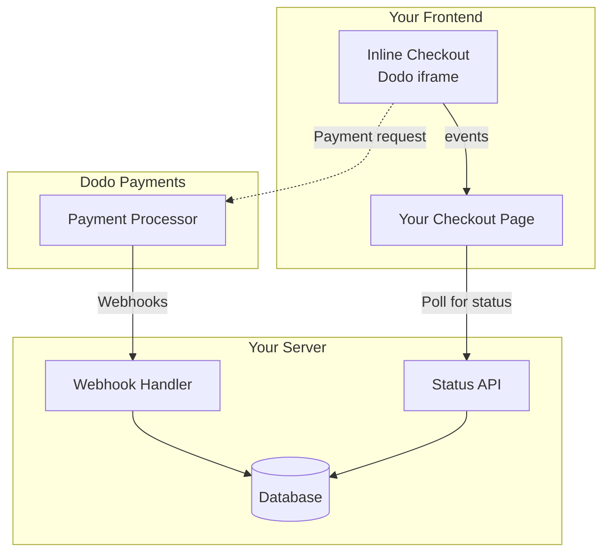

## 概要

インラインチェックアウトを使用すると、ウェブサイトやアプリケーションにシームレスに統合されたチェックアウト体験を作成できます。[オーバーレイチェックアウト](/developer-resources/overlay-checkout)とは異なり、インラインチェックアウトは支払いフォームをページレイアウトに直接埋め込みます。

インラインチェックアウトを使用すると、次のことができます：

- アプリやウェブサイトと完全に統合されたチェックアウト体験を作成する
- Dodo Paymentsが顧客と支払い情報を安全にキャプチャする最適化されたチェックアウトフレームを提供する
- Dodo Paymentsからのアイテム、合計、その他の情報をページに表示する
- SDKメソッドとイベントを使用して高度なチェックアウト体験を構築する

<Frame>
    
</Frame>

## 仕組み

インラインチェックアウトは、ウェブサイトやアプリに安全なDodo Paymentsフレームを埋め込むことで機能します。

チェックアウトフレームは、顧客情報の収集と支払い詳細のキャプチャを処理します。あなたのページには、アイテムリスト、合計、チェックアウトの内容を変更するためのオプションが表示されます。SDKを使用すると、ページとチェックアウトフレームが相互にやり取りできます。

Dodo Paymentsは、チェックアウトが完了すると自動的にサブスクリプションを作成し、あなたがプロビジョニングできるようにします。

<Note>
インラインチェックアウトフレームは、すべての機密支払い情報を安全に処理し、あなたの側での追加認証なしにPCI準拠を保証します。
</Note>

## 良いインラインチェックアウトとは？

顧客が誰から購入しているのか、何を購入しているのか、いくら支払っているのかを知ることが重要です。

コンプライアンスがあり、コンバージョンに最適化されたインラインチェックアウトを構築するには、実装に次の要素を含める必要があります：

<Frame caption="必要な要素がラベル付けされたインラインチェックアウトレイアウトの例">
    
</Frame>

1. **定期情報**：定期的な場合、どのくらいの頻度で繰り返されるかと更新時の合計金額。トライアルの場合、トライアルの期間。
2. **アイテムの説明**：購入されるものの説明。
3. **取引合計**：小計、総税、合計金額を含む取引合計。通貨も含めることを忘れないでください。
4. **Dodo Paymentsのフッター**：Dodo Paymentsに関する情報、販売条件、プライバシーポリシーを含む完全なインラインチェックアウトフレーム。
5. **返金ポリシー**：Dodo Paymentsの標準返金ポリシーと異なる場合は、返金ポリシーへのリンク。

<Warning>
常に完全なインラインチェックアウトフレームを表示してください。法的情報を削除または隠すことは、コンプライアンス要件に違反します。
</Warning>

## 顧客の旅

チェックアウトフローは、チェックアウトセッションの設定によって決まります。チェックアウトセッションをどのように設定するかによって、顧客はすべての情報が1ページに表示されるか、複数のステップに分かれるチェックアウトを体験します。

<Steps>
<Step title="顧客がチェックアウトを開く">

アイテムまたは既存のトランザクションを渡すことでインラインチェックアウトを開くことができます。SDKを使用してページ上の情報を表示および更新し、顧客のインタラクションに基づいてアイテムを更新するためのSDKメソッドを使用します。
    

</Step>

<Step title="顧客が詳細を入力する">

インラインチェックアウトは、最初に顧客にメールアドレスを入力し、国を選択し、（必要に応じて）郵便番号を入力するように求めます。このステップでは、税金と利用可能な支払いオプションを決定するために必要なすべての情報を収集します。

顧客の詳細を事前に入力し、保存された住所を提示して体験をスムーズにすることができます。

</Step>

<Step title="顧客が支払い方法を選択する">

詳細を入力した後、顧客には利用可能な支払い方法と支払いフォームが表示されます。オプションには、クレジットカードまたはデビットカード、PayPal、Apple Pay、Google Pay、そして顧客の所在地に基づくその他のローカル支払い方法が含まれる場合があります。

利用可能な場合は、保存された支払い方法を表示してチェックアウトを迅速化します。


</Step>

<Step title="チェックアウト完了">

Dodo Paymentsは、すべての支払いをその販売に最適なアクワイアラーにルーティングし、成功の可能性を最大限に高めます。顧客は、あなたが構築できる成功ワークフローに入ります。


</Step>

<Step title="Dodo Paymentsがサブスクリプションを作成">

Dodo Paymentsは、顧客のために自動的にサブスクリプションを作成し、あなたがプロビジョニングできるようにします。顧客が使用した支払い方法は、更新やサブスクリプションの変更のためにファイルに保持されます。


</Step>
</Steps>

## クイックスタート

Dodo Paymentsのインラインチェックアウトを数行のコードで始めましょう：

```typescript
import { DodoPayments } from "dodopayments-checkout";

// Initialize the SDK for inline mode
DodoPayments.Initialize({
  mode: "test",
  displayType: "inline",
  onEvent: (event) => {
    console.log("Checkout event:", event);
  },
});

// Open checkout in a specific container
DodoPayments.Checkout.open({
  checkoutUrl: "https://test.dodopayments.com/session/cks_123",
  elementId: "dodo-inline-checkout" // ID of the container element
});
```

<Tip>
ページに対応する`id`を持つコンテナ要素があることを確認してください: `<div id="dodo-inline-checkout"></div>`.
</Tip>

## ステップバイステップの統合ガイド

<Steps>
<Step title="SDKをインストール">

Dodo Payments Checkout SDKをインストールします：

<CodeGroup>

```bash npm
npm install dodopayments-checkout
```

```bash yarn
yarn add dodopayments-checkout
```

```bash pnpm
pnpm add dodopayments-checkout
```

</CodeGroup>

</Step>

<Step title="インライン表示のためにSDKを初期化">

SDKを初期化し、`displayType: 'inline'`を指定します。また、リアルタイムの税金と合計計算でUIを更新するために`checkout.breakdown`イベントをリッスンする必要があります。

```typescript
import { DodoPayments } from "dodopayments-checkout";

DodoPayments.Initialize({
  mode: "test",
  displayType: "inline",
  onEvent: (event) => {
    if (event.event_type === "checkout.breakdown") {
      const breakdown = event.data?.message;
      // Update your UI with breakdown.subTotal, breakdown.tax, breakdown.total, etc.
    }
  },
});
```

</Step>

<Step title="コンテナ要素を作成">

チェックアウトフレームが挿入されるHTMLに要素を追加します：

```html
<div id="dodo-inline-checkout"></div>
```

</Step>

<Step title="チェックアウトを開く">

`DodoPayments.Checkout.open()`を呼び出し、コンテナの`checkoutUrl`と`elementId`を指定します:

```typescript
DodoPayments.Checkout.open({
  checkoutUrl: "https://test.dodopayments.com/session/cks_123",
  elementId: "dodo-inline-checkout"
});
```

</Step>

<Step title="統合をテスト">

1. 開発サーバーを起動します：

```bash
npm run dev
```

2. チェックアウトフローをテストします：
   - インラインフレームにメールアドレスと住所の詳細を入力します。
   - カスタム注文概要がリアルタイムで更新されることを確認します。
   - テスト資格情報を使用して支払いフローをテストします。
   - リダイレクトが正しく機能することを確認します。

<Check>
`checkout.breakdown`イベントがブラウザのコンソールにログされているのが見えるはずです。これは、`onEvent`コールバックにコンソールログを追加した場合です。
</Check>

</Step>

<Step title="本番環境に移行">

本番環境の準備ができたら：

1. モードを`'live'`に変更します:

```typescript
DodoPayments.Initialize({
  mode: "live",
  displayType: "inline",
  onEvent: (event) => {
    // Handle events
  }
});
```

2. チェックアウトURLをバックエンドからのライブチェックアウトセッションを使用するように更新します。
3. 本番環境で完全なフローをテストします。

</Step>
</Steps>

## 完全なReactの例

この例は、インラインチェックアウトと同期を保ちながらカスタムオーダーサマリーを実装する方法を示しています。これは`checkout.breakdown`イベントを使用します。

```tsx
"use client";

import { useEffect, useState } from 'react';
import { DodoPayments, CheckoutBreakdownData } from 'dodopayments-checkout';

export default function CheckoutPage() {
  const [breakdown, setBreakdown] = useState<Partial<CheckoutBreakdownData>>({});

  useEffect(() => {
    // 1. Initialize the SDK
    DodoPayments.Initialize({
      mode: 'test',
      displayType: 'inline',
      onEvent: (event) => {
        // 2. Listen for the 'checkout.breakdown' event
        if (event.event_type === "checkout.breakdown") {
          const message = event.data?.message as CheckoutBreakdownData;
          if (message) setBreakdown(message);
        }
      }
    });

    // 3. Open the checkout in the specified container
    DodoPayments.Checkout.open({
      checkoutUrl: 'https://test.dodopayments.com/session/cks_123',
      elementId: 'dodo-inline-checkout'
    });

    return () => DodoPayments.Checkout.close();
  }, []);

  const format = (amt: number | null | undefined, curr: string | null | undefined) => 
    amt != null && curr ? `${curr} ${(amt/100).toFixed(2)}` : '0.00';

  const currency = breakdown.currency ?? breakdown.finalTotalCurrency ?? '';

  return (
    <div className="flex flex-col md:flex-row min-h-screen">
      {/* Left Side - Checkout Form */}
      <div className="w-full md:w-1/2 flex items-center">
        <div id="dodo-inline-checkout" className='w-full' />
      </div>

      {/* Right Side - Custom Order Summary */}
      <div className="w-full md:w-1/2 p-8 bg-gray-50">
        <h2 className="text-2xl font-bold mb-4">Order Summary</h2>
        <div className="space-y-2">
          {breakdown.subTotal && (
            <div className="flex justify-between">
              <span>Subtotal</span>
              <span>{format(breakdown.subTotal, currency)}</span>
            </div>
          )}
          {breakdown.discount && (
            <div className="flex justify-between">
              <span>Discount</span>
              <span>{format(breakdown.discount, currency)}</span>
            </div>
          )}
          {breakdown.tax != null && (
            <div className="flex justify-between">
              <span>Tax</span>
              <span>{format(breakdown.tax, currency)}</span>
            </div>
          )}
          <hr />
          {(breakdown.finalTotal ?? breakdown.total) && (
            <div className="flex justify-between font-bold text-xl">
              <span>Total</span>
              <span>{format(breakdown.finalTotal ?? breakdown.total, breakdown.finalTotalCurrency ?? currency)}</span>
            </div>
          )}
        </div>
      </div>
    </div>
  );
}

```

## APIリファレンス

### 設定

#### 初期化オプション

```typescript
interface InitializeOptions {
  mode: "test" | "live";
  displayType: "inline"; // Required for inline checkout
  onEvent: (event: CheckoutEvent) => void;
}
```

| オプション | タイプ | 必須 | 説明 |
|--------|------|----------|-------------|
| `mode` | `"test" \| "live"` | はい | 環境モード。 |
| `displayType` | `"inline" \| "overlay"` | はい | チェックアウトを埋め込むには`"inline"`に設定する必要があります。 |
| `onEvent` | `function` | はい | チェックアウトイベントを処理するためのコールバック関数。 |

#### チェックアウトオプション

```typescript
export type FontSize = "xs" | "sm" | "md" | "lg" | "xl" | "2xl";
export type FontWeight = "normal" | "medium" | "bold" | "extraBold";

interface CheckoutOptions {
  checkoutUrl: string;
  elementId: string; // Required for inline checkout
  options?: {
    showTimer?: boolean;
    showSecurityBadge?: boolean;
    manualRedirect?: boolean;
    themeConfig?: ThemeConfig;
    payButtonText?: string;
    fontSize?: FontSize;
    fontWeight?: FontWeight;
  };
}
```

| オプション | タイプ | 必須 | 説明 |
|--------|------|----------|-------------|
| `checkoutUrl` | `string` | はい | チェックアウトセッションのURL。 |
| `elementId` | `string` | はい | チェックアウトがレンダリングされるDOM要素の`id`。 |
| `options.showTimer` | `boolean` | いいえ | チェックアウトタイマーを表示または非表示にします。デフォルトは`true`です。無効にすると、セッションが期限切れになると`checkout.link_expired`イベントが受信されます。 |
| `options.showSecurityBadge` | `boolean` | いいえ | セキュリティバッジを表示または非表示にします。デフォルトは`true`です。 |
| `options.manualRedirect` | `boolean` | いいえ | 有効にすると、チェックアウトは完了後に自動的にリダイレクトされません。代わりに、`checkout.status`と`checkout.redirect_requested`イベントを受信して、リダイレクトを自分で処理します。 |
| `options.themeConfig` | `ThemeConfig` | いいえ | カスタムテーマ設定。 |
| `options.payButtonText` | `string` | いいえ | 支払いボタンに表示するカスタムテキスト。 |
| `options.fontSize` | `FontSize` | いいえ | チェックアウトのグローバルフォントサイズ。 |
| `options.fontWeight` | `FontWeight` | いいえ | チェックアウトのグローバルフォントウェイト。 |

### メソッド

#### チェックアウトを開く

指定されたコンテナにチェックアウトフレームを開きます。

```typescript
DodoPayments.Checkout.open({
  checkoutUrl: "https://test.dodopayments.com/session/cks_123",
  elementId: "dodo-inline-checkout"
});
```

チェックアウトの動作をカスタマイズするために追加のオプションを渡すこともできます:

```typescript
DodoPayments.Checkout.open({
  checkoutUrl: "https://test.dodopayments.com/session/cks_123",
  elementId: "dodo-inline-checkout",
  options: {
    showTimer: false,
    showSecurityBadge: false,
    manualRedirect: true,
    payButtonText: "Pay Now",
  },
});
```

`manualRedirect`を使用する場合、チェックアウト完了を`onEvent`コールバックで処理します:

```typescript
DodoPayments.Initialize({
  mode: "test",
  displayType: "inline",
  onEvent: (event) => {
    if (event.event_type === "checkout.status") {
      const status = event.data?.message?.status;
      // Handle status: "succeeded", "failed", or "processing"
    }
    if (event.event_type === "checkout.redirect_requested") {
      const redirectUrl = event.data?.message?.redirect_to;
      // Redirect the customer manually
      window.location.href = redirectUrl;
    }
    if (event.event_type === "checkout.link_expired") {
      // Handle expired checkout session
    }
  },
});
```

#### チェックアウトを閉じる

プログラムでチェックアウトフレームを削除し、イベントリスナーをクリーンアップします。

```typescript
DodoPayments.Checkout.close();
```

#### ステータスを確認

チェックアウトフレームが現在注入されているかどうかを返します。

```typescript
const isOpen = DodoPayments.Checkout.isOpen();
// Returns: boolean
```

### イベント

SDKは、`onEvent`コールバックを通じてリアルタイムイベントを提供します。インラインチェックアウトの場合、`checkout.breakdown`はUIを同期させるのに特に便利です。

| イベントタイプ | 説明 |
|------------|-------------|
| `checkout.opened` | チェックアウトフレームが読み込まれました。 |
| `checkout.breakdown` | 価格、税金、または割引が更新されたときに発火します。 |
| `checkout.customer_details_submitted` | 顧客の詳細が送信されました。 |
| `checkout.pay_button_clicked` | 顧客が支払いボタンをクリックしたときに発火します。分析やコンバージョンファネルの追跡に便利です。 |
| `checkout.redirect` | チェックアウトがリダイレクトを実行します（例：銀行ページへ）。 |
| `checkout.error` | チェックアウト中にエラーが発生しました。 |
| `checkout.link_expired` | チェックアウトセッションが期限切れになったときに発火します。`showTimer`が`false`に設定されている場合のみ受信されます。 |
| `checkout.status` | `manualRedirect`が有効なときに発火します。チェックアウトの状態（`succeeded`、`failed`、または`processing`）が含まれます。 |
| `checkout.redirect_requested` | `manualRedirect`が有効なときに発火します。顧客をリダイレクトするためのURLが含まれます。 |

#### チェックアウトの内訳データ

`checkout.breakdown`イベントは、以下のデータを提供します:

```typescript
interface CheckoutBreakdownData {
  subTotal?: number;          // Amount in cents
  discount?: number;         // Amount in cents
  tax?: number;              // Amount in cents
  total?: number;            // Amount in cents
  currency?: string;         // e.g., "USD"
  finalTotal?: number;       // Final amount including adjustments
  finalTotalCurrency?: string; // Currency for the final total
}
```

#### チェックアウトステータスイベントデータ

`manualRedirect`が有効なとき、以下のデータを持つ`checkout.status`イベントを受信します:

```typescript
interface CheckoutStatusEventData {
  message: {
    status?: "succeeded" | "failed" | "processing";
  };
}
```

#### チェックアウトリダイレクト要求イベントデータ

`manualRedirect`が有効なとき、以下のデータを持つ`checkout.redirect_requested`イベントを受信します:

```typescript
interface CheckoutRedirectRequestedEventData {
  message: {
    redirect_to?: string;
  };
}
```

#### 内訳イベントの理解

`checkout.breakdown`イベントは、アプリケーションのUIをDodo Paymentsのチェックアウト状態と同期させる主な方法です。

**発火するタイミング:**
- **初期化時**: チェックアウトフレームが読み込まれ、準備が整った直後。
- **住所変更時**: 顧客が国を選択したり、税金の再計算を引き起こす郵便番号を入力したとき。

**フィールドの詳細:**

| フィールド | 説明 |
|-------|-------------|
| `subTotal` | 割引や税金が適用される前のセッション内のすべてのラインアイテムの合計。 |
| `discount` | 適用されたすべての割引の合計値。 |
| `tax` | 計算された税額。`inline`モードでは、ユーザーが住所フィールドに対話するにつれて動的に更新されます。 |
| `total` | セッションの基本通貨での`subTotal - discount + tax`の数学的結果。 |
| `currency` | 標準の小計、割引、税金の値に対するISO通貨コード（例: `"USD"`）。 |
| `finalTotal` | 顧客が実際に請求される金額。これには、基本価格の内訳に含まれない追加の外国為替調整やローカル支払い方法手数料が含まれる場合があります。 |
| `finalTotalCurrency` | 顧客が実際に支払っている通貨。これは、購買力平価またはローカル通貨変換がアクティブな場合、`currency`とは異なる場合があります。 |

**統合のための重要なヒント:**

1.  **通貨フォーマット**: 価格は常に最小通貨単位（例: USDの場合はセント、JPYの場合は円）で整数として返されます。表示するには、100（または適切な10の累乗）で割るか、`Intl.NumberFormat`のようなフォーマットライブラリを使用します。
2.  **初期状態の処理**: チェックアウトが最初に読み込まれるとき、`tax`と`discount`は、ユーザーが請求情報を提供するかコードを適用するまで`0`または`null`である可能性があります。UIはこれらの状態を適切に処理する必要があります（例: ダッシュ`—`を表示するか、行を隠す）。
3.  **「最終合計」と「合計」**: `total`は標準の価格計算を提供しますが、`finalTotal`は取引の真実の源です。`finalTotal`が存在する場合、顧客のカードに請求される正確な金額を反映します。動的調整を含みます。
4.  **リアルタイムフィードバック**: `tax`フィールドを使用して、税金がリアルタイムで計算されていることをユーザーに示します。これにより、チェックアウトページに「ライブ」感が生まれ、住所入力ステップ中の摩擦が軽減されます。

## 実装オプション

### パッケージマネージャーのインストール

npm、yarn、またはpnpmを使用して、[ステップバイステップの統合ガイド](#step-by-step-integration-guide)に示されているようにインストールします。

### CDN実装

ビルドステップなしで迅速に統合するには、CDNを使用できます:

```html
<!DOCTYPE html>
<html lang="en">
<head>
    <meta charset="UTF-8">
    <meta name="viewport" content="width=device-width, initial-scale=1.0">
    <title>Dodo Payments Inline Checkout</title>
    
    <!-- Load DodoPayments -->
    <script src="https://cdn.jsdelivr.net/npm/dodopayments-checkout@latest/dist/index.js"></script>
    <script>
        // Initialize the SDK
        DodoPaymentsCheckout.DodoPayments.Initialize({
            mode: "test",
            displayType: "inline",
            onEvent: (event) => {
                console.log('Checkout event:', event);
            }
        });
    </script>
</head>
<body>
    <div id="dodo-inline-checkout"></div>

    <script>
        // Open the checkout
        DodoPaymentsCheckout.DodoPayments.Checkout.open({
            checkoutUrl: "https://test.dodopayments.com/session/cks_123",
            elementId: "dodo-inline-checkout"
        });
    </script>
</body>
</html>
```

### テーマのカスタマイズ

チェックアウトの外観は、チェックアウトを開くときに`options`パラメータに`themeConfig`オブジェクトを渡すことでカスタマイズできます。テーマ設定は、ライトモードとダークモードの両方をサポートしており、色、境界線、テキスト、ボタン、境界半径をカスタマイズできます。

#### 基本テーマ設定

```typescript
DodoPayments.Checkout.open({
  checkoutUrl: "https://checkout.dodopayments.com/session/cks_123",
  options: {
    themeConfig: {
      light: {
        bgPrimary: "#FFFFFF",
        textPrimary: "#344054",
        buttonPrimary: "#A6E500",
      },
      dark: {
        bgPrimary: "#0D0D0D",
        textPrimary: "#FFFFFF",
        buttonPrimary: "#A6E500",
      },
      radius: "8px",
    },
  },
});
```

#### 完全なテーマ設定

利用可能なすべてのテーマプロパティ：

```typescript
DodoPayments.Checkout.open({
  checkoutUrl: "https://checkout.dodopayments.com/session/cks_123",
  options: {
    themeConfig: {
      light: {
        // Background colors
        bgPrimary: "#FFFFFF",        // Primary background color
        bgSecondary: "#F9FAFB",      // Secondary background color (e.g., tabs)
        
        // Border colors
        borderPrimary: "#D0D5DD",     // Primary border color
        borderSecondary: "#6B7280",  // Secondary border color
        inputFocusBorder: "#D0D5DD", // Input focus border color
        
        // Text colors
        textPrimary: "#344054",       // Primary text color
        textSecondary: "#6B7280",    // Secondary text color
        textPlaceholder: "#667085",  // Placeholder text color
        textError: "#D92D20",        // Error text color
        textSuccess: "#10B981",      // Success text color
        
        // Button colors
        buttonPrimary: "#A6E500",           // Primary button background
        buttonPrimaryHover: "#8CC500",      // Primary button hover state
        buttonTextPrimary: "#0D0D0D",       // Primary button text color
        buttonSecondary: "#F3F4F6",         // Secondary button background
        buttonSecondaryHover: "#E5E7EB",     // Secondary button hover state
        buttonTextSecondary: "#344054",     // Secondary button text color
      },
      dark: {
        // Background colors
        bgPrimary: "#0D0D0D",
        bgSecondary: "#1A1A1A",
        
        // Border colors
        borderPrimary: "#323232",
        borderSecondary: "#D1D5DB",
        inputFocusBorder: "#323232",
        
        // Text colors
        textPrimary: "#FFFFFF",
        textSecondary: "#909090",
        textPlaceholder: "#9CA3AF",
        textError: "#F97066",
        textSuccess: "#34D399",
        
        // Button colors
        buttonPrimary: "#A6E500",
        buttonPrimaryHover: "#8CC500",
        buttonTextPrimary: "#0D0D0D",
        buttonSecondary: "#2A2A2A",
        buttonSecondaryHover: "#3A3A3A",
        buttonTextSecondary: "#FFFFFF",
      },
      radius: "8px", // Border radius for inputs, buttons, and tabs
    },
  },
});
```

#### ライトモードのみ

ライトテーマのみをカスタマイズしたい場合：

```typescript
DodoPayments.Checkout.open({
  checkoutUrl: "https://checkout.dodopayments.com/session/cks_123",
  options: {
    themeConfig: {
      light: {
        bgPrimary: "#FFFFFF",
        textPrimary: "#000000",
        buttonPrimary: "#0070F3",
      },
      radius: "12px",
    },
  },
});
```

#### ダークモードのみ

ダークテーマのみをカスタマイズしたい場合：

```typescript
DodoPayments.Checkout.open({
  checkoutUrl: "https://checkout.dodopayments.com/session/cks_123",
  options: {
    themeConfig: {
      dark: {
        bgPrimary: "#000000",
        textPrimary: "#FFFFFF",
        buttonPrimary: "#0070F3",
      },
      radius: "12px",
    },
  },
});
```

#### 部分的なテーマオーバーライド

特定のプロパティのみをオーバーライドできます。指定しないプロパティにはデフォルト値が使用されます：

```typescript
DodoPayments.Checkout.open({
  checkoutUrl: "https://checkout.dodopayments.com/session/cks_123",
  options: {
    themeConfig: {
      light: {
        buttonPrimary: "#FF6B6B", // Only override primary button color
      },
      radius: "16px", // Override border radius
    },
  },
});
```

#### 他のオプションとのテーマ設定

テーマ設定を他のチェックアウトオプションと組み合わせることができます：

```typescript
DodoPayments.Checkout.open({
  checkoutUrl: "https://checkout.dodopayments.com/session/cks_123",
  options: {
    showTimer: true,
    showSecurityBadge: true,
    manualRedirect: false,
    themeConfig: {
      light: {
        bgPrimary: "#FFFFFF",
        buttonPrimary: "#A6E500",
      },
      dark: {
        bgPrimary: "#0D0D0D",
        buttonPrimary: "#A6E500",
      },
      radius: "8px",
    },
  },
});
```

#### TypeScript タイプ

TypeScript ユーザーのために、すべてのテーマ設定タイプがエクスポートされています：

```typescript
import { ThemeConfig, ThemeModeConfig } from "dodopayments-checkout";

const themeConfig: ThemeConfig = {
  light: {
    bgPrimary: "#FFFFFF",
    // ... other properties
  },
  dark: {
    bgPrimary: "#0D0D0D",
    // ... other properties
  },
  radius: "8px",
};
```

## エラーハンドリング

SDKは、イベントシステムを通じて詳細なエラー情報を提供します。常に`onEvent`コールバックで適切なエラーハンドリングを実装してください:

```typescript
DodoPayments.Initialize({
  mode: "test",
  displayType: "inline",
  onEvent: (event: CheckoutEvent) => {
    if (event.event_type === "checkout.error") {
      console.error("Checkout error:", event.data?.message);
      // Handle error appropriately
    }
  }
});
```

<Warning>
問題が発生したときに良好なユーザーエクスペリエンスを提供するために、必ず`checkout.error`イベントを処理してください。
</Warning>

## ベストプラクティス

1. **レスポンシブデザイン**: コンテナ要素に十分な幅と高さがあることを確認してください。iframeは通常、そのコンテナを埋めるように拡張されます。
2. **同期**: `checkout.breakdown`イベントを使用して、カスタムオーダーサマリーや価格表をチェックアウトフレームでユーザーが見ているものと同期させます。
3. **スケルトン状態**: `checkout.opened`イベントが発火するまで、コンテナ内にローディングインジケーターを表示します。
4. **クリーンアップ**: コンポーネントがアンマウントされるときに`DodoPayments.Checkout.close()`を呼び出して、iframeとイベントリスナーをクリーンアップします。

<Info>
ダークモードの実装では、インラインチェックアウトフレームとの視覚的統合を最適化するために、背景色として`#0d0d0d`を使用することをお勧めします。
</Info>

## 支払いステータスの検証

<Warning>
支払いの成功または失敗を判断するためにインラインチェックアウトイベントのみに依存しないでください。常にウェブフックやポーリングを使用してサーバー側の検証を実装してください。
</Warning>

### サーバー側の検証が重要な理由

インラインチェックアウトイベント（例えば`checkout.status`）はリアルタイムフィードバックを提供しますが、支払いステータスの唯一の真実の源であってはなりません。ネットワークの問題、ブラウザのクラッシュ、またはユーザーがページを閉じることにより、イベントが見逃される可能性があります。信頼できる支払い検証を確保するために:

1. **あなたのサーバーはウェブフックイベントをリッスンする必要があります** - Dodo Paymentsは支払いステータスの変更に対してウェブフックを送信します。
2. **ポーリングメカニズムを実装する** - フロントエンドは、ステータス更新のためにサーバーをポーリングする必要があります。
3. **両方のアプローチを組み合わせる** - ウェブフックを主要な情報源として使用し、ポーリングをフォールバックとして使用します。

### 推奨アーキテクチャ



### 実装手順

**1. チェックアウトイベントをリッスンする** - ユーザーが支払いをクリックしたとき、ステータスを確認する準備を開始します:

```typescript
onEvent: (event) => {
  if (event.event_type === 'checkout.status') {
    // Start polling your server for confirmed status
    startPolling();
  }
}
```

**2. サーバーをポーリングする** - 支払いステータスを確認するエンドポイントを作成します（ウェブフックによって更新されます）。:

```typescript
// Poll every 2 seconds until status is confirmed
const interval = setInterval(async () => {
  const { status } = await fetch(`/api/payments/${paymentId}/status`).then(r => r.json());
  if (status === 'succeeded' || status === 'failed') {
    clearInterval(interval);
    handlePaymentResult(status);
  }
}, 2000);
```

**3. サーバー側でウェブフックを処理する** - Dodoが`payment.succeeded`または`payment.failed`ウェブフックを送信したときにデータベースを更新します。詳細については、[ウェブフックのドキュメント](/developer-resources/webhooks)を参照してください。

### リダイレクトの処理（3DS、Google Pay、UPI）

`manualRedirect: true`を使用する場合、特定の支払い方法では認証のためにユーザーをページからリダイレクトする必要があります:

- **3Dセキュア（3DS）** - カード認証
- **Google Pay** - 一部のフローでのウォレット認証
- **UPI** - インドの支払い方法のリダイレクト

リダイレクトが必要な場合、`checkout.redirect_requested`イベントを受信します。ユーザーを提供されたURLにリダイレクトします:

```typescript
if (event.event_type === 'checkout.redirect_requested') {
  const redirectUrl = event.data?.message?.redirect_to;
  // Save payment ID before redirect, then redirect
  sessionStorage.setItem('pendingPaymentId', paymentId);
  window.location.href = redirectUrl;
}
```

認証が完了した後（成功または失敗）、ユーザーはあなたのページに戻ります。**ユーザーが戻ったからといって成功を仮定しないでください。** 代わりに:

1. ユーザーがリダイレクトから戻ってきているかどうかを確認します（例: `sessionStorage`を介して）
2. 確認された支払いステータスのためにサーバーをポーリングし始めます
3. ポーリング中に「支払いを確認中...」状態を表示します
4. サーバーで確認されたステータスに基づいて成功/失敗のUIを表示します

<Tip>
リダイレクト後は必ずサーバー側で支払いステータスを確認してください。ユーザーがあなたのページに戻ることは、認証が完了したことを意味するだけであり、支払いが成功したか失敗したかを示すものではありません。
</Tip>

## トラブルシューティング

<AccordionGroup>
<Accordion title="チェックアウトフレームが表示されない">
- `elementId`が、DOM内に実際に存在する`id`の`div`と一致していることを確認してください。
- `displayType: 'inline'`が`Initialize`に渡されたことを確認してください。
- `checkoutUrl`が有効であることを確認してください。
</Accordion>

<Accordion title="税金がUIで更新されない">
- `checkout.breakdown`イベントをリッスンしていることを確認してください。
- 税金は、ユーザーがチェックアウトフレームに有効な国と郵便番号を入力した後にのみ計算されます。
</Accordion>
</AccordionGroup>

## Apple Payの有効化

Apple Payを使用すると、顧客は保存された支払い方法を使用して迅速かつ安全に支払いを完了できます。有効にすると、顧客はサポートされているデバイスのチェックアウトオーバーレイから直接Apple Payモーダルを起動できます。

<Info>
Apple Payは、iOS 17+、iPadOS 17+、およびmacOSのSafari 17+でサポートされています。
</Info>

本番環境でドメインのApple Payを有効にするには、次の手順に従ってください:

<Steps>
<Step title="Apple Payドメイン関連付けファイルをダウンロードしてアップロード">

[Apple Payドメイン関連付けファイル](http://checkout.dodopayments.com/.well-known/apple-developer-merchantid-domain-association)をダウンロードします。

ファイルを`/.well-known/apple-developer-merchantid-domain-association`にあるウェブサーバーにアップロードします。たとえば、あなたのウェブサイトが`example.com`の場合、ファイルを`https://example.com/well-known/apple-developer-merchantid-domain-association`で利用できるようにします。

</Step>

<Step title="Apple Payの有効化をリクエスト">

以下の情報を含むメールを**support@dodopayments.com**に送信します:

- あなたの本番ドメインURL（例: `https://example.com`）
- あなたのドメインのApple Payを有効にするリクエスト

<Check>
Apple Payがあなたのドメインに有効になったら、1〜2営業日以内に確認の連絡を受け取ります。
</Check>

</Step>

<Step title="Apple Payの利用可能性を確認">

確認の連絡を受け取った後、チェックアウトでApple Payをテストします:

1. サポートされているデバイス（iOS 17+、iPadOS 17+、またはmacOSのSafari 17+）でチェックアウトを開きます
2. 支払いオプションとしてApple Payボタンが表示されることを確認します
3. 完全な支払いフローをテストします

</Step>
</Steps>

<Warning>
Apple Payは、本番環境で支払いオプションとして表示される前に、あなたのドメインで有効にする必要があります。Apple Payを提供する予定がある場合は、ライブにする前にサポートに連絡してください。
</Warning>

## ブラウザサポート

Dodo Payments Checkout SDKは、以下のブラウザをサポートしています:
