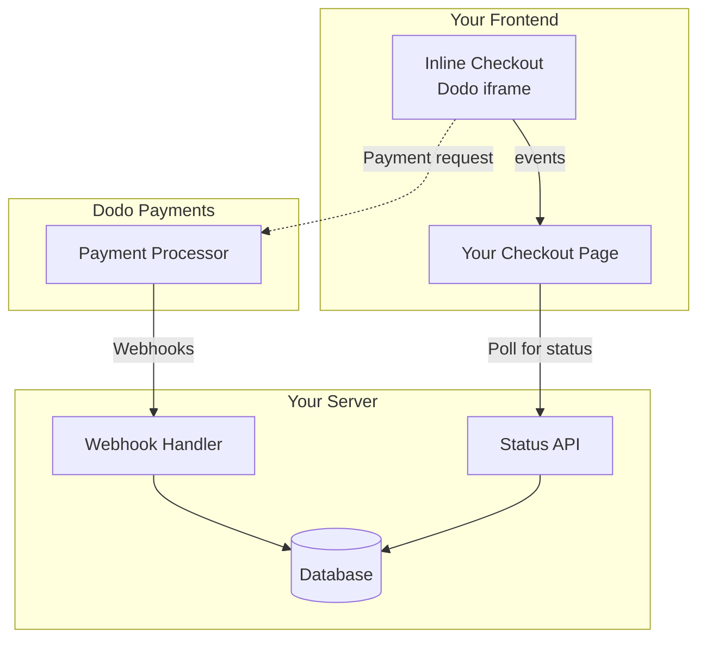

## 概要

インラインチェックアウトを使用すると、ウェブサイトやアプリケーションにシームレスに統合されたチェックアウト体験を作成できます。[オーバーレイチェックアウト](/developer-resources/overlay-checkout)とは異なり、インラインチェックアウトは支払いフォームをページレイアウトに直接埋め込みます。

インラインチェックアウトを使用すると、次のことができます：

- アプリやウェブサイトと完全に統合されたチェックアウト体験を作成する
- Dodo Paymentsが顧客と支払い情報を安全にキャプチャする最適化されたチェックアウトフレームを提供する
- Dodo Paymentsからのアイテム、合計、その他の情報をページに表示する
- SDKメソッドとイベントを使用して高度なチェックアウト体験を構築する

<Frame>
    
</Frame>

## 仕組み

インラインチェックアウトは、ウェブサイトやアプリに安全なDodo Paymentsフレームを埋め込むことで機能します。

チェックアウトフレームは、顧客情報の収集と支払い詳細のキャプチャを処理します。あなたのページには、アイテムリスト、合計、チェックアウトの内容を変更するためのオプションが表示されます。SDKを使用すると、ページとチェックアウトフレームが相互にやり取りできます。

Dodo Paymentsは、チェックアウトが完了すると自動的にサブスクリプションを作成し、あなたがプロビジョニングできるようにします。

<Note>
インラインチェックアウトフレームは、すべての機密支払い情報を安全に処理し、追加の認証なしでPCI準拠を確保します。
</Note>

## 良いインラインチェックアウトとは？

顧客が誰から購入しているのか、何を購入しているのか、いくら支払っているのかを知ることが重要です。

コンプライアンスがあり、コンバージョンに最適化されたインラインチェックアウトを構築するには、実装に次の要素を含める必要があります：

{/* LOCKED_PATTERN_2c3203bfa100605bc2704d01e7dccd32 */}
    
</Frame>

1. **定期情報**：定期的な場合、どのくらいの頻度で繰り返されるかと更新時の合計金額。トライアルの場合、トライアルの期間。
2. **アイテムの説明**：購入されるものの説明。
3. **取引合計**：小計、総税、合計金額を含む取引合計。通貨も含めることを忘れないでください。
4. **Dodo Paymentsのフッター**：Dodo Paymentsに関する情報、販売条件、プライバシーポリシーを含む完全なインラインチェックアウトフレーム。
5. **返金ポリシー**：Dodo Paymentsの標準返金ポリシーと異なる場合は、返金ポリシーへのリンク。

<Warning>
インラインチェックアウトフレーム全体（フッターを含む）を常に表示してください。法的情報を削除または非表示にすると、準拠要件に違反します。
</Warning>

## 顧客の旅

チェックアウトフローは、チェックアウトセッションの設定によって決まります。チェックアウトセッションをどのように設定するかによって、顧客はすべての情報が1ページに表示されるか、複数のステップに分かれるチェックアウトを体験します。

<Steps>
{/* LOCKED_PATTERN_d5c5891a92fe908e4b310aff2fe906f3 */}

アイテムまたは既存のトランザクションを渡すことでインラインチェックアウトを開くことができます。SDKを使用してページ上の情報を表示および更新し、顧客のインタラクションに基づいてアイテムを更新するためのSDKメソッドを使用します。
    

</Step>

{/* LOCKED_PATTERN_271a3373ec4ee2458dad7f9a80e26855 */}

インラインチェックアウトは、最初に顧客にメールアドレスを入力し、国を選択し、（必要に応じて）郵便番号を入力するように求めます。このステップでは、税金と利用可能な支払いオプションを決定するために必要なすべての情報を収集します。

顧客の詳細を事前に入力し、保存された住所を提示して体験をスムーズにすることができます。

</Step>

{/* LOCKED_PATTERN_1234bf83f7f396022f1c91c09356f654 */}

詳細を入力した後、顧客には利用可能な支払い方法と支払いフォームが表示されます。オプションには、クレジットカードまたはデビットカード、PayPal、Apple Pay、Google Pay、そして顧客の所在地に基づくその他のローカル支払い方法が含まれる場合があります。

利用可能な場合は、保存された支払い方法を表示してチェックアウトを迅速化します。


</Step>

{/* LOCKED_PATTERN_3250600b8fe70b0b1b5c169861bc3240 */}

Dodo Paymentsは、すべての支払いをその販売に最適なアクワイアラーにルーティングし、成功の可能性を最大限に高めます。顧客は、あなたが構築できる成功ワークフローに入ります。


</Step>

{/* LOCKED_PATTERN_fe28b170edb53eebdbefd92e22425bda */}

Dodo Paymentsは、顧客のために自動的にサブスクリプションを作成し、あなたがプロビジョニングできるようにします。顧客が使用した支払い方法は、更新やサブスクリプションの変更のためにファイルに保持されます。


</Step>
</Steps>

## クイックスタート

Dodo Paymentsのインラインチェックアウトを数行のコードで始めましょう：

```typescript
import { DodoPayments } from "dodopayments-checkout";

// Initialize the SDK for inline mode
DodoPayments.Initialize({
  mode: "test",
  displayType: "inline",
  onEvent: (event) => {
    console.log("Checkout event:", event);
  },
});

// Open checkout in a specific container
DodoPayments.Checkout.open({
  checkoutUrl: "https://test.dodopayments.com/session/cks_123",
  elementId: "dodo-inline-checkout" // ID of the container element
});
```

<Tip>
ページに該当する `id` を持つコンテナ要素があることを確認してください: `<div id="dodo-inline-checkout"></div>`。
</Tip>

## ステップバイステップの統合ガイド

<Steps>
{/* LOCKED_PATTERN_776027320500bde6b99bac6bed1cc64d */}

Dodo Payments Checkout SDKをインストールします：

<CodeGroup>

```bash npm
npm install dodopayments-checkout
```

```bash yarn
yarn add dodopayments-checkout
```

```bash pnpm
pnpm add dodopayments-checkout
```

</CodeGroup>

</Step>

{/* LOCKED_PATTERN_c9671e1641fc4b5a7d02836b54fde4a6 */}

SDK を初期化し、`displayType: 'inline'` を指定します。また、`checkout.breakdown` イベントを監視して、リアルタイムの税金および合計計算で UI を更新してください。

```typescript
import { DodoPayments } from "dodopayments-checkout";

DodoPayments.Initialize({
  mode: "test",
  displayType: "inline",
  onEvent: (event) => {
    if (event.event_type === "checkout.breakdown") {
      const breakdown = event.data?.message;
      // Update your UI with breakdown.subTotal, breakdown.tax, breakdown.total, etc.
    }
  },
});
```

</Step>

{/* LOCKED_PATTERN_7ddf8b1f0258fda183d82c15a3096a03 */}

チェックアウトフレームが挿入されるHTMLに要素を追加します：

```html
<div id="dodo-inline-checkout"></div>
```

</Step>

{/* LOCKED_PATTERN_4817384312c2fcbac3336846aa45db8f */}

コンテナの `checkoutUrl` および `elementId` を使用して `DodoPayments.Checkout.open()` を呼び出します:

```typescript
DodoPayments.Checkout.open({
  checkoutUrl: "https://test.dodopayments.com/session/cks_123",
  elementId: "dodo-inline-checkout"
});
```

</Step>

{/* LOCKED_PATTERN_97e1d34fe501fd0a9dd5e96c0a83886c */}

1. 開発サーバーを起動します：

```bash
npm run dev
```

2. チェックアウトフローをテストします：
   - インラインフレームにメールアドレスと住所の詳細を入力します。
   - カスタム注文概要がリアルタイムで更新されることを確認します。
   - テスト資格情報を使用して支払いフローをテストします。
   - リダイレクトが正しく機能することを確認します。

<Check>
`checkout.breakdown` イベントが `onEvent` コールバック内に console log を追加していればブラウザのコンソールに記録されるのが確認できます。
</Check>

</Step>

{/* LOCKED_PATTERN_b11a46166b3a72b09cb0a82966c3c591 */}

本番環境の準備ができたら：

1. モードを `'live'` に変更します:

```typescript
DodoPayments.Initialize({
  mode: "live",
  displayType: "inline",
  onEvent: (event) => {
    // Handle events
  }
});
```

2. チェックアウトURLをバックエンドからのライブチェックアウトセッションを使用するように更新します。
3. 本番環境で完全なフローをテストします。

</Step>
</Steps>

## 完全なReactの例

この例では、`checkout.breakdown` イベントを使用してインラインチェックアウトと連携しながら、カスタム注文概要を同期させる方法を示しています。

```tsx
"use client";

import { useEffect, useState } from 'react';
import { DodoPayments, CheckoutBreakdownData } from 'dodopayments-checkout';

export default function CheckoutPage() {
  const [breakdown, setBreakdown] = useState<Partial<CheckoutBreakdownData>>({});

  useEffect(() => {
    // 1. Initialize the SDK
    DodoPayments.Initialize({
      mode: 'test',
      displayType: 'inline',
      onEvent: (event) => {
        // 2. Listen for the 'checkout.breakdown' event
        if (event.event_type === "checkout.breakdown") {
          const message = event.data?.message as CheckoutBreakdownData;
          if (message) setBreakdown(message);
        }
      }
    });

    // 3. Open the checkout in the specified container
    DodoPayments.Checkout.open({
      checkoutUrl: 'https://test.dodopayments.com/session/cks_123',
      elementId: 'dodo-inline-checkout'
    });

    return () => DodoPayments.Checkout.close();
  }, []);

  const format = (amt: number | null | undefined, curr: string | null | undefined) => 
    amt != null && curr ? `${curr} ${(amt/100).toFixed(2)}` : '0.00';

  const currency = breakdown.currency ?? breakdown.finalTotalCurrency ?? '';

  return (
    <div className="flex flex-col md:flex-row min-h-screen">
      {/* Left Side - Checkout Form */}
      <div className="w-full md:w-1/2 flex items-center">
        <div id="dodo-inline-checkout" className='w-full' />
      </div>

      {/* Right Side - Custom Order Summary */}
      <div className="w-full md:w-1/2 p-8 bg-gray-50">
        <h2 className="text-2xl font-bold mb-4">Order Summary</h2>
        <div className="space-y-2">
          {breakdown.subTotal && (
            <div className="flex justify-between">
              <span>Subtotal</span>
              <span>{format(breakdown.subTotal, currency)}</span>
            </div>
          )}
          {breakdown.discount && (
            <div className="flex justify-between">
              <span>Discount</span>
              <span>{format(breakdown.discount, currency)}</span>
            </div>
          )}
          {breakdown.tax != null && (
            <div className="flex justify-between">
              <span>Tax</span>
              <span>{format(breakdown.tax, currency)}</span>
            </div>
          )}
          <hr />
          {(breakdown.finalTotal ?? breakdown.total) && (
            <div className="flex justify-between font-bold text-xl">
              <span>Total</span>
              <span>{format(breakdown.finalTotal ?? breakdown.total, breakdown.finalTotalCurrency ?? currency)}</span>
            </div>
          )}
        </div>
      </div>
    </div>
  );
}

```

## APIリファレンス

### 設定

#### 初期化オプション

```typescript
interface InitializeOptions {
  mode: "test" | "live";
  displayType: "inline"; // Required for inline checkout
  onEvent: (event: CheckoutEvent) => void;
}
```

| オプション | タイプ | 必須 | 説明 |
|--------|------|----------|-------------|
| `mode` | `"test" \| "live"` | Yes | 環境モード。 |
| `displayType` | `"inline" \| "overlay"` | Yes | チェックアウトを埋め込むには `"inline"` に設定する必要があります。 |
| `onEvent` | `function` | Yes | チェックアウトイベントを処理するコールバック関数。 |

#### チェックアウトオプション

```typescript
export type FontSize = "xs" | "sm" | "md" | "lg" | "xl" | "2xl";
export type FontWeight = "normal" | "medium" | "bold" | "extraBold";

interface CheckoutOptions {
  checkoutUrl: string;
  elementId: string; // Required for inline checkout
  options?: {
    showTimer?: boolean;
    showSecurityBadge?: boolean;
    manualRedirect?: boolean;
    themeConfig?: ThemeConfig;
    payButtonText?: string;
    fontSize?: FontSize;
    fontWeight?: FontWeight;
  };
}
```

| オプション | タイプ | 必須 | 説明 |
|--------|------|----------|-------------|
| `checkoutUrl` | `string` | Yes | チェックアウトセッションのURL。 |
| `elementId` | `string` | Yes | チェックアウトを表示するDOM要素の `id`。 |
| `options.showTimer` | `boolean` | No | チェックアウトタイマーの表示・非表示。デフォルトは `true`。無効にすると、セッションが期限切れになると `checkout.link_expired` イベントが届きます。 |
| `options.showSecurityBadge` | `boolean` | No | セキュリティバッジの表示・非表示。デフォルトは `true`。 |
| `options.manualRedirect` | `boolean` | No | 有効にすると、チェックアウト完了後に自動でリダイレクトしません。代わりに `checkout.status` および `checkout.redirect_requested` イベントを受け取り、リダイレクトを自分で処理できます。 |
| `options.themeConfig` | `ThemeConfig` | No | カスタムテーマ設定。 |
| `options.payButtonText` | `string` | No | 支払ボタンに表示するカスタムテキスト。 |
| `options.fontSize` | `FontSize` | No | チェックアウト全体のフォントサイズ。 |
| `options.fontWeight` | `FontWeight` | No | チェックアウト全体のフォントウェイト。 |

### メソッド

#### チェックアウトを開く

指定されたコンテナにチェックアウトフレームを開きます。

```typescript
DodoPayments.Checkout.open({
  checkoutUrl: "https://test.dodopayments.com/session/cks_123",
  elementId: "dodo-inline-checkout"
});
```

チェックアウトの動作をカスタマイズするために追加のオプションを渡すこともできます:

```typescript
DodoPayments.Checkout.open({
  checkoutUrl: "https://test.dodopayments.com/session/cks_123",
  elementId: "dodo-inline-checkout",
  options: {
    showTimer: false,
    showSecurityBadge: false,
    manualRedirect: true,
    payButtonText: "Pay Now",
  },
});
```

`manualRedirect` を使用する場合は `onEvent` コールバック内でチェックアウト完了を処理してください:

```typescript
DodoPayments.Initialize({
  mode: "test",
  displayType: "inline",
  onEvent: (event) => {
    if (event.event_type === "checkout.status") {
      const status = event.data?.message?.status;
      // Handle status: "succeeded", "failed", or "processing"
    }
    if (event.event_type === "checkout.redirect_requested") {
      const redirectUrl = event.data?.message?.redirect_to;
      // Redirect the customer manually
      window.location.href = redirectUrl;
    }
    if (event.event_type === "checkout.link_expired") {
      // Handle expired checkout session
    }
  },
});
```

#### チェックアウトを閉じる

プログラムでチェックアウトフレームを削除し、イベントリスナーをクリーンアップします。

```typescript
DodoPayments.Checkout.close();
```

#### ステータスを確認

チェックアウトフレームが現在注入されているかどうかを返します。

```typescript
const isOpen = DodoPayments.Checkout.isOpen();
// Returns: boolean
```

### イベント

SDK は `onEvent` コールバックを通じてリアルタイムイベントを提供します。インラインチェックアウトでは、`checkout.breakdown` が UI を同期させる上で特に役立ちます。

| イベントタイプ | 説明 |
|------------|-------------|
| `checkout.opened` | チェックアウトフレームが読み込まれました。 |
| `checkout.form_ready` | チェックアウトフォームがユーザー入力に対応する準備完了。読み込み状態を隠してチェックアウト UI を表示するのに便利です。 |
| `checkout.breakdown` | 価格、税金、割引が更新されたときに発火します。 |
| `checkout.customer_details_submitted` | 顧客情報が送信されました。 |
| `checkout.pay_button_clicked` | 顧客が支払ボタンをクリックしたときに発火。分析やコンバージョンファネルの追跡に便利です。 |
| `checkout.redirect` | チェックアウトがリダイレクトを行います（例：銀行ページ）。 |
| `checkout.error` | チェックアウト中にエラーが発生しました。 |
| `checkout.link_expired` | チェックアウトセッションが期限切れになったときに発火。`showTimer` を `false` に設定した場合のみ受信します。 |
| `checkout.status` | `manualRedirect` が有効なときに発火。チェックアウトのステータス（`succeeded`、`failed`、または `processing`）を含みます。 |
| `checkout.redirect_requested` | `manualRedirect` が有効なときに発火。顧客をリダイレクトする URL を含みます。 |

#### チェックアウトの内訳データ

`checkout.breakdown` イベントは以下のデータを提供します:

```typescript
interface CheckoutBreakdownData {
  subTotal?: number;          // Amount in cents
  discount?: number;         // Amount in cents
  tax?: number;              // Amount in cents
  total?: number;            // Amount in cents
  currency?: string;         // e.g., "USD"
  finalTotal?: number;       // Final amount including adjustments
  finalTotalCurrency?: string; // Currency for the final total
}
```

#### チェックアウトステータスイベントデータ

`manualRedirect` が有効な場合、次のデータを伴う `checkout.status` イベントを受け取ります:

```typescript
interface CheckoutStatusEventData {
  message: {
    status?: "succeeded" | "failed" | "processing";
  };
}
```

#### チェックアウトリダイレクト要求イベントデータ

`manualRedirect` が有効な場合、次のデータを伴う `checkout.redirect_requested` イベントを受け取ります:

`checkout.breakdown` イベントは、アプリケーションの UI を Dodo Payments のチェックアウト状態と同期させる主要な方法です。

#### 内訳イベントの理解

The `checkout.breakdown` event is the primary way to keep your application's UI in sync with the Dodo Payments checkout state.

**発火するタイミング:**
- **初期化時**: チェックアウトフレームが読み込まれ、準備が整った直後。
- **住所変更時**: 顧客が国を選択したり、税金の再計算を引き起こす郵便番号を入力したとき。

**フィールドの詳細:**

| フィールド | 説明 |
|-------|-------------|
| `subTotal` | 割引や税金を適用する前のすべての行項目の合計金額。 |
| `discount` | 適用されたすべての割引の合計金額。 |
| `tax` | 計算された税額。`inline` モードでは、ユーザーが住所フィールドと対話するたびに動的に更新されます。 |
| `total` | セッションの基準通貨での `subTotal - discount + tax` の計算結果。 |
| `currency` | 標準の小計、割引、税額に使用される ISO 通貨コード（例: `"USD"`）。 |
| `finalTotal` | 顧客に請求される実際の金額。基本価格内訳に含まれない為替調整やローカル決済手数料が含まれる場合があります。 |
| `finalTotalCurrency` | 顧客が実際に支払う通貨。購買力平価やローカル通貨換算が有効な場合、`currency` と異なることがあります。 |

**統合のための重要なヒント:**

1.  **通貨フォーマット**: 価格は常に最小通貨単位（例: USD はセント、JPY は円）で整数として返されます。表示するには100（または適切な10の累乗）で割るか、`Intl.NumberFormat` のようなフォーマットライブラリを使用してください。
2.  **初期状態の処理**: チェックアウト最初の読み込み時、`tax` および `discount` は、ユーザーが請求情報を入力するかコードを適用するまで `0` または `null` になる可能性があります。UI ではこれらの状態を適切に処理してください（例: ダッシュ `—` を表示するか行を非表示にするなど）。
3.  **「Final Total」と「Total」**: `total` は標準的な価格計算を示しますが、`finalTotal` が取引の真実のソースです。`finalTotal` が存在する場合、動的調整を含めて顧客のカードに請求される金額を正確に反映します。
4.  **リアルタイムフィードバック**: `tax` フィールドを使用して税金がリアルタイムで計算されていることをユーザーに示してください。これによりチェックアウトページに「ライブ」感が生まれ、住所入力時の摩擦が軽減されます。

## 実装オプション

### パッケージマネージャーのインストール

npm、yarn、またはpnpmを使用して、[ステップバイステップの統合ガイド](#step-by-step-integration-guide)に示されているようにインストールします。

### CDN実装

ビルドステップなしで迅速に統合するには、CDNを使用できます:

```html
<!DOCTYPE html>
<html lang="en">
<head>
    <meta charset="UTF-8">
    <meta name="viewport" content="width=device-width, initial-scale=1.0">
    <title>Dodo Payments Inline Checkout</title>
    
    <!-- Load DodoPayments -->
    <script src="https://cdn.jsdelivr.net/npm/dodopayments-checkout@latest/dist/index.js"></script>
    <script>
        // Initialize the SDK
        DodoPaymentsCheckout.DodoPayments.Initialize({
            mode: "test",
            displayType: "inline",
            onEvent: (event) => {
                console.log('Checkout event:', event);
            }
        });
    </script>
</head>
<body>
    <div id="dodo-inline-checkout"></div>

    <script>
        // Open the checkout
        DodoPaymentsCheckout.DodoPayments.Checkout.open({
            checkoutUrl: "https://test.dodopayments.com/session/cks_123",
            elementId: "dodo-inline-checkout"
        });
    </script>
</body>
</html>
```

### テーマのカスタマイズ

チェックアウトを開く際に `options` パラメータで `themeConfig` オブジェクトを渡すことで、チェックアウトの外観をカスタマイズできます。テーマ設定はライトモードとダークモードの両方をサポートしており、色、ボーダー、テキスト、ボタン、角丸をカスタマイズできます。

<Info>
このセクションでは Checkout SDK を使用した**クライアントサイド**のテーマ設定について説明します。API の `theme_config` パラメータを使ってチェックアウトセッションを作成するときに**サーバーサイド**でテーマを設定することもできます。API レベルの設定については [Checkout Theme Customization](/features/checkout#checkout-theme-customization) を参照してください。
</Info>

#### 基本的なテーマ設定

```typescript
DodoPayments.Checkout.open({
  checkoutUrl: "https://checkout.dodopayments.com/session/cks_123",
  options: {
    themeConfig: {
      light: {
        bgPrimary: "#FFFFFF",
        textPrimary: "#344054",
        buttonPrimary: "#A6E500",
      },
      dark: {
        bgPrimary: "#0D0D0D",
        textPrimary: "#FFFFFF",
        buttonPrimary: "#A6E500",
      },
      radius: "8px",
    },
  },
});
```

#### 完全なテーマ設定

使用可能なすべてのテーマプロパティ:

```typescript
DodoPayments.Checkout.open({
  checkoutUrl: "https://checkout.dodopayments.com/session/cks_123",
  options: {
    themeConfig: {
      light: {
        // Background colors
        bgPrimary: "#FFFFFF",        // Primary background color
        bgSecondary: "#F9FAFB",      // Secondary background color (e.g., tabs)
        
        // Border colors
        borderPrimary: "#D0D5DD",     // Primary border color
        borderSecondary: "#6B7280",  // Secondary border color
        inputFocusBorder: "#D0D5DD", // Input focus border color
        
        // Text colors
        textPrimary: "#344054",       // Primary text color
        textSecondary: "#6B7280",    // Secondary text color
        textPlaceholder: "#667085",  // Placeholder text color
        textError: "#D92D20",        // Error text color
        textSuccess: "#10B981",      // Success text color
        
        // Button colors
        buttonPrimary: "#A6E500",           // Primary button background
        buttonPrimaryHover: "#8CC500",      // Primary button hover state
        buttonTextPrimary: "#0D0D0D",       // Primary button text color
        buttonSecondary: "#F3F4F6",         // Secondary button background
        buttonSecondaryHover: "#E5E7EB",     // Secondary button hover state
        buttonTextSecondary: "#344054",     // Secondary button text color
      },
      dark: {
        // Background colors
        bgPrimary: "#0D0D0D",
        bgSecondary: "#1A1A1A",
        
        // Border colors
        borderPrimary: "#323232",
        borderSecondary: "#D1D5DB",
        inputFocusBorder: "#323232",
        
        // Text colors
        textPrimary: "#FFFFFF",
        textSecondary: "#909090",
        textPlaceholder: "#9CA3AF",
        textError: "#F97066",
        textSuccess: "#34D399",
        
        // Button colors
        buttonPrimary: "#A6E500",
        buttonPrimaryHover: "#8CC500",
        buttonTextPrimary: "#0D0D0D",
        buttonSecondary: "#2A2A2A",
        buttonSecondaryHover: "#3A3A3A",
        buttonTextSecondary: "#FFFFFF",
      },
      radius: "8px", // Border radius for inputs, buttons, and tabs
    },
  },
});
```

#### ライトモードのみ

ライトテーマだけをカスタマイズしたい場合:

```typescript
DodoPayments.Checkout.open({
  checkoutUrl: "https://checkout.dodopayments.com/session/cks_123",
  options: {
    themeConfig: {
      light: {
        bgPrimary: "#FFFFFF",
        textPrimary: "#000000",
        buttonPrimary: "#0070F3",
      },
      radius: "12px",
    },
  },
});
```

#### ダークモードのみ

ダークテーマだけをカスタマイズしたい場合:

```typescript
DodoPayments.Checkout.open({
  checkoutUrl: "https://checkout.dodopayments.com/session/cks_123",
  options: {
    themeConfig: {
      dark: {
        bgPrimary: "#000000",
        textPrimary: "#FFFFFF",
        buttonPrimary: "#0070F3",
      },
      radius: "12px",
    },
  },
});
```

#### テーマの一部上書き

特定のプロパティだけを上書きできます。指定しなかったプロパティにはデフォルト値が使用されます:

```typescript
DodoPayments.Checkout.open({
  checkoutUrl: "https://checkout.dodopayments.com/session/cks_123",
  options: {
    themeConfig: {
      light: {
        buttonPrimary: "#FF6B6B", // Only override primary button color
      },
      radius: "16px", // Override border radius
    },
  },
});
```

#### 他のオプションとのテーマ設定

テーマ設定はほかのチェックアウトオプションと組み合わせることができます:

```typescript
DodoPayments.Checkout.open({
  checkoutUrl: "https://checkout.dodopayments.com/session/cks_123",
  options: {
    showTimer: true,
    showSecurityBadge: true,
    manualRedirect: false,
    themeConfig: {
      light: {
        bgPrimary: "#FFFFFF",
        buttonPrimary: "#A6E500",
      },
      dark: {
        bgPrimary: "#0D0D0D",
        buttonPrimary: "#A6E500",
      },
      radius: "8px",
    },
  },
});
```

#### TypeScript 型

TypeScript ユーザー向けに、すべてのテーマ設定型がエクスポートされています:

```typescript
import { ThemeConfig, ThemeModeConfig } from "dodopayments-checkout";

const themeConfig: ThemeConfig = {
  light: {
    bgPrimary: "#FFFFFF",
    // ... other properties
  },
  dark: {
    bgPrimary: "#0D0D0D",
    // ... other properties
  },
  radius: "8px",
};
```

## 支払い方法の更新

インラインチェックアウトではサブスクリプションの**支払い方法の更新**に対応しています。顧客がアクティブなサブスクリプションの支払い方法を更新する必要がある場合や、一時停止中のサブスクリプションを再開する場合でも、ページレイアウト内で直接更新フローを表示できます。

### 仕組み

1. [支払い方法更新API](/features/subscription#update-payment-method-for-active-subscription) を呼び出して `payment_link` を取得します:

```typescript
const response = await client.subscriptions.updatePaymentMethod('sub_123', {
  type: 'new',
  return_url: 'https://example.com/return'
});
```

2. 返却された `payment_link` を `checkoutUrl` として渡し、インラインチェックアウトを開きます:

```typescript
DodoPayments.Checkout.open({
  checkoutUrl: response.payment_link,
  elementId: "dodo-inline-checkout"
});
```

インラインフレームは支払い方法の収集フォームのみを表示します。顧客はページを離れることなく新しいカード情報を入力したり、保存された支払い方法を選択できます。

### 保留中のサブスクリプションの場合

`on_hold` ステータスのサブスクリプションの支払い方法を更新する際、Dodo Payments は残りの未払い額に対して自動的に請求を作成します。再開を確認するには `payment.succeeded` および `subscription.active` Webhook を監視してください。

```typescript
const response = await client.subscriptions.updatePaymentMethod('sub_123', {
  type: 'new',
  return_url: 'https://example.com/return'
});

if (response.payment_id) {
  // Charge created for remaining dues
  // Open inline checkout for payment collection
  DodoPayments.Checkout.open({
    checkoutUrl: response.payment_link,
    elementId: "dodo-inline-checkout"
  });
}
```

既存の保存済み支払い方法を使用するには、Update Payment Method API に `type: 'existing'` と `payment_method_id` を渡してください。

## エラー処理

SDK はイベントシステムを通じて詳細なエラー情報を提供します。常に `onEvent` コールバック内で適切なエラー処理を実装してください:

```typescript
DodoPayments.Initialize({
  mode: "test",
  displayType: "inline",
  onEvent: (event: CheckoutEvent) => {
    if (event.event_type === "checkout.error") {
      console.error("Checkout error:", event.data?.message);
      // Handle error appropriately
    }
  }
});
```

問題が発生したときに良いユーザー体験を提供するため、常に `checkout.error` イベントを処理してください。

## ベストプラクティス

1. **レスポンシブデザイン**: コンテナ要素に十分な幅と高さがあることを確認してください。iframe は通常、コンテナを埋めるように拡大します。
2. **同期**: `checkout.breakdown` イベントを使用して、カスタム注文概要や価格テーブルをチェックアウトフレームの表示と一致させてください。
3. **スケルトン状態**: `checkout.opened` イベントが発火するまで、コンテナにローディングインジケーターを表示してください。
4. **クリーンアップ**: コンポーネントがアンマウントするときに `DodoPayments.Checkout.close()` を呼び出し、iframe やイベントリスナーをクリーンアップしてください。

<Info>
ダークモードの実装では、インラインチェックアウトフレームとの視覚的な統合を最適化するため、背景色に `#0d0d0d` を使用することを推奨します。
</Info>

## 支払いステータスの検証

<Warning>
支払いの成功や失敗を判断する際は、インラインチェックアウトイベントだけに頼らないでください。Webhook やポーリングを使ってサーバーサイドで検証を行ってください。
</Warning>

### なぜサーバーサイド検証が不可欠なのか

`checkout.status` のようなインラインチェックアウトイベントはリアルタイムフィードバックを提供しますが、支払いステータスの唯一のソースにすべきではありません。ネットワーク障害、ブラウザのクラッシュ、ページを閉じたユーザーなどによりイベントが失われる可能性があります。信頼性のある支払い検証を行うには:

1. **サーバーは webhook イベントを監視する必要があります** - Dodo Payments は支払いステータスの変更に対する webhook を送信します
2. **ポーリング機構を実装する** - フロントエンドはステータス更新のためにサーバーをポーリングするべきです
3. **両方のアプローチを組み合わせる** - webhook を主な情報源として使用し、ポーリングはフォールバックとします

### 推奨アーキテクチャ



### 実装ステップ

**1. チェックアウトイベントを監視する** - ユーザーが支払ボタンをクリックしたらステータスの検証準備を開始します:

```typescript
onEvent: (event) => {
  if (event.event_type === 'checkout.status') {
    // Start polling your server for confirmed status
    startPolling();
  }
}
```

**2. サーバーをポーリングする** - Webhook で更新される支払いステータスをデータベースで確認するエンドポイントを作成します:

```typescript
// Poll every 2 seconds until status is confirmed
const interval = setInterval(async () => {
  const { status } = await fetch(`/api/payments/${paymentId}/status`).then(r => r.json());
  if (status === 'succeeded' || status === 'failed') {
    clearInterval(interval);
    handlePaymentResult(status);
  }
}, 2000);
```

**3. Webhook をサーバーサイドで処理する** - Dodo が `payment.succeeded` または `payment.failed` の webhook を送信した際にデータベースを更新します。詳細は [Webhooks documentation](/developer-resources/webhooks) を参照してください。

### リダイレクトの処理（3DS、Google Pay、UPI）

`manualRedirect: true` を使用する場合、特定の支払い方法は認証のためにユーザーをページ外へリダイレクトする必要があります:

- **3Dセキュア (3DS)** - カード認証
- **Google Pay** - 一部のフローでのウォレット認証
- **UPI** - インドの支払い方法でのリダイレクト

リダイレクトが必要な場合、`checkout.redirect_requested` イベントを受け取ります。提供された URL にユーザーをリダイレクトしてください:

```typescript
if (event.event_type === 'checkout.redirect_requested') {
  const redirectUrl = event.data?.message?.redirect_to;
  // Save payment ID before redirect, then redirect
  sessionStorage.setItem('pendingPaymentId', paymentId);
  window.location.href = redirectUrl;
}
```

認証が完了した後（成功または失敗）、ユーザーはページに戻ります。**ユーザーが戻ってきたからといって成功と判断しないでください。**代わりに:

1. ユーザーがリダイレクトから戻ってきたかどうかを確認します（例: `sessionStorage` を使用）。
2. 確定した支払いステータスを得るためにサーバーをポーリングし始めます。
3. ポーリング中は「支払い確認中...」状態を表示します。
4. サーバーで確認されたステータスに基づいて成功/失敗の UI を表示します。

<Tip>
リダイレクト後は常にサーバーサイドで支払いステータスを確認してください。ユーザーがページに戻ってきたことは認証が完了したことを意味しますが、支払いが成功したか失敗したかは示していません。
</Tip>

## トラブルシューティング

<AccordionGroup>
{/* LOCKED_PATTERN_93cff808dfbc871be9b4fbc9b88bb642 */}
- `elementId` が DOM に実在する `div` の `id` と一致していることを確認してください。
- `displayType: 'inline'` が `Initialize` に渡されていることを確認してください。
- `checkoutUrl` が有効であることを確認してください。
</Accordion>

{/* LOCKED_PATTERN_05b89b97a7f9c53e2d9d7a4e480e2342 */}
- `checkout.breakdown` イベントを監視していることを確認してください。
- 税金は、チェックアウトフレーム内で有効な国と郵便番号が入力された場合にのみ計算されます。
</Accordion>
</AccordionGroup>

## デジタルウォレットの有効化

Apple Pay、Google Pay、その他のデジタルウォレットの設定に関する詳細は <a href="/features/payment-methods/digital-wallets">デジタルウォレット</a> ページを参照してください。

### Apple Pay のクイックセットアップ

<Steps>
{/* LOCKED_PATTERN_052fb22f687ef020f4d37c90a8329c23 */}
ダウンロード [Apple Pay domain association file](http://checkout.dodopayments.com/.well-known/apple-developer-merchantid-domain-association)。
</Step>

{/* LOCKED_PATTERN_3a44bb73d2b6657e3ef8dfb6df5437c3 */}
実稼働ドメインの URL を記載して **support@dodopayments.com** にメールを送り、Apple Pay の有効化を依頼してください。
</Step>

{/* LOCKED_PATTERN_f4cb4ca481d047ba1b29ad7a11be722d */}
確認後、Apple Pay がチェックアウトに表示されることを確認し、フロー全体をテストしてください。
</Step>
</Steps>

<Warning>
Apple Pay は本番で表示される前にドメイン認証が必要です。Apple Pay を提供する予定がある場合は、本番リリース前にサポートに連絡してください。
</Warning>

## ブラウザサポート

Dodo Payments Checkout SDK は次のブラウザをサポートしています:
- Chrome (latest)
- Firefox (latest)
- Safari (latest)
- Edge (latest)
- IE11+

- Chrome (latest)
- Firefox (latest)
- Safari (latest)
- Edge (latest)
- IE11+

## インラインチェックアウト vs オーバーレイチェックアウト

用途に応じて適切なチェックアウトタイプを選択してください:

| 機能 | インラインチェックアウト | オーバーレイチェックアウト |
|---------|-----------------|------------------|
| 統合の深さ | ページに完全に埋め込まれる | ページ上にモーダル表示 |
| レイアウト制御 | 完全に制御可能 | 制限あり |
| ブランディング | シームレス | ページと別 |
| 実装の労力 | 高い | 低い |
| 最適な用途 | カスタムチェックアウトページ、高コンバージョンフロー | 迅速な統合、既存ページ |

<Tip>
チェックアウト体験を最大限に制御し、ブランドをシームレスに統合したい場合は **インラインチェックアウト** を使用してください。既存ページへの最小限の変更で素早く統合したい場合は **オーバーレイチェックアウト** を使用してください。
</Tip>

## 関連リソース

{/* LOCKED_PATTERN_bd3b9ce11ef978f59c6eb5461169b62d */}
{/* LOCKED_PATTERN_03192cb7afa497d816218ee2e453c19b */}
    クイックなモーダルベースの統合にはオーバーレイチェックアウトを使用してください。
{/* LOCKED_PATTERN_4ceaf3811b39bde3b7bfedbcf0487a0b */}

{/* LOCKED_PATTERN_5e9b3579ee53b9305eb4a383d135b798 */}
    チェックアウトセッションを作成してチェックアウト体験を構築します。
{/* LOCKED_PATTERN_4ceaf3811b39bde3b7bfedbcf0487a0b */}

{/* LOCKED_PATTERN_4fdc255b113f889a339d4227d31c920b */}
    Webhook を使用して支払いイベントをサーバーサイドで処理します。
{/* LOCKED_PATTERN_4ceaf3811b39bde3b7bfedbcf0487a0b */}

{/* LOCKED_PATTERN_4389e7f71e1a171de8ea420860f91acc */}
    Dodo Payments の統合に関する完全なガイド。
{/* LOCKED_PATTERN_4ceaf3811b39bde3b7bfedbcf0487a0b */}
{/* LOCKED_PATTERN_639ec37665c9a30d7ddbd3a284a688a5 */}

さらにサポートが必要な場合は、[Discord コミュニティ](https://discord.gg/bYqAp4ayYh) を訪れるか、開発者サポートチームにお問い合わせください。
