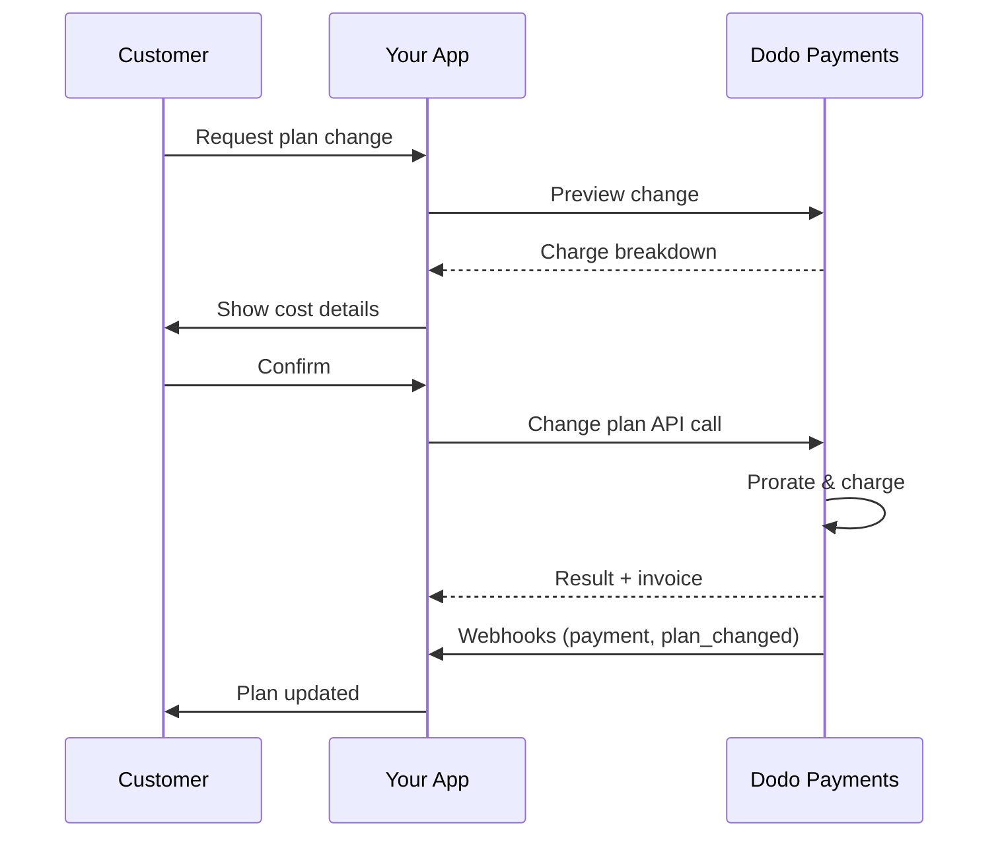
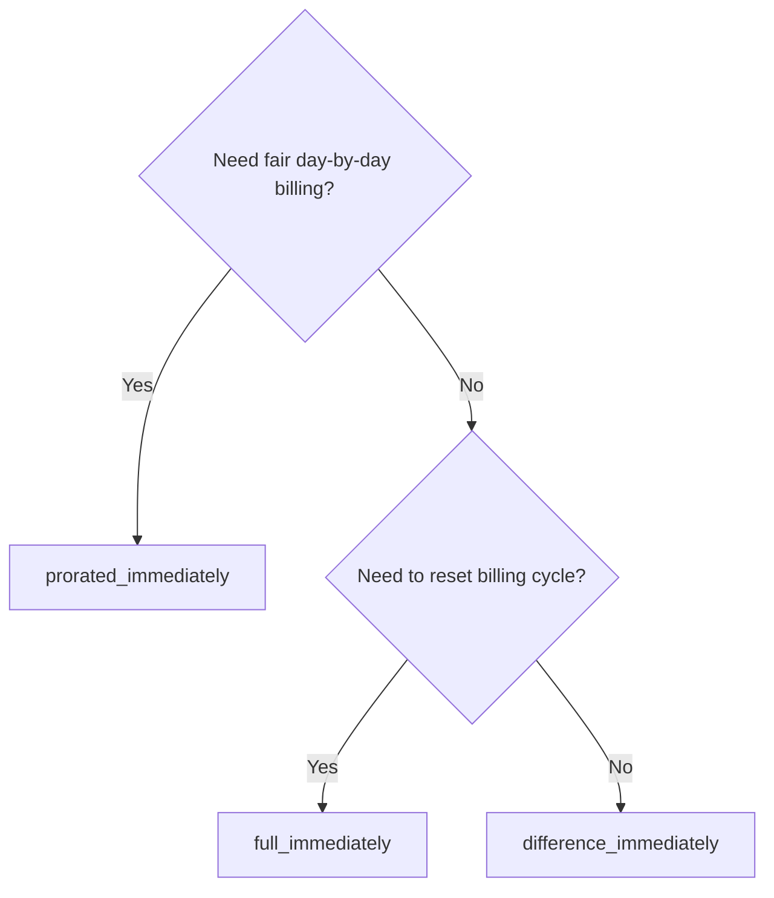
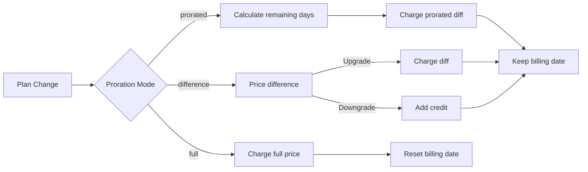

{/* LOCKED_PATTERN_6d744560e4135463c359b094ae69cd5f */}
{/* LOCKED_PATTERN_e019618386b2aca726eb1801e3e74076 */}
  サブスクリプションの更新に関する完全なAPIドキュメント。
</Card>
{/* LOCKED_PATTERN_1e8b2499d330dcc44e5e284a3600fd11 */}
  プラン変更前に請求金額を確認します。
</Card>
{/* LOCKED_PATTERN_782a37ccd4cc5a4159c5497e7f1d4c54 */}
  サブスクリプションの設定手順。
</Card>
</CardGroup>

## サブスクリプションのアップグレードまたはダウングレードとは？

プランを変更すると、顧客をサブスクリプション階層や数量の間で移動できます。次のような用途に使用してください:
- 利用状況や機能に応じて価格を調整する
- 月額から年額へ（またはその逆）移行する
- シートベースの製品の数量を調整する

プラン変更は、選択した按分モードによって即時請求が発生する可能性があります。

## プラン変更を使用するタイミング

- 顧客がより多くの機能、利用量、またはシートを必要とする場合にアップグレードする
- 利用量が減少した場合にダウングレードする
- サブスクリプションをキャンセルせずにユーザーを新しい製品または価格に移行する

## プラン変更の流れ



## 前提条件

サブスクリプションプランの変更を実装する前に、次のことを確認してください：

- アクティブなサブスクリプション製品を持つDodo Paymentsのマーチャントアカウント
- ダッシュボードからのAPI認証情報（APIキーとWebhookシークレットキー）
- 修正するための既存のアクティブなサブスクリプション
- サブスクリプションイベントを処理するために設定されたWebhookエンドポイント

詳細なセットアップ手順については、当社の[Integration Guide](/developer-resources/integration-guide#dashboard-setup)をご覧ください。

## ステップバイステップの実装ガイド

アプリケーションでサブスクリプションプランの変更を実装するための包括的なガイドに従ってください：

実装前に次を確認してください:
- どのサブスクリプション製品をどの製品に変更できるか
- ビジネスモデルに適した按分モード
- プラン変更の失敗をどのように優雅に処理するか
- 状態管理のために監視すべきWebhookイベント

本番環境で実装する前に、テストモードでプラン変更を徹底的にテストしてください。

ビジネスニーズに合った課金方法を選択してください:

最適な用途: 未使用時間に対して公平に請求したいSaaSアプリケーション
- 残りのサイクル時間に基づいて正確な按分金額を計算します
- サイクル内に残る未使用時間に基づいた按分金額を請求します
- 顧客に透明性の高い請求を提供します

最適な用途: 明確なアップグレード・ダウングレードシナリオ
- アップグレード: 即時差額（例: $30→$80 = $50を請求）
- ダウングレード: 残りの価値を将来の更新にクレジット
- 請求ロジックと顧客とのコミュニケーションを簡素化

最適な用途: 課金サイクルをリセットしたいとき
- 新しいプランの全額を即時請求
- 旧プランの残り時間を無視
- 年間契約から月額契約への移行に便利

Change Plan API を使用してサブスクリプションの詳細を変更します:

変更するアクティブなサブスクリプションのID。

サブスクリプションを変更する新しい製品ID。

新しいプランのユニット数（シートベースの製品向け）。

即時請求の処理方法: `prorated_immediately`、`full_immediately`、または `difference_immediately`。

新しいプラン向けのオプションアドオン。空にすると既存のアドオンが削除されます。

プラン変更の支払いが失敗した場合の動作を制御します:
- `prevent_change`: 支払いが成功するまでサブスクリプションを現在のプランのままにします
- `apply_change` (デフォルト): 支払い結果にかかわらずプラン変更を即時適用します

指定しない場合、ビジネスレベルのデフォルト設定が使用されます。

プラン変更の結果を追跡するためにWebhook処理を設定します:

- `subscription.active`: プラン変更が成功し、サブスクリプションが更新されました
- `subscription.plan_changed`: サブスクリプションプランが変更されました（アップグレード/ダウングレード/アドオンの更新）
- `subscription.on_hold`: プラン変更の請求が失敗し、サブスクリプションが一時停止されました
- `payment.succeeded`: プラン変更の即時請求が成功しました
- `payment.failed`: 即時請求が失敗しました

常にWebhook署名を検証し、冪等性のあるイベント処理を実装してください。

Webhookイベントに基づき、アプリケーションを更新します:
- 新しいプランに基づいて機能の付与/取り消し
- 顧客ダッシュボードに新しいプラン情報を反映
- プラン変更に関する確認メールを送信
- 監査目的で請求変更を記録

以下を徹底的にテストしてください:
- さまざまなシナリオで全ての按分モードをテスト
- Webhook処理が正しく動作するかを確認
- プラン変更の成功率を監視
- プラン変更失敗時のアラートを設定

サブスクリプションのプラン変更実装は、本番環境で使用する準備が整いました。

## プラン変更のプレビュー

プラン変更を確定する前に、Preview APIを使用して顧客に請求される金額を正確に表示します:

<Tabs>
<Tab title="Node.js SDK">

```javascript
const preview = await client.subscriptions.previewChangePlan('sub_123', {
  product_id: 'prod_pro',
  quantity: 1,
  proration_billing_mode: 'prorated_immediately'
});

// Show customer the charge before confirming
console.log('Immediate charge:', preview.immediate_charge.summary);
console.log('New plan details:', preview.new_plan);
```

</Tab>

<Tab title="Python SDK">

```python
preview = client.subscriptions.preview_change_plan(
    subscription_id="sub_123",
    product_id="prod_pro",
    quantity=1,
    proration_billing_mode="prorated_immediately"
)

# Show customer the charge before confirming
print("Immediate charge:", preview.immediate_charge.summary)
print("New plan details:", preview.new_plan)
```

</Tab>
</Tabs>

プラン変更を確定する前に、顧客に請求される正確な金額を表示する確認ダイアログをPreview APIで構築してください。

## Change Plan API

Change Plan APIを使用して、アクティブなサブスクリプションの製品、数量、按分動作を変更します。

### クイックスタート例

<Tabs>
  <Tab title="Node.js SDK">

    ```javascript
    import DodoPayments from 'dodopayments';

    const client = new DodoPayments({
      bearerToken: process.env.DODO_PAYMENTS_API_KEY,
      environment: 'test_mode', // defaults to 'live_mode'
    });

    async function changePlan() {
      const result = await client.subscriptions.changePlan('sub_123', {
        product_id: 'prod_new',
        quantity: 3,
        proration_billing_mode: 'prorated_immediately',
        on_payment_failure: 'prevent_change', // Optional: control behavior on payment failure
      });
      console.log(result.status, result.invoice_id, result.payment_id);
    }

    changePlan();
    ```

  </Tab>
  <Tab title="Python SDK">

    ```python
    import os
    from dodopayments import DodoPayments

    client = DodoPayments(
        bearer_token=os.environ.get("DODO_PAYMENTS_API_KEY"),
        environment="test_mode",  # defaults to "live_mode"
    )

    result = client.subscriptions.change_plan(
        subscription_id="sub_123",
        product_id="prod_new",
        quantity=3,
        proration_billing_mode="prorated_immediately",
        on_payment_failure="prevent_change",  # Optional: control behavior on payment failure
    )
    print(result.status, result.get("invoice_id"), result.get("payment_id"))
    ```

  </Tab>
  <Tab title="Go SDK">

    ```go
    package main

    import (
      "context"
      "fmt"
      "github.com/dodopayments/dodopayments-go"
      "github.com/dodopayments/dodopayments-go/option"
    )

    func main() {
      client := dodopayments.NewClient(option.WithBearerToken("YOUR_TOKEN"))
      res, err := client.Subscriptions.ChangePlan(context.TODO(), dodopayments.SubscriptionChangePlanParams{
        SubscriptionID: dodopayments.F("sub_123"),
        ProductID:             dodopayments.F("prod_new"),
        Quantity:              dodopayments.F(int64(3)),
        ProrationBillingMode:  dodopayments.F(dodopayments.SubscriptionChangePlanParamsProrationBillingModeProratedImmediately),
        OnPaymentFailure:      dodopayments.F(dodopayments.OnPaymentFailurePreventChange), // Optional
      })
      if err != nil { panic(err) }
      fmt.Println(res.Status, res.InvoiceID, res.PaymentID)
    }
    ```

  </Tab>
  <Tab title="HTTP">

    ```bash
    curl -X POST "$DODO_API_BASE/subscriptions/sub_123/change-plan" \
      -H "Authorization: Bearer $DODO_PAYMENTS_API_KEY" \
      -H "Content-Type: application/json" \
      -d '{
        "product_id": "prod_new",
        "quantity": 3,
        "proration_billing_mode": "prorated_immediately",
        "on_payment_failure": "prevent_change"
      }'
    ```

  </Tab>
</Tabs>

```json Success
{
  "status": "processing",
  "subscription_id": "sub_123",
  "invoice_id": "inv_789",
  "payment_id": "pay_456",
  "proration_billing_mode": "prorated_immediately"
}
```

<code>invoice_id</code> や <code>payment_id</code> のようなフィールドは、プラン変更中に即時請求および/または請求書が作成された場合にのみ返されます。結果の確認には常にWebhookイベント（例: <code>payment.succeeded</code>、<code>subscription.plan_changed</code>）を使用してください。

即時請求が失敗すると、サブスクリプションは支払いが成功するまで `subscription.on_hold` 状態になる場合があります。

## アドオンの管理

サブスクリプションプランを変更する際にアドオンも変更できます:

```javascript
// Add addons to the new plan
await client.subscriptions.changePlan('sub_123', {
  product_id: 'prod_new',
  quantity: 1,
  proration_billing_mode: 'difference_immediately',
  addons: [
    { addon_id: 'addon_123', quantity: 2 }
  ]
});

// Remove all existing addons
await client.subscriptions.changePlan('sub_123', {
  product_id: 'prod_new',
  quantity: 1,
  proration_billing_mode: 'difference_immediately',
  addons: [] // Empty array removes all existing addons
});
```

アドオンは按分計算に含まれ、選択された按分モードに従って請求されます。

## 按分モード

プラン変更時の請求方法を選択してください:

#### `prorated_immediately`
- 現在のサイクルの差額の一部を請求
- トライアル中の場合、新しいプランに即時切り替えて請求
- ダウングレード: 将来の更新に適用される按分クレジットが発生する場合があります

#### `full_immediately`
- 新しいプランの全額を即時請求
- 旧プランの残り時間を無視

`prorated_immediately` を使用したダウングレードで作成されるクレジットはサブスクリプション単位であり、<a href="/features/customer-credit">Customer Credits</a>とは異なります。同じサブスクリプションの将来の更新に自動的に適用され、サブスクリプション間で移行できません。

#### `difference_immediately`
- アップグレード: 旧プランと新プランの価格差を即時請求
- ダウングレード: 残りの価値をサブスクリプションの内部クレジットに加算し、更新時に自動適用

| 機能 | `prorated_immediately` | `difference_immediately` | `full_immediately` |
|---------|----------------------|------------------------|-------------------|
| **アップグレード請求** | 残り日数に対する按分差額 | プラン間の全差額 | 新プランの全価格 |
| **ダウングレードクレジット** | 残り日数の按分クレジット | 全差額をクレジットとして | クレジットなし |
| **請求サイクル** | 変更なし | 変更なし | 今日にリセット |
| **トライアル動作** | トライアル終了、即時請求 | トライアル終了、即時請求 | トライアル終了、全額請求 |
| **最適な用途** | 時間ベースの公平な請求 | シンプルなアップ/ダウン計算 | 請求サイクルのリセット |
| **複雑さ** | 中程度（日数計算） | 低（単純な減算） | 低（全額請求） |



### 例のシナリオ

以下の代表的な数値を一貫して使用してください:
- 現在のプラン: **Basic** (**$30/月**)
- アップグレード対象: **Pro** (**$80/月**)
- ダウングレード対象（Proから）: **Starter** (**$20/月**)
- 請求サイクル: **30日**、開始日 **1月1日**
- プラン変更発生日: **1月16日**（残り15日、使用済み15日）

  <AccordionGroup>
  {/* LOCKED_PATTERN_1a58b4dbcc060de029ff28c82c80a6fe */}

    ```
    Step 1: Calculate unused credit from current plan
      Unused days = 15 out of 30 days
      Credit = $30 × (15/30) = $15.00

    Step 2: Calculate prorated cost of new plan
      Remaining days = 15 out of 30 days
      New plan cost = $80 × (15/30) = $40.00

    Step 3: Calculate immediate charge
      Charge = New plan cost − Credit
      Charge = $40.00 − $15.00 = $25.00

    → Customer pays $25.00 now
    → Next renewal (Feb 1): $80.00/month
    ```

    ```javascript
    await client.subscriptions.changePlan('sub_123', {
      product_id: 'prod_pro',
      quantity: 1,
      proration_billing_mode: 'prorated_immediately'
    })
    ```

  </Accordion>

  {/* LOCKED_PATTERN_807a82fa1b52ee9a606ce1f9c1d8b613 */}

    ```
    Step 1: Calculate unused credit from current plan
      Unused days = 15 out of 30 days
      Credit = $80 × (15/30) = $40.00

    Step 2: Calculate prorated cost of new plan
      Remaining days = 15 out of 30 days
      New plan cost = $20 × (15/30) = $10.00

    Step 3: Calculate credit balance
      Credit = $40.00 − $10.00 = $30.00

    → No charge — $30.00 credit added to subscription
    → Credit auto-applies to future renewals
    → Next renewal (Feb 1): $20.00 − $30.00 credit = $0.00
    → Following renewal (Mar 1): $20.00 − $10.00 remaining credit = $10.00
    ```

    ```javascript
    await client.subscriptions.changePlan('sub_123', {
      product_id: 'prod_starter',
      quantity: 1,
      proration_billing_mode: 'prorated_immediately'
    })
    ```

  </Accordion>

  {/* LOCKED_PATTERN_67905dd0e892a1412bd0f1a567dd0a62 */}

    ```
    Immediate charge = New plan price − Old plan price
                     = $80 − $30
                     = $50.00

    → Customer pays $50.00 now (regardless of cycle position)
    → Next renewal (Feb 1): $80.00/month
    ```

    ```javascript
    await client.subscriptions.changePlan('sub_123', {
      product_id: 'prod_pro',
      quantity: 1,
      proration_billing_mode: 'difference_immediately'
    })
    ```

  </Accordion>

  {/* LOCKED_PATTERN_b17ed67d3062fadb798904adf781b844 */}

    ```
    Credit = Old plan price − New plan price
           = $80 − $20
           = $60.00

    → No charge — $60.00 credit added to subscription
    → Credit auto-applies to future renewals
    → Next renewal: $20.00 − $20.00 (from credit) = $0.00
    → Following renewal: $20.00 − $20.00 (from credit) = $0.00
    → Third renewal: $20.00 − $20.00 (from remaining credit) = $0.00
    ```

    ```javascript
    await client.subscriptions.changePlan('sub_123', {
      product_id: 'prod_starter',
      quantity: 1,
      proration_billing_mode: 'difference_immediately'
    })
    ```

  </Accordion>

  {/* LOCKED_PATTERN_0cb1a5657302a3970059ca925841dcd5 */}

    ```
    Immediate charge = Full new plan price = $80.00

    → Customer pays $80.00 now
    → No credit for unused time on old plan
    → Billing cycle resets to today (January 16)
    → Next renewal: February 16 at $80.00/month
    ```

    ```javascript
    await client.subscriptions.changePlan('sub_123', {
      product_id: 'prod_pro',
      quantity: 1,
      proration_billing_mode: 'full_immediately'
    })
    ```

  </Accordion>

  {/* LOCKED_PATTERN_6edab7762bdaeaf6cef5f85bafdb8832 */}

    ```
    Current: Basic plan ($30/month), no add-ons
    New: Pro plan ($80/month) + Extra Seats add-on ($10/seat × 3 seats = $30/month)
    Change on day 16 of 30 (15 days remaining)

    Step 1: Credit from current plan
      Credit = $30 × (15/30) = $15.00

    Step 2: Prorated cost of new plan + add-ons
      New plan = $80 × (15/30) = $40.00
      Add-ons = $30 × (15/30) = $15.00
      Total new = $55.00

    Step 3: Immediate charge
      Charge = $55.00 − $15.00 = $40.00

    → Customer pays $40.00 now
    → Next renewal: $80.00 + $30.00 = $110.00/month
    ```

    ```javascript
    await client.subscriptions.changePlan('sub_123', {
      product_id: 'prod_pro',
      quantity: 1,
      proration_billing_mode: 'prorated_immediately',
      addons: [
        { addon_id: 'addon_seats', quantity: 3 }
      ]
    })
    ```

  </Accordion>
</AccordionGroup>

### 各モードの請求処理方法



公平な時間ベースの会計には `prorated_immediately` を選び、請求を再開したい場合は `full_immediately` を選び、シンプルなアップグレードとダウングレードでの自動クレジットには `difference_immediately` を使用してください。

## 支払い失敗の処理

プラン変更の支払いが失敗したときの動作は `on_payment_failure` パラメータで制御します。

### 支払い失敗モード

**動作**: 支払いが成功するまでサブスクリプションを現在のプランのままにします。

- プラン変更は「保留中」とマークされます
- 顧客は現在のプランへのアクセスを維持します
- サブスクリプションは支払いが成功した後にのみ `active` 状態に移行します
- アップグレード機能を提供する前に支払いを確実にしたい場合に便利です

```javascript
await client.subscriptions.changePlan('sub_123', {
  product_id: 'prod_pro',
  quantity: 1,
  proration_billing_mode: 'prorated_immediately',
  on_payment_failure: 'prevent_change'
});
```

</Tab>

**動作**: 支払い結果にかかわらずプラン変更を即時適用します。

- 支払いが失敗してもプラン変更が適用されます
- 顧客は新しいプランに即時アクセスできます
- 支払いが失敗した場合、サブスクリプションは `on_hold` 状態になる可能性があります
- 重大でないアップグレードや顧客を信頼している場合に適しています

```javascript
await client.subscriptions.changePlan('sub_123', {
  product_id: 'prod_pro',
  quantity: 1,
  proration_billing_mode: 'prorated_immediately',
  on_payment_failure: 'apply_change' // This is the default
});
```

</Tab>
</Tabs>

指定しない場合、`on_payment_failure` パラメータはダッシュボードで設定されているビジネスレベルのデフォルト設定を使用します。

### 各モードの使用タイミング

| シナリオ | 推奨モード | 理由 |
|----------|------------------|--------|
| 高機能へのアップグレード | `prevent_change` | アクセスを付与する前に支払いを確保する |
| 数量増加（シート追加） | `prevent_change` | 支払いなしの使用を防ぐ |
| プランのダウングレード | `apply_change` | 顧客が支出を減らしている |
| 信頼できるエンタープライズ顧客 | `apply_change` | 未払いリスクが低い |
| トライアルから有料への移行 | `prevent_change` | 重要な支払いタイミング |

## Webhookの処理

Webhookを通じてサブスクリプションの状態を追跡し、プラン変更と支払いを確認します。

### 処理すべきイベントタイプ
- `subscription.active`: サブスクリプションが有効化されました
- `subscription.plan_changed`: サブスクリプションプランが変更されました（アップ/ダウン/アドオン変更）
- `subscription.on_hold`: 請求が失敗し、サブスクリプションが一時停止されました
- `subscription.renewed`: 更新が成功しました
- `payment.succeeded`: プラン変更または更新の支払いが成功しました
- `payment.failed`: 支払いが失敗しました

サブスクリプションイベントをビジネスロジックの主軸とし、支払いイベントを確認や照合に使用することを推奨します。

### 署名を検証し、インテントを処理する

<Tabs>
  {/* LOCKED_PATTERN_ad56e9578b99d8d029bf3ec794be6fc4 */}

    ```javascript
    import { NextRequest, NextResponse } from 'next/server';
    
    export async function POST(req) {
      const webhookId = req.headers.get('webhook-id');
      const webhookSignature = req.headers.get('webhook-signature');
      const webhookTimestamp = req.headers.get('webhook-timestamp');
      const secret = process.env.DODO_WEBHOOK_SECRET;
    
      const payload = await req.text();
      // verifySignature is a placeholder – in production, use a Standard Webhooks library
      const { valid, event } = await verifySignature(
        payload,
        { id: webhookId, signature: webhookSignature, timestamp: webhookTimestamp },
        secret
      );
      if (!valid) return NextResponse.json({ error: 'Invalid signature' }, { status: 400 });
    
      switch (event.type) {
        case 'subscription.active':
          // mark subscription active in your DB
          break;
        case 'subscription.plan_changed':
          // refresh entitlements and reflect the new plan in your UI
          break;
        case 'subscription.on_hold':
          // notify user to update payment method
          break;
        case 'subscription.renewed':
          // extend access window
          break;
        case 'payment.succeeded':
          // reconcile payment for plan change
          break;
        case 'payment.failed':
          // log and alert
          break;
        default:
          // ignore unknown events
          break;
      }
    
      return NextResponse.json({ received: true });
    }
    ```

  </Tab>
  <Tab title="Express.js">

    ```javascript
    import express from 'express';
    
    const app = express();
    app.post('/webhooks/dodo', express.raw({ type: 'application/json' }), async (req, res) => {
      const webhookId = req.header('webhook-id');
      const webhookSignature = req.header('webhook-signature');
      const webhookTimestamp = req.header('webhook-timestamp');
      const secret = process.env.DODO_WEBHOOK_SECRET;
      const payload = req.body.toString('utf8');
    
      const { valid, event } = await verifySignature(
        payload,
        { id: webhookId, signature: webhookSignature, timestamp: webhookTimestamp },
        secret
      );
      if (!valid) return res.status(400).send('Invalid signature');
    
      // handle events like above
      res.json({ received: true });
    });
    
    app.listen(3000);
    ```

  </Tab>
</Tabs>

詳細なペイロードスキーマについては、<a href="/developer-resources/webhooks/intents/subscription">Subscription webhook payloads</a> および <a href="/developer-resources/webhooks/intents/payment">Payment webhook payloads</a> をご参照ください。

## ベストプラクティス

以下の推奨事項に従って、信頼性の高いサブスクリプションプラン変更を実現してください:

### プラン変更戦略
- **徹底的にテスト**: 本番前に必ずテストモードでプラン変更をテストする
- **按分を慎重に選択**: ビジネスモデルに合う按分モードを選ぶ
- **失敗を丁寧に処理**: 適切なエラーハンドリングと再試行ロジックを実装する
- **成功率を監視**: プラン変更の成功/失敗率を追跡し、問題を調査する

### Webhookの実装
- **署名を検証**: 常にWebhook署名を検証して正当性を確保する
- **冪等性を実装**: 重複するWebhookイベントにも適切に対処する
- **非同期で処理**: 重い処理でWebhookのレスポンスをブロックしない
- **すべてログに記録**: デバッグと監査のために詳細なログを保持する

### ユーザーエクスペリエンス
- **明確に伝える**: 請求の変更とタイミングを顧客に通知する
- **確認を提供**: プラン変更成功のメール確認を送る
- **エッジケースに対応**: トライアル期間、按分、支払い失敗を考慮する
- **UIを即時更新**: アプリケーションのインターフェースにプラン変更を反映する

## よくある問題と対処方法

サブスクリプションプラン変更でよく発生する問題を解決します:

**症状**: API呼び出しは成功するが、サブスクリプションが古いプランのまま

**主な原因**:
- Webhook処理が失敗したか遅延した
- Webhook受信後にアプリケーション状態が更新されていない
- 状態更新時のデータベーストランザクションの問題
**解決策**:
- 再試行ロジックを備えた堅牢なWebhook処理を実装
- 状態更新には冪等な操作を使用
- Webhookイベントの見逃しを検知しアラートする監視を追加
- Webhookエンドポイントがアクセス可能で正しく応答していることを確認

<Accordion title="401 Unauthorized">
無効または欠落しているAPIキー。`DODO_PAYMENTS_API_KEY`が正しいことを確認し、適切な権限があることを確認してください。
</Accordion>

**症状**: 顧客がダウングレードしてもクレジット残高が表示されない
**主な原因**:
- 按分モードの期待: `difference_immediately` ではダウングレード時にプラン間の全差額をクレジットし、`prorated_immediately` はサイクルの残り時間に基づいた按分クレジットを作成します
- クレジットはサブスクリプション固有で、別のサブスクリプションには移行しません
- クレジット残高が顧客ダッシュボードに表示されない
**解決策**:
- 自動クレジットを望むダウングレードでは `difference_immediately` を使用する
- クレジットは同じサブスクリプションの将来の更新に適用されることを顧客に説明する
- クレジット残高を表示する顧客ポータルを実装する
- 次の請求書プレビューで適用されたクレジットを確認する

<Accordion title="422 Unprocessable Entity">
サブスクリプションを変更できません（例：すでにキャンセルされている、製品が利用できないなど）。
</Accordion>

<Accordion title="500 Internal Server Error">
サーバーエラーが発生しました。短い遅延の後にリクエストを再試行してください。
</Accordion>
</AccordionGroup>

**症状**: 無効な署名でWebhookイベントが拒否される
**主な原因**:
- 間違ったWebhookシークレットキー
- 署名検証前に生のリクエストボディが変更された
- 誤った署名検証アルゴリズム
**解決策**:
- ダッシュボードの正しい `DODO_WEBHOOK_SECRET` を使用していることを確認する
- JSON解析ミドルウェアの前に生のリクエストボディを読み取る
- プラットフォーム標準のWebhook検証ライブラリを使用する
- 開発環境でWebhook署名検証をテストする

```json
{
  "error": {
    "code": "subscription_not_found",
    "message": "The subscription with ID 'sub_123' was not found",
    "details": {
      "subscription_id": "sub_123"
    }
  }
}
```

## 次のステップ

**症状**: APIが422 Unprocessable Entityエラーを返す
**主な原因**:
- 無効なサブスクリプションIDまたは製品ID
- サブスクリプションがアクティブな状態ではない
- 必須パラメータが欠如している
- プラン変更に利用できない製品
**解決策**:
- サブスクリプションが存在しアクティブであることを確認
- 製品IDが有効で利用可能か確認
- 必須パラメータがすべて提供されていることを確認
- パラメータ要件についてAPIドキュメントを確認

- <a href="/api-reference/subscriptions/change-plan">プラン変更API</a>をレビューする
- <a href="/features/customer-credit">顧客クレジット</a>を探る
- `subscription.on_hold`のアラートを実装する
- <a href="/developer-resources/webhooks">Webhook統合ガイド</a>をチェックする

**Solutions**:
- Verify subscription exists and is active
- Check product ID is valid and available
- Ensure all required parameters are provided
- Review API documentation for parameter requirements
</Accordion>

**症状**: プラン変更が開始されたが即時請求に失敗
**主な原因**:
- 顧客の支払い方法に資金不足
- 支払い方法が期限切れまたは無効
- 銀行が取引を拒否
- 不正検知により請求がブロックされた
**解決策**:
- `payment.failed` のWebhookイベントを適切に処理
- 顧客に支払い方法の更新を通知
- 一時的な失敗に対して再試行ロジックを実装
- 即時請求が失敗してもプラン変更を許可することを検討

**Common causes**:
- Insufficient funds on customer's payment method
- Payment method expired or invalid
- Bank declined the transaction
- Fraud detection blocked the charge

**Solutions**:
- Handle `payment.failed` webhook events appropriately
- Notify customer to update payment method
- Implement retry logic for temporary failures
- Consider allowing plan changes with failed immediate charges
</Accordion>

**症状**: プラン変更請求が失敗し、サブスクリプションが `on_hold` 状態に移行
**発生すること**:
プラン変更請求が失敗すると、サブスクリプションは自動的に `on_hold` 状態に置かれます。支払い方法が更新されるまで自動更新されません。
**解決策**: 支払い方法を更新してサブスクリプションを再有効化
同じサブスクリプションを `on_hold` 状態から再有効化するには:
1. **Update Payment Method API** を使用して支払い方法を更新
2. **自動請求作成**: APIが未収金額に対する請求を自動で作成
3. **請求書発行**: 請求に対して請求書が生成される
4. **支払い処理**: 新しい支払い方法で支払いが処理される
5. **再有効化**: 支払いが成功するとサブスクリプションは `active` 状態に再度有効化される

**What happens**:
When a plan change charge fails, the subscription is automatically placed in `on_hold` state. The subscription will not renew automatically until the payment method is updated.

**Solution**: Update the payment method to reactivate the subscription

To reactivate a subscription from `on_hold` state after a failed plan change:

1. **Update the payment method** using the Update Payment Method API
2. **Automatic charge creation**: The API automatically creates a charge for remaining dues
3. **Invoice generation**: An invoice is generated for the charge
4. **Payment processing**: The payment is processed using the new payment method
5. **Reactivation**: Upon successful payment, the subscription is reactivated to `active` state

<CodeGroup>

```javascript Node.js
// Reactivate subscription from on_hold after failed plan change
async function reactivateAfterFailedPlanChange(subscriptionId) {
  // Update payment method - automatically creates charge for remaining dues
  const response = await client.subscriptions.updatePaymentMethod(subscriptionId, {
    type: 'new',
    return_url: 'https://example.com/return'
  });
  
  if (response.payment_id) {
    console.log('Charge created for remaining dues:', response.payment_id);
    console.log('Payment link:', response.payment_link);
    
    // Redirect customer to payment_link to complete payment
    // Monitor webhooks for:
    // 1. payment.succeeded - charge succeeded
    // 2. subscription.active - subscription reactivated
  }
  
  return response;
}

// Or use existing payment method if available
async function reactivateWithExistingPaymentMethod(subscriptionId, paymentMethodId) {
  const response = await client.subscriptions.updatePaymentMethod(subscriptionId, {
    type: 'existing',
    payment_method_id: paymentMethodId
  });
  
  // Monitor webhooks for payment.succeeded and subscription.active
  return response;
}
```

```python Python
# Reactivate subscription from on_hold after failed plan change
def reactivate_after_failed_plan_change(subscription_id):
    # Update payment method - automatically creates charge for remaining dues
    response = client.subscriptions.update_payment_method(
        subscription_id=subscription_id,
        type="new",
        return_url="https://example.com/return"
    )
    
    if response.payment_id:
        print("Charge created for remaining dues:", response.payment_id)
        print("Payment link:", response.payment_link)
        
        # Redirect customer to payment_link to complete payment
        # Monitor webhooks for:
        # 1. payment.succeeded - charge succeeded
        # 2. subscription.active - subscription reactivated
    
    return response

# Or use existing payment method if available
def reactivate_with_existing_payment_method(subscription_id, payment_method_id):
    response = client.subscriptions.update_payment_method(
        subscription_id=subscription_id,
        type="existing",
        payment_method_id=payment_method_id
    )
    
    # Monitor webhooks for payment.succeeded and subscription.active
    return response
```

</CodeGroup>

**監視すべきWebhookイベント**:
- `subscription.on_hold`: プラン変更請求が失敗したときに受信する、サブスクリプションが保留状態になったイベント
- `payment.succeeded`: 支払い方法更新後、未収金額の支払いが成功したイベント
- `subscription.active`: 支払い成功後にサブスクリプションが再有効化されたイベント
**ベストプラクティス**:
- プラン変更請求が失敗した際には顧客に即座に通知する
- 支払い方法の更新方法を分かりやすく案内する
- 再有効化状況を追跡するためWebhookイベントを監視する
- 一時的な支払い失敗に対して自動再試行ロジックの実装を検討

**Best practices**:
- Notify customers immediately when a plan change charge fails
- Provide clear instructions on how to update their payment method
- Monitor webhook events to track reactivation status
- Consider implementing automatic retry logic for temporary payment failures

支払い方法の更新とサブスクリプションの再有効化に関する完全なAPIドキュメントをご覧ください。

## 実装のテスト

サブスクリプションプラン変更の実装を徹底的にテストするには、以下のステップに従ってください:

- テストAPIキーとテスト製品を使用する
- 異なるプランタイプでテスト用サブスクリプションを作成する
- テストWebhookエンドポイントを設定する
- 監視とロギングを設定する

- 異なる請求サイクルの位置で `prorated_immediately` をテストする
- アップグレードとダウングレードで `difference_immediately` をテストする
- 請求サイクルをリセットするために `full_immediately` をテストする
- クレジット計算が正しいことを確認する

- 関連するWebhookイベントがすべて受信されていることを確認する
- Webhook署名検証をテストする
- 重複Webhookイベントを適切に処理する
- Webhook処理の失敗シナリオをテストする

- 無効なサブスクリプションIDでテストする
- 期限切れの支払い方法でテストする
- ネットワーク障害やタイムアウトをテストする
- 資金不足でテストする

- プラン変更失敗のアラートを設定する
- Webhook処理時間を監視する
- プラン変更の成功率を追跡する
- プラン変更に関するカスタマーサポートチケットを確認する

## エラー処理

一般的なAPIエラーを処理します:

### HTTPステータスコード

プラン変更リクエストは正常に処理されました。サブスクリプションが更新され、支払い処理が開始されています。

リクエストパラメータが無効です。すべての必須フィールドが提供され、正しくフォーマットされているか確認してください。

APIキーが無効または欠落しています。`DODO_PAYMENTS_API_KEY` が正しく、適切な権限を持っていることを確認してください。

サブスクリプションIDが見つからないか、アカウントに属していません。

サブスクリプションを変更できません（例: すでにキャンセルされている、製品が利用できないなど）。

サーバーエラーが発生しました。少し時間を置いて再試行してください。

### エラー応答形式

```json
{
  "error": {
    "code": "subscription_not_found",
    "message": "The subscription with ID 'sub_123' was not found",
    "details": {
      "subscription_id": "sub_123"
    }
  }
}
```

## 次のステップ

- <a href="/api-reference/subscriptions/change-plan">Change Plan API</a> を確認する
- <a href="/features/customer-credit">Customer Credits</a> を探索する
- `subscription.on_hold` のアラートを実装する
- <a href="/developer-resources/webhooks">Webhook Integration Guide</a> をご覧ください
