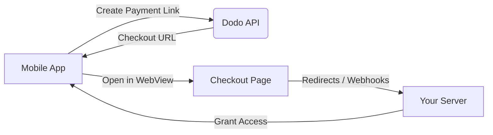

## はじめに

Dodo Paymentsは、開発者がiOSアプリでデジタル商品やサービスを販売できるようにし、税務コンプライアンス、通貨換算、支払いなどの複雑な側面を処理します。この包括的なガイドでは、SaaSツール、コンテンツサブスクリプション、デジタルユーティリティ向けにDodo PaymentsをiOSアプリに統合する方法を詳しく説明します。

## 概要

Dodo Paymentsは、あなたの**記録商人 (MoR)**として機能し、デジタルビジネスの重要な側面を管理します：

<Tabs>
<Tab title="What We Handle">
- 税金の徴収と送金（VAT、GST、その他の地域税）
- ポリシーおよび現地の支払い方法に準拠したグローバル支払い
- 通貨換算と外国為替
- チャージバックと不正防止
- エンドカスタマー向け請求および領収書
- 地域の規制遵守
</Tab>

<Tab title="What You Get">
- Webおよびモバイルプラットフォーム向けの統合API
- アプリ内チェックアウトのサポート（UPI、カード、ウォレット、BNPL）
- グローバル支払い対応（Payoneer、Wise、現地銀行振込）
- 分析およびレポートダッシュボード
- 安全な決済処理
</Tab>
</Tabs>

## ユースケース

<CardGroup cols={2}>
<Card title="Subscriptions" icon="repeat">
- プレミアムコンテンツまたは機能アクセス
- 柔軟なオプションの定期課金、無料トライアル、比例配分、アップグレードおよびダウングレード
</Card>

<Card title="Courses and Learning" icon="graduation-cap">
- コースごとのアクセス課金
- バンドルコンテンツパッケージ
- 永続または更新可能なライセンス
- 進捗追跡の統合
</Card>

<Card title="Digital Downloads" icon="download">
- 一度限りの購入（PDF、音楽、ツール）
- デジタル資産の配信
- ライセンスキー管理
</Card>

<Card title="SaaS Tools" icon="screwdriver-wrench">
- SaaSサブスクリプション
- 使用量に基づく課金
- チームおよびエンタープライズプラン
</Card>
</CardGroup>

## 統合フロー

Dodo Paymentsをアプリに統合するには、ホストされたチェックアウトまたはアプリ内ブラウザソリューションを使用できます。

### 統合手順

<Steps>
<Step title="Mobile App to Dodo API">
このプロセスは、モバイルアプリがDodo APIと連携して支払いリンクを作成することから始まります。
</Step>

<Step title="Dodo API to Mobile App">
Dodo APIはチェックアウトURLをモバイルアプリに返すことで応答します。
</Step>

<Step title="Mobile App to Checkout Page">
モバイルアプリはこのチェックアウトURLをWebView内で開き、ユーザーをチェックアウトページに誘導します。
</Step>

<Step title="Checkout Page to Your Server">
チェックアウトプロセス完了後、チェックアウトページはリダイレクトまたはWebhookを通じてサーバーと通信します。
</Step>

<Step title="Your Server to Mobile App">
最後に、お客様のサーバーが購入したコンテンツまたはサービスへのアクセスを許可し、モバイルアプリ内で取引サイクルが完了します。
</Step>
</Steps>

<Card title="Mobile Integration Guide" icon="mobile" href="/developer-resources/mobile-integration">
完全な開発者向けウォークスルーについては、Mobile Integration Guideをご覧ください。
</Card>

## 地域の可用性

Dodo Paymentsは、Appleが外部支払いを明示的に許可しているApp Store地域、または規制当局または裁判所の命令によって義務付けられている地域でのみ、代替のアプリ内購入フローを可能にします。

### 対応地域

<AccordionGroup>
<Accordion title="United States">
現在の裁判所命令およびAppleの最新ガイドラインで許可されている範囲でサポートされます。

- 特定の裁判所命令に基づく条項の下で利用可能
- Appleが法的要件を遵守することが条件
- Appleの実装ガイドラインに従う必要があります
</Accordion>

<Accordion title="European Union (EU) App Store">
AppleのEU代替条件および外部購入権限を通じてサポートされます。

- AppleのEU代替条件を通じて有効化
- 外部購入権限の承認が必要
- EUデジタル市場法の要件を遵守する必要があります
</Accordion>

<Accordion title="South Korea">
韓国専用バイナリ向けのStoreKit外部購入権限を通じてサポートされます。

- StoreKit外部購入権限を通じて利用可能
- 韓国特有のアプリバイナリが必要
- 韓国の電気通信法を遵守する必要があります
</Accordion>
</AccordionGroup>

<Warning>
Dodo Paymentsを任意のストアフロントで有効にする前に、常にAppleの地域別権限およびApp Store Connect要件を確認し、遵守してください。未対応地域で代替決済フローを利用すると、アプリが拒否または削除される可能性があります。
</Warning>

<Note>
一部のビジネスモデル（サービスや特定のコンテンツカテゴリなど）では、Appleがアプリ内課金（IAP）の使用を必須としない場合があります。Dodo Paymentsはこれらのモデルにも対応しています。IAPが使用例に対して必須かどうかを判断するために、常にアプリの分類とAppleの最新ガイドラインを確認してください。
</Note>

### 詳細を学ぶ

グローバルポリシー、法的前例、App Store手数料を回避するための戦略的アプローチの詳細な内訳については、包括的なガイドをご覧ください：

<Card title="Bypassing App Store & Play Store Fees: A Strategic and Legal Playbook" icon="shield-check" href="/features/bypassing-app-store-fees">
最新の地域別ガイダンスとコンプライアンスのヒントに従って、代替決済フローをどこでどのように合法的に実装できるかを確認してください。
</Card>