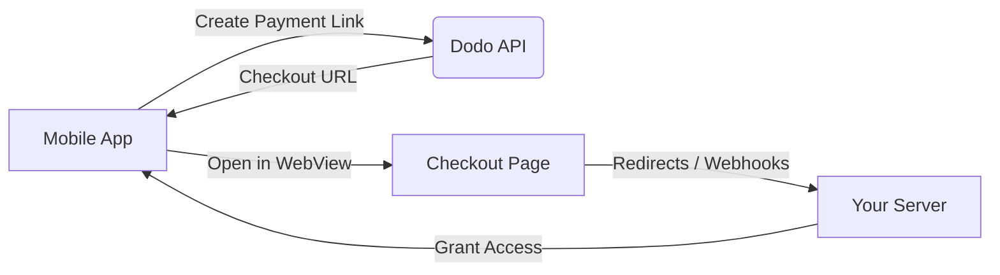

## はじめに

Dodo Paymentsは、開発者がiOSアプリでデジタル商品やサービスを販売できるようにし、税務コンプライアンス、通貨換算、支払いなどの複雑な側面を処理します。この包括的なガイドでは、SaaSツール、コンテンツサブスクリプション、デジタルユーティリティ向けにDodo PaymentsをiOSアプリに統合する方法を詳しく説明します。

## 概要

Dodo Paymentsは、あなたの**記録商人 (MoR)**として機能し、デジタルビジネスの重要な側面を管理します：

<Tabs>
<Tab title="私たちが扱うこと">
- 税金の徴収と納付（VAT、GST、その他の地域税）
- ポリシーおよび地域の支払い方法に基づくグローバルな支払い
- 通貨換算と外国為替
- チャージバックと詐欺防止
- エンドカスタマーの請求書と領収書
- 地域規制の遵守
</Tab>

<Tab title="あなたが得られるもの">
- ウェブおよびモバイルプラットフォーム向けの統一API
- アプリ内チェックアウトのサポート（UPI、カード、ウォレット、BNPL）
- グローバルな支払いサポート（Payoneer、Wise、ローカル銀行振込）
- 分析およびレポートダッシュボード
- 安全な支払い処理
</Tab>
</Tabs>

## ユースケース

<CardGroup cols={2}>
<Card title="サブスクリプション" icon="repeat">
- プレミアムコンテンツまたは機能へのアクセス
- 柔軟なオプションでの定期請求、無料トライアル、按分、アップグレードおよびダウングレード
</Card>

<Card title="コースと学習" icon="graduation-cap">
- コースごとのアクセス
- バンドルコンテンツパッケージ
- 生涯または更新可能なライセンス
- 進捗追跡の統合
</Card>

<Card title="デジタルダウンロード" icon="download">
- 一回限りの購入（PDF、音楽、ツール）
- デジタル資産の配信
- ライセンスキー管理
</Card>

<Card title="SaaSツール" icon="screwdriver-wrench">
- サービスとしてのソフトウェアのサブスクリプション
- 使用量に基づく請求
- チームおよびエンタープライズプラン
</Card>
</CardGroup>

## 統合フロー

Dodo Paymentsをアプリに統合するには、ホストされたチェックアウトまたはアプリ内ブラウザソリューションを使用できます。

### 統合手順

<Steps>
<Step title="モバイルアプリからDodo APIへ">
プロセスは、モバイルアプリがDodo APIと対話して支払いリンクを作成することから始まります。
</Step>

<Step title="Dodo APIからモバイルアプリへ">
Dodo APIは、モバイルアプリにチェックアウトURLを提供して応答します。
</Step>

<Step title="モバイルアプリからチェックアウトページへ">
モバイルアプリは、このチェックアウトURLをWebView内で開き、ユーザーをチェックアウトページに導きます。
</Step>

<Step title="チェックアウトページからあなたのサーバーへ">
チェックアウトプロセスが完了すると、チェックアウトページはリダイレクトまたはWebhookを通じてあなたのサーバーと通信します。
</Step>

<Step title="あなたのサーバーからモバイルアプリへ">
最後に、あなたのサーバーは購入したコンテンツまたはサービスへのアクセスを許可し、モバイルアプリ内で取引サイクルを完了します。
</Step>
</Steps>

<Card title="モバイル統合ガイド" icon="mobile" href="/developer-resources/mobile-integration">
完全な開発者の手順については、モバイル統合ガイドをご覧ください。
</Card>

## 地域の可用性

Dodo Paymentsは、Appleが外部支払いを明示的に許可しているApp Store地域、または規制当局または裁判所の命令によって義務付けられている地域でのみ、代替のアプリ内購入フローを可能にします。

### 対応地域

<AccordionGroup>
<Accordion title="アメリカ合衆国">
現在の裁判所の命令およびAppleの更新されたガイドラインに基づいて許可される範囲でサポートされています。

- 特定の裁判所の命令に基づく条件下で利用可能
- Appleが法的要件を遵守する必要があります
- Appleの実装ガイドラインに従う必要があります
</Accordion>

<Accordion title="欧州連合 (EU) App Store">
AppleのEU代替条件および外部購入権限を通じてサポートされています。

- AppleのEU代替条件を通じて有効
- 外部購入権限の承認が必要
- EUデジタル市場法の要件を遵守する必要があります
</Accordion>

<Accordion title="韓国">
韓国専用バイナリのStoreKit外部購入権限を通じてサポートされています。

- StoreKit外部購入権限を通じて利用可能
- 韓国特有のアプリバイナリが必要
- 韓国の電気通信法を遵守する必要があります
</Accordion>
</AccordionGroup>

<Warning>
Dodo Paymentsを任意のストアフロントに対して有効にする前に、Appleの地域特有の権限およびApp Store Connectの要件を常に確認し、遵守してください。サポートされていない地域で代替支払いフローを使用すると、アプリの拒否または削除の原因となる可能性があります。
</Warning>

<Note>
サービスや特定のコンテンツカテゴリなど、一部のビジネスモデルでは、Appleがアプリ内購入 (IAP) の使用を全く要求しない場合があります。Dodo Paymentsはこれらのモデルもサポートしています。アプリの分類とAppleの最新のガイドラインを常に確認し、IAPがあなたのユースケースにとって必須かどうかを判断してください。
</Note>

### 詳細を学ぶ

グローバルポリシー、法的前例、App Store手数料を回避するための戦略的アプローチの詳細な内訳については、包括的なガイドをご覧ください：

<Card title="App StoreおよびPlay Store手数料の回避：戦略的および法的プレイブック" icon="shield-check" href="/features/bypassing-app-store-fees">
代替支払いフローを合法的に実装できる場所と方法を学び、最新の地域ガイダンスとコンプライアンスのヒントを得てください。
</Card>