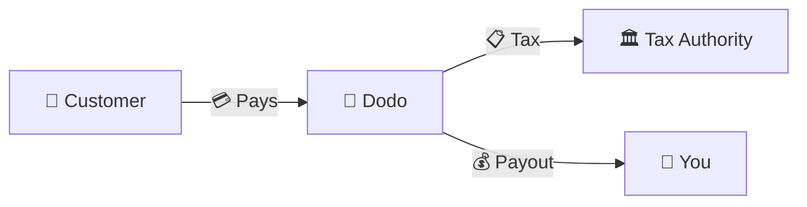
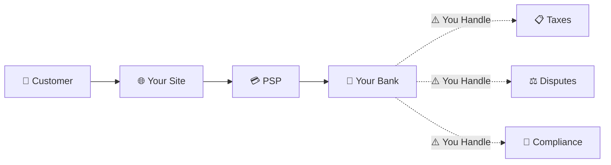
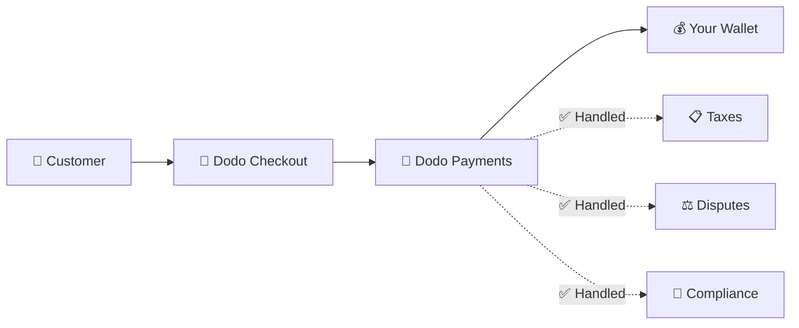
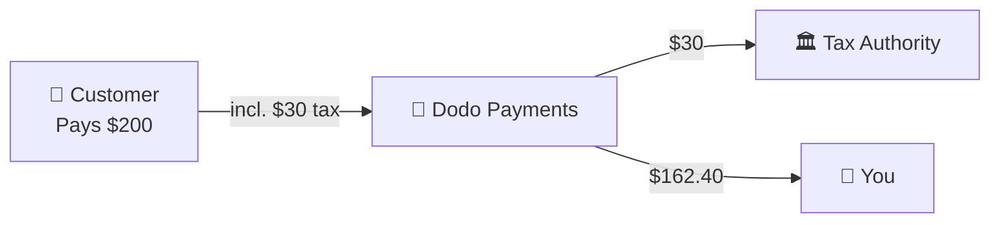

Dodo Paymentsは**記録商人（MoR）**として運営されており、あなたのデジタル製品の法的な販売者となり、支払い、税金、詐欺、コンプライアンスの責任を引き受けることで、あなたが製品の構築に完全に集中できるようにします。

<CardGroup cols={3}>
税務コンプライアンスを自動で処理
</Card>

{/* LOCKED_PATTERN_a7f32ee62695527a537b82d99f01c4bc */}
カード、ウォレット、ローカル決済方法
</Card>

{/* LOCKED_PATTERN_cb6e35d755bb02c3f1254b1c5a9c4c73 */}
すべての送金を担当します
</Card>
</CardGroup>

## 記録商人とは？

**記録商人**は、顧客のクレジットカード明細に表示され、取引の責任を引き受ける法的な実体です。Dodo PaymentsをMoRとして使用する場合：

- **私たちが法的な販売者です** — Dodoが銀行明細書や領収書に表示されます
- **あなたが製品のクリエイターです** — あなたが製品を構築し、価格を設定し、提供します
- **私たちがバックオフィスを処理します** — 税金、紛争、コンプライアンス、請求サポート
- **あなたは純利益を受け取ります** — 収益が直接あなたの口座に入金されます

<Note>
Merchant of Recordとは、国ごとの請求、税務、請求書発行をすべて処理してくれるグローバルなファイナンスチームを雇うようなものです — あなたは何もする必要はありません。
</Note>

## なぜ記録商人を使用するのか？

デジタル製品をグローバルに販売することは、ヨーロッパのVAT、オーストラリアのGST、アメリカの売上税、そして無数の他の要件をナビゲートすることを意味します。各管轄区域には異なるルール、税率、閾値、申告期限があります。

| あなたの責任 | MoRなし | DodoをMoRとして使用した場合 |
|---------------------|:-----------:|:----------------:|
| VAT/GST登録 | ❌ あなた | ✅ Dodo |
| 税金計算 | ❌ あなた | ✅ Dodo |
| 税務申告と送金 | ❌ あなた | ✅ Dodo |
| チャージバック責任 | ❌ あなた | ✅ Dodo |
| PCIコンプライアンス | ❌ あなた | ✅ Dodo |
| 多通貨サポート | ❌ 複雑 | ✅ 組み込み |
| ローカル支払い方法 | ❌ 各自統合 | ✅ 30+含まれています |

<Tip>
**例**: フランスの顧客に月額50€のサブスクリプションを販売する場合?

**MoRなし**: フランスのVATに登録し、€60（20% VAT）を請求し、四半期ごとにフランスの申告を行い、監査を処理します — フランス語で。

**Dodoの場合**: €60を徴収し、€10のVATをフランスに納付して、手数料差し引きで€50をお支払いします。あなたはコードを書くだけです。
</Tip>

## PSPとMoR: 主な違い

**決済サービスプロバイダー**（Stripeなど）と**記録商人**の違いを理解することは重要です。

### 決済サービスプロバイダー（PSP）

PSPは取引を処理しますが、あなたを法的な販売者として残します：

<Warning>
PSPを利用する場合、**あなた**が顧客を有するすべての法域で税務登録、徴収、申告、送金の責任を負います。
</Warning>

### 記録商人（Dodo）

MoRは法的な販売者となり、コンプライアンスをエンドツーエンドで処理します：

<Check>
DodoをMoRとして利用すると、税務、紛争、コンプライアンスをすべて私たちが担当します。あなたは書類なしで純額の支払いを受け取れます。
</Check>

### サイドバイサイド比較

| 概要 | PSP（Stripeなど） | MoR（Dodo） |
|--------|:------------------:|:----------:|
| 法的販売者 | あなたの会社 | Dodo |
| 顧客明細書に表示 | あなたの名前 | Dodo |
| 税務登録 | ❌ あなた | ✅ Dodo |
| 税金計算 | ❌ あなた | ✅ Dodo |
| 税金送金 | ❌ あなた | ✅ Dodo |
| チャージバックリスク | ❌ あなた | ✅ Dodo |
| PCIコンプライアンス | ❌ あなた | ✅ Dodo |
| グローバル設定 | 複雑 | シンプル |

<Info>
**重要**: PSPとMoRの両方が支払い処理を行います。主な違いは**税務コンプライアンスと取引責任の法的責任者が誰か**という点です。
</Info>

## 税務コンプライアンスの仕組み

Dodoは税務ライフサイクル全体を自動的に処理します：

<Steps>
{/* LOCKED_PATTERN_9939f53f87faa28f5e85c7bcd4aa5d90 */}
顧客の国を検出し、適用される税ルール（VAT、GST、販売税、その他のローカル要件）を判定します。
</Step>

{/* LOCKED_PATTERN_70142fc485c0e1d535a43e599b490143 */}
製品種類、顧客の所在地、B2B/B2Cステータスに基づいて正しい税率を計算します。有効なVAT番号を持つEU法人顧客には逆課税を適用します。
</Step>

{/* LOCKED_PATTERN_44b82b1d71e9f255cf562f67916ee9b7 */}
税額はチェックアウト時に明確に表示され、徴収されます。顧客は支払額を正確に確認できます。
</Step>

{/* LOCKED_PATTERN_1a778e95cb3812007334c0b47194f9ac */}
申告書を提出し、収集した税金を関係当局に予定通り納付します。あなたが税務書類を見ることはありません。
</Step>
</Steps>

## 収益の流れ

顧客からあなたの口座へのお金の流れは次のようになります：

### 例：支払いの内訳

| ラインアイテム | 金額 |
|-----------|-------:|
| 顧客の支払い | $200.00 |
| 売上税（15% VAT） | −$30.00 |
| Dodoプラットフォーム手数料（4%） | −$8.00 |
| 支払い処理 | −$0.60 |
| **あなたの支払い** | **$162.40** |

## MoRとPSPを選ぶべき時

<Tabs>
{/* LOCKED_PATTERN_1d2e428d12b1ee53f2d946d9302bede1 */}
**Dodo Paymentsが理想的なケース:**

- デジタル製品、SaaS、サブスクリプションを販売している
- 複数の国に顧客がいる
- 税務登録の煩わしさを避けたい
- 予測可能で外部委託されたコンプライアンスを希望する
- 最大のコントロールより市場投入までのスピードを重視する
- 紛争や不正の管理をしたくない
</Tab>

{/* LOCKED_PATTERN_9020967e8e2c9a3ebc575f4072e18e76 */}
**PSPが適している可能性があるケース:**

- 主に1つの国で事業を展開している
- 社内の財務およびコンプライアンスチームを持っている
- チェックアウトのUXを完全にコントロールする必要がある
- 非常に薄利で事業を運営している
- 物理的な商品を販売している（MoRはデジタルに注力）
</Tab>
</Tabs>

<Note>
多くの企業はPSPから始め、国際展開に伴いMoRに移行します。Dodoはこの移行をスムーズにするためのサポートを提供します。
</Note>

## よくある質問

<AccordionGroup>
{/* LOCKED_PATTERN_03db007d1397fc75cc7c059a12f7514d */}
Dodo Paymentsが販売者として表示されます。文字数制限の範囲で、あなたの製品やブランドの参照を含め、顧客には詳細な領収書にあなたの製品情報が表示されます。
</Accordion>

{/* LOCKED_PATTERN_14efbd55af6b9971cc9bb290118d1ce5 */}
はい。価格設定、ブランディング、製品提供、直接のコミュニケーションはあなたがコントロールします。Dodoは請求の仕組みを担当しますが、顧客にはあなたから購入していることが伝わります。チェックアウト、メール、請求書にはあなたのブランドが明確に表示されます。
</Accordion>

{/* LOCKED_PATTERN_5e87ff5ce15f8c25ec293008878ec1c8 */}
EUでのB2B販売では、顧客がチェックアウト時にVAT番号を入力できます。私たちがそれを検証し、逆課税を自動的に適用します — 税金は徴収されず、買い手のVAT申告に移行します。
</Accordion>

{/* LOCKED_PATTERN_828a96aed23c294d40585d542017c689 */}
Dodoは独自の決済インフラを用いた完全なソリューションとして機能します。この統合により、税務および不正の責任を負うことが可能となっています。今後、他の決済プロバイダーとの統合提供も進めています。
</Accordion>

{/* LOCKED_PATTERN_7d718a1b657f28e952148f962ca6593e */}
ダッシュボードから返金を開始してください。顧客の元の決済方法と通貨で返金を処理します。税額は自動的に調整・照合されます。
</Accordion>

{/* LOCKED_PATTERN_dc7f113144600495109fc2c229c89f70 */}
Dodoは顧客取引に対する**売上税**（VAT、GST、販売税）を取り扱います。あなたは受け取る支払いに対する事業の所得税、法人税、その他の税務義務について引き続き責任を負います。
</Accordion>

{/* LOCKED_PATTERN_04ec30ba2875e1ca25e9a1ae1dcc112d */}
220以上の国・地域からの支払いを受け付けており、継続的に拡大しています。完全なリストはこちら：

{/* LOCKED_PATTERN_1baa59aa331aff639990872bb61046bd */}
支払いを受け付けている220以上の国・地域すべてを表示する。
</Card>
</Accordion>
</AccordionGroup>

## 始める

<CardGroup cols={2}>
{/* LOCKED_PATTERN_a6e00712f4bf1e0645985bccec8d5def */}
無料でサインアップして、数分でグローバルペイメントを受け取りましょう。
</Card>

{/* LOCKED_PATTERN_d858044e80838a32f52c51b21b17f5eb */}
事例とユースケースを交えた詳細な比較。
</Card>

{/* LOCKED_PATTERN_4e501d9df0a1b75ab7c08a16b87219c5 */}
サポートする事業を確認する。
</Card>

{/* LOCKED_PATTERN_6053eaa23d9fa4210c02c58e94af8536 */}
チームからのパーソナライズされたガイダンスを受ける。
</Card>
</CardGroup>
