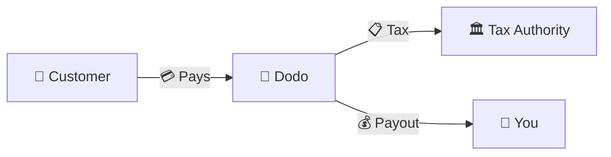
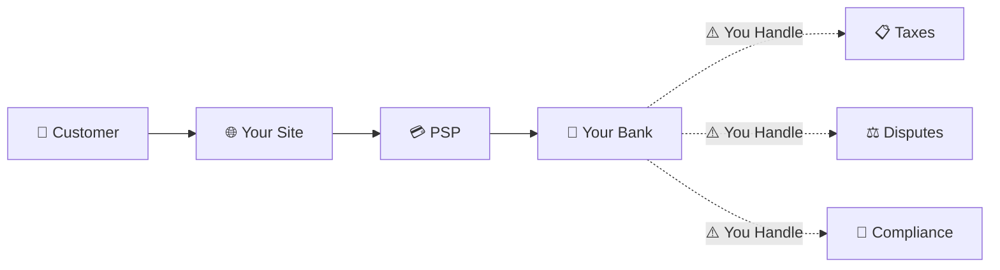
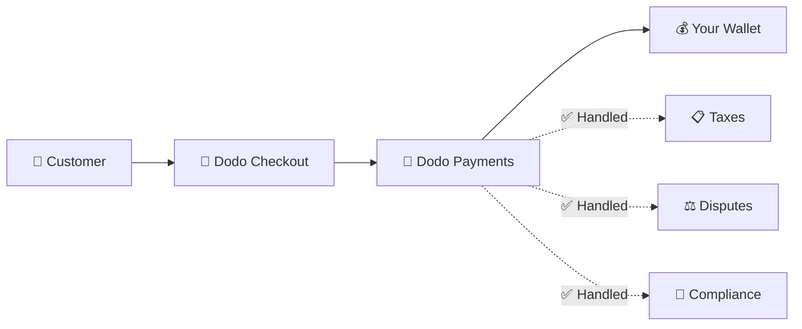
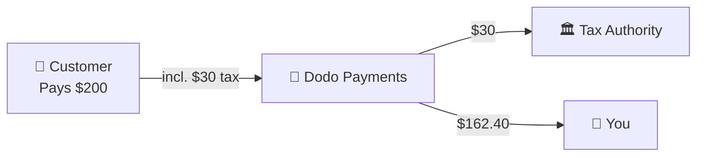

Dodo Paymentsは**記録商人（MoR）**として運営されており、あなたのデジタル製品の法的な販売者となり、支払い、税金、詐欺、コンプライアンスの責任を引き受けることで、あなたが製品の構築に完全に集中できるようにします。

<CardGroup cols={3}>
<Card title="220+地域" icon="globe">
税務コンプライアンスは自動的に処理されます
</Card>

<Card title="30+支払い方法" icon="credit-card">
カード、ウォレット、ローカルメソッド
</Card>

<Card title="ゼロ税務申告" icon="file-invoice">
すべての送金を処理します
</Card>
</CardGroup>

## 記録商人とは？

**記録商人**は、顧客のクレジットカード明細に表示され、取引の責任を引き受ける法的な実体です。Dodo PaymentsをMoRとして使用する場合：

- **私たちが法的な販売者です** — Dodoが銀行明細書や領収書に表示されます
- **あなたが製品のクリエイターです** — あなたが製品を構築し、価格を設定し、提供します
- **私たちがバックオフィスを処理します** — 税金、紛争、コンプライアンス、請求サポート
- **あなたは純利益を受け取ります** — 収益が直接あなたの口座に入金されます

<Note>
記録商人を、請求書、税金、請求をすべての国で処理するグローバルなファイナンスチームを雇うことと考えてください — あなたが指一本動かすことなく。
</Note>

## なぜ記録商人を使用するのか？

デジタル製品をグローバルに販売することは、ヨーロッパのVAT、オーストラリアのGST、アメリカの売上税、そして無数の他の要件をナビゲートすることを意味します。各管轄区域には異なるルール、税率、閾値、申告期限があります。

| あなたの責任 | MoRなし | DodoをMoRとして使用した場合 |
|---------------------|:-----------:|:----------------:|
| VAT/GST登録 | ❌ あなた | ✅ Dodo |
| 税金計算 | ❌ あなた | ✅ Dodo |
| 税務申告と送金 | ❌ あなた | ✅ Dodo |
| チャージバック責任 | ❌ あなた | ✅ Dodo |
| PCIコンプライアンス | ❌ あなた | ✅ Dodo |
| 多通貨サポート | ❌ 複雑 | ✅ 組み込み |
| ローカル支払い方法 | ❌ 各自統合 | ✅ 30+含まれています |

<Tip>
**例**: フランスの顧客に€50/月のサブスクリプションを販売する場合？

**MoRなし**: フランスのVATに登録し、€60（20% VAT）を請求し、四半期ごとにフランスの申告を行い、監査を処理します — フランス語で。

**Dodoを使用した場合**: 私たちは€60を集め、€10のVATをフランスに送金し、手数料を差し引いた€50をあなたに支払います。あなたはコードを書くことに集中します。
</Tip>

## PSPとMoR: 主な違い

**決済サービスプロバイダー**（Stripeなど）と**記録商人**の違いを理解することは重要です。

### 決済サービスプロバイダー（PSP）

PSPは取引を処理しますが、あなたを法的な販売者として残します：

<Warning>
PSPを使用すると、**あなた**が税務登録、徴収、申告、送金の責任を負います。顧客がいるすべての管轄区域で。
</Warning>

### 記録商人（Dodo）

MoRは法的な販売者となり、コンプライアンスをエンドツーエンドで処理します：

<Check>
DodoをMoRとして使用すると、私たちが税金、紛争、コンプライアンスを処理します。あなたは書類なしで純利益を受け取ります。
</Check>

### サイドバイサイド比較

| 概要 | PSP（Stripeなど） | MoR（Dodo） |
|--------|:------------------:|:----------:|
| 法的販売者 | あなたの会社 | Dodo |
| 顧客明細書に表示 | あなたの名前 | Dodo |
| 税務登録 | ❌ あなた | ✅ Dodo |
| 税金計算 | ❌ あなた | ✅ Dodo |
| 税金送金 | ❌ あなた | ✅ Dodo |
| チャージバックリスク | ❌ あなた | ✅ Dodo |
| PCIコンプライアンス | ❌ あなた | ✅ Dodo |
| グローバル設定 | 複雑 | シンプル |

<Info>
**重要**: PSPとMoRはどちらも支払い処理を行います。主な違いは、**誰が法的に税務コンプライアンスと取引責任を負うか**です。
</Info>

## 税務コンプライアンスの仕組み

Dodoは税務ライフサイクル全体を自動的に処理します：

<Steps>
<Step title="顧客の所在地">
顧客の国を検出し、どの税ルールが適用されるかを判断します — VAT、GST、売上税、または他のローカル要件。
</Step>

<Step title="税率計算">
製品の種類、顧客の所在地、B2B/B2Cのステータスに基づいて正しい税率が計算されます。EUのビジネス顧客は有効なVAT番号を持っている場合、逆課税が適用されます。
</Step>

<Step title="チェックアウト時の徴収">
税金は明確に表示され、チェックアウト時に徴収されます。顧客は自分が支払っている金額を正確に確認できます。
</Step>

<Step title="申告と送金">
私たちは申告を行い、徴収した税金を関連当局に定期的に支払います。あなたは税務申告書を見ることはありません。
</Step>
</Steps>

## 収益の流れ

顧客からあなたの口座へのお金の流れは次のようになります：

### 例：支払いの内訳

| ラインアイテム | 金額 |
|-----------|-------:|
| 顧客の支払い | $200.00 |
| 売上税（15% VAT） | −$30.00 |
| Dodoプラットフォーム手数料（4%） | −$8.00 |
| 支払い処理 | −$0.60 |
| **あなたの支払い** | **$162.40** |

## MoRとPSPを選ぶべき時

<Tabs>
<Tab title="Dodoを選ぶ（MoR）">
**Dodo Paymentsは次のような場合に最適です：**

- デジタル製品、SaaS、またはサブスクリプションを販売する
- 複数の国に顧客がいる
- 税務登録の頭痛を避けたい
- 予測可能でアウトソーシングされたコンプライアンスを好む
- 最大のコントロールよりも市場へのスピードを重視する
- 紛争や詐欺を管理したくない
</Tab>

<Tab title="PSPを検討する">
**PSPが適しているかもしれない場合：**

- 主に1か国で運営している
- 社内にファイナンスとコンプライアンスのチームがいる
- チェックアウトUXに対して絶対的なコントロールが必要
- 非常に薄いマージンで運営している
- 物理的な商品を販売している（MoRはデジタルに焦点を当てています）
</Tab>
</Tabs>

<Note>
多くのビジネスはPSPから始め、国際的にスケールするにつれてMoRに切り替えます。Dodoはこの移行をスムーズにするための移行サポートを提供しています。
</Note>

## よくある質問

<AccordionGroup>
<Accordion title="顧客のクレジットカード明細には何が表示されますか？">
Dodo Paymentsが商人として表示されます。文字数制限が許す範囲で、あなたの製品/ブランドの参照を含め、顧客には製品情報を示す詳細な領収書が提供されます。
</Accordion>

<Accordion title="顧客関係はまだ私のものですか？">
はい。あなたが価格設定、ブランディング、製品の提供、直接のコミュニケーションを制御します。Dodoは請求メカニズムを処理しますが、顧客は自分があなたから購入していることを知っています。あなたのブランドはチェックアウト、メール、請求書に目立つように表示されます。
</Accordion>

<Accordion title="B2B VAT逆課税はどのように機能しますか？">
EUでのB2B販売の場合、顧客はチェックアウト時にVAT番号を入力できます。私たちはそれを検証し、自動的に逆課税を適用します — 税金は徴収されるのではなく、買い手のVAT申告に移ります。
</Accordion>

<Accordion title="自分の支払いプロセッサを使用できますか？">
Dodoは、私たちの支払いインフラストラクチャを使用して完全なソリューションとして機能します。この統合により、私たちは税金と詐欺の責任を引き受けることができます。将来的には他の支払いプロセッサとの統合を提供する予定です。
</Accordion>

<Accordion title="返金はどのように機能しますか？">
ダッシュボードから返金を開始します。私たちは顧客の元の支払い方法と通貨で返金を処理します。税金の金額は自動的に調整され、調整されます。
</Accordion>

<Accordion title="私の所得税についてはどうなりますか？">
Dodoは顧客取引に関する**売上税**（VAT、GST、売上税）を処理します。あなたは、受け取る支払いに対するビジネスの所得税、法人税、および税務義務に対して責任を持ち続けます。
</Accordion>

<Accordion title="どの国に販売できますか？">
私たちは220以上の国と地域からの支払いを受け付けており、継続的に拡大しています。完全なリストを参照してください：

<Card title="サポートされている地域" icon="globe" href="/miscellaneous/list-of-countries-we-accept-payments-from">
私たちが支払いを受け付けている220以上の国と地域をすべて表示します。
</Card>
</Accordion>
</AccordionGroup>

## 始める

<CardGroup cols={2}>
<Card title="アカウントを作成" icon="rocket" href="https://app.dodopayments.com/signup">
無料でサインアップし、数分でグローバルな支払いを受け付けます。
</Card>

<Card title="MoRとPGの詳細比較" icon="scale-balanced" href="/features/mor-vs-pg">
例とユースケースを含む詳細な比較。
</Card>

<Card title="受け入れポリシー" icon="building-shield" href="/miscellaneous/merchant-acceptance">
私たちがサポートするビジネスについて学びます。
</Card>

<Card title="お問い合わせ" icon="envelope" href="mailto:founders@dodopayments.com">
私たちのチームから個別のガイダンスを受け取ります。
</Card>
</CardGroup>
