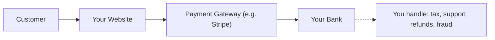
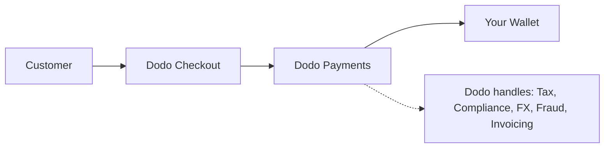

## はじめに

このガイドでは、MoRモデルと従来のペイメントゲートウェイアプローチを比較し、Dodo Paymentsがあなたのビジネスにもたらす利点を理解する手助けをします。

## 核心的な違い

| 特徴                             | MoR (Dodo Payments)         | ペイメントゲートウェイ (従来のPG)           |
|----------------------------------|--------------------------------------------|--------------------------------------------|
| 法的販売者                      | Dodo Payments (MoR)                        | あなたの会社                               |
| 税金の徴収と送金               | Dodoが処理                            | あなたが責任を持つ                        |
| コンプライアンスと規制の負担   | Dodoが責任を負う                     | あなたが現地法やチャージバックを処理      |
| 決済通貨                       | USD、EUR、INR、その他25以上の通貨に対応    | あなたのマーチャントアカウントによる     |
| リスク管理                     | 内蔵の詐欺およびチャージバック保護   | あなたが独自のツールを設定する（例：Stripe Radar） |
| 支払い                         | 集約された簡素化されたグローバル支払い   | PGからあなたへの直接送金、銀行設定が必要     |

## あなたにとっての意味

**DodoをMoRとして利用することで**、私たちはあなたの顧客に対する法的販売者となり、あなたは以下のことが可能になります：

- 現地法人の設立をスキップ
- VAT、GST、または売上税の処理を避ける
- グローバルにより多くの支払い方法を提供
- 法的リスクを軽減
- 新しい市場での迅速な立ち上げ

<Note>
フランスのユーザーにデジタルサブスクリプションを販売することを想像してください。Dodo Paymentsを利用すれば、私たちが支払いを収集し、フランス当局にVATを申告し、あなたに純収益を送金します。税金の頭痛も、弁護士も不要。成長だけです。
</Note>

さらに、MoRモデルはあなたのバックオフィス全体を簡素化します。DodoがあなたのMoRとして、PCIコンプライアンス、詐欺検出、通貨変換、さらには顧客請求サポートを処理し、あなたのチームが製品と成長に集中できるようにします。

## ビジュアル比較

**収益フロー：ペイメントゲートウェイ**

**収益フロー：商業記録者（Dodo）**

## SaaSおよびデジタルビジネスにとっての重要性

ビジネスが拡大するにつれて、税金、コンプライアンス、グローバルな支払いの好みを管理することが圧倒的になることがあります。ペイメントゲートウェイを使用すると、あなたは以下のことに責任を持ちます：

- 複数の管轄区域でのVAT/GST登録と申告
- 通貨変換とチャージバックの管理
- ローカライズされたチェックアウトと支払い方法の提供

Dodo PaymentsをMoRとして利用することで：
- 現地法人を設立せずにグローバルに拡大
- 税金はあなたの代わりに計算、徴収、送金される
- 顧客に合わせた支払い方法のライブラリにアクセスできる
- 私たちはあなたの法的バッファーおよび運営パートナーとして機能します

<Tip>
"ペイメントゲートウェイをトンネルと考えてみてください。次に、商業記録者をトンネル、列車、運転手、チケットスタッフをすべて一体化したものと想像してください。"
</Tip>

## 誰がMoRを使用すべきか？

Dodo Paymentsは以下のような企業に最適です：
- SaaSおよびデジタル製品企業
- インディクリエイターおよびソロプレナー
- 100か国以上に顧客を持つグローバル企業
- 内部で税金とコンプライアンスを管理したくない企業

国際的に拡大している場合、サブスクリプションを販売している場合、または単に運営上の頭痛を減らしたい場合、MoRはより賢い選択です。

## 代わりにペイメントゲートウェイを使用するべき時

ペイメントゲートウェイのみを使用することが理にかなう場合もあります：
- あなたのビジネスが1か国のみで運営されている場合
- すでに内部の財務およびコンプライアンスリソースがある場合
- 顧客請求体験を完全にコントロールする必要がある場合
- コストに非常に敏感で、スケールで薄利な場合

<Note>
多くのスタートアップにとって、最初はゲートウェイを使用することが十分かもしれませんが、複雑さが増すにつれて、MoRに切り替えることで時間を節約し、リスクを軽減し、国際的な成長を加速できます。
</Note>

## Dodo Paymentsを選ぶ理由

Dodo Paymentsは以下を提供します：
- オールインワンの支払い、税金、コンプライアンススタック
- リアルタイムのFXおよび多通貨サポート
- 30以上の支払い方法へのアクセス
- シートベースの請求、サブスクリプション、一回限りの支払い
- 150か国以上での自動税処理
- 内蔵の詐欺防止およびPCIコンプライアンス

あなたがソロファウンダーであろうと、スケーリング中のSaaSチームであろうと、Dodoはグローバルに販売する際の複雑さを簡素化します。

## 詳しく知る

<CardGroup cols={2}>
<Card title="適応通貨サポート" icon="money-bill-wave" href="/features/adaptive-currency">
Dodoがどのようにして顧客の現地通貨で価格を自動的に提示するかを学びましょう
</Card>

<Card title="サポートされている支払い方法" icon="credit-card" href="/features/payment-methods">
Dodo Paymentsを通じて利用可能な30以上の支払い方法を発見してください
</Card>
</CardGroup>

## 切り替える準備はできましたか？

国境やボトルネックなしでグローバルに販売するためにDodo Paymentsを利用している3,000以上のデジタルビジネスに参加しましょう。

<CardGroup cols={2}>
<Card title="無料でサインアップ" icon="user-plus" href="https://app.dodopayments.com/signup">
Dodo Paymentsアカウントを作成し、今日からグローバルに販売を開始しましょう
</Card>

<Card title="営業に相談" icon="envelope" href="mailto:founders@dodopayments.com">
私たちのチームから個別のガイダンスを受けましょう
</Card>
</CardGroup>

<Tip>
Dodoに難しいことを任せて、素晴らしい製品を構築することに集中しましょう。
</Tip>