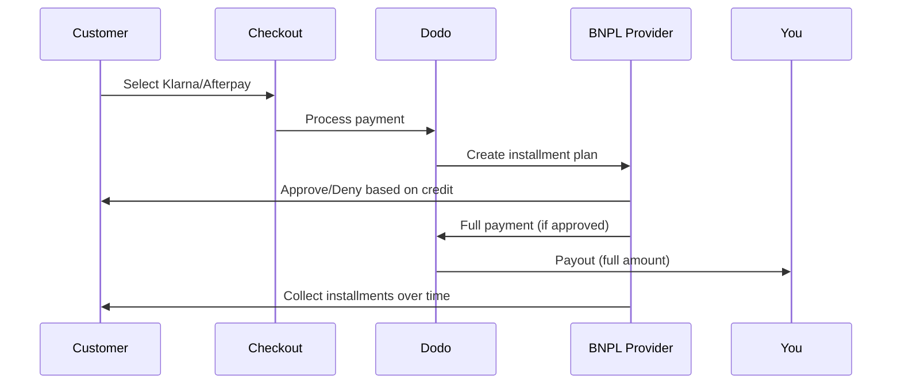

Buy Now Pay Later (BNPL)では、顧客が購入を利息なしの分割で支払えるようになるため、対象取引において平均注文額が20〜50%、コンバージョン率が10〜30%向上します。

## BNPLを提供する理由

<CardGroup cols={3}>
<Card title="Higher AOV" icon="chart-line">
顧客は支払いを分割できるとより多く購入します。平均注文額は20〜50%増加します。
</Card>

<Card title="Better Conversion" icon="percent">
チェックアウトでの支払いの摩擦をなくすことで、ハイチケット商品のコンバージョン率は10〜30%改善されます。
</Card>

<Card title="Zero Risk" icon="shield-check">
BNPLプロバイダーが信用リスクと回収を担当します。あなたは前払いで全額を受け取ります。
</Card>
</CardGroup>

## 対応プロバイダー

### Klarna

| Feature | Details |
| :------ | :------ |
| **Availability** | 米国 + 19のヨーロッパ諸国 |
| **Currencies** | USD, EUR, GBP, DKK, NOK, SEK, CZK, RON, PLN, CHF |
| **Minimum** | $50.01（または同等額） |
| **Subscriptions** | なし |

**対応国:** オーストリア、ベルギー、チェコ共和国、デンマーク、フィンランド、フランス、ドイツ、ギリシャ、アイルランド、イタリア、オランダ、ノルウェー、ポーランド、ポルトガル、ルーマニア、スペイン、スウェーデン、スイス、英国、米国

**支払いオプション:**
- **Pay in 4** — 利息なしの4回分割払い
- **Pay in 30 days** — 30日以内での一括支払い
- **Financing** — 長期の分割プラン

### Afterpay (Clearpay)

| Feature | Details |
| :------ | :------ |
| **Availability** | 米国、英国 |
| **Currencies** | USD, GBP |
| **Minimum** | $50.01（または同等額） |
| **Subscriptions** | なし |

**支払いオプション:**
- **Pay in 4** — 2週間ごとの利息なし4回払い

<Note>
英国ではAfterpayは「Clearpay」として運用されますが、同じAPIタイプ（`afterpay_clearpay`）を使用します。
</Note>

### Billie

| Feature | Details |
| :------ | :------ |
| **Availability** | グローバル |
| **Currencies** | GBP |
| **Minimum** | なし |
| **Subscriptions** | なし |

**Billieについて:**
BillieはB2B向けのBuy Now Pay Laterソリューションで、企業が顧客に柔軟な支払い条件を提供できるようにします。請求書ベースの支払いオプションが必要な法人取引向けに設計されています。

**支払いオプション:**
- **Invoice Payment** — 合意した支払い条件内で決済
- **Flexible Terms** — 企業向けの柔軟な支払いスケジュール

## 設定

### APIメソッドタイプ

| Type | Provider |
| :--- | :------- |
| `klarna` | Klarna |
| `afterpay_clearpay` | Afterpay / Clearpay |
| `billie` | Billie (B2B) |

### 例

```javascript
const session = await client.checkoutSessions.create({
  product_cart: [{ product_id: 'prod_123', quantity: 1 }],
  allowed_payment_method_types: [
    'klarna',
    'afterpay_clearpay',
    'credit',
    'debit'
  ],
  customer: {
    email: 'customer@example.com',
    name: 'Jane Smith'
  },
  billing_address: {
    country: 'US',
    zipcode: '10001'
  },
  return_url: 'https://example.com/success'
});
```

<Warning>
常に`credit`と`debit`をフォールバックとして含めてください。すべての顧客がBNPLの対象になるわけではなく、$50.01未満の取引は適格になりません。
</Warning>

## 最低取引金額

**KlarnaとAfterpayの両方で最小$50.01 USD**（または対応通貨で同等額）が必要です。

このしきい値を下回る取引では:
- チェックアウトにBNPLオプションが表示されない
- エラーは発生せず、単に表示されないだけ
- カード支払いは引き続き利用可能

これは意図した動作です。$50未満の商品については`allowed_payment_method_types`にBNPLを含めないでください。

## 分割払いの仕組み



**ポイント:**
- BNPLプロバイダーから**前払いで全額**を受け取ります
- BNPLプロバイダーが**信用リスクと回収**を処理します
- 顧客は通常**4回払い**でプロバイダーに直接支払います
- 分割払いの失敗による**チャージバックは発生せず**、それはプロバイダーのリスクです

## テスト

### Klarnaのテストデータ

テストモードでは以下の情報を使用してください:

| Field | Approved | Denied |
| :---- | :------- | :----- |
| **Date of Birth** | 07-10-1970 | 07-10-1970 |
| **First Name** | Test | Test |
| **Last Name** | Person-us | Person-us |
| **Email** | customer@email.us | customer+denied@email.us |
| **Street** | Amsterdam Ave | Amsterdam Ave |
| **House Number** | 509 | 509 |
| **City** | New York | New York |
| **State** | New York | New York |
| **Postal Code** | 10024-3941 | 10024-3941 |
| **Phone** | +13106683312 | +13106354386 |

<Note>
Klarnaを選択肢として表示するには、取引額が最低$50である必要があります。
</Note>

### Afterpayのテスト

<Steps>
<Step title="Select Afterpay">
チェックアウトでAfterpayを選択し、支払いをクリックしてください。
</Step>

<Step title="Successful payment">
有効なメールアドレスと配送先住所を使用してください。
</Step>

<Step title="Failed authentication">
失敗をテストするには、リダイレクトページでAfterpayモーダルを閉じてください。支払いステータスは`requires_payment_method`に移行します。
</Step>
</Steps>

## ベストプラクティス

<AccordionGroup>
<Accordion title="Target high-ticket items">
BNPLは$100〜$1000の製品で最も効果を発揮します。「後払い」の価値提案が最も魅力的になるのはこの範囲です。
</Accordion>

<Accordion title="Show installment amounts">
"4回に分けた$25"は"Klarnaで$100"より説得力があります。可能であれば1回あたりの支払い額を表示してください。
</Accordion>

<Accordion title="Don't force BNPL for low-value products">
$50未満ではBNPLは表示されません。$100未満ではほとんどの顧客がカードを好みます。BNPLのプロモーションは高額商品に集中させましょう。
</Accordion>

<Accordion title="Collect billing address">
BNPLプロバイダーは信用調査のために請求情報を必要とします。チェックアウトで完全な住所情報を収集していることを確認してください。
</Accordion>

<Accordion title="Set clear expectations">
顧客には、Klarna/Afterpayとの間で信用契約を結んでいるのであって、あなたとの契約ではないことを理解してもらいましょう。
</Accordion>
</AccordionGroup>

## 制限事項

### サブスクリプション不可
BNPL決済手段は**継続課金をサポートしていません**。サブスクリプション商品ではカードや他の継続対応方式を利用してください。

### 信用ベースの承認
BNPLプロバイダーは即時の信用チェックを行います。全ての顧客が承認されるわけではありません。承認率は以下で変動します:
- プロバイダーとの顧客の信用履歴
- 取引金額
- 顧客の所在地

### 通貨と国のマッピング

各通貨は対応する地域に制限されます:

| Currency | Supported Countries |
| :------- | :------------------ |
| **USD** | 米国のみ |
| **EUR** | サポートされているすべてのヨーロッパ諸国（オーストリア、ベルギー、チェコ共和国、デンマーク、フィンランド、フランス、ドイツ、ギリシャ、アイルランド、イタリア、オランダ、ノルウェー、ポーランド、ポルトガル、ルーマニア、スペイン、スウェーデン、スイス） |
| **GBP** | 英国およびすべてのサポート対象のヨーロッパ諸国 |

その他のKlarna対応通貨（DKK、NOK、SEK、CZK、RON、PLN、CHF）はそれぞれの国で機能します。

<Info>
たとえば、USD取引では米国内の顧客にのみBNPLオプションが表示されます。EUR取引では、すべてのサポート対象のヨーロッパ諸国でBNPLオプションが表示されます。GBP取引では、英国およびすべてのサポート対象のヨーロッパ諸国の顧客にBNPLオプションが表示されます。
</Info>

| Provider | Supported Currencies |
| :------- | :------------------- |
| Klarna | USD, EUR, GBP, DKK, NOK, SEK, CZK, RON, PLN, CHF |
| Afterpay | USD (米国), GBP (英国) |

## トラブルシューティング

<AccordionGroup>
<Accordion title="BNPL not appearing at checkout">
**確認事項:**
1. 取引金額は最低$50.01ですか?
2. 顧客の所在地はサポート対象国ですか?
3. 通貨はBNPLプロバイダーに対応していますか?
4. BNPL方式は`allowed_payment_method_types`に含まれていますか?

**解決策:** 最も多い原因は取引額が最低額を下回っていることです。金額が$50.01のしきい値を満たしているか確認してください。
</Accordion>

<Accordion title="Customer denied by BNPL provider">
**原因:**
- プロバイダーとの信用履歴が不十分
- すでに多くの分割払いプランが存在
- 本人確認の失敗

**解決策:** 一部の顧客では想定内の動作です。カードのフォールバックを用意し、特定の否認理由は開示しないでください。
</Accordion>

<Accordion title="Payment stuck in pending">
**原因:** 顧客がBNPLプロバイダーとの認証フローを完了しませんでした。

**解決策:** 支払いはタイムアウトして失敗します。顧客は再試行するか別の方法を利用できます。
</Accordion>
</AccordionGroup>

## 関連ページ

<CardGroup cols={2}>
<Card title="Payment Methods Overview" icon="credit-card" href="/features/payment-methods">
すべての対応支払い方法をご覧ください。
</Card>

<Card title="Checkout Guide" icon="book" href="/developer-resources/checkout-session">
チェックアウトの実装ガイドを完了させましょう。
</Card>

<Card title="Testing Process" icon="flask" href="/miscellaneous/testing-process">
支払い方法のすべてのテストデータ。
</Card>

<Card title="Adaptive Currency" icon="globe" href="/features/adaptive-currency">
通貨サポートとコンバージョン。
</Card>
</CardGroup>