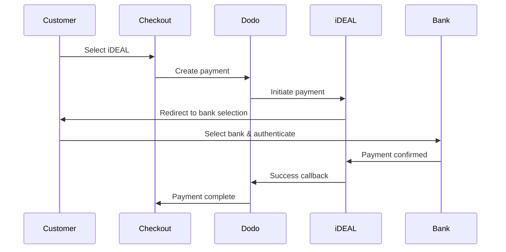

ヨーロッパの顧客は、銀行システムと統合されたローカルな支払い方法を強く好みます。これらの方法を提供することで、ターゲット市場でのコンバージョン率が20〜40％向上します。

## なぜローカルなヨーロッパの支払い方法が必要なのか？

<CardGroup cols={3}>
<Card title="Higher Conversion" icon="chart-line">
iDEALはオランダのオンライン決済の約60%を占めます。提供しないと顧客を失うことになります。
</Card>

<Card title="Lower Fraud" icon="shield-check">
銀行で認証される支払いは不正がほぼゼロでチャージバックもありません。
</Card>

<Card title="Real-Time Settlement" icon="bolt">
ほとんどのヨーロッパの決済手段は即時の支払い確認を提供します。
</Card>
</CardGroup>

## 対応方法

| 方法 | 国 | 市場シェア | 通貨 | サブスクリプション |
| :----- | :------ | :----------- | :------- | :-----------: |
| **iDEAL** | オランダ | ~60% | EUR | いいえ |
| **Bancontact** | ベルギー | ~50% | EUR | いいえ |
| **EPS** | オーストリア | ~30% | EUR | いいえ |
| **Multibanco** | ポルトガル | ~40% | EUR | いいえ |

## iDEAL（オランダ）

iDEALはオランダにおける主要なオンライン支払い方法であり、すべての主要なオランダの銀行に直接接続しています。

### 仕組み



### 対応銀行

すべての主要なオランダの銀行がサポートされています：
- ABN AMRO
- ASN Bank
- Bunq
- ING
- Knab
- Rabobank
- RegioBank
- Revolut
- SNS
- Triodos Bank
- Van Lanschot

### 設定

```javascript
const session = await client.checkoutSessions.create({
  product_cart: [{ product_id: 'prod_123', quantity: 1 }],
  allowed_payment_method_types: ['ideal', 'credit', 'debit'],
  billing_currency: 'EUR',
  billing_address: {
    country: 'NL',
    zipcode: '1012JS'
  },
  return_url: 'https://example.com/success'
});
```

## Bancontact（ベルギー）

Bancontactはベルギーの全国的な支払いスキームであり、ほぼすべてのベルギーの銀行がオンライン支払いに利用しています。

### 特徴
- 既存のベルギーのデビットカードと連携
- モバイルアプリのサポート（Payconiq by Bancontact）
- 即時の支払い確認
- 顧客の追加登録不要

### 設定

```javascript
const session = await client.checkoutSessions.create({
  product_cart: [{ product_id: 'prod_123', quantity: 1 }],
  allowed_payment_method_types: ['bancontact_card', 'credit', 'debit'],
  billing_currency: 'EUR',
  billing_address: {
    country: 'BE',
    zipcode: '1000'
  },
  return_url: 'https://example.com/success'
});
```

## EPS（オーストリア）

EPS（電子決済標準）は、オーストリアの顧客のための直接オンライン銀行振込を可能にします。

### 特徴
- オーストリアの銀行との直接統合
- リアルタイムの支払い確認
- オーストリアの消費者の間で高い信頼性
- チャージバックなし

### 対応銀行

主要なオーストリアの銀行には：
- Erste Bank
- Bank Austria
- Raiffeisen
- BAWAG
- Volksbank

### 設定

```javascript
const session = await client.checkoutSessions.create({
  product_cart: [{ product_id: 'prod_123', quantity: 1 }],
  allowed_payment_method_types: ['eps', 'credit', 'debit'],
  billing_currency: 'EUR',
  billing_address: {
    country: 'AT',
    zipcode: '1010'
  },
  return_url: 'https://example.com/success'
});
```

## Multibanco（ポルトガル）

Multibancoはポルトガルのインターバンクネットワークであり、オンライン支払いとATMベースの支払いの両方を提供しています。

### 支払いオプション

1. **オンラインバンキング** — インターネットバンキングを介した直接銀行振込
2. **ATM支払い** — 顧客は、任意のMultibancoATMで支払うためのリファレンスを受け取ります
3. **モバイルバンキング** — 銀行モバイルアプリを通じた支払い

### ATM支払いの仕組み

ATM支払いの場合、顧客は支払いリファレンスを受け取ります：

```
Entity: 12345
Reference: 123 456 789
Amount: €50.00
Expiry: 24 hours
```

顧客はこのリファレンスを使って、任意のポルトガルのATMまたはオンラインバンキングで支払うことができます。

### 設定

```javascript
const session = await client.checkoutSessions.create({
  product_cart: [{ product_id: 'prod_123', quantity: 1 }],
  allowed_payment_method_types: ['multibanco', 'credit', 'debit'],
  billing_currency: 'EUR',
  billing_address: {
    country: 'PT',
    zipcode: '1000-001'
  },
  return_url: 'https://example.com/success'
});
```

<Note>
MultibancoのATM支払いはチェックアウトと実際の支払いの間に遅延が生じる場合があります。支払い確認にはWebhookを監視してください。
</Note>

## APIメソッドの種類

| 種類 | メソッド | 国 |
| :--- | :----- | :------ |
| `ideal` | iDEAL | Netherlands |
| `bancontact_card` | Bancontact | Belgium |
| `eps` | EPS | Austria |
| `multibanco` | Multibanco | Portugal |

## マルチカントリーのヨーロッパチェックアウト

複数のヨーロッパの国にサービスを提供するビジネスには、すべての地域の方法を含めてください：

```javascript
const session = await client.checkoutSessions.create({
  product_cart: [{ product_id: 'prod_123', quantity: 1 }],
  allowed_payment_method_types: [
    'ideal',           // Netherlands
    'bancontact_card', // Belgium
    'eps',             // Austria
    'multibanco',      // Portugal
    'credit',          // Fallback
    'debit'            // Fallback
  ],
  billing_currency: 'EUR',
  return_url: 'https://example.com/success'
});
```

Dodoは顧客の位置情報に基づいて、関連する方法のみを自動的に表示します。オランダの顧客はiDEALを、ベルギーの顧客はBancontactを表示します。

## テスト

ヨーロッパの支払い方法は、サンドボックスモードでテストできます。テストフローは銀行認証プロセスをシミュレートします。

<Steps>
<Step title="Enable test mode">
Dodo PaymentsのテストAPIキーを使用してください。
</Step>

<Step title="Set appropriate billing address">
請求先住所の国が決済手段と一致するように設定してください:
- `NL` は iDEAL 用
- `BE` は Bancontact 用
- `AT` は EPS 用
- `PT` は Multibanco 用
</Step>

<Step title="Complete the test flow">
テスト環境でシミュレートされた銀行認証のフローに従ってください。
</Step>
</Steps>

## ベストプラクティス

<AccordionGroup>
<Accordion title="Always include regional methods for target markets">
オランダの顧客に販売する場合はiDEALを含めてください。含めないのは米国でVisaを受け入れないのと同じで、大幅に売上を失うことになります。
</Accordion>

<Accordion title="Match currency to region">
ヨーロッパの決済手段はEURを必要とします。価格設定がユーロ取引に対応していることを確認してください。
</Accordion>

<Accordion title="Handle redirects gracefully">
すべてのヨーロッパの決済手段は銀行サイトへのリダイレクトを伴います。リターンURLの処理が堅牢で、ユーザーが途中で離脱する可能性に対応していることを確認してください。
</Accordion>

<Accordion title="Provide card fallbacks">
すべてのヨーロッパの顧客がこれらの地域限定の手段にアクセスできるわけではありません（旅行者、駐在員など）。常に `credit` と `debit` をフォールバックとして含めてください。
</Accordion>

<Accordion title="Consider Multibanco timing">
MultibancoのATM支払いは完了まで数時間かかることがあります。即時の支払いを待たずにフルフィルメントをブロックしないでください。非同期の確認にはWebhookを使用してください。
</Accordion>
</AccordionGroup>

## トラブルシューティング

<AccordionGroup>
<Accordion title="European method not appearing">
**確認:**
1. 顧客の請求先国はメソッドの国と一致していますか？
2. 通貨はEURに設定されていますか？
3. メソッドは `allowed_payment_method_types` に含まれていますか？

**解決策:** ヨーロッパの手段は厳密に地域限定です。請求先国が `DE`（ドイツ）の顧客には、オランダ限定のiDEALは表示されません。
</Accordion>

<Accordion title="Bank authentication failed">
**原因:**
- 顧客が銀行認証中にキャンセルした
- 銀行の認証システムが一時的に利用できなかった
- 顧客が認証情報を間違えた

**解決策:** 顧客に再試行してもらってください。継続する場合は別の決済手段を試すよう促してください。
</Accordion>

<Accordion title="Redirect not completing">
**原因:**
- 顧客が銀行のリダイレクト中にブラウザを閉じた
- 認証中のネットワーク問題
- リターンURLの設定ミス

**解決策:** リターンURLが正しくアクセス可能か確認してください。成功と失敗の両方の状態を処理できるようにしてください。
</Accordion>

<Accordion title="Multibanco payment pending">
**原因:** 顧客は支払い参照番号を受け取りましたが、まだ支払っていません。

**解決策:** これはATMベースの支払いで想定される動作です。Webhookの確認を待ってください。参照番号は通常24〜72時間で期限切れになります。
</Accordion>
</AccordionGroup>

## PSD2コンプライアンス

すべてのヨーロッパの支払い方法は、PSD2（Payment Services Directive 2）規制に準拠しています：

- **強力な顧客認証（SCA）** — 銀行認証フローに組み込まれています
- **安全な通信** — すべてのデータは安全なチャンネルを介して送信されます
- **消費者保護** — EUの消費者権利に完全に準拠

## 関連ページ

<CardGroup cols={2}>
<Card title="Payment Methods Overview" icon="credit-card" href="/features/payment-methods">
サポートされているすべての決済手段を見る。
</Card>

<Card title="Adaptive Currency" icon="globe" href="/features/adaptive-currency">
通貨サポートと自動換算。
</Card>

<Card title="Checkout Guide" icon="book" href="/developer-resources/checkout-session">
チェックアウト実装ガイドを完了します。
</Card>

<Card title="Webhooks" icon="webhook" href="/developer-resources/webhooks">
支払い確認を非同期で処理してください。
</Card>
</CardGroup>